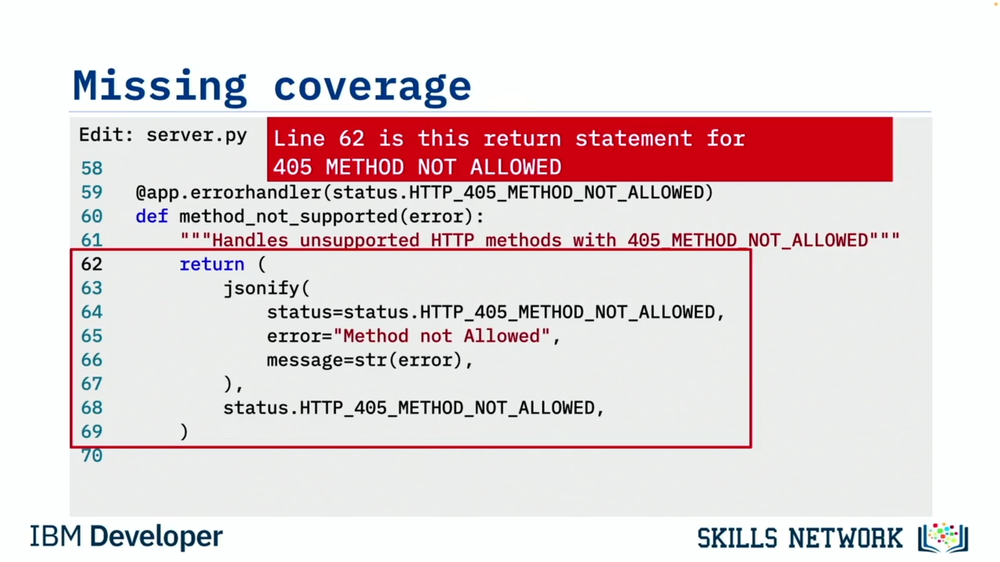
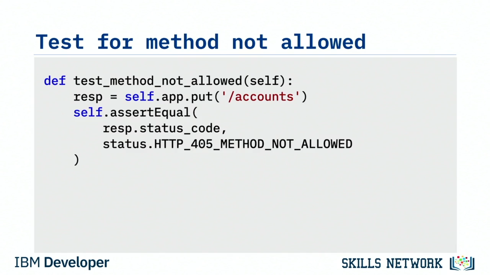

# 🧪 Test Coverage

Bu videoyu izledikten sonra şunları yapabileceksiniz: test kapsamının önemini açıklamak, test kapsamını artırmak için test kapsam raporlarının nasıl kullanılacağını özetlemek ve %100 test kapsamına ulaşılsa bile neden test etmeye devam etmenin önemli olduğunu açıklamak.

Yeterince test yazdığınızı nasıl anlarsınız? Test kapsamı.

Test kapsamı, tüm testleriniz sırasında yürütülen kod satırlarının yüzdesidir. Test kapsamını çağırdığınızda, kapsam aracınız yürütülebilir tüm kod satırlarını sayar ve ardından test sırasında testlerin hangi satırları yürüttüğünü görmek için testi izler. Araç daha sonra yürütülebilir satır sayısını toplam satır sayısına böler ve bu da testinizin gerçekten kapsadığı kod satırlarının yüzdesini verir.

Yüksek test kapsamı, testler sırasında çok miktarda kodun yürütüldüğüne dair size güven verir. Ve buna bağlı olarak, testler için ne kadar fazla kod satırı yürütülürse, o satırların beklendiği gibi çalıştığından o kadar emin olabilirsiniz.

## 📊 Test Kapsam Raporları

Test kapsamı seviyenizi belirlemek için test kapsam raporlarını kullanırsınız. Bu raporlar hangi kod satırlarının test edildiğini gösterebilir, fakat daha da önemlisi, hangi kod satırlarının test edilmediğini de gösterebilir; böylece o satırları yürütecek daha fazla test vakası yazabilirsiniz.

Bir test kapsam raporunun nasıl göründüğüne bakalım. Özellikle, `coverage` adlı bir Python aracının raporunu kullanacağız.

Önce `coverage` komutunu çalıştırır ve `-m` seçeneğiyle bir rapor isteriz. Bu seçenek bize eksik kod satırlarını, yani test vakalarının yürütmediği satırları gösterecektir.

```bash
coverage report -m
```

Program dosyalarının tümünü istatistikleriyle birlikte listeleyen güzel bir rapor elde ederiz. Bu örnekte basitlik açısından yalnızca tek bir Python dosyamız olacak: `server.py`.

Ama bu raporun bize ne söylediğini parçalayarak inceleyelim:

* Test edilen program dosyalarının adını verir. Bu, dosya bazında ayrıştırılır ve uygulamamız birden fazla Python dosyasından oluşuyorsa faydalıdır.
* Sonra o dosyadaki yürütülebilir ifadelerin toplam sayısını verir. `server.py` dosyasının 81 ifade içerdiğini belirtir. Bu sayı, kod kapsamı hesaplamamızın payıdır.
* Ardından test vakalarında yürütülmeyen kod satırı sayısını verir. Bu sütuna *miss* yani eksik kapsam der. `server.py` için beş eksik satır olduğunu belirtir; yani 81 satırın beşi test sırasında yürütülmemiştir. Dolayısıyla bu beş satırın üretimde nasıl davranacağı hakkında hiçbir fikrimiz yoktur.
* Sonra, önceki iki sayıyı kullanarak testlerin kapsadığı satırların yüzdesini verir. Bu örnekte %94 test kapsamına sahibiz; yani 81 satırın %94’ü test sırasında yürütülmüştür.
* Son olarak, test vakası olmayan satırların satır numaralarını verir.

Bu bilgi kritiktir, çünkü artık testlerimizi nereye yoğunlaştıracağımızı biliriz. Bu satırların yürütülmesini sağlayacak daha fazla test vakası yazmamız gerekir.

Yine, bu eksik raporu yalnızca `coverage` komutuna `-m` parametresini eklerseniz ya da kapsamla testleri çalıştırırken bunu bir parametre olarak belirtirseniz görünür.

## 🔎 Eksik Satırları Hedefleme

`server.py` dosyasındaki 62. satırı kontrol edelim ve onun yürütülmesini sağlayacak bir test vakası yazmanın bir yolunu düşünelim.

`server.py` dosyasını düzenler ve 62. satıra kaydırırız ve ne yaptığını görürüz. Bu fonksiyonun hata işleyicilerinden biri olduğu görülüyor. 62. satırın, 405 *method not allowed* ile karşılaşıldığını bildiren bir `return` ifadesi olduğunu görürüz.

Bu, bir hata mesajını bir durum koduyla birlikte döndürüyor gibi görünüyor.

Şimdi görevimiz, kodumuzda 405 *method not allowed* oluşmasına neden olacak bir test vakasını nasıl oluşturacağımızı bulmak.



## 🧭 Flask Route’larını Kullanma

*Method not allowed* ifadesinin ne anlama geldiğine bakalım. Bunun bir Python Flask uygulaması olduğunu biliyorum.

Flask’ta, bir uygulamanın desteklediği tüm uç noktaları veya route’ları listeleyen `flask routes` adlı bir komut vardır. Bu komutu çalıştırdığımızda, uygulanmış tüm geçerli route’ları görürüz. Raporun ortasındaki *methods* sütunu, her uç noktanın desteklediği HTTP metotlarını listeler.


405 *method not allowed* hatasına neden olmak için, bir uç noktada desteklenmeyen bir metot kullanmamız yeterlidir. `/accounts` uç noktasının yalnızca `post` ve `get` metotlarını desteklediğini görürüz. 405 *method not allowed* üretmek istiyorsak, onu `put` gibi desteklenmeyen bir metotla çağırabiliriz.

Eğer `/accounts` üzerinde `put` çağırırsak, `post` veya `get` ile eşleşmeyecektir ve böylece *method not allowed* döndürecektir. Hadi bunu yapalım.

## ✅ Yeni Test Vakası Eklemek

Kod editörümüzü açar ve yeni bir test vakası ekleriz. Ne yaptığını anlaması kolay olsun diye yeni test vakasına `test_method_not_allowed` adını veririz.

Ardından `accounts` uç noktasına `put` çağrısı yapar ve sonucu `resp` adlı bir değişkende saklarız (response için). Bu, aradığımız davranışı vermelidir.

Son olarak, `resp` değişkenindeki `status_code` değerinin 405 *method not allowed* HTTP yanıtıyla eşleşeceğine dair bir assertion yaparız.

Komut satırına geri döner ve testi tekrar çalıştırırız ve `-m` seçeneğini eklediğimizden emin olarak bir kapsam raporu alırız. Artık testsiz yalnızca dört satır kod kaldığını görebiliriz.



Kod kapsamımız %95’e yükselmiştir, çünkü daha fazla satırın test vakaları vardır. Son olarak, eksik raporumuz azalmıştır çünkü 62. satır artık eksik kapsam değildir.

Sonraki adım olarak, 66. satır ve 167’den 169’a kadar olan satırlar için aynı süreci geri dönüp tekrarlamalısınız.


## 🌧️ Happy Path ve Sad Path

Yüksek kod kapsamına sahip olmanın tek yolu budur. Muhtemelen fark etmişsinizdir: yalnızca  *happy path* ’leri, yani her şeyin çalıştığı yolları test etmek, tüm kodunuzu kapsamayacaktır.

 *Sad path* ’leri de test etmelisiniz.  *Sad path* ’ler `else` ve `if-then-else` ifadelerinin yollarıdır. 405 *method not allowed* örneğimizde olduğu gibi hata koşullarını yakalayan yollardır.

Tam test kapsamına ulaşmak için, kodunuzun tamamını çalıştıracak senaryolar düşünmeniz gerekir.

## 🛑 %100 Kapsamda Bile Teste Devam Etmek

Ama şunu unutmayın: %100 test kapsamına sahip olsanız bile kodunuz hâlâ hatalar içerebilir. %100 test kapsamı yalnızca her satır kodun bilinen bazı iyi verilerle test edildiği anlamına gelir.

Kodunuza hâlâ kötü veri verebilir ve hatalar bulabilirsiniz. Bu yüzden kod kapsamınız %100’e ulaştığında test etmeyi bırakmayın. Kodunuzun bütünlüğünü kötü verilerle, köşe durumlarla zorlamaya devam edin.

Kodunuzun hem elverişli hem de olumsuz koşullar altında beklendiği gibi davrandığından emin olun.

## 📌 Öğrenilenler

Bu videoda şunları öğrendiniz: test kapsamı ne kadar yüksekse, geliştiriciler kodlarının beklendiği gibi çalıştığından o kadar emin olabilir. Test kapsam raporları, hâlâ test vakasına ihtiyaç duyan satırların belirlenmesine yardımcı olabilir.

%100 test kapsamında bile kod hâlâ hatalar içerebilir.
