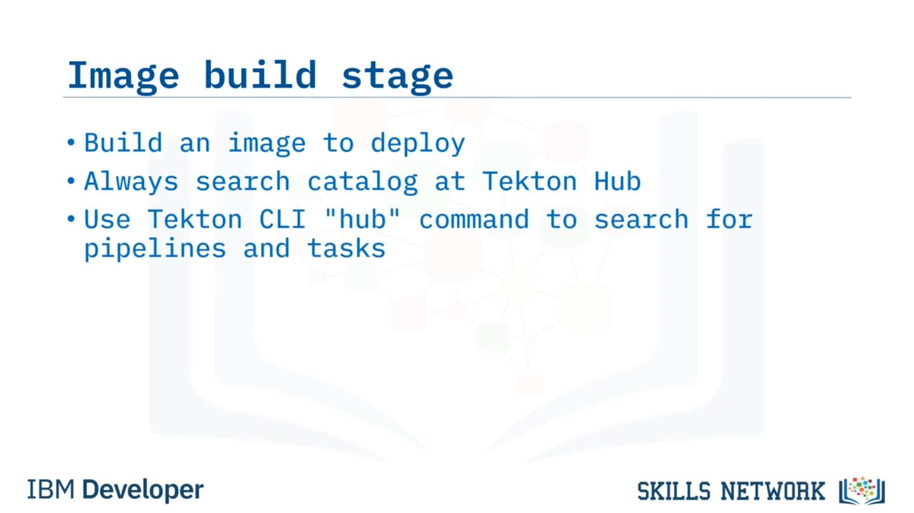
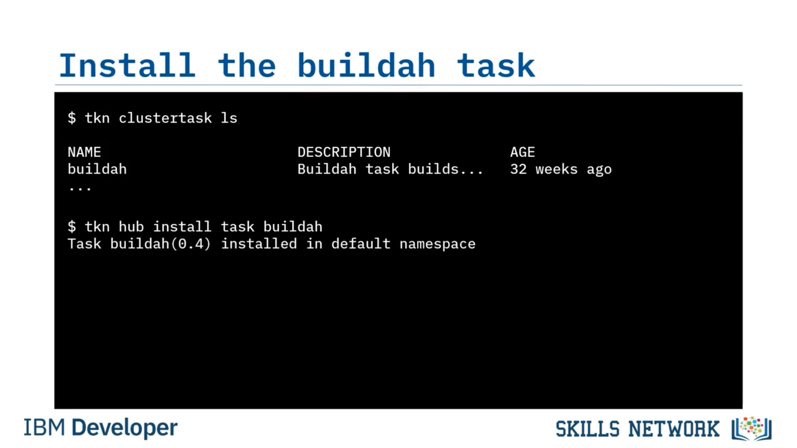
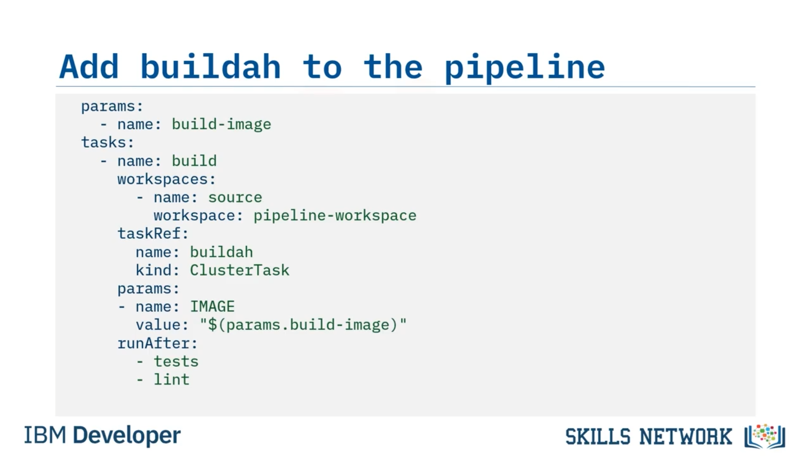

# 🧱 Image Oluşturma

‘Image Oluşturma’ya hoş geldiniz. Bu videoyu izledikten sonra, Tekton CLI’yi kullanarak görevleri nasıl arayacağınızı açıklayabilecek, bir image oluşturup dağıtmak için bir görev bulmayı anlatabilecek ve paralel görevlerden sonra bir pipeline’a deploy görevi eklemeyi tarif edebileceksiniz. 


Şimdiye kadar CD pipeline’ınızı oluştururken, GitHub’dan klonlayarak kodu checkout etmeyi ve flake8 ile nose gibi kalite kontrolleri ve birim testlerini çalıştırmayı ele aldınız. Şimdi, Kubernetes’e deploy etmeye hazırlanmak için bir container image oluşturma zamanı.

Image build aşamasının amacı, Kubernetes ortamına deploy etmeye hazırlanmak için bir registry’ye push edebileceğiniz bir container image oluşturmaktır. Bu build görevi dahil olmak üzere ihtiyaç duyabileceğiniz yeni görevler için Tekton Hub’daki Tekton kataloğunu aramayı alışkanlık haline getirmek iyi bir davranıştır. Hatta Tekton CLI `"hub"` komutunu kullanarak pipeline ve görevleri arayabilirsiniz.


## 🔎 Tekton CLI ile Görev Arama

Bunun nasıl çalıştığını görelim. Komutu `'tkn hub search'` kullanıp ardından `"build"` arama kriterini ekleyebilirsiniz. Ayrıca şu anda yalnızca görevleri aradığınızı belirtmek için `--kinds` bayrağını ekleyebilirsiniz. `"build"` anahtar kelimesiyle eşleşen tüm görevler döndürülür.



```bash
tkn hub search build --kinds
```

Şimdi dönen bazı arama sonuçlarına daha yakından bakalım. Docker-build, bir Dockerfile’dan bir Docker image oluşturur ve bir Docker image’ını bir registry’ye push eder. İstediğiniz şey budur, bu yüzden bir aday olabilir.


## 🛠️ Build Görev Adayları

Bir diğer sonuç  **buildah** ’dır. buildah görevi, kaynak kodunuzu bir Dockerfile’dan bir container image’a dönüştürür ve ardından Project Atomic’in Buildah build aracını kullanarak bir container registry’ye push eder. Bu da muhtemel bir aday gibi görünüyor.


**Buildpacks** da döndürüldü. İlk ikisiyle hemen hemen aynı şeyi yapar, ancak Cloud Native Buildpacks kullanır. Bunlar, Dockerfile’lara ihtiyaç duymadan uygulama kaynak kodunu Open Container Initiative (veya  *OCI* ) image’larına dönüştüren tak-çıkar, modüler araçlardır.

Ayrıca **Source-2-Image** (veya  *s2i* ) vardır; buildpacks gibi, bir Dockerfile oluşturma ihtiyacı olmadan kaynak kodunuzu OCI container image’larına dönüştürür.


## ✅ Buildah Seçimi ve ClusterTask Kontrolü

Seçebileceğiniz birçok build görevi vardır, ancak pipeline’ınız için buildah’ı araç olarak seçersiniz. Yöneticilerin görevleri cluster seviyesinde kurabileceğini belirtmek isterim. Hangi cluster görevlerinin kurulu olduğunu görmek için şu komutu kullanmak her zaman iyi bir fikirdir: `tkn clustertask ls'`.

```bash
tkn clustertask ls
```

Bu örnekte, buildah cluster seviyesinde kuruludur; bu yüzden onu namespace’inize yerel olarak kurmanıza gerek yoktur. Cluster’daki herkes, pipeline’larında cluster task’ları kullanabilir. Eğer cluster seviyesinde kurulu değilse, Tekton CLI kullanarak buildah görevini yerel namespace’inize kurabilirsiniz. Komut, `'tkn hub install task'` ve ardından kurmak istediğiniz görevin adıyla gelir; bu durumda `'buildah’`.

```bash
tkn hub install task buildah
```

buildah’ın mevcut namespace’inize kurulduğunu belirten bir sonuç döndüğünü görmelisiniz.



## 📄 Buildah Görevini Pipeline’da Kullanma

Peki buildah görevini nasıl kullanırsınız? Tekton Hub’daki buildah dokümantasyonunu okuduğunuzda, tek zorunlu parametrenin varsayılanı olmadığı için `'IMAGE'` parametresi olduğunu görürsünüz. Ayrıca `'source'` adında bir workspace gerektirdiğini de görürsünüz. Bu iki bilgiyle, buildah görevini Tekton pipeline’ınıza eklemeye hazırsınız.

buildah’ı pipeline’a eklemek için, önce `'build-image’` adında yeni bir pipeline parametresi eklersiniz. Birazdan bu parametreyi buildah görevine geçireceksiniz.


## 🧩 Pipeline’a Build Görevi Ekleme

Şimdi yeni bir görev ekleyebilirsiniz. Pipeline’da başka görevler de olacaktır, ancak bu görevi nereye eklediğiniz önemli değildir; çünkü her zaman yazdığınız sıraya göre değil, belirttiğiniz görevlerden sonra çalışacaktır. Bu göreve `'build'` adını verirsiniz.

Sonra workspace için bir tanım eklersiniz. Dokümantasyon, buildah’ın `'source'` adlı bir workspace’e ihtiyaç duyduğunu belirtir; bu nedenle workspace’i `'source'` olarak adlandırır ve pipeline-workspace persistent volume claim’inizi (veya  *PVC* ) kullanırsınız.

Ardından, kurulu buildah görevine referans verirsiniz. Cluster task sürümünü kullanıyorsanız, Tekton’a bunu `'kind'` anahtar kelimesini kullanarak ve değerini ‘ClusterTask.’ yaparak söylemelisiniz. Bu, onu yerel olarak namespace’inize kurduysanız gerekli değildir.

Şimdi `'IMAGE'` adında bir parametre oluşturma zamanı; çünkü buildah’ın bakacağı parametrenin adı budur. Ona, pipeline parametrenizden aynı isimli `'params.build-image'` referansını kullanan bir değer verirsiniz.

Son olarak, bu pipeline görevinin hem `'tests'` hem de `'lint'` görevleri tamamlandıktan sonra çalışmasını belirtirsiniz. Hatırlarsanız, `'tests'` ve `'lint'` paralel çalışıyordu; dolayısıyla kod test edilip lint edilmeden image’ın build edilmemesini sağlamak istiyorsanız, `'runAfter'` anahtar kelimesini kullanarak bu iki görevi de isimleriyle build görevinin önkoşulu olarak belirtmelisiniz.

Ve bu kadar. buildah kullanarak pipeline’ınıza başarılı bir şekilde bir build görevi eklediniz.



## 📌 Video Özeti

Bu videoda, Tekton Hub’ı CI/CD pipeline’larınız için build görevleri bulmak amacıyla kullanabileceğinizi, web sitesi yerine Tekton CLI ile görev bulabileceğinizi, namespace’inize yerel olarak kurmak zorunda kalmadan ClusterTask’ları kullanabileceğinizi ve paralel görevlerden sonra bir görevi çalıştırmak için runAfter içinde tüm paralel görevleri belirtmeniz gerektiğini öğrendiniz.


