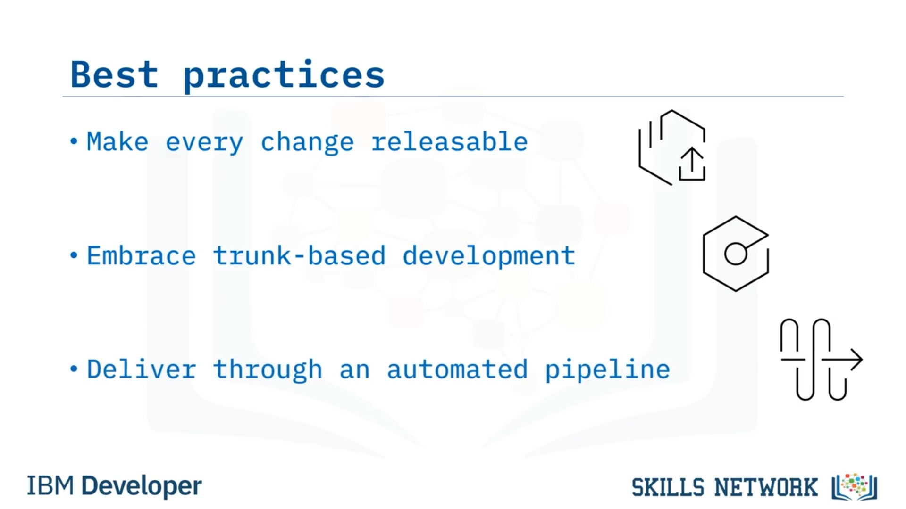
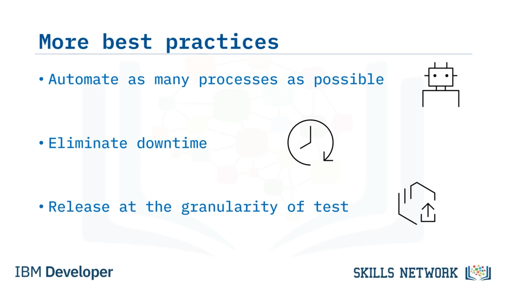

# 🚀 Sürekli Teslimat Uygulamaları

‘Sürekli Teslimat Uygulamaları’na hoş geldiniz. Bu videoyu izledikten sonra, Sürekli Teslimat en iyi uygulamalarını açıklayabilecek, bir CI/CD hattının gereksinimlerini anlatabilecek ve Sürekli Dağıtım ile Sürekli Teslimat arasındaki farkları tanımlayabileceksiniz.

Sürekli Teslimatı uygularken takip edilecek birçok en iyi uygulama vardır. Her değişikliği *yayınlanabilir* hale getirmek önemlidir. Bu, her zaman kullanıcı dokümantasyonunu, operasyon runbook’larını ve değişikliğinizin ne yaptığını açıklayan bilgileri dahil etmeniz gerektiği anlamına gelir. Bu, her değişikliğin çalışmasını ve müşterilere teslim edilebilecek kadar iyi belgelenmesini sağlamanın yanı sıra gerçekleşebilecek herhangi bir denetime de hizmet eder.

Ayrıca, Sürekli Teslimatın *Sürekli Entegrasyon* üzerine kurulu olduğunu akılda tutmanız gerekir.

---

## 🌿 Kısa Ömürlü Dallar ve Trunk-Tabanlı Geliştirme

En iyi uygulama olarak, uzun ömürlü dalların neden olduğu entegrasyon gecikmelerinden kaçınmalısınız. Ana kod tabanına sürekli entegre edilen kısa ömürlü  *feature branch* ’ler kullanmak istersiniz.

Buna ayrıca *trunk-based development* denir; çünkü her zaman trunk’a, yani *master* veya *main* dalı olarak da bilinen dala geri dönersiniz. En hızlı geri bildirim için her değişiklik birlikte *build* edilir, *test* edilir ve *deploy* edilir.

---

## 🤖 Otomatik Teslimat Hattı ve Süreç Otomasyonu

İyi kurgulanmış, otomatik bir teslimat hattı, başarılı bir Sürekli Teslimat uygulaması için temel bir unsurdur. Bu, tüm kod sürümlerinin test ve üretim ortamlarına tutarlı ve öngörülebilir bir şekilde taşınmasını sağlar.

Mümkün olduğunca çok süreci otomatikleştirin.

Sürekli Teslimatta, iyi ve güvenilir bir teslimat hattı oluşturmak için yazılım geliştirme yaşam döngünüzde mümkün olduğunca çok süreci otomatikleştirmelisiniz. Bu hat yalnızca kod derlemeleri ve dağıtımlar için değil, aynı zamanda yeni geliştirme ortamlarının oluşturulması için de kullanılır.

---

## 🟢 Kesintisiz Hizmet ve Doğrulama

Hedefiniz *downtime olmaması* olmalıdır. Sık Sürekli Teslimat güncellemeleri yaparken uygulama erişilebilirliğini sağlamak için, üretime yeni bir işlev gönderdiğinizde, onu halka açık olarak çalışan uygulama örneklerine dağıtmadan önce doğrulamalısınız.

Ayrıca, testin granülerliğinde yayın yapmak istersiniz. Sistemin iki parçası birlikte test edilmek zorundaysa, sistemin parçalarının uyumlu olduğunu bilmeniz için birlikte yayınlanmaları gerekir. *Release automation* araçları bu tür teslimatı koordine etmede iyidir.

Alternatif olarak, tamamen ayrıştırabilirsiniz.

---

## 🧩 CI/CD Hattı Gereksinimleri

Bir CI/CD hattının yerinde olması için birkaç öğe gereklidir:

* Tüm kaynak kodu barındırmak ve yönetmek için bir **kod deposu (code repository)** gerekir.
  Kaynak kod yönetim sisteminiz *tek doğruluk sürümüdür (single version of the truth).* Kodunuzu derlemek ve yayınlamak için ihtiyaç duyduğunuz her şey sürüm kontrolüne check-in edilmelidir.
* Bu kodun, uygulamanın derlenmesini yönetecek bir **build sunucusuna (build server)** ihtiyacı vardır.
  Bu ortamın her seferinde aynı durumdan başlayarak *clean build* gerçekleştirmesini istersiniz.
* Build otomasyonunu yöneten ve kodunuza karşı testleri çalıştıran bir **entegrasyon sunucusu veya orkestratör (integration server / orchestrator)** gerekir.
* **Manuel adım olmamalıdır.** Her şey otomatikleştirilmelidir.
* Son olarak, bir kez derlenip test edildikten sonra kolayca dağıtılabilmeleri için uygulamanın tüm binary ve artifact’lerini saklayacak bir **depolama deposuna (storage repository)** ihtiyaç vardır.

---

## 🔁 Sürekli Dağıtım ve Sürekli Teslimat Arasındaki Fark

Peki, Sürekli Dağıtım ( *Continuous Deployment* ) ile Sürekli Teslimat ( *Continuous Delivery* ) arasındaki fark nedir?

Sürekli Dağıtım, bir Sürekli Teslimat hattının parçası olabilir. Özellikle:

* **Sürekli Teslimat** , gerekli otomasyon testlerini geçtikten sonra kodun geliştirme yaşam döngüsü (veya teslimat yaşam döngüsü) boyunca otomatik olarak ilerletilmesidir.
* **Sürekli Dağıtım** , teslim edilen bu kodun alınarak üretime dağıtılmasıdır.

Sürekli Teslimatın uygulanıp uygulanmaması ve nasıl uygulanacağı tamamen iş ihtiyaçlarınıza bağlıdır. İşiniz, teslimat ekibinin üretime yeni veya güncellenmiş yazılımı tekrar tekrar, güvenilir ve hızlı bir şekilde yayınlamasını gerektiriyorsa, Sürekli Dağıtım büyük fayda sağlayacaktır.

---

## 🧾 Bu Videoda Öğrendikleriniz

Bu videoda şunları öğrendiniz:

* Sürekli Teslimatı uygularken izlenecek birkaç en iyi uygulama vardır,
* Bir CI/CD hattı bir kod deposu, build sunucusu, entegrasyon sunucusu ve bir depolama deposu gerektirir,
* Sürekli Teslimat, kodun geliştirme yaşam döngüsü boyunca hareketini otomatikleştirme uygulamasıdır,
* Sürekli Dağıtım, teslim edilen kodu alıp üretim ortamına dağıtma uygulamasıdır.

