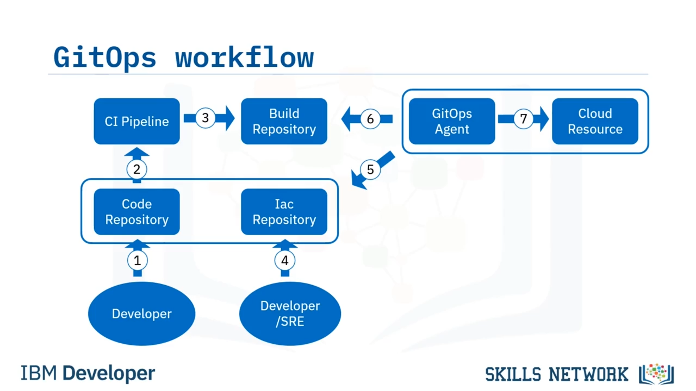

# 🚀 GitOps’a Giriş

GitOps’a Giriş’e hoş geldiniz. Bu videoyu izledikten sonra GitOps’u ve temel ilkelerini tanımlayabilecek, GitOps’un faydalarını açıklayabilecek ve GitOps iş akışını tanımlayabileceksiniz. Bulut teknolojisi, otomasyon ve izlenebilirlik ihtiyacını vurgulayarak yazılım dağıtımını devrimleştiriyor. Geleneksel dağıtım yöntemleri, güncellemeler için geliştirme ve operasyon ekipleri arasında manuel iletişime dayanır. Bu yaklaşımda otomasyon ve sürüm takibi yoktu; bu da modern yazılım sisteminde geliştirme ve operasyon görevlerinin yürütülmesi için verimli bir dağıtım sürecine ihtiyaç doğurdu.

GitOps, diğer adıyla  *Git powered Ops* , belirtilen zorlukları ele alan değerli bir çözümdür. Uygulama geliştirmede kullanılan DevOps’un en iyi uygulamalarını kullanan bir operasyonel çerçevedir.

## 🤝 DevOps En İyi Uygulamaları ve GitOps’un Rolü

Bazı örnekler iş birliği, sürüm kontrolü ve uyumluluktur. GitOps bunları altyapı otomasyonu için sağlar. Dağıtım sürecini  *shell script* ’leri kullanarak kodlamaya veya dağıtılan sistemin istenen durumunu *YAML* dosyalarıyla tanımlamaya dayanır. Bu dosyalar daha sonra Git içinde sürümlendirilir; böylece otomatik araçlar sistem durumundaki değişiklikleri görünür ve denetlenebilir olacak şekilde uygular.

## 🧾 Tek Doğruluk Kaynağı ve İzlenebilirlik

GitOps’un özü, altyapı ve uygulama yapılandırmalarını yönetmek için Git  *pull request* ’lerinden yararlanmasıdır. Git deposunu tek doğruluk kaynağı olarak kabul ederek sistemin tüm durumunu kapsar. Bu yaklaşım görünürlük ve denetlenebilirlik sağlar.

Sistem durumunda yapılan değişikliklerin net bir kaydını sunar. Ayrıca uygulamaların kaynak kodu GitOps içinde neredeyse evrensel olarak izlenebilirdir. Değişikliklerin izlenebilirliği yeni bir kavram değildir. Ancak GitOps savunucuları; incelemeler,  *pull request* ’ler ve etiketleme ( *tagging* ) gibi ilkeleri altyapı ve uygulama yapılandırmasına uygular. Bu, ekiplerin uygulama kaynak kodu için sahip oldukları aynı güvencelerden yararlanmasını sağlar.

# 📌 GitOps’u Tanımlayan İlkeler

GitOps’u tanımlayan ilkeler aşağıdaki gibi özetlenebilir.

## 🧩 Sistem Tanımını Kod Olarak Tanımlar

Sistem yapılandırmasını kod olarak ele almak, bunları Git içinde saklamanıza ve sürümlendirmenize olanak tanır; böylece tek doğruluk kaynağı olarak hizmet eder. Bu yaklaşım, sistemlerinizde değişikliklerin kolayca ileri ( *rollout* ) ve geri ( *rollback* ) alınmasını sağlar.

## 🗂️ İstenen Sistem Yapılandırmasını Sürümler ve Tanımlar

Sistemlerinizin istenen yapılandırmasını Git içinde saklayıp sürümlendirerek, değişiklikleri kolayca yönetebilir ve takip edebilirsiniz.

## 🔄 Git Değişiklikleri ile Pull Request ve Otomatik Uygulama

 *Pull request* ’leri etkinleştiren GitChanges sağlar ve bunları yapılandırmaya otomatik olarak uygular. Saklanan yapılandırmaya değişikliklerin nasıl uygulanacağını kolayca yönetebilir, farklı ekip üyelerinden inceleme talep edebilir ve CI testlerini çalıştırabilirsiniz.

Ayrıca, küme ( *cluster* ) kimlik bilgilerinizi kimseyle paylaşmanıza gerek yoktur. Burada yalnızca yapılandırmanın alındığı Git deposuna erişim gerekir.

## 🛡️ Drift Kontrolü Sağlayan Denetleyici

Son olarak GitOps, yapılandırma kaymalarının ( *configuration drift* ) olmadığından emin olan bir denetleyici sunar. İstenen sistem durumu Git’te bulunduğundan, yalnızca mevcut sistem durumunun istenen sistem durumuyla eşleştiğini doğrulayan bir yazılıma ihtiyaç vardır. Bu yazılım, durumlar farklıysa kendi kendini iyileştirebilmeli ( *self-heal* ) veya kaymayı bildirebilmelidir.

GitOps, sistemin istenen durumunu tanımlamak ve kontrol etmek için GitOps’u tek doğruluk kaynağı olarak kullanarak ekiplerin sistemlerini yönetme ve dağıtma biçimini dönüştürüyor.

# ✅ GitOps’un Faydaları

GitOps’un bazı temel faydaları şunlardır.

## 🚀 Sürekli Dağıtım

Altyapı ve uygulamalardaki değişiklikleri dağıtma sürecini otomatikleştirerek sürekli dağıtımı mümkün kılar. GitOps tek doğruluk kaynağı olduğunda, Git deposuna gönderilen her değişiklik otomatik dağıtım süreçlerini tetikler ve sistemin hızlı ve güvenilir şekilde güncellenmesini sağlar.

## 🧷 Sürüm Kontrolü ve İzlenebilirlik

GitOps, Git’in sürüm kontrol yeteneklerinden yararlanarak altyapı ve uygulama yapılandırmalarında yapılan değişikliklerin tam bir geçmişini sağlar. Bu, hesap verebilirlik sunar ve geliştiricilerin ihtiyaç halinde minimal riskle önceki bir sürüme kolayca geri dönmesini sağlar.

## 🧪 Tutarlılık ve Yeniden Üretilebilirlik

GitOps, sürüm kontrollü yapılandırmalara dayanarak tutarlı ve yeniden üretilebilir bir dağıtım süreci uygular. Kubernetes’te olduğu gibi, Git sistemin istenen durumunun tanımını içerir ve otomatik süreçler gerçek durumun istenen durumla eşleşmesini sağlar.

## 🧯 Yapılandırma Drift’ini Azaltma ve Güvenilirliği Artırma

## 👥 İş Birliği ve İnceleme

GitOps,  *pull request* ’ler ve kod incelemeleri gibi Git’in iş birliği özelliklerini altyapı ve uygulama yapılandırma değişikliklerine uygulayarak iş birliğini teşvik eder.

## 🧾 Denetlenebilirlik ve Uyumluluk

GitOps içinde Git depoları, sistemde yapılan tüm değişiklikleri takip eder; tüm modifikasyonların merkezi ve denetlenebilir bir kaydını sağlar. Bu, denetlenebilirliği artırır ve finans veya sağlık gibi düzenlemeye tabi sektörlerde, belirli politika ve düzenlemelere uyumun kritik olduğu durumlarda, düzenleyici gerekliliklerle uyumluluğu güçlendirir.

## 🏗️ Kod Olarak Altyapı

Son fayda  *Infrastructure as Code* ’dur. GitOps, altyapı yapılandırmalarının Git depolarında saklanan kod aracılığıyla tanımlandığı ve yönetildiği *Infrastructure as Code* paradigmasını benimser.

# 🔁 GitOps İş Akışı

Şimdi bir GitOps iş akışına bakalım.

Geliştiriciler, uygulama kaynak kodunda değişiklik yapar ve bunları inceleme için *pull request* olarak gönderir. Onaylanan değişiklikler ana dala ( *main branch* ) birleşir ve sürekli entegrasyon (*continuous integration* veya  *CI* ) hattını tetikler.

CI hattı değişiklikleri algılar ve derleme sürecini başlatır; bunun sonucunda bir yapıt deposunda ( *artifact repository* ) saklanan yapıtlar ( *artifacts* ) üretilir.

*Site Reliability Engineers* veya  *SRE* ’ler, operasyon tarafında ortam yapılandırmasını ayrı bir bildirime dayalı ( *declarative* ) Config Repo üzerinden yönetir. Yapılandırmayı değiştirir ve inceleme için *pull request* oluşturma sürecini izlerler. Onaylandığında değişiklikler Declarative Config Repo’nun ana dalına birleşir.

Hedef ortam mimarisi, Git depoları ile hedef ortam arasında kesintisiz senkronizasyonu sağlamak için bir *GitOps Agent* bileşeni sunar. Bu ajan, Declarative Config Repo’daki değişiklikleri sürekli izler. Bir değişiklik algılandığında GitOps ajanı, en güncel yapılandırmayı depodan otomatik olarak çeker ve bu değişiklikleri ortama uygular.

GitOps çözümü, yapıt deposundan uygun derlemeyi çeker ve bulut kaynaklarında durum değişikliğini uygular. GitOps yaklaşımının güzelliği, sistemin güvenliğini ve bütünlüğünü korurken manuel müdahale ihtiyacını ortadan kaldırmasıdır. Geliştiriciler veya SRE’ler, IaC deposundaki Git değişikliklerini basitçe geri alarak süreci aynı kolaylıkla tersine çevirebilir.

# 🧠 Video Özeti

Bu videoda GitOps’un, altyapı ve uygulama yapılandırmalarını yönetmek için Git  *pull request* ’lerini kullanan bir uygulamalar bütünü olduğunu öğrendiniz. GitOps,  *pull request* ’ler aracılığıyla otomatik yapılandırma güncellemelerini mümkün kılar. Git’te saklanan kod tek doğruluk kaynağı sağlar ve yapılandırma dosyalarını her dağıtımda aynı altyapı ortamında kullanırsınız. Bu, verimliliği ve istikrarı artırır ve iş birliğini güçlendirir.

