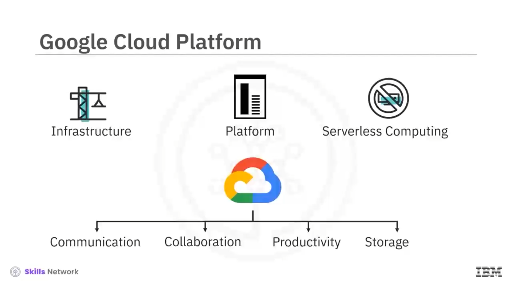
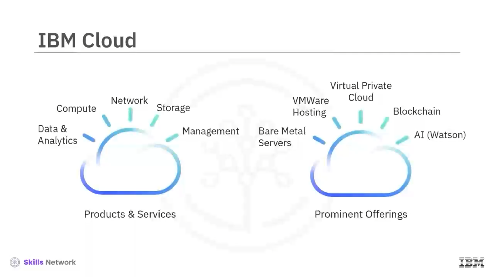
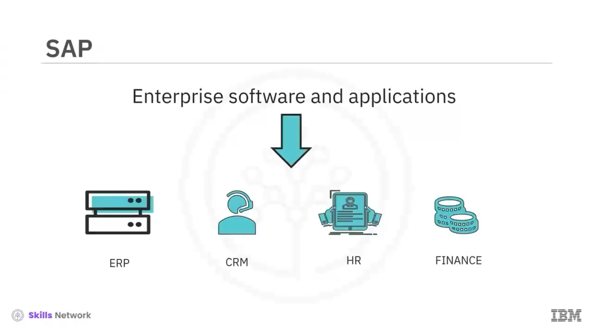

# ☁️ Temel Bulut Hizmeti Sağlayıcıları ve Hizmetleri

Önümüzdeki yıllarda bulutun ulaşması öngörülen ölçeği görmemize yardımcı olan bazı sayılara ve tahminlere bakalım. Gartner Inc., yakın gelecekte dünya genelinde genel bulut harcamalarının %20,7 artarak toplam **591,8 milyar dolara** ulaşacağını ve önceki yıllardaki **490,3 milyar dolardan** yukarı doğru ölçekleneceğini öngörüyor. Şirketler geleneksel istemci bilişim çözümlerinden abonelik tabanlı sanal masaüstü hizmetlerine kaydıkça, dünya genelinde *desktop as a service* harcamaları 2023’te **3,2 milyar dolara** ulaşacak. Önümüzdeki yıllarda işletmeler, geleneksel BT çözümlerine kıyasla genel bulut hizmetlerine daha fazla harcama yapacak.

Açık olan şu ki; bulut, tahmin edilenden daha hızlı ivmeleniyor, benimsenme yüksek ve gelirler hızla artıyor. Bugün işletmeler için soru artık bulutu benimseyip benimsememeleri değil; işletmelerine ve müşterilerine en iyi şekilde hizmet etmek için bulut benimseme stratejilerinin ne olması gerektiği. Bu teknolojik dalgayla ayak uyduran ve onu ileri taşıyanlar, çok geniş bir hizmet yelpazesine sahip bulut hizmeti sağlayıcılarıdır.

---

## 🧩 Başlıca Bulut Hizmeti Sağlayıcıları

Şimdi alfabetik sırayla bazı büyük bulut hizmeti sağlayıcılarından bahsedeceğiz.

---

## 🟧 Alibaba Cloud

Alibaba Cloud, nispeten yeni olmasına rağmen Çin’in en büyük bulut bilişim hizmeti sağlayıcısıdır. Alibaba Cloud, yalnızca müşterilerinin çevrimiçi işlerini değil, aynı zamanda Alibaba grubunun kendi e-ticaret ekosistemini de desteklemek için kapsamlı bir küresel bulut bilişim hizmetleri paketi sunar.

 *Compute* ,  *network* ,  *storage* ,  *security* ,  *monitoring and managing* ,  *communication* ,  *analytics* ,  *IoT* ,  *application development* ,  *data migration* , *web hosting* ve daha fazlası gibi çok sayıda ürün ve hizmet sunar.

---

## 🟨 Amazon Web Services (AWS Cloud)

Bulut bilişim alanına ilk girenlerden biri olan Amazon Web Services (AWS Cloud), bireylere, şirketlere ve hükümetlere ölçümlenmiş, *pay as you go* (kullandıkça öde) esasına dayalı geniş bir altyapı ve platform hizmetleri yelpazesi sunar.

Amazon Cloud;  *compute* ,  *DevOps* ,  *data* ,  *analytics* ,  *IoT* ,  *machine learning* ,  *networking* ,  *content delivery* ,  *robotics* , *serverless computing* ve çok daha fazlasını kapsayan geniş bir ürün, hizmet ve çözüm yelpazesi sağlar.

---

## 🟦 Google Cloud Platform (GCP)

Google Cloud Platform (GCP), altyapı, platform ve *serverless computing* ortamları sağlayan bir bulut bilişim hizmetleri paketidir. Google, GCP’yi Google Search ve YouTube gibi son kullanıcı ürünleri için dahili olarak da kullanır.

Google Cloud; iletişim, üretkenlik, iş birliği, depolama ve daha fazlası için ürünler içeren  **G Suite** ’i de kapsar.  **Google App Engine** , Google tarafından yönetilen veri merkezlerinde web uygulamaları geliştirmek ve barındırmak için bir platformdur; talebi karşılamak için kaynakları otomatik olarak tahsis eder ve geri alır.

---

## 🟦 IBM Cloud

IBM Cloud, genel, özel ve hibrit ortamları kapsayan tam yığın ( *full stack* ) bir bulut platformudur;  *compute* ,  *network* ,  *storage* ,  *management* ,  *security* , *DevOps* ve *databases* alanlarında ürün ve hizmetleri içerir.

Öne çıkan bazı sunumları arasında  *bare metal servers* ,  *VMware* , uygulama modernizasyonu için  *cloud packs* , *virtual private cloud* ve  *AI* ,  *IoT* ,  *blockchain* , *data* ve *analytics* gibi gelişen teknolojilerden oluşan paket yer alır.

Red Hat’in satın alınmasıyla IBM, günümüzün lider hibrit bulut sağlayıcısı olarak konumlanmaktadır.

---

## 🟦 Microsoft Azure

Microsoft Azure, Microsoft tarafından yönetilen veri merkezleri üzerinden uygulama ve hizmetleri oluşturmak, test etmek, dağıtmak ve yönetmek için esnek bir bulut platformudur. Veri merkezleri birçok bölgeye yayılmış olduğundan Azure, yerel varlıkla küresel erişim sağlar.

Microsoft’e özgü ve üçüncü taraf dillerini, araçlarını ve çerçevelerini destekleyen yazılım, platform ve altyapı hizmetleri sunar.

---

## 🟥 Oracle Cloud

Oracle Cloud, öncelikle **SaaS** ve **Database as a service** ile tanınır; bu aynı zamanda **Oracle Data Cloud** olarak da bilinir. Oracle’ın SaaS sunumu; bulutta çalışan  **ERP** ,  **SCM** ,  **HCM** , pazarlama, satış ve **CX** gibi geniş kapsamlı uygulamalar içerir.

Oracle Data Cloud ise, hedef kitlelere yönelik olarak çevrimiçi, çevrimdışı ve mobil pazarlama kampanyalarını kişiselleştirmeye yardımcı olan, en büyük bulut tabanlı veri yönetim platformlarından birini sağlar. Oracle Cloud ayrıca bazı bulut altyapısı ve platform hizmetleri de sunar.

---

## 🟦 Salesforce

Salesforce, müşteri ilişkileri yönetimine odaklanan ve işletmelerin müşterileri, iş ortakları ve potansiyel müşterileriyle daha iyi bağlantı kurmasını destekleyen *software as a service* teklifinde uzmanlaşmıştır.

Salesforce;  **Sales Cloud** , **Service Cloud** ve **Marketing Cloud** gibi birden fazla bulut hizmeti sunar ve müşterilerin analitikleri gerçek zamanlı takip etmelerine yardımcı olur.  *Customers success and support* , müşteri şikayetleri ve hatta sosyal platformlar genelinde müşterileri dinleyerek, çözüm için onları otomatik olarak uygun ajanlara yönlendirme gibi yetenekler sağlar.

---

## 🟨 SAP

SAP; bulutta çalışan  **ERP** ,  **CRM** , **HR** ve **Finance** gibi kurumsal yazılım ve uygulamalarıyla bilinir. Ayrıca SAP tarafından yönetilen güvenli bir bulut bilişim ortamında hızlı inovasyon döngüleriyle iş uygulamalarını oluşturmak ve genişletmek için bir **SAP cloud platform** da vardır.

---

## 🎬 Sonraki Adım

Bir sonraki videoda, bulut bilişim için iş gerekçesine ( *business case* ) bakacağız.
