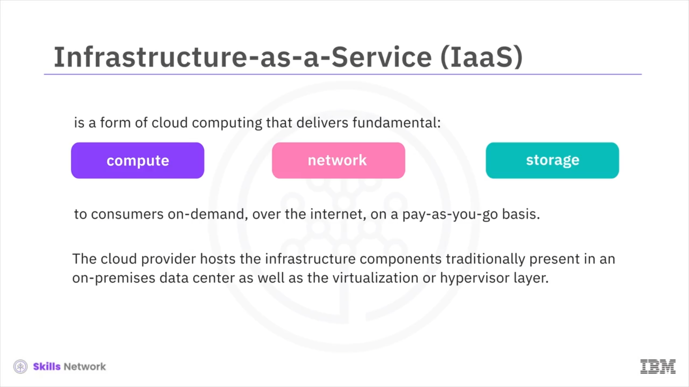
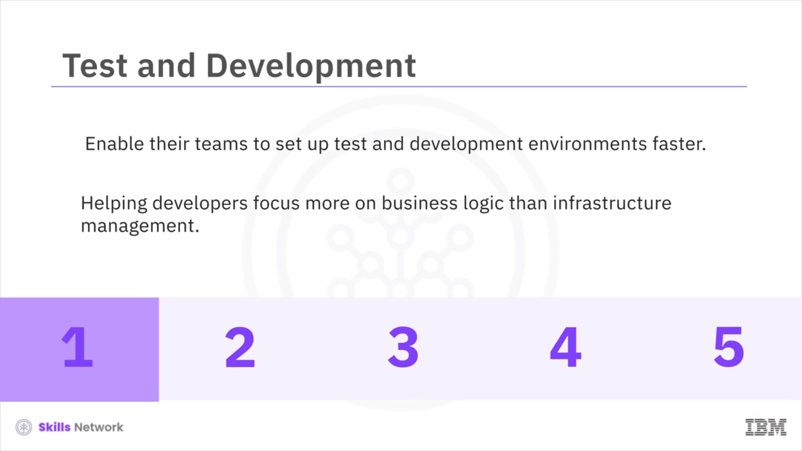
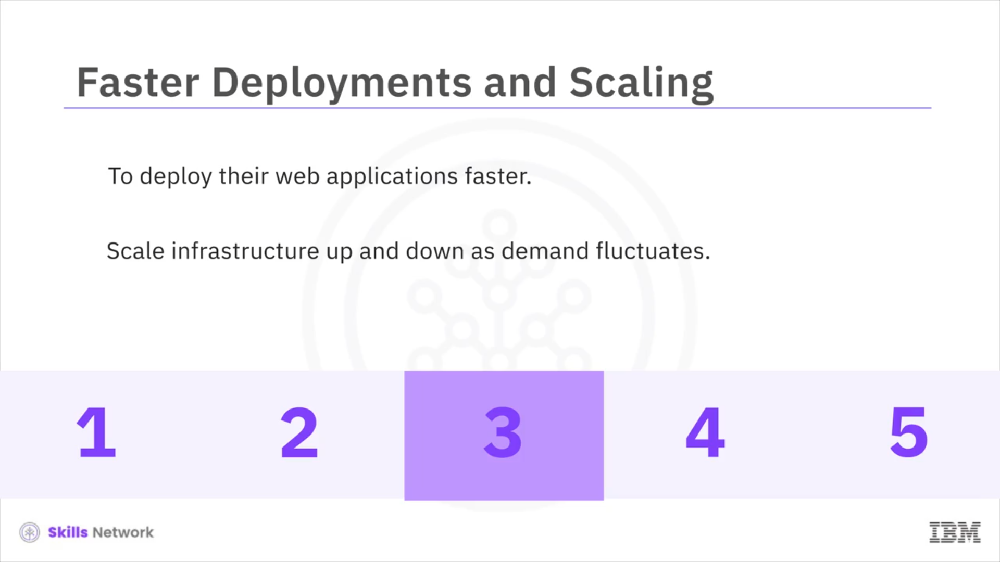

# 🏗️ IaaS - Hizmet Olarak Altyapı

Bu videoda, *Hizmet Olarak Altyapı* (Infrastructure-as-a-Service) modelini daha ayrıntılı şekilde ele alacağız. Genellikle **“IaaS”** olarak adlandırılan – ya da basitçe **“eye-es”** şeklinde telaffuz edilen –  *Hizmet Olarak Altyapı* , tüketicilere temel  **hesaplama** , **ağ** ve **depolama** kaynaklarını  **isteğe bağlı** ,  **internet üzerinden** , **kullandıkça öde** esasına göre sunan bir bulut bilişim biçimidir.

Bulut sağlayıcısı, geleneksel olarak şirket içi ( *on-premises* ) bir veri merkezinde bulunan altyapı bileşenlerini ve ayrıca sanallaştırma ya da *hypervisor* katmanını barındırır.

## 🌍 Sanal Makineler ve Dağıtım

Bir IaaS Bulut ortamında müşteriler, Bulut Sağlayıcı tarafından sunulan **Bölge** ( *Region* ) ve **Bölge Altı** ( *Zone* ) seçeneklerinden istediklerini seçerek **sanal makineler** (*virtual machines* veya  **VM’ler** ) oluşturabilir ya da sağlayabilirler. Bu VM’ler genellikle müşterinin seçtiği **işletim sistemi** önceden yüklenmiş şekilde gelir.

Müşteriler daha sonra bu VM’ler üzerinde **middleware** dağıtabilir, uygulamalar yükleyebilir ve iş yüklerini çalıştırabilir. Ayrıca iş yükleri ve yedeklemeleri için depolama oluşturabilirler.

## 📈 İzleme, Performans ve Felaket Kurtarma

Bulut sağlayıcıları, müşterilere bulut hizmetlerinin performansını ve kullanımını izleme ve takip etme, ayrıca felaket kurtarmayı yönetme olanağı da sunar.

## 🧱 Bulut Altyapısının Temel Bileşenleri

Bulut altyapısının temel bileşenlerine bakalım:

### 🏢 Fiziksel Veri Merkezleri

IaaS sağlayıcıları, üzerlerindeki farklı soyutlama katmanlarına güç veren fiziksel makineleri barındıran büyük veri merkezlerini yönetir. Çoğu IaaS modelinde son kullanıcılar fiziksel altyapıyla doğrudan etkileşime girmez; bunu kendilerine hizmet olarak sunulan bir yapı şeklinde deneyimler.

### 🖥️ Hesaplama

IaaS sağlayıcıları  *hypervisor* ’ları yönetir ve son kullanıcılar, istenen miktarda  **hesaplama** , **bellek** ve **depolama** kaynağıyla sanal örnekleri programatik olarak sağlar. Bulut hesaplama genellikle ölçeklenebilirlik ve yüksek performans sağlayan *auto scaling* ve *load balancing* gibi destek hizmetleriyle birlikte gelir.

### 🌐 Ağ

Kullanıcılar bulutta ağ kaynaklarına sanallaştırma yoluyla ya da  **API** ’ler üzerinden programatik olarak erişir.

### 💾 Depolama

Bulut veri depolamanın üç türü vardır:  **nesne** , **dosya** ve **blok** depolama.

*Nesne depolama* bulutta en yaygın depolama biçimidir; çünkü yüksek ölçüde dağıtık ve dayanıklıdır.

## 🧩 IaaS Kullanım Senaryoları

IaaS çok geniş bir kullanım alanını destekler. Burada bazı tipik kullanım senaryolarına bakacağız.

Kuruluşlar bugün, ekiplerinin **test** ve **geliştirme** ortamlarını daha hızlı kurmalarını sağlamak için bulut altyapı hizmetlerini kullanıyor; bu da yeni uygulamaların daha hızlı oluşturulmasına yardımcı oluyor.

Düşük seviyeli bileşenleri soyutlayarak, bulut altyapısı geliştiricilerin altyapı yönetiminden ziyade **iş mantığına** daha fazla odaklanmasına yardımcı oluyor.

## 🛡️ İş Sürekliliği ve Felaket Kurtarma

İş sürekliliği ve felaket kurtarma, önemli ölçüde teknoloji ve personel yatırımı gerektirir. IaaS, kuruluşların bu maliyeti azaltmasına ve bir felaket ya da kesinti sırasında uygulamalara ve verilere her zamanki gibi erişilebilir olmasını sağlamasına yardımcı oluyor.

## 🚀 Web Uygulamaları ve Ölçekleme

Kuruluşlar, web uygulamalarını daha hızlı dağıtmak ve talep dalgalandıkça altyapıyı yukarı ve aşağı ölçeklemek için bulut altyapısını kullanıyor.

## 🧮 Yüksek Performanslı Hesaplama

Kuruluşlar, iklim ve hava tahminleri ile finansal modelleme gibi milyonlarca değişken ve hesaplama içeren karmaşık problemleri çözmek için bulut altyapısının **yüksek performanslı hesaplama** yeteneklerinden yararlanıyor.

## 🔍 Büyük Veri Analizi ve Ekonomik Uygulanabilirlik

Devasa veri kümelerini inceleyerek değerli örüntüleri, eğilimleri ve ilişkileri bulmak çok büyük işlem gücü gerektirir. Bulut altyapısı yalnızca gerekli yüksek performanslı hesaplamayı sağlamakla kalmaz, aynı zamanda bunu **ekonomik olarak uygulanabilir** hale getirir.

## ⚠️ Endişeler ve Sonuç

Bulut altyapısının yapılandırma ve yönetiminde **şeffaflık eksikliği** ve iş yükü kullanılabilirliği ile performansı için **üçüncü bir tarafa bağımlılık** gibi bazı endişeler bulunsa da, *Hizmet Olarak Altyapı* günümüzde en hızlı büyüyen bulut modelidir.

## ▶️ Sonraki Video

Bir sonraki videoda, *Hizmet Olarak Platform* (Platform-as-a-Service) modelini, özelliklerini, faydalarını ve bazı kullanım senaryolarını inceleyeceğiz.
