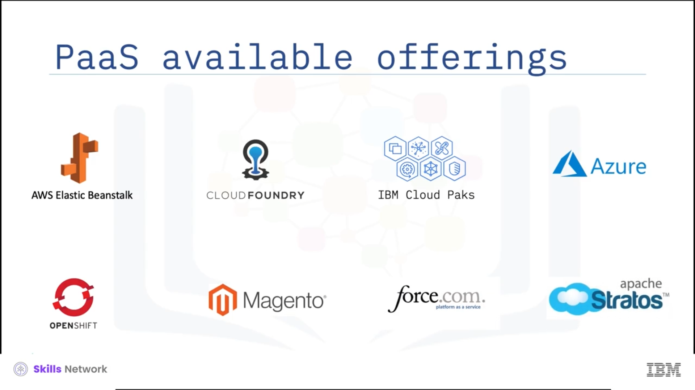

# 🧩 PaaS - Platform as a Service

Platform as a service, commonly referred to as *P-a-a-S* or simply,  *PaaS* , müşterilere kendileri tarafından oluşturulan veya üçüncü bir taraftan edinilen uygulamaları geliştirmek, dağıtmak, yönetmek ve çalıştırmak için eksiksiz bir platform sağlayan bir bulut bilişim modelidir.

PaaS sağlayıcısı her şeyi barındırır: sunucular, ağlar, depolama, işletim sistemi, uygulama çalışma zamanları, API’ler, ara katman yazılımları (middleware), veritabanları ve diğer araçlar kendi veri merkezinde bulunur.

Sağlayıcı ayrıca uygulama altyapısının kurulumu, yapılandırması ve işletiminden sorumludur; bu da kullanıcının yalnızca uygulama kodundan ve onun bakımından sorumlu kalmasını sağlar.

Müşteriler bu hizmet için kullanım bazında ödeme yapar ve kaynakları talep üzerine satın alır.

IaaS’te, bulut sağlayıcısı sunucular, depolama ve ağ gibi ham bilişim kaynaklarına erişim sunarken, kullanıcı platform ve uygulama yazılımından sorumludur.

*P-a-a-S* veya  *PaaS* ’te ise bulut hizmet sağlayıcısı tüm platform altyapısını teslim eder ve yönetir; kullanıcıları ortamın daha alt seviye ayrıntılarından soyutlar.

Şimdi platform as a service veya PaaS’in bazı temel özelliklerine bakalım.

---

## 🧠 PaaS’in Temel Özellikleri

PaaS bulutları, kullanıcılara sağladıkları yüksek soyutlama seviyesiyle ayırt edilir; uygulamaları dağıtmanın, altyapıyı yapılandırmanın ve yük dengeleyiciler (load balancers) ve veritabanları gibi destekleyici teknolojileri sağlama ve yapılandırmanın karmaşıklığını ortadan kaldırır.

PaaS bulutları, geliştiricilerin elastik olarak ölçeklenebilir ve yüksek erişilebilir bulut uygulamaları sunma işini basitleştirmeye yardımcı olan hizmetler ve API’ler sağlar.

Bu hizmetler tipik olarak; dağıtım, önbellekleme (caching), kuyruklama (queuing) ve mesajlaşma (messaging), dosya ve veri depolama, iş yükü yönetimi, kullanıcı kimliği ve analitik için API’ler gibi çeşitli yetenekleri içerir; böylece birbirinden kopuk bileşenleri entegre etme ihtiyacını ortadan kaldırır.

PaaS çalışma zamanı ortamı (runtime environment), uygulama sahibi ve bulut sağlayıcısı tarafından belirlenen politikalara göre son kullanıcı kodunu çalıştırır.

PaaS tekliflerinin birçoğu, geliştiricilere uygulamaları dağıtmak ve çalıştırmak için hızlı dağıtım mekanizmaları veya *push and run* mekanizması sağlar.

PaaS teklifleri; uygulama sunucuları, veritabanı yönetim sistemleri, iş analitiği sunucuları, mobil backend hizmetleri, entegrasyon hizmetleri, iş süreçleri yönetim sistemleri, kural motorları ve karmaşık olay işleme sistemleri gibi bir dizi uygulama altyapısı veya ara katman yazılımı (middleware) yeteneğini destekler.

Böyle bir uygulama altyapısı, yazılması gereken kod miktarını azaltırken uygulamanın işlevsel yeteneklerini genişleterek geliştiricilere yardımcı olur.

---

## 🎯 PaaS için Kullanım Senaryoları

PaaS için en önemli kullanım senaryosu stratejiktir: uygulamaları hızlı ve maliyet etkin şekilde oluşturmak (build), test etmek, dağıtmak (deploy), geliştirmek (enhance) ve ölçeklemek (scale).

Şimdi PaaS için birkaç kullanım senaryosuna daha bakalım.

### 🔌 API Geliştirme ve Yönetimi

Kuruluşlar, gevşek bağlı (loosely coupled), bağımsız olarak dağıtılabilir (independently deployable) bileşenler ve hizmetler olan API’leri ve mikroservisleri geliştirmek, çalıştırmak, yönetmek ve güvenliğini sağlamak için PaaS kullanıyor.

### 🌐 Internet of Things (IoT)

PaaS bulutları, IoT dağıtımları için kullanılan geniş bir uygulama ortamları, programlama dilleri ve araçlar yelpazesini destekler.

### 📊 İş Analitiği veya Zekâsı (Business analytics, or intelligence)

PaaS araçları, kuruluşların daha bilinçli iş kararları ve tahminler yapılmasını sağlayan iş içgörüleri bulmak için verilerini analiz etmelerine olanak tanır.

### 🔄 İş Süreçleri Yönetimi (Business Process management, or BPM)

Kuruluşlar, hizmet olarak sunulan BPM platformuna erişmek için PaaS bulutunu kullanıyor.

### 🗂️ Ana Veri Yönetimi (Master data management, or MDM)

Kuruluşlar, müşteri işlemleri hakkında bilgi ve karar vermeyi destekleyen analitik veriler gibi kritik iş verileri için tek bir referans noktası sağlamak üzere PaaS bulutundan yararlanıyor.

---

## ✅ PaaS Kullanmanın Avantajları

PaaS’in sunduğu *pay-as-you-use* modeliyle kaynakların hızlı tahsisi ve geri tahsisi (allocation ve deallocation) sayesinde mümkün olan ölçeklenebilirlik (scalability).

PaaS bulutlarının sağladığı hizmetler, API’ler ve ara katman yazılımı (middleware) yetenekleri, geliştiricilerin çabalarını uygulama geliştirme ve test etmeye odaklamasına yardımcı olur; bu da ürün ve hizmetleri için daha hızlı pazara çıkış süresi (time-to-market) sağlar.

Ara katman yazılımı (middleware) yetenekleri ayrıca yazılması gereken kod miktarını azaltırken uygulamanın işlevsel yeteneklerini genişletir.

Daha yüksek çeviklik (agility) ve yenilik (innovation): çünkü PaaS platformlarını kullanmak, bu kaynaklara yatırım yapmak zorunda kalmadan birden fazla işletim sistemi, dil ve araçla denemeler yapabileceğiniz anlamına gelir.

Fikirleri çok düşük risk maruziyetiyle değerlendirebilir ve prototipleyebilirsiniz; bu da daha geniş bir kaynak yelpazesinin daha hızlı, daha kolay, daha az riskli şekilde benimsenmesini sağlar.

---

## 🧰 Piyasadaki Bazı Önemli PaaS Çözümleri

Bugün piyasada mevcut bazı önemli PaaS teklifleri şunlardır:  *AWS Elastic Beanstalk* ,  *Cloud Foundry* ,  *IBM Cloud Paks* ,  *Windows Azure* ,  *Red Hat OpenShift* ,  *Magento Commerce Cloud* , *force.com* ve  *Apache Stratos* .

---

## ⚠️ PaaS’in Riskleri

PaaS bulutları bazı risklerle birlikte gelir; genel olarak tüm bulut tekliflerinin sahip olduğu bilgi güvenliği tehditleri ve hizmet sağlayıcının altyapısına bağımlılık gibi.

Bir hizmet sağlayıcının altyapısı kesinti (downtime) yaşadığında hizmetler etkilenebilir.

Müşterilerin ayrıca, bir sağlayıcı stratejisinde, hizmet tekliflerinde veya araçlarında değişiklik yaptığında ortaya çıkabilecek değişiklikler üzerinde doğrudan bir kontrolü yoktur.

Ancak faydalar bu risklerden çok daha ağır basabilir.

PaaS güçlü bir büyüme yaşamaya devam etmektedir ve ilerleyen dönemde baskın platform teslim modeli haline geleceği öngörülmektedir.

---

## ➡️ Sonraki Video

Bir sonraki videoda, software as a service modelini, özelliklerini, faydalarını ve bazı kullanım senaryolarını inceleyeceğiz.
