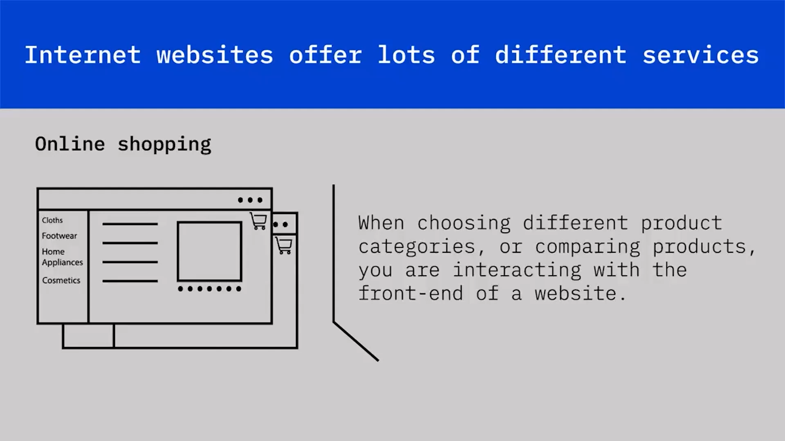
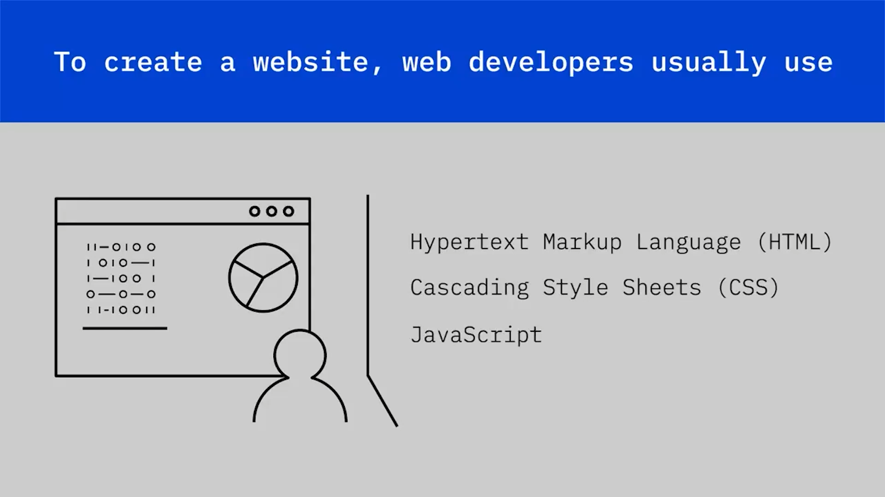
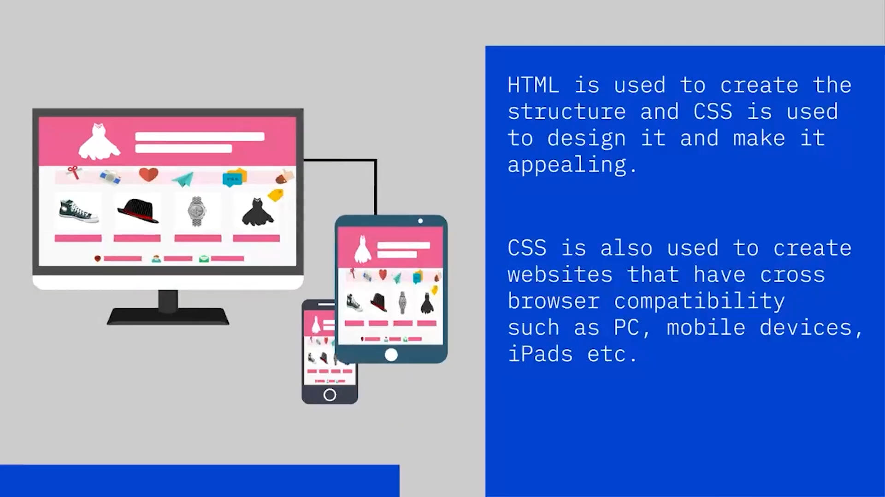
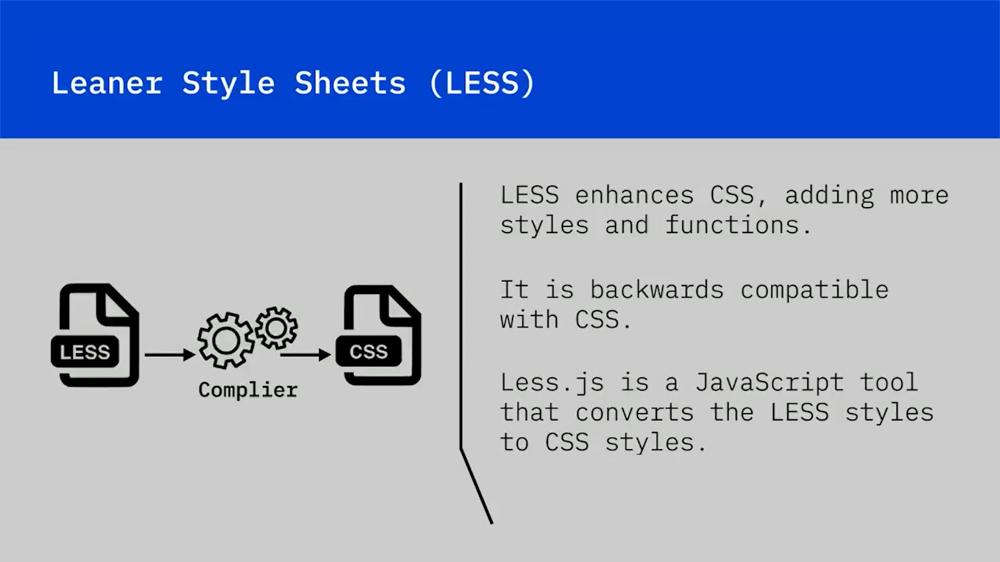
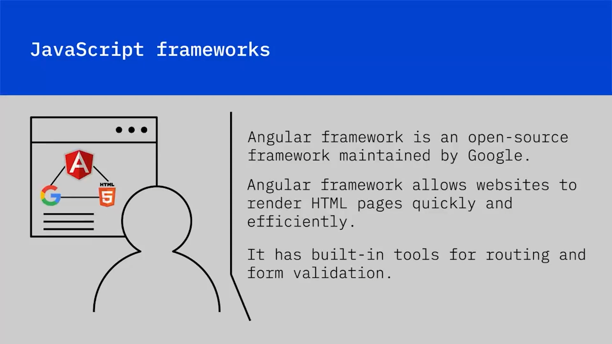
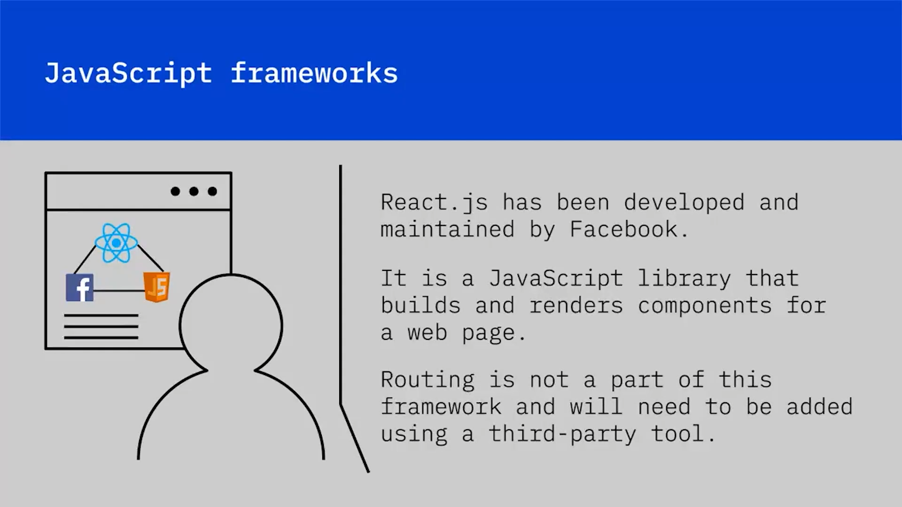
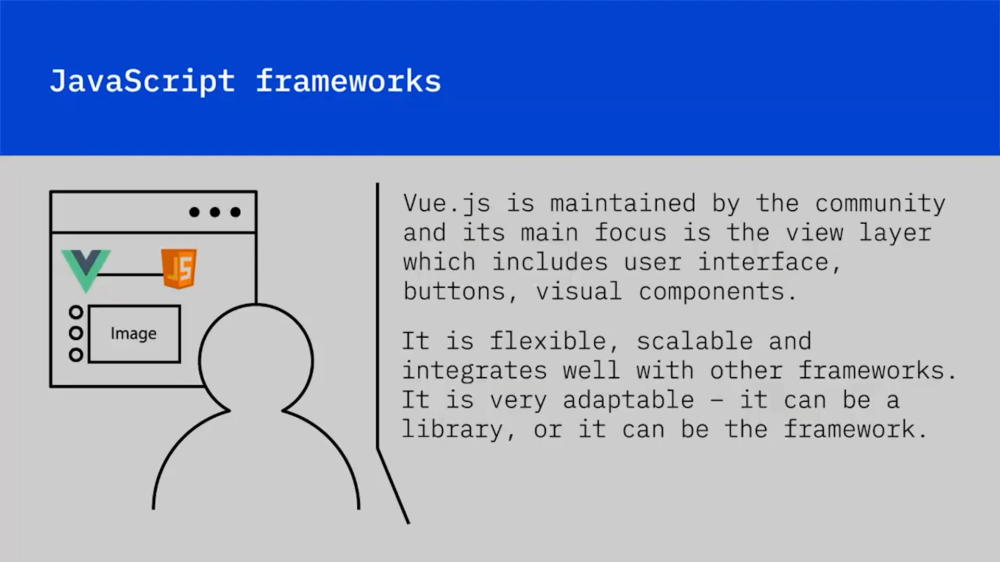
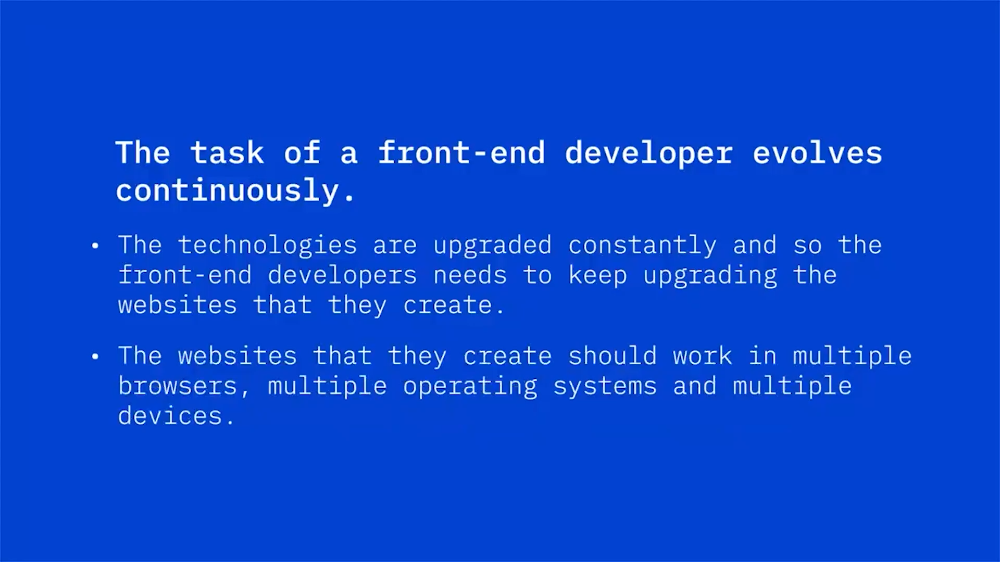

## 🎨 Front-End Geliştirmeyi Öğrenme

İnternet web siteleri birçok farklı hizmet sunar; bunlardan en popüler olanlardan biri çevrimiçi alışveriştir. Bir çevrimiçi alışveriş sitesini keşfederken, sayfalar arasında gezinirken, farklı ürün kategorileri seçerken veya ürünleri karşılaştırırken, bir web sitesinin  **front end** ’i ile etkileşim kurarsınız.

Şimdi, bir web sitesinin  **front end** ’inin front-end geliştiriciler tarafından nasıl geliştirildiğine bakalım. Bunun için, bir web sitesinin nasıl yapıldığını anlamamız gerekir. Bir web sitesi oluşturmak için web geliştiriciler genellikle  **Hypertext Markup Language (HTML)** , **Cascading Style Sheets (CSS)** ve **JavaScript** kullanır. Bu diller, birbirleriyle birlikte çalışacak şekilde tasarlanmıştır.  **HTML** , bir web sitesinin fiziksel yapısını oluşturmak için kullanılır.

## 🧱 HTML: Yapıyı Oluşturma

Fiziksel yapı; metin, bağlantılar, görseller ve videolar, sayfa ayırıcıları ve düğmeler gibi öğeler içerir. HTML kodu, tüm metin ve görsel öğelerinin doğru biçimlendirilmesini sağlayarak tarayıcıların sayfayı tutarlı bir şekilde görüntülemesini sağlar. Front-end geliştirici, web sitesinin yapısını kodlar.

Bir web sitesi, yalnızca inşa edilmiş bir ev gibidir. Nasıl ki bir mekâna stil katmak için iç mimarlara ihtiyaç duyuyorsak, bir web sitesine gerekli gösterişi ve çekiciliği katmak için de front-end geliştiricilere ihtiyaç duyarız.

## 🎭 CSS: Tasarım ve Görsel Çekicilik

Herhangi bir web sitesinden ürün sipariş ettiğinizde, sayfaların hoş bir yazı tipine sahip olduğunu, çekici renklere sahip olduğunu ve gezinmenin kolay olduğunu fark edersiniz. Geliştiriciler, şık web siteleri oluşturmak için **CSS** kullanır.

CSS, front-end geliştiricilere bir web sitesi ve onun her bir bileşeni için farklı stil özellikleri kümelerini tanımlamak, uygulamak ve yönetmek için standart bir yöntem sağlar. CSS; görünüm ve his, stil, renkler, yazı tipleri, tasarımlar ve düzenlerde tutarlılığı garanti eder.

Yani **HTML** yapı oluşturmak için, **CSS** ise onu tasarlayıp çekici hale getirmek için kullanılır.

CSS ayrıca tarayıcılar arası uyumluluğa sahip web siteleri oluşturmak için de kullanılır; bu da PC, mobil cihazlar, iPad’ler vb. gibi birden fazla tarayıcı ve birden fazla cihazla uyumlu oldukları anlamına gelir.

## ⚙️ JavaScript: Etkileşim ve Dinamik İçerik

Çevrimiçi alışveriş siteleri sezgiseldir, etkileşimlidir ve hızlı yüklenir. İşte burada **JavaScript** devreye girer. JavaScript, HTML ve CSS ile birlikte kullanılarak bir web sitesine etkileşim kazandıran nesne yönelimli bir programlama dilidir.

Örneğin, bir sayfaya giriş (login) düğmesi eklemek için HTML kullanırsınız ve bu düğmeyi stillendirmek için CSS kullanırsınız. Ardından, bu düğmeye giriş işlevselliğini eklemek için JavaScript kullanırsınız.

## 🧩 SASS ve LESS: CSS Uzantıları

Yeni bir front-end geliştirme dili  **Syntactically Awesome Style Sheets (SASS)** , *SAS* olarak adlandırılır. Tüm CSS sürümleriyle uyumlu olan CSS’in bir uzantısıdır. SASS; değişkenler, iç içe kurallar ve satır içi içe aktarmalar gibi şeyleri kullanarak düzenli kalmanızı sağlar. SASS, stil dosyalarını daha hızlı ve daha kolay oluşturmanıza olanak tanır.

Şu anda kullanılan bir diğer dil **Leaner Style Sheets (LESS)** ya da  *LESS* ’tir. LESS, CSS’i geliştirerek daha fazla stil ve işlev ekler. CSS ile geriye dönük uyumludur.  **LESS.js** , LESS stillerini CSS stillerine dönüştüren bir JavaScript aracıdır.

## 📱 Uyarlanabilir ve Duyarlı Tasarım

Tüm bu diller kullanılarak web siteleri uyarlanabilir ( *adaptive* ) ve duyarlı ( *responsive* ) olarak tasarlanır.

 **Uyarlanabilir web siteleri** , belirli bir ekran boyutu için tasarlanmış web sitesi sürümünü görüntüler. Örneğin, bir web sitesi PC’de açıldığında, mobil cihazda açıldığından daha fazla bilgi sağlayabilir.

Bir web sitesinin **duyarlı tasarımı** ise, erişildiği cihaza otomatik olarak yeniden boyutlanacağı anlamına gelir. Örneğin, bir ürün web sitesini mobil cihazınızda açarsanız, ekranın küçük boyutuna kendini uyarlar ve yine de size tüm özellikleri gösterir.

## 🧱 JavaScript Framework’leri ve Kütüphaneler

Bir JavaScript framework’ü, JavaScript ile yazılmış bir uygulama framework’üdür. Programcılar farklı işlevleri manipüle edebilir, gerektiği yerde kullanabilir ve cihaza duyarlı uygulamalar oluşturabilir.

Kullanılan framework’lere birkaç örnek:

* **Angular Framework** , Google tarafından sürdürülen açık kaynaklı bir framework’tür. Angular Framework’leri, web sitelerinin HTML sayfalarını hızlı ve verimli şekilde render etmesini sağlar. Yönlendirme ( *routing* ) ve form doğrulama ( *form validation* ) için yerleşik araçlara sahiptir.
  
* **React.js** , Facebook tarafından geliştirilmiş ve sürdürülmektedir. Bir web sayfası için bileşenler ( *components* ) oluşturan ve render eden bir JavaScript kütüphanesidir. Tam bir araç paketi değildir. Örneğin yönlendirme bu framework’ün bir parçası değildir ve üçüncü taraf bir araç kullanılarak eklenmesi gerekir. React.js yalnızca bileşenleri oluşturup sayfaya yerleştirmeye yardımcı olur.

  
* **Vue.js** , topluluk tarafından sürdürülür ve ana odağı Vue katmanıdır; bu katman kullanıcı arayüzünü, düğmeleri ve görsel bileşenleri içerir. Esnek, ölçeklenebilir ve diğer framework’lerle iyi entegre olur. Çok uyarlanabilirdir. Bir kütüphane olabilir ya da framework olabilir.

## 🔄 Front-End Geliştiricinin Sürekli Evrilen Rolü

Bir front-end geliştiricinin görevi sürekli olarak gelişir. Teknolojiler sürekli yükseltilir, bu nedenle front-end geliştiricilerin oluşturdukları web sitelerini de sürekli yükseltmeleri gerekir.

Oluşturdukları web siteleri; birden fazla tarayıcıda, birden fazla işletim sisteminde ve birden fazla cihazda çalışmalıdır.

