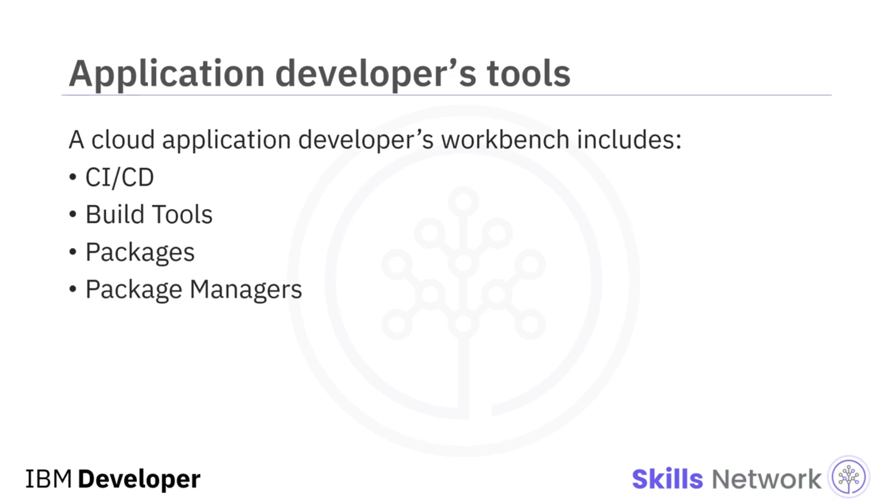
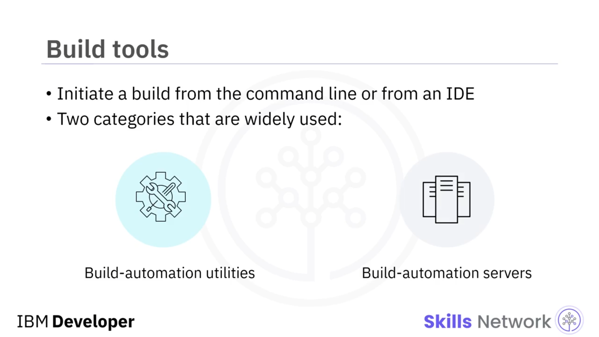
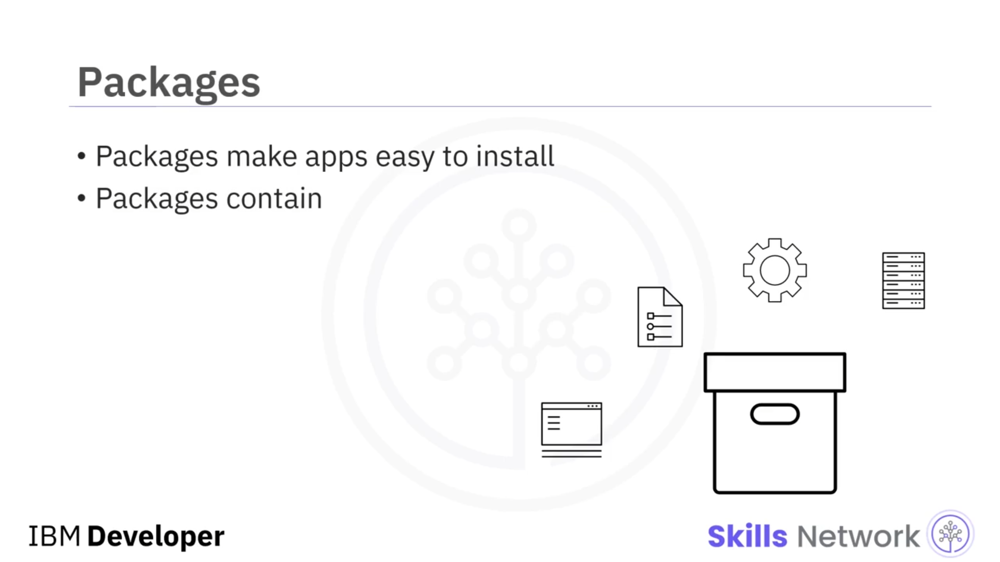
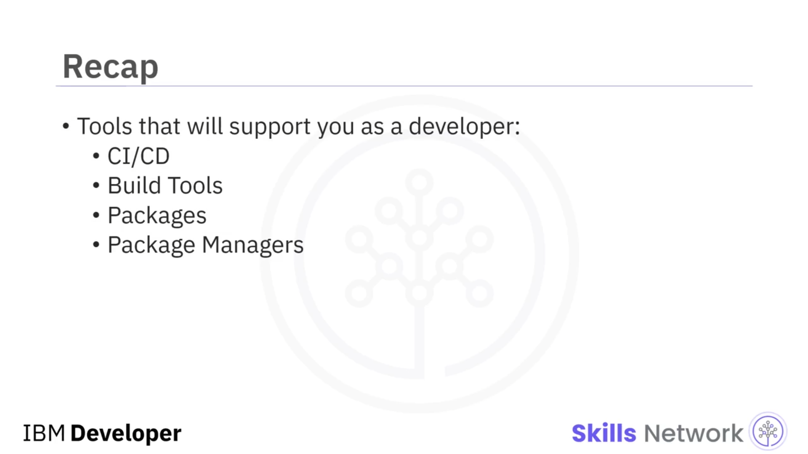

## 🧰 Daha Fazla Uygulama Geliştirme Aracı

Daha Fazla Uygulama Geliştirme Aracı dersine hoş geldiniz. Uygulamanızı oluşturmanıza ve dağıtmanıza yardımcı olabilecek bazı araçlara bakalım:  **CI/CD** ,  **Build Tools** , **Packages** ve  **Package Managers** .

## 🔁 CI/CD

CI/CD, *continuous integration* ve *continuous delivery* veya *continuous deployment* uygulamalarını ifade eder. CI/CD, geliştiricilerin sık değişiklikleri güvenilir şekilde teslim etmesini sağlayan,  **devops ekipleri için bir en iyi uygulamadır** .

Bir build-automation sunucusu üzerinden uygulanan  **Continuous Integration (CI)** , tüm kod bileşenlerinin birlikte sorunsuz çalışmasını sağlar. Bir CI build ortamı, yeni geliştirilen kodu sık sık entegre etmenizi mümkün kılar; projenin ne kadar hızlı değiştiğine bağlı olarak, her gün en az bir kez, hatta her saat bile olabilir.

 **Continuous delivery (CD)** , CI’nin bittiği yerde başlar. CI süreci kodunuzu otomatik olarak build eder ve test eder, ardından CD, bir build içindeki tüm kod değişikliklerini bir test veya *staging* ortamına dağıtır.

## 🏗️ Build Tools

Bir build tool, kaynak kodunuzu kurulum için gereken ikili dosyalara ( *binaries* ) dönüştürür. Build araçları, kaynak kodunuzu organize eder, derleme bayraklarını ( *compile flags* ) ayarlar ve bağımlılıkları ( *dependencies* ) yönetir.

Build araçları, birbiriyle bağlantılı çok sayıda projenin olduğu ve her projeye birden fazla geliştiricinin katkıda bulunduğu ortamlarda en önemlidir. Bu ortamlarda hangi değişikliklerin yapıldığını, hangi sırayla yapıldığını, hangi bağımlılıkların bulunduğunu ve bir sonraki build’e nelerin dahil edilmesi gerektiğini takip etmek çok zor olabilir; bu yüzden otomasyon, her şeyin sorunsuz çalışmasını sağlamak için kritiktir.

Build otomasyonu, geliştiricilerin günlük faaliyetlerinde yaptığı çok çeşitli görevleri otomatikleştirebilir, örneğin:

* Bağımlılıkları indirme
* Kaynak kodu ikili koda derleme
* Bu ikili kodu paketleme
* Testleri çalıştırma
* Ve üretim sistemlerine dağıtım ( *deployment* )

Bir build’i komut satırından ya da bir IDE’den başlatabilirsiniz.

## 🧱 Build Araçlarının Kategorileri

Yaygın olarak kullanılan iki kategori Build Tool vardır:

* **Build-automation utilities** , kaynak kodu derleyip bağlayarak ( *compiling and linking* ) çalıştırılabilir dosyalar gibi build çıktıları ( *build artifacts* ) üretir.
* **Build-automation servers** , build-automation utilities araçlarını planlanmış veya tetiklenmiş bir şekilde çalıştırır.

Bazı build tool örnekleri:

* **Webpack** – JavaScript için bir modül paketleyici ( *module bundler* )
* **Babel** – bir JavaScript derleyicisi ( *compiler* )
* **Web Assembly** - tarayıcınızda çalışan ikili komut formatı ( *binary instruction format* )

## 📦 Packages

Artık uygulamanızı geliştirdiniz ve test ettiniz; dağıtıma hazırsınız. Peki bu nasıl gerçekleşir?

Kullanıcının kurulumunun basit ve sorunsuz olması gerekir; bu yüzden yaygın kullanılan bir teknik, gerekli tüm dosyaları toplayıp bunları tek bir pakette bir araya getirmektir.

 **Packages** , uygulama dosyalarını, kurulum talimatlarını ve seçtiğiniz herhangi bir metaveriyi ( *metadata* ) içeren arşiv dosyalarıdır. Paketlerin kendilerine ait metaverileri de vardır; buna paket açıklaması, paket sürümü ve önceden kurulması gereken diğer paketler gibi bağımlılıklar dahildir.

Uygulamanızı bir pakete dönüştürdükten sonra, onu dağıtmak için bir **package manager** kullanabilirsiniz.

## 📦🧩 Package Managers

 **Package manager** ’lar, kullanıcının isteği üzerine yazılım paketlerini bulma, kurma, sürdürme veya kaldırma ( *uninstalling* ) görevlerini üstlenir.

Package management system’ler şunları yapar:

* Paket arşivlerini çıkarmak için dosya arşivleyicilerle koordinasyon sağlar
* Paketin bütünlüğünü ve özgünlüğünü sağlamak için checksum’ları ve dijital sertifikaları doğrular
* Bir yazılım deposundan ( *software repository* ) mevcut yazılımları bulur, indirir, kurar veya günceller
* Bir paketin ihtiyaç duyduğu tüm paketlerle birlikte kurulmasını sağlamak için bağımlılıkları yönetir

Başlıca platformların her biri için bazı yaygın package manager’lar:

* Linux’ta:  **Debian Package Management System (DPKG)** , **Red Hat Package Manager (RPM)**
* Windows’ta: **Chocolatey**
* Android’de: **Package Manager**
* MacOS’ta: **Homebrew** ve **MacPorts**

Uygulamanın bir parçası olarak geliştirilen herhangi bir kütüphane veya yardımcı kod, bulut uygulaması package manager’ları ile yönetilir.

Popüler diller için bazı package manager örnekleri:

* Node.js/Javascript için: **npm**
* Java için: **Gradle** ve **Maven**
* Ruby için: **RubyGems**
* Python için: **Pip** ve **Conda**

## ✅ Bu Videoda Öğrendikleriniz

Bu videoda, bir geliştirici olarak kariyerinizde kullanacağınız bazı araçlar hakkında bilgi edindiniz; bunlar arasında:  **CI/CD** ,  **Build Tools** , **Packages** ve **Package Managers** yer alır.

