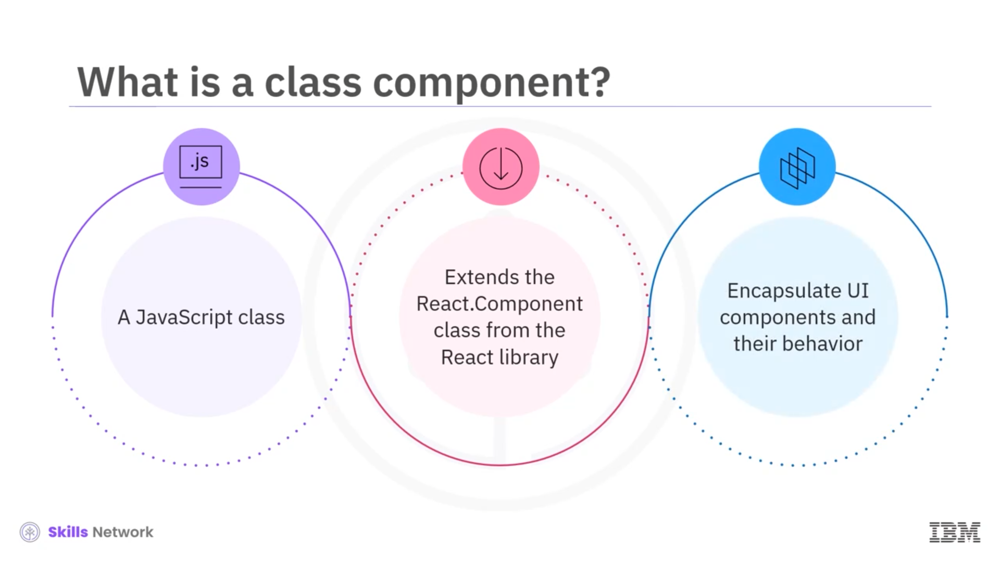
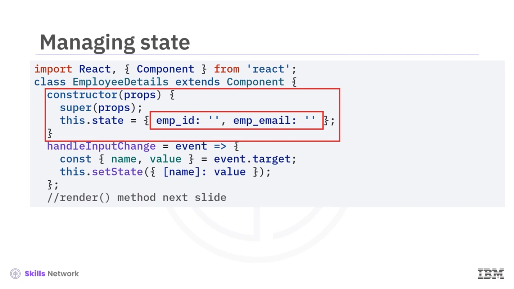
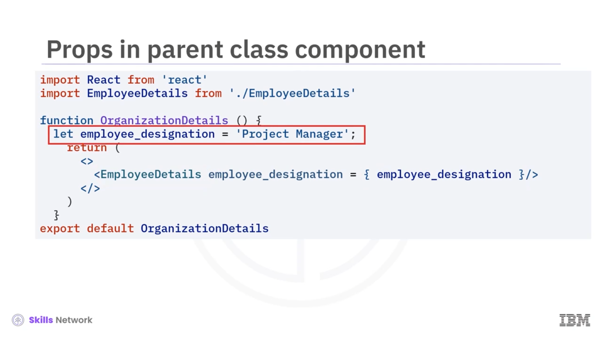

## 🎓 Working with React Class Components: Props and Event Handling

React sınıf bileşenleri, props ve olay yönetimi üzerine bir videoya hoş geldiniz. Bu videoyu izledikten sonra bir sınıf bileşenini tanımlayabilecek, bir sınıf bileşeninin nasıl çalıştığını açıklayabilecek, React sınıf bileşeninde state’i nasıl yöneteceğinizi açıklayabilecek, React’te bir sınıf bileşeninde props’un nasıl kullanılacağını açıklayabilecek ve sınıf bileşenlerinde olayların nasıl ele alınacağını açıklayabileceksiniz.

React’te bir sınıf bileşeni, React kütüphanesindeki `React.Component` sınıfını genişleten bir JavaScript sınıfıdır. Sınıf bileşenleri, hook’lar tanıtılmadan önce React’te bileşen tanımlamanın birincil yoluydu. UI bileşenlerini ve bunların davranışlarını yeniden kullanılabilir yapı taşları hâlinde kapsüllerler.

Sınıf bileşenleri ES6 sınıf sözdizimi kullanılarak tanımlanır. Ayrıca state’leri yönetir, yaşam döngüsü (lifecycle) olaylarını ele alır ve sınıf içerisinde bileşen metotlarını tanımlar.

---

## 🧩 Sınıf Bileşeni Tanımı ve Temel Yapı

Bir sınıf bileşeninin temel bir örneğine bakalım. Sınıf bileşeninde önce import ifadelerini yazarsınız: React’ten React ve component import edilir. Bu ifade, React’i ve React paketinden component sınıfını içe aktarır. React, React uygulamalarında UI bileşenleri oluşturmak için çekirdek kütüphanedir ve component, React sınıf bileşenlerinin oluşturulduğu temel sınıftır.

Sonra sınıfı bildirirsiniz ve `MyComponent` sınıfı React tarafından sağlanan component’i genişletir. Bu ifade, `MyComponent`’in artık bir React sınıf bileşeni olduğu ve component sınıfının sağladığı tüm işlevselliği miras aldığı anlamına gelir.

Ardından `MyComponent` sınıfının içinde `render` metodunu kullanırsınız. Bu metot her sınıf bileşeninde zorunludur ve bileşenin UI’ını temsil eden JSX React elemanlarını döndürmekten sorumludur. Bu örnekte, içinde `"Hello, world!"` metni bulunan bir `h1` öğesi barındıran bir `div` etiketi döndürür.

JSX, JavaScript kodu içinde doğrudan HTML benzeri sözdizimi yazmanıza olanak tanır. Son ifade ise `export` ifadesidir: `export default MyComponent`. Bu ifade `MyComponent` sınıfını bu dosyadan varsayılan (default) dışa aktarım olarak export eder. Böylece projedeki diğer dosyalar `import MyComponent from MyComponent` kullanarak `MyComponent`’i içe aktarabilir ve kullanabilir.

---

## 🧠 State Yönetimi

State yönetimi, React sınıf bileşenlerinin kritik bir yönüdür. State, bileşenin render edilmesi ve kullanıcı etkileşimlerine yanıt verebilmesi için ihtiyaç duyduğu veriyi temsil eder.

State’i `constructor` içinde `this.state` kullanarak başlatabilir ve `this.setState` kullanarak güncelleyebilirsiniz. Bir sınıf bileşeninde state’i aşağıdaki kodda gösterildiği gibi yönetebilirsiniz.

Kod, React tarafından sağlanan component sınıfını genişleten `EmployeeDetails` adlı bir sınıf tanımlar. `constructor` içinde bileşen, state’ini iki özellik ile başlatır: `emp_id` ve `emp_email`; her ikisi de boş string olarak ayarlanır. Bu başlangıç state’i, kullanıcıların çalışan kimliği ve e-posta girebileceği input alanları için başlangıç değerlerini temsil eder.

Bileşen, input alanlarındaki değişimleri yönetmek için `handleInputChange` adlı bir metot tanımlar. Bu metot, input alanlarında bir değişim olayı gerçekleştiğinde tetiklenir.

Input değiştiğinde metot, event target’tan name ve value değerlerini çıkarır; burada name, güncellenecek state özelliğine (`emp_id` veya `emp_email`) karşılık gelir ve value, kullanıcının girdiği yeni değere karşılık gelir. Ardından bileşen state’ini, güncellenen özelliği ve yeni değerini içeren bir nesne ile `this.setState` çağırarak günceller. React bu nesneyi mevcut state ile otomatik olarak birleştirir; yalnızca belirtilen özelliği güncellerken diğer özellikleri değiştirmeden korur.

`render` metodu bileşeni mevcut state’ine göre oluşturur. Input alanlarının `value` özelliğini, karşılık gelen state özellikleri olan `emp_id` ve `emp_email` ile dinamik olarak bağlar. Bu bağlama, input alanlarının bileşen state’inde saklanan güncel değerleri göstermesini sağlar. Kullanıcı input alanlarıyla etkileşime geçtiğinde, state değiştikçe ekranda gösterilen değerler gerçek zamanlı olarak güncellenir.

`Show Details` düğmesine tıklandığında bir `alert` tetiklenir ve `emp_id` ile `emp_email`’in mevcut değerleri görüntülenir. Alert, değerleri göstermek için doğrudan state özellikleri olan `emp_id` ve `emp_email`’e erişir. React state’i yönettiği için, gösterilen değerlerin her zaman mevcut state ile güncel kalmasını sağlar.

---

## 📦 Props Kullanımı

React’te props ya da properties, veriyi parent bileşenlerden child bileşenlere göndermek için kullanılır. Child bileşen, parent’tan veriyi alır ve kullanabilir. Child bileşenin aldığı props’lar salt okunurdur ve değiştirilemez. Ayrıca parent bileşenlerden child bileşenlere metotlar veya fonksiyonlar da aktarılabilir.

Bir kod örneğine bakalım. Parent bileşen `OrganizationDetails.jsx`’tir. JSX içinde, `employee_designation` prop değeri sınıf bileşeni içinde tanımlanır ve bir attribute olarak `EmployeeDetails` bileşenine aktarılır. `employee_designation` prop’unun değeri olarak `Project Manager` iletilir.

Child sınıf `EmployeeDetails`’in parent sınıf `OrganizationDetails`’ten gelen veriye nasıl eriştiğine bakalım. Kodda `employee_designation` prop’u, `render` metodunda `this.props` içinden destructuring yapılarak `EmployeeDetails` bileşeni içinde erişilir. Bu metot, child sınıfın parent sınıf `OrganizationDetails` tarafından aktarılan `employee_designation` prop’una erişmesini sağlar.

JSX içinde `employee_designation`, diğer değerler `emp_id` ve `emp_email` ile birleştirilir. `Show Details` düğmesine tıklandığında bir `alert` tetiklenir ve `emp_id`, `emp_email` ve `employee_designation` değerleri görüntülenir.

---

## 🖱️ Event Handling

React’te event handling, bir React uygulaması içinde tıklamalar, mouseover, mouse out, form gönderimleri ve benzeri kullanıcı etkileşimlerine yanıt vermektir.

Örneğin, event handling JSX içinde `onClick` özelliği kullanılarak verilen kodda yapılır. `Show Details` düğmesine tıklandığında bir arrow function çağrılır. `emp_id`, `emp_email` ve `employee_designation` değerleri bu arrow function tarafından template literal kullanılarak bir uyarı mesajı oluşturmak için kullanılır. Bu arrow kodu, `onClick` attribute’u ayarlandığında çalışır ve kullanıcıya alert mesajını gösterir.

Bu yöntem, olayları doğrudan JSX kodu içinde ele almanızı sağlar ve React bileşenlerine kullanıcı etkileşimleri eklemeyi kolaylaştırır.

---

## ✅ Video Özeti

Bu videoda, React’te bir sınıf bileşeninin React kütüphanesindeki `React.Component` sınıfını genişleten bir JavaScript sınıfı olduğunu öğrendiniz. Sınıf bileşenleri UI bileşenlerini ve bunların davranışlarını yeniden kullanılabilir yapı taşları hâlinde kapsüller.

Sınıf bileşenleri state’i yönetir, yaşam döngüsü olaylarını ele alır ve bileşen metotlarını tanımlar. State, bileşenin render edilmesi ve kullanıcı etkileşimlerine yanıt verebilmesi için ihtiyaç duyduğu veriyi temsil eder.

React’te props ya da properties, veriyi parent bileşenlerden child bileşenlere gönderir. React’te event handling, bir React uygulaması içinde tıklamalar, mouseover, mouseout, form gönderimleri ve benzeri kullanıcı etkileşimlerine yanıt verme sürecidir.

