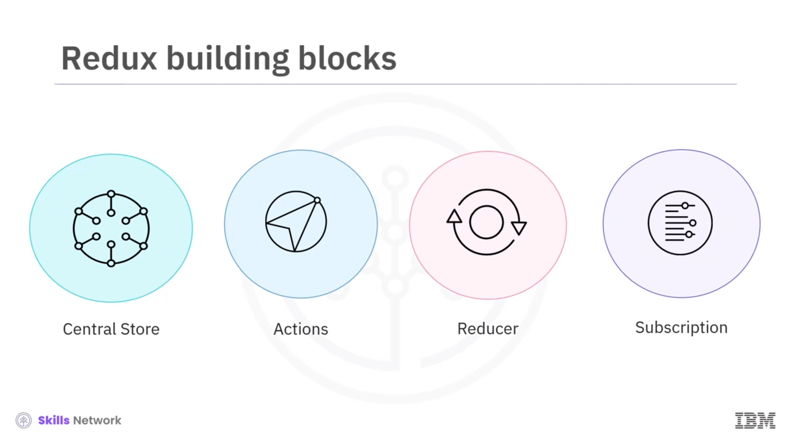
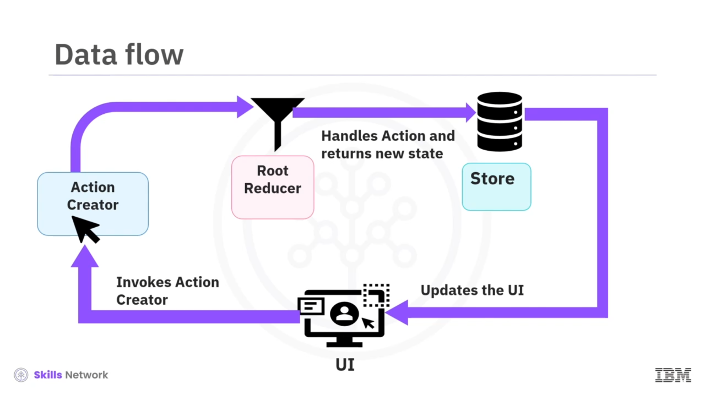

## 🔗 Binding Redux and Flow

*Redux Bağlama ve Akış’a hoş geldiniz.* Bu videoyu izledikten sonra şunları yapabileceksiniz: *state change* kavramını açıklamak, Redux’taki veri akışını tanımlamak ve Redux’taki  *one-way data flow* ’un avantajlarını listelemek.

## 🧠 State Change Kavramı

Bir React uygulamasında  *state* , bir bileşenin özelliklerini saklar. Bir bileşenin durumu değiştiğinde, React  *Document Object Model (DOM)* ’un yeniden render edilmesini tetikleyerek yanıt verir.

Uygulama büyüdükçe, uygulamanızdaki state’i yönetmek zorlaşır. State’teki değişim, bileşenler arasında veri aktarımını ve uzun bir *props* zincirini içerebilir; bu da karmaşık bir uygulama koduna yol açabilir.

## 🧩 Redux’un Çözümü

Bu probleme çözüm olarak *Redux* sunulur. Redux, uygulamanızın state’ini yönetebilen açık kaynaklı bir JavaScript kütüphanesidir. Genellikle *ReactJS* ile kullanılır; ancak bununla sınırlı değildir ve *Angular* gibi diğer JavaScript kütüphaneleriyle de kullanılabilir.

Geleneksel bir React-Redux uygulaması, tek bir *store* ile birlikte tek bir *root Reducer* içerir. Uygulama daha karmaşık hale geldikçe,  *root Reducer* , state tree’nin farklı bölümlerinde çalışan daha küçük  *Reducers* ’lara ayrılır.

Alternatif bir çözüm, farklı bileşenlerin erişebileceği bir *global variable* ayarlamak olabilir. Ancak React, global variable üzerinde yapılan değişikliklere tepki vermez. Redux, kodun karmaşıklığını azaltan ve state güncelleme sürecini kolaylaştıran merkezi bir store sağlar.

## 🧱 Bileşen Özelliklerini Güncellemede Redux Öğeleri

Bileşen özelliklerinin güncellenmesinde yer alan Redux öğeleri şunlardır:

### 🏛️ Central Store

 *Store* , tüm uygulama listesini “ *state tree* ” biçiminde tutar.

### 📨 Actions

Bunlar, bileşen tarafından reducer’a bir tür ( *type/description* ) ile gönderilen bilgi paketleridir. *Actions* basit nesnelerdir ve geleneksel olarak iki özelliğe sahiptir: *type* ve  *payload* .

*type* özelliği genellikle action’ı tanımlayan bir string’dir; *payload* ise bir görevi gerçekleştirmek için gereken bazı verileri içeren isteğe bağlı bir özelliktir. Dolayısıyla action’ların temel işlevi, veriyi uygulamadan Redux store’a göndermektir.

### 🧮 Reducer

Bu, eski state’i ve action’ı girdi olarak alan ve güncellenmiş bir state döndüren basit bir fonksiyondur. State *immutable* olduğu için reducer her zaman yeni bir state döndürür; bu da önceki state’in güncellenmiş bir sürümüdür.

### 🔔 Subscription

Bu, store’daki state güncellendiğinde bileşenlerde tetiklenir.

## ➡️ React-Redux’ta Veri Akışı

Bir React-Redux uygulamasında veri akışı  *unidirectional* ’dır. Yalnızca tek bir yönde ilerler.

React-Redux uygulamasında veri akışı, kullanıcı uygulama arayüzüyle etkileşime geçtiğinde bileşen seviyesinde başlar. Bu etkileşim,  *action creators* ’ın bir action dispatch etmesine yol açar.

Bir action dispatch edildiğinde, uygulamanın  *root reducer* ’ı tarafından alınır ve tüm reducer’lara iletilir. Bu nedenle, dispatch edilen action’a göre state’i güncellemesi gerekip gerekmediğini belirlemek reducer’ın görevidir. Bu kontrol, gerekli action’ları ayıklamak için basit bir *switch statement* kullanılarak yapılır.

Uygulamadaki her küçük reducer, dispatch edilen action’ı kabul eder ve dispatch edilen action’ın  *type* ’ı eşleşirse, yeni güncellenmiş bir state döndürür.

Burada önemli olan nokta şudur: Redux’ta state aslında hiçbir zaman değişmez. Bunun yerine reducer, her zaman eski state’in bir kopyası olan fakat bazı değişiklikler içeren yeni bir state üretir. Ardından store bileşeni yeni state hakkında bilgilendirir; bileşen güncellenmiş state’i alır ve bileşeni yeniden render eder.

## 🔁 Two-Way Binding’den One-Way Data Flow’a

Eskiden geliştiriciler, UI’nin değişimi yansıtması için state verisini değiştirmede *two-way binding* kullanırlardı. *Angular* ve *Ember* gibi sağlam framework’ler bu tür bağlamayı kullanıyordu.

Ancak uygulamalar büyüdükçe, two-way binding tarayıcı performansını olumsuz etkiliyordu. Ayrıca veri akışını takip etmek zorlaştı. Büyük şirketler, sohbet özelliği gibi basit uygulamaları bile uygulamakta zorlandı.

*One-way data flow* paradigmasında, sunum bileşenleri ( *presentational components* ) inşa edip bunları container’lar veya store ile sarmalamak (Redux uygulamalarında olduğu gibi) problemi çözer.

## ✅ Redux’ta One-Way Data Flow’un Avantajları

Redux’ta  *one-way data flow* ’un avantajı, büyük ve front-end ağırlıklı web uygulamalarını geliştirmenin çok daha yönetilebilir hale gelmesidir.

UI üzerinde gerçekleştirilen eylemler, eylem sonucunda gerçekleşen state değiştirme ve güncelleme süreçlerinden ayrıldığında state’i yönetmek daha kolaydır.

Ayrıca React Native’de, aynı container’ların, action’ların ve reducer’ların bazılarını kullanarak iOS ve Android için hızlıca uygulamalar oluşturabilirsiniz. iOS veya Android view bileşenlerini HTML yerine kullandığınızda, *presentational components* biraz değişir.

## 🧾 Video Özeti

Bu videoda şunları öğrendiniz:

* Bir bileşenin state’i değiştiğinde, React DOM’un yeniden render edilmesini tetikler.
* Bileşen özelliklerini güncellemede yer alan Redux öğeleri:  *Central Store* ,  *Actions* , *Reducer* ve  *Subscription* ’dır.
* React-Redux uygulamasında veri akışı  *unidirectional* ’dır.
* UI üzerinde yapılan eylemler, state’in değişmesinden ayrıldığında state’i yönetmek daha kolaydır.

