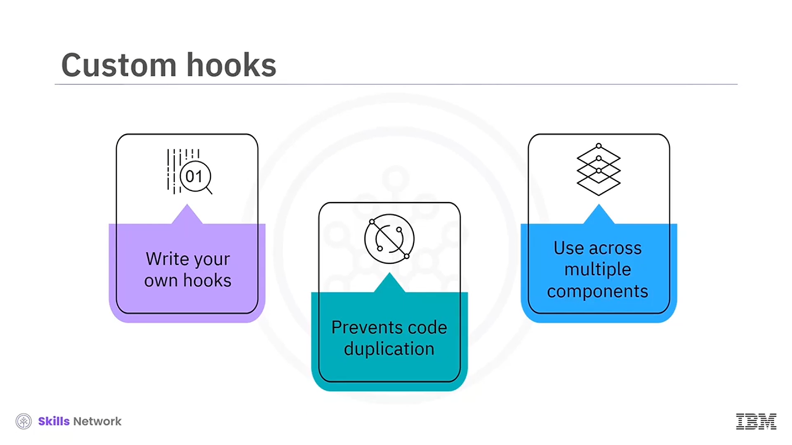
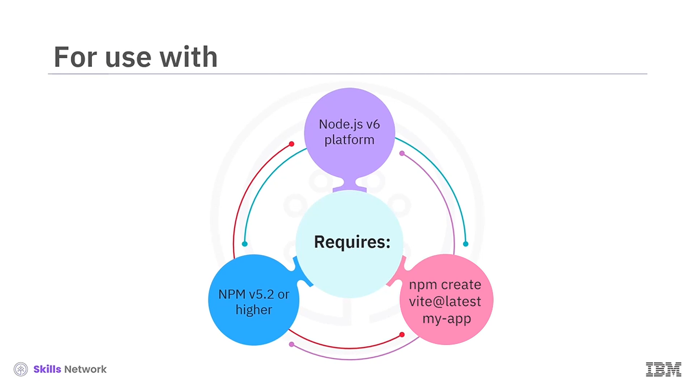
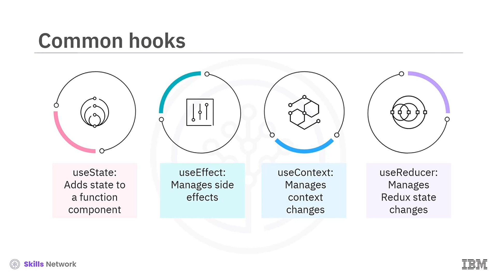

# 🪝 Hooks

Hooks’e hoş geldiniz. Bu videoyu izledikten sonra **Hooks** kullanmanın amacını açıklayabilecek,  **Hooks** ’un avantajlarını listeleyebilecek, **Hook geliştirme** için en iyi uygulamaları özetleyebilecek ve **standart** ile **özel (custom)** Hooks’u karşılaştırabileceksiniz.


React’in **16.8** sürümünde tanıtılan Hooks, **class component** yazmanın getirdiği birçok zorluğu hafifletir. Hooks,  **functional component** ’leri,  **class component** ’lerle aynı yeteneklere sahip olacak şekilde yazmanın bir yolunu sunar. Yani,  **function component** ’lerde Hooks kullanarak bir bileşenin  **state** ’ine erişebilirsiniz. Bileşen güncellendiğinde ve yeniden render edildiğinde state’ini korur. Böylece function component’ler, class component’lerle aynı işlevselliği, kodda daha az karmaşıklıkla sağlar.


Adından da anlaşılacağı gibi, function component’lerden React’in **state** ve **lifecycle** özelliklerine “bağlanmanıza” (hook into) olanak tanır. Hatta **özelleştirilmiş hooks** da yazabilirsiniz. Bir bileşenden diğerine kod kopyalamak yerine, birden fazla bileşen için bir **custom hook** yazabilirsiniz.



Hooks kullanmanın avantajları arasında kodun daha kolay okunması yer alır. Kod parçalarınız boyut olarak daha yönetilebilir hale gelir. Hooks, kodunuzu optimize etmeye yardımcı olur ve UI’da karmaşık davranışlar üreten kod yazmanızı sağlar. Kodunuzu basitleştirir.

Hooks, class kullanmadan olayları (events) ve sonrasındaki mantığı yönetmenize yardımcı olur. Hooks ayrıca bileşenlerinize bir **performans artışı** da sağlar.


---

## ✅ En İyi Uygulamalar

Hooks kullanırken bazı en iyi uygulamaları konuşalım. Hooks’u  **yalnızca function component** ’lerle kullanabilirsiniz. Bir hook’u bir bileşen ağacının **en üst seviyesinde** çağırmalısınız. Başka bir deyişle,  **child component** ’ler içinde hooks çağıramazsınız. Normal bir JavaScript fonksiyonundan bir hook çağıramazsınız.

Hooks’u  **döngüler (loops)** , **koşullu ifadeler (conditional statements)** veya **iç içe fonksiyonlar (nested functions)** içinde çağıramazsınız.


Sürümleme açısından, Hooks **Node.js sürüm 6** JavaScript platformunu gerektirir. Ayrıca **Node Package Manager (NPM)** sürüm **5.2** veya daha yükseğini kullanırlar.

React uygulamanızı Vite kullanarak kurmak için aşağıdaki aracı kullanmalısınız. Bu, yapılandırmayı basitleştirir, birden çok build aracına duyulan ihtiyacı azaltır ve uygulamanızı otomatik olarak optimize eder:



```bash
npm create vite@latest my-app --template react
```

---

## 🧩 Yaygın Olarak Kullanılan Hooks

En sık kullanılan hooks’lardan bazılarını inceleyelim:

* *UseState* hook’u, function component’inizde bileşenin  **state** ’ine erişmenizi sağlar.
* *UseEffect* hook’u, document değişiklikleri ve HTTP istekleri gibi  **side effect** ’leri yönetir. Bir veritabanından veri çekmeniz gerekiyorsa bunu kullanırsınız.
* *UseContext* hook’u, **context** değişikliklerini yönetir ve bir context’e erişim sağlar.
* *UseReducer* hook’u, **redux state** değişikliklerini yönetir. Redux’un hafif bir formu gibi, bu hook bir **dispatch** fonksiyonu ve bir **state** sağlar; bir **reducer** ve bir **initial state** alır. Redux kütüphanesi hakkında başka bir derste daha fazla bilgi edineceksiniz.
* 

---

## 🛠️ Custom React Hooks

Custom React hooks, React uygulamalarınıza benzersiz işlevsellik eklemenizi sağlar. Custom hook’ları, **use** önekini prefix olarak kullanarak adlandırırsınız. Örneğin, *UseLocalStorage* veya *UseAuthentication* adlı custom hooks oluşturabilirsiniz.

Bir custom hook, bir veya birden fazla hook’un yeni bir bileşimidir. Hooks’u fonksiyonlar gibi ele alabildiğiniz için aynı özelliklere sahiptirler. İhtiyaç duydukça yeniden kullanabilir ve birleştirebilirsiniz.


Bu kod örneğinde, bu kod bileşenin yerel state’ine erişmek için *UseState* hook’unu içe aktarır. Bu hook, **destructed array** ile değerleri döndürür ve atar. Mevcut **count state** ilk dizi elemanıdır ve ikinci değişken  **count** ’u ayarlar; böylece güncellemeler yapmanıza olanak tanır. Başlangıç count değeri, *UseState* hook fonksiyonuna bir parametre olarak aktarılır. Bundan sonra, bunu kullanmak için bu fonksiyonu bir  **event handler** ’dan çağırırsınız.


---

## 🧾 Özet

Bu videoda, hooks’un function component’lere class component’lerle aynı yetenekleri kazandırdığını öğrendiniz. Hooks, daha basit, daha okunabilir ve daha az miktarda kod yazmanızı sağlar; daha karmaşık davranışlar sunar ve performansı iyileştirir.

Hooks’u ağacın en üst seviyesinde çağırmalısınız ve normal ya da iç içe fonksiyonlardan veya döngüler ve koşullar içinden çağıramazsınız. Standart hooks’lar arasında  *UseState* ,  *UseEffect* , *UseContext* ve *UseReducer* bulunur.

Ve son olarak, custom hooks kullanarak benzersiz işlevsellik ekleyebilirsiniz.


