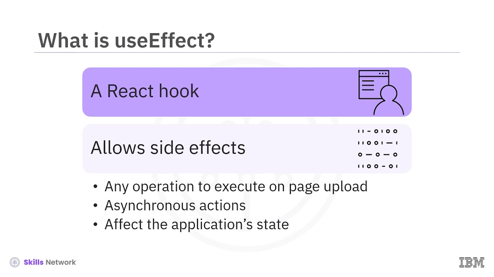
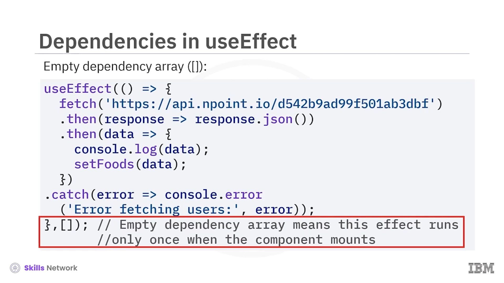
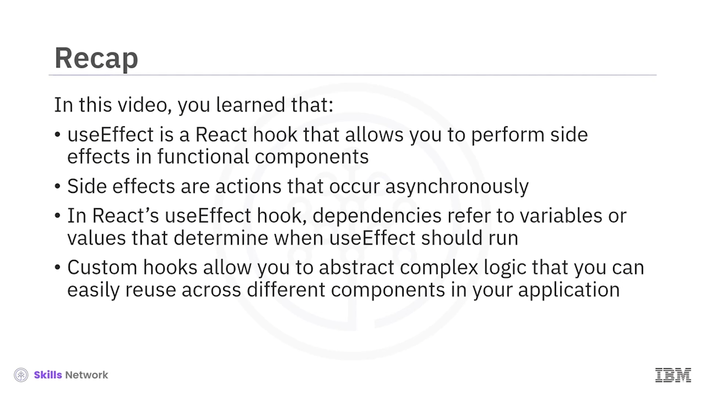

# 🌪️ Side-effects Management and Custom Hook

Site Effects Management and Custom Hook videosuna hoş geldiniz. Bu videoyu izledikten sonra React’te *UseEffect* ve  *SiteEffects* ’in rolünü tanımlayabilecek, *UseEffect* ve  *SiteEffects* ’in React’te nasıl çalıştığını açıklayabilecek, *UseEffect* içindeki farklı bağımlılıkları (dependencies) açıklayabilecek ve React’te bir  **custom hook** ’u tanımlayabileceksiniz.

 *UseEffect* , functional component’lerde *SiteEffects* gerçekleştirmenize olanak tanıyan bir React hook’udur. Bir  *SiteEffect* , sayfa yüklendiği anda, bu operasyonları/işlevleri ayrıca çağırmadan çalıştırmanız gereken herhangi bir işlemi ifade eder; örneğin bir API’den veri çekmek, event’lere abone olmak, DOM’u manipüle etmek veya timer’lar kurmak gibi.

 *SiteEffects* , asenkron olarak gerçekleşen ve uygulamanın state’ini veya UI’ını etkileyen eylemlerdir.

---

## 🍽️ UseEffect ve SiteEffects Örneği

React’te *UseEffect* ve  *SiteEffects* ’i anlamak için basit bir örnek. Diyelim ki bir component, bir API’den yemek öğeleri listesini çekiyor ve bunları görüntülüyor. Bu kod örneğinde component’ler aşağıdaki gibidir.

### 🧠 UseState ile State Yönetimi

Component, bir functional component içinde state’i yönetmek için *UseState* hook’unu kullanır. Özellikle *UseState* ile **foods** adlı bir state değişkeni tanımlar ve bunu boş bir diziyle başlatır.

Bu değişken daha sonra API’den çekilen veriyi tutacaktır.

### ⚙️ UseEffect ile SiteEffects Gerçekleştirme

*UseEffect* hook’u, functional component’lerde *SiteEffects* çalıştırmak için kullanılır. Bu component’te  *UseEffect* , component mount olduğunda dış bir API’den veri çekmek için kullanılır.

### 🌐 Veri Çekme

*UseEffect* hook’unun içinde, belirtilen API endpoint’ine bir fetch isteği yapılır. *fetch* fonksiyonu, sunucudan gelen response’a çözümlenen bir promise döndürür.

Response alındıktan sonra, *response.json* response body’sini JSON olarak parse eder. Parse edilen JSON verisi sonraki *then* bloğunda kullanılabilir hale gelir; burada debug amacıyla console’a loglanır ve ardından **foods** state değişkenini çekilen veriyle güncellemek için  *setFoods* ’a aktarılır.

Fetch işlemi sırasında bir hata oluşursa, bu hata *catch* bloğunda yakalanır ve console’a bir hata mesajı loglanır.

### 🧾 Çekilen Veriyi Render Etme

Component’in döndürdüğü JSX içinde, yemek öğelerinin bir listesi ( **ul** ) render edilir. *map* metodu, **foods** dizisi üzerinde iterate etmek ve her yemek öğesi için bir liste öğesi ( **li** ) üretmek için kullanılır.

Her bir yemek öğesi için name, description, price, category, ingredients ve bir image gibi detaylar görüntülenir.

Image, her yemek öğesinin **image_url** özelliğinden alınan URL ile **img** tag’i kullanılarak render edilir.

### 📦 Component Export

Son olarak, *SideEffect* component’i **default export** olarak export edilir ve böylece uygulamanın diğer kısımlarında kullanılabilir hale gelir.

## 🧷 UseEffect Bağımlılıkları

React’in *useEffect* hook’unda  **dependencies** ,  *useEffect* ’in ne zaman çalışması gerektiğini belirlemek için kullanılan değişkenler veya değerlerdir. Dependencies, *useEffect* fonksiyonuna bir array argümanı olarak verilir. Aşağıdakiler bazı dependency türleridir.

### ⛔ Boş Dependency Array

Boş bir dependency array verdiğinizde, effect yalnızca component ilk kez yüklendiğinde bir kez çalışır.

Herhangi bir özel değişkene veya state değişikliklerine bağlı değildir. Bu davranış, yükleme anında yalnızca bir kez çalışması gereken görevleri yürütmek için kullanılır. Örneğin, kodda sayfa yalnızca bu sayfanın yüklenmesi sırasında bir kez çalışacaktır.

### 🔁 Dependency Array İçinde Değerler

Dependency array içinde değerler verdiğinizde, effect bu değerlerden herhangi biri değiştiğinde çalışır. Örneğin, kodda gösterildiği gibi **count** değeri.

Dependencies’ten herhangi biri son render’dan beri değiştiyse, React effect’i yeniden çalıştırır. Kodda effect yalnızca **count** state’i değiştiğinde çalışır; böylece *useEffect* hook’u, **count** güncellendiğinde her seferinde çalıştırılmış olur.

Bu nedenle **count** değişkeni dependency array’e dahil edilir.

### ♾️ Dependency Array’i Tamamen Atlamak

Dependency array’i tamamen çıkarırsanız, effect her render’dan sonra çalışır; buna initial render ve sonraki güncellemeler de dahildir.

Bu, effect’in başlangıç render’dan sonra ve component’in her rerender’ından sonra, herhangi bir değeri değiştirip değiştirmediğinize bakmaksızın çalışacağı anlamına gelir. Dependency olmadan bu davranış, effect’in her render’dan sonra çalışmasına neden olur.

---

## 🧩 Custom Hook ile Yeniden Kullanılabilir Mantık

React’te yeniden kullanılabilir mantık oluşturmak için bir **custom hook** kullanabilirsiniz. Custom hooks, uygulamanızdaki farklı component’ler arasında kolayca yeniden kullanabileceğiniz karmaşık mantığı soyutlamanıza olanak tanır. Bunu bir örnekle anlayalım.

İki component’iniz var: **ToggleButton** ve  **UseToggle** . ToggleButton kodunu inceleyelim.

ToggleButton component’i, true ve false durumları arasında geçiş yapma (toggling) mantığını kullanan **UseToggle** adlı bir custom hook’u import eder ve kullanır.

ToggleButton component’i içinde, butonun state’ini yönetmek için **UseToggle** hook’u kullanılır. Hook iki değer döndürür:  **IsToggled** , mevcut durumu (true veya false) temsil eder ve  **Toggle** , çağrıldığında state’i true ile false arasında değiştiren bir fonksiyondur.

JSX içinde, state true olduğunda  **on** , state false olduğunda **off** metin içeriğine sahip bir button render edilir. Butona tıklanınca **toggle** fonksiyonu tetiklenir ve state buna göre güncellenir.

Bu yapı, React component’leri içinde toggle işlevselliğini oluşturmak için basit ve yeniden kullanılabilir bir yol sağlar.

**UseToggle** custom hook’unun yeniden kullanılabilir kodu gösterildiği gibidir. ToggleButton’ın true ve false state’ini yönetir.

ToggleButton’a tıklamadan önce output gösterildiği gibi olacaktır. ToggleButton’a tıkladıktan sonra output gösterildiği gibi olacaktır. Kullanıcı butona tıkladığı sürece bu toggle işlemi gerçekleşecektir.

---

## 🧾 Özet

Bu videoda,  *UseEffect* ’in functional component’lerde side effects gerçekleştirmenizi sağlayan bir React hook’u olduğunu öğrendiniz.

Side effects, asenkron olarak gerçekleşen ve uygulamanın state’ini veya UI’ını etkileyen eylemlerdir. React’in *UseEffect* hook’unda dependencies,  *UseEffect* ’in ne zaman çalışacağını belirlemek için kullanılan değişkenler veya değerlerdir.

Custom hooks, uygulamanızdaki farklı component’ler arasında kolayca yeniden kullanabileceğiniz karmaşık mantığı soyutlamanıza olanak tanır.

