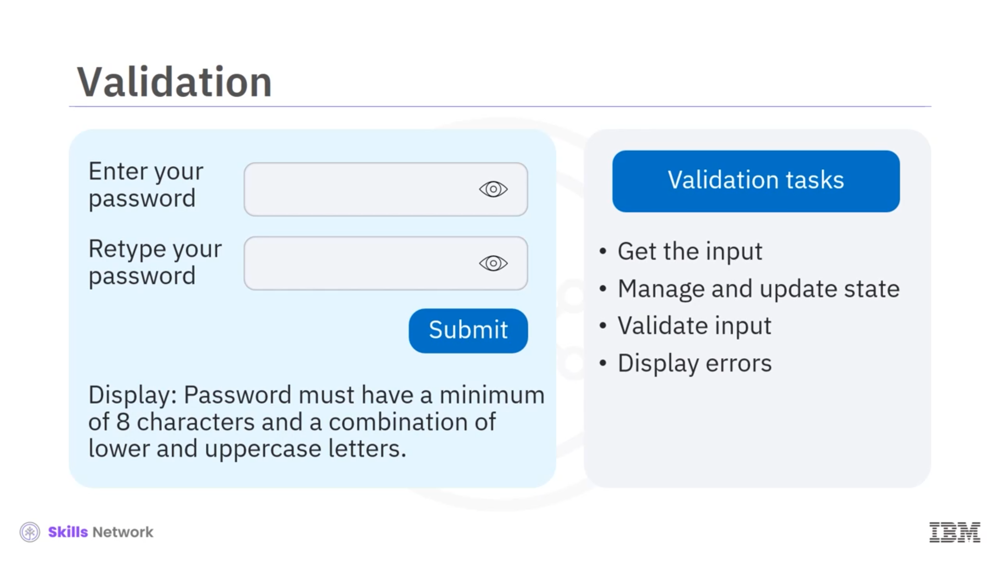

# 📝 Implementing Forms

Implementing Forms’a hoş geldiniz. Bu videoyu izledikten sonra formların amacını açıklayabilecek, **controlled** ve **uncontrolled** form component’lerini karşılaştırıp karşıtlayabilecek ve form geliştirme için React hook kütüphanesinin faydalarını özetleyebileceksiniz.


Formlar, kullanıcıların bir web sayfasındaki verilerle etkileşime girmesini sağlar. Örneğin, kullanıcı kaydı, anketler veya bir kullanıcının sipariş vermesi gibi durumlarda formları kullanırsınız. Kullanıcıların verilerle etkileşime girdiği alanlara **fields** denir.

Birçok field türü vardır; örneğin text box’lar, drop-down menüler, radio button’lar ve checkbox’lar. Bir form üzerinden kullanıcıdan input alırken, submission mantığını da ele almanız ve veriyi doğrulamanız (validate) gerekir. React’te bu yetenekleri component’lerle yönetirsiniz. Genellikle input’u client side’da yakalar ve geçici olarak component state’inde saklarsınız. Bilgiyi doğrudan formdan bir sunucuya göndermezsiniz.


HTML, input, textarea ve select gibi bazı form yetenekleri sağlar. Bu elementlerin state’ini browser yönetir.


React’te ise input’u saklamak için component state’ini kullanır ve component’in **setState** metodu ile güncellemeler yaparsınız. Kullanıcıların etkileşime girdiği data field’larını sağlamanın yanı sıra, formunuz uygulamaya kullanıcının input’unu ne zaman kabul edeceğini söyleyen bir submission mantığı da sağlamalıdır. Örneğin, kullanıcı **Submit** butonuna tıklayana kadar parolayı kabul etmek istemezsiniz. Bu, kullanıcının yazmak istediği parolayı gerçekten girdiğine dair bir ölçüde güvence sağlar.


Validation açısından, kullanıcılar parola oluştururken uygulamalar çoğu zaman kullanıcının parolayı iki kez yazmasını ister ve parola için minimum karakter sayısı gibi kurallara sahip olabilir. Genel olarak form validation şu görevleri gerektirir: input’u alma, form state’ini yönetme ve güncelleme, input değerlerini doğrulama, uygun hata mesajlarını gösterme.

React form component’leri **controlled** veya **uncontrolled** olabilir.



---

## 🎛️ Controlled ve Uncontrolled Bileşenler

Yüksek seviyede farkı konuşalım ve sonra her birini daha yakından inceleyelim. Uncontrolled component’lerde React ile değeri sayfaya yerleştirirsiniz ve geri kalanını browser takip eder. Controlled component’lerde ise form verisini React state yönetir. Bu, state’i oluşturmak ve veri değiştiğinde nasıl güncelleneceğini açıkça kodlamanız gerektiği anlamına gelir.


Uncontrolled component’ler daha az kod kullanır ve geliştirmesi daha kolaydır; ancak nihayetinde daha az sağlamdır. Adından da anlaşılacağı gibi, ilkinde kontrolünüz az, ikincisinde daha fazladır.

---

## 🧱 Uncontrolled Components

Uncontrolled component’lerle kullanıcı input’unu ele aldığınızda, form elementlerini browser yönetir. HTML form elementleriyle çalışmaya benzer şekilde, uncontrolled component’teki değerler DOM’un input node’unda saklanır. Input’lar otomatik olarak güncellenir.

Uncontrolled bir component yazarken, input değerlerini DOM’dan almak için bir **ref** fonksiyonu yazarsınız. State değiştiğinde event handler yazmanız gerekmez.


---

## 🧠 Controlled Components

Controlled component kullanmaya karar verirseniz, tüm state değişikliklerini açıkça yönetirsiniz; örneğin bir tuşa basmaya, mouse click’e veya bir dokunmaya (tap) tepki vermek gibi. DOM’un input’u yönetmesi yerine, veriyi nereye kaydedeceğini component’e söylersiniz ve bunun sonucu olarak gösterilecek değerleri geri döndürürsünüz.


Verinin component’e *onChange* event’leriyle geçmesini ele almak için fonksiyonlar yazarsınız; örneğin ekranda belirli bir konuma dokunma gibi. Çoğu zaman güncellenen input’u kaydetmek için **setState** metodunu kullanırsınız. Ayrıca değişkenlerin state’ini güncellemek için event handler’lar da yazarsınız.

Bu basit controlled component bir registration form’u yönetir. Component, email adresinin state’ini izlemek için *useState* hook’unu uygular. Email adresinin form submit edildiğinde güncellendiğinden emin olmak için, value ve onChange attribute’larına sahip bir input element eklemeniz gerekir. Kullanıcı Submit butonuna dokunduğunda component email adresini console’a yazar.


---

## 🪝 React Hook Form Library

Form içeren React uygulamalarında state yönetimi ve validation için **React hook form** kütüphanesini kullanabilirsiniz.

Bu, form oluştururken geliştiricilerin yazması gereken kod miktarını azaltır. Ayrıca gereksiz form component rerender’larını ortadan kaldırarak performansı iyileştirmeye yardımcı olur.

React hook form’u, install react hook form komutunu kullanarak kurabilirsiniz.

```bash
install react hook form
```


---

## 🧾 Özet

Bu videoda, formların kullanıcıların bir web uygulamasında verilerle etkileşime girmesi için bir yol sağladığını öğrendiniz. Formlar genellikle input field’ları, submission mantığı ve kullanıcı etkileşimlerini yönetmek için validation kuralları gerektirir. Browser, uncontrolled component’lerde DOM ile elementlerin veri ve state’ini takip eder. Controlled component’ler, UI input verisini component’in state’iyle açıkça yönetmenizi gerektirir.

React hook form library, bir component’in render edilme sayısını azaltarak performansı optimize eder.


