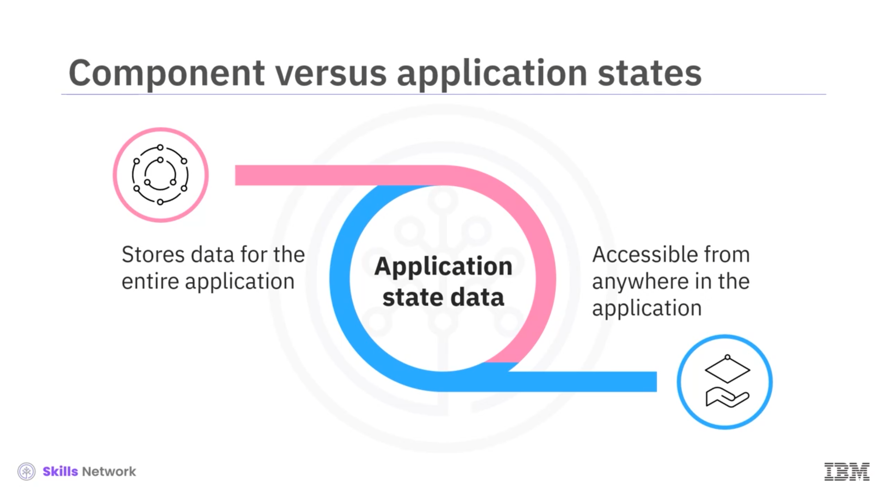
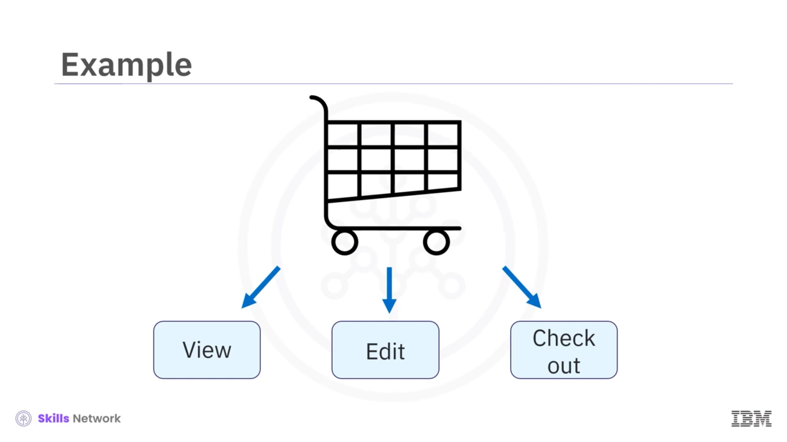
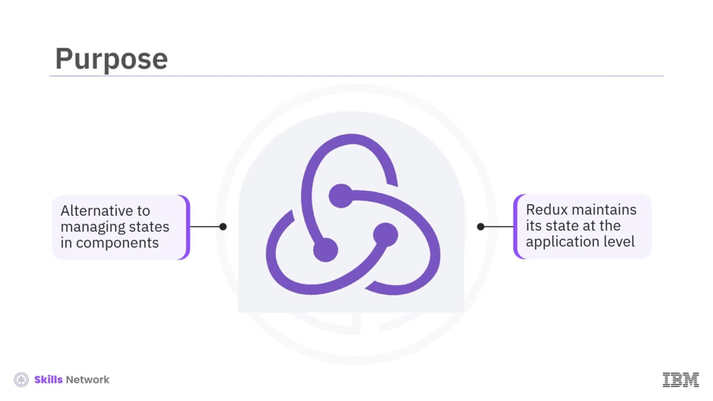
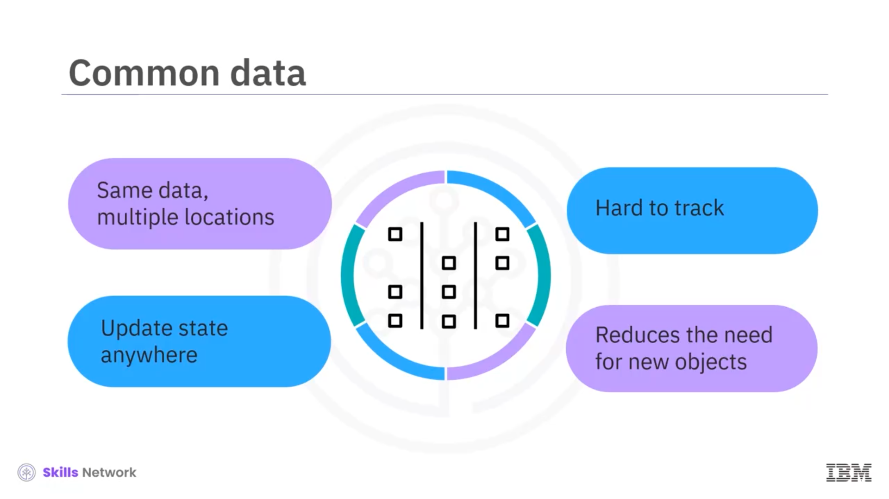

## 🧩 Introduction to Redux

*Redux’a Giriş’e hoş geldiniz.* Bu videoyu izledikten sonra şunları yapabileceksiniz: *bileşen durumu* ile *uygulama durumu*nu karşılaştırmak ve aralarındaki farkları açıklamak, *Redux* kütüphanesinin amacını açıklamak, *Redux’un ne zaman kullanılacağını* tanımlamak, *Redux kullanmanın faydalarını* özetlemek.

## 🧠 Bileşen Durumu ve Uygulama Durumu

*Redux* kütüphanesinin faydasını anlayabilmek için önce *bileşen durumu* ile *uygulama durumu* arasındaki farkları anlamalısınız. *Bileşen durumunun* aksine, *uygulama durumu* tüm uygulamayla ilgili bilgileri tutar. Bu duruma, yalnızca belirli bir bileşenden değil, uygulamanızın her yerinden erişebilirsiniz.

Örneğin, kullanıcılarına *sepet* özelliği sunan bir e-ticaret uygulamasını düşünün; kullanıcılarınızın, belirli bir bileşenin durumundan bağımsız olarak, uygulamanın herhangi bir yerinden sepeti görüntüleyebilmesi veya içeriğini düzenleyebilmesi ya da istedikleri an ödeme yapabilmesi gerekir. *Redux* kütüphanesi, *uygulama durumunu* yönetmenize yardımcı olur.

## 🏗️ Redux’un Amacı ve Ne Zaman Kullanılır?

Bireysel bileşenlerin kendi durumlarını yönetmesi yerine, *Redux* uygulamanın durumunu koruyabilir ve çağrıldığında uygulamadan bileşene bilgi aktarabilir. Genel olarak, uygulama ne kadar büyükse, *Redux* potansiyel olarak o kadar faydalı hale gelir.

Uygulamanızdaki bileşen sayısı arttıkça, tüm bu *bileşen durumlarını* yönetmek giderek zorlaşır. Çok sayıda bileşen, bileşen ağacınız boyunca sık sık *props* geçirmek yerine  *Redux* ’tan yardım almanız gerektiğini gösterir. Ayrıca, aynı veriyi kullanan ancak DOM ağacında rastgele konumlanmış bileşenleriniz olması muhtemeldir; bu durumda veriyi bir bileşenden ağacın farklı noktalarına taşımak zahmetli ve takibi zor hale gelir.

*Redux* durumları *global* olarak yönettiği için, uygulamanın herhangi bir yerinden durumu güncelleyebilirsiniz. Bu, her durum değişikliğinde yeni nesneler oluşturma ihtiyacını önler.

## 🔌 Redux’un Kullanım Alanı ve Redux Store

*Redux* kütüphanesini React dışındaki çerçevelerle de kullanabilirsiniz; örneğin  *Angular* , *Vue* ve hatta standart *JavaScript* ile. Ancak, *React* kullanan geliştiricilerin çoğu *Redux* da kullanır.

 *Redux* , birden fazla durum değişikliğini *Redux Store* adı verilen bir yerde yönetir.  *Store* , verileri depolayan ve yöneten bir veri yapısını ifade eder. Geliştiriciler bazen  *Redux store* ’u *tek doğruluk kaynağı (single source of truth)* olarak adlandırır.

## ✅ Redux Kullanmanın Faydaları

 *Redux* ’u birden fazla nedenle faydalı bulacaksınız:

* Uygulama düzeyinde durum kullanmak, kod karmaşıklığını azaltabilir ve okunabilirliği artırabilir.
* Belirli bir zamanda uygulamanın davranışını anlamak için bir bileşenin özel durumunu ayrıca düşünmeniz gerekmez.
* Bileşenler arasında veriyi o kadar sık aktarmanıza gerek kalmadığı için, *Redux* herhangi bir anda uygulama durumunu tahmin etmeyi kolaylaştırır.
* Bileşenleri ağaç üzerinde yukarı-aşağı izleyerek durum verilerini takip etme ihtiyacını ortadan kaldırdığı için kod bakımını kolaylaştırır.
* Gerekli güncellenen sayfa bölümlerini yeniden yükleyip tüm sayfayı yeniden yüklemediğinden, sayfa render sayısını azaltarak performansı optimize etmeye yardımcı olabilir.

## 🧾 Video Özeti

Bu videoda, *uygulama durumunun* tüm uygulamayla ilgili verileri tuttuğunu ve bu verilere herhangi bir bileşenden erişebileceğinizi öğrendiniz. Uygulamanızın durumunu yönetmek için *Redux* kütüphanesini kullanabilirsiniz.

Bir bileşen ağacının bir bölümünden diğerine veri aktarmanız gerektiğinde  *Redux* ’u faydalı bulacaksınız. *Redux’un faydaları* arasında kodlama karmaşıklığını azaltma, kod okunabilirliğini artırma, daha iyi performans ve daha kolay kod bakımı yer alır.

