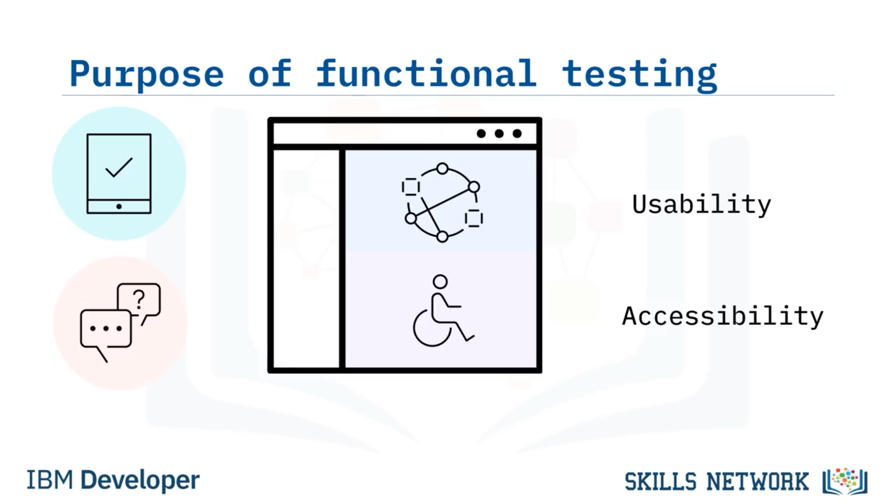
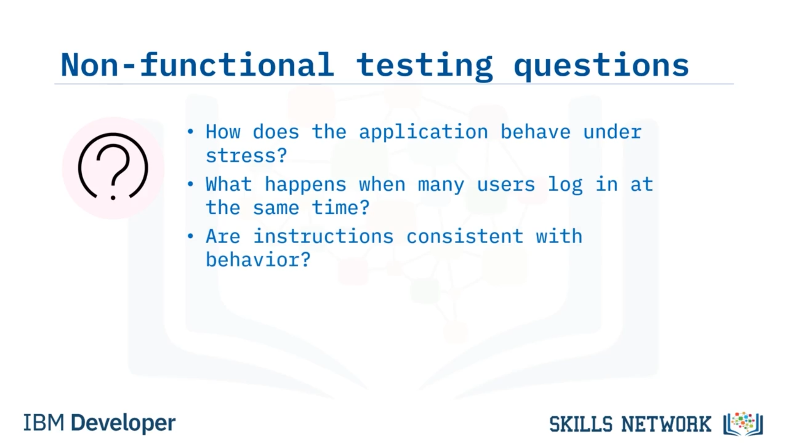
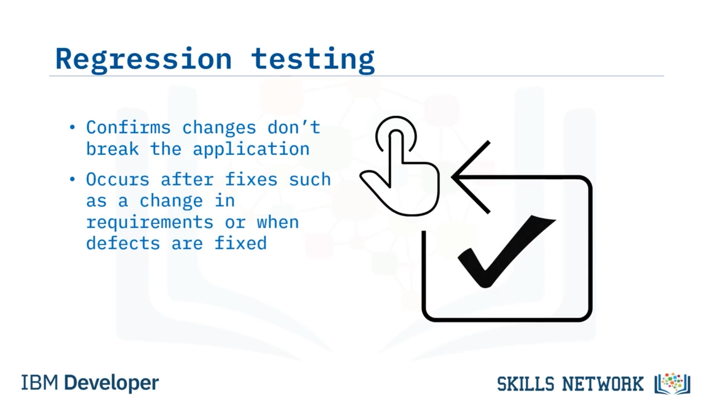

# 🧪 Yazılım Testi

## 🎯 Öğrenme Hedefleri

Yazılım Testine hoş geldiniz. Bu videoyu izledikten sonra, fonksiyonel test, fonksiyonel olmayan test ve regresyon testi terimlerini tanımlayabilecek ve yaygın test seviyelerini karşılaştırıp aralarındaki farkları açıklayabileceksiniz.

## 🧾 Yazılım Testine Genel Bakış ve Test Senaryoları

Yazılım testi, yazılım geliştirme döngüsünün tamamına kalite kontrollerinin entegre edilmesi uygulamasıdır. Test etmenin amacı, yazılımın beklenen gereksinimlerle eşleşip eşleşmediğini kontrol etmek ve hatasız yazılımı güvence altına almaktır.

Yazılımı test edebilmek için ekip “test senaryoları” yazar. Bu test senaryoları, bir yazılım uygulamasının işlevselliğini doğrulamak ve gereksinimlerin karşılandığından emin olmak için yazılır. Test senaryoları, SDLC’nin farklı aşamalarında yazılabilir ve Agile veya Waterfall gibi yazılımı geliştirmek için kullanılan teste ya da yönteme bağlı olarak değişiklik gösterebilir.

Bir test senaryosu; adımlar, girdiler, veriler ve bunlara karşılık beklenen çıktıları içerir. Test türü veya geliştirme yöntemi ne olursa olsun, test senaryoları her zaman gereksinimler kesinleştirildikten sonra yazılmalıdır. Yazılım testi, yazılım ürününün gereksinimleri karşılayıp karşılamadığını ve hatasız olup olmadığını belirlemek için yazılımı değerlendirmeye yardımcı olur.

## 🧪 Test Türleri

Test türleri genel olarak üç kategoriye ayrılabilir: fonksiyonel test, fonksiyonel olmayan test ve regresyon testi.

### 🔹 Fonksiyonel Test

Fonksiyonel test genellikle, kaynak koda veya iç yapıya bakmaksızın test yapma yöntemi olan kara kutu (black box) testini içerir. Fonksiyonel test, test edilen sistemin (SUT – system under test) yalnızca girdileri ve bunlara karşılık gelen çıktılarıyla ilgilenir. Tamamen işlevsel gereksinimlerin test edilmesine dayanır. Fonksiyonel test, manuel olarak ya da otomatik araçlar kullanılarak gerçekleştirilebilir.

Amaç, uygulamanın işlevselliğini test ederek uygulamanın kullanılabilir ve erişilebilir olduğundan emin olmaktır. Fonksiyonel test, SUT’yi test ederek işlevsel gereksinimleri karşıladığından emin olur. Fonksiyonel test, kullanıcı hataları veya uç (edge) girdi durumları ortaya çıktığında yazılımın bu istisnaları uygun hata mesajları göstererek sorunsuz biçimde ele aldığından emin olur .

### 🔹 Fonksiyonel Olmayan Test

Fonksiyonel olmayan test, uygulamayı performans, güvenlik, ölçeklenebilirlik ve erişilebilirlik gibi nitelikler açısından test etmeyi içerir. Fonksiyonel olmayan test, SUT’nin fonksiyonel olmayan davranışının düzgün çalışıp çalışmadığını kontrol eder.

Fonksiyonel olmayan test, şu tür soruları yanıtlamalıdır: Uygulama stres altındayken nasıl davranır? Çok sayıda kullanıcı aynı anda oturum açtığında ne olur? Belgelerde ve kullanıcı kılavuzlarında yer alan talimatlar, uygulamanın davranışıyla tutarlı mıdır? Uygulama farklı işletim sistemlerinde benzer şekilde davranır mı? Uygulama felaket kurtarma (disaster recovery) durumlarını nasıl ele alır? Ve uygulama ne kadar güvenlidir?

### 🔹 Regresyon Testi

Bakım testi olarak da adlandırılan regresyon testi, bir hata düzeltmesi gibi uygulamada yakın zamanda yapılan bir değişikliğin, hâlihazırda var olan işlevselliği olumsuz yönde etkilemediğini doğrular. Gereksinimlerde bir değişiklik olduğunda veya kusurlar giderildiğinde regresyon testi yapılmalıdır.

Regresyon testi gerçekleştirmek için test senaryolarının tümü ya da bir kısmı, uygulamaya karşı test edilmek üzere seçilmelidir. Regresyon test senaryosu seçimi ve önceliklendirmesi zor olabilir ve çeşitli faktörlere bağlıdır.

Regresyon test senaryosu seçiminin yaygın nedenleri şunları içerir: sık sık kusur görülen senaryolar, sık kullanılan işlevsellik içeren senaryolar, yakın zamanda değişiklik yapılmış özellikleri içeren senaryolar veya karmaşık test senaryoları, uç (edge) vakalar ve bazen başarılı bazen başarısız olan rastgele test senaryoları .

## 🧱 Test Seviyeleri

Farklı test türlerini ele aldığımıza göre, şimdi de test seviyelerini tartışalım. Dört test seviyesi vardır: birim (unit), entegrasyon (integration), sistem (system) ve kabul (acceptance). Her seviye, SDLC’nin farklı bir zamanında gerçekleşir. Çakışmayı önleyerek test için harcanan süreyi azaltmak amacıyla bu 4 farklı seviye tanımlanmıştır. Şimdi bu test seviyelerinin her birini ele alacağız.

### 🔹 Birim Testi (Unit Testing)

Birim testi, genellikle fonksiyon düzeyinde olmak üzere, belirli bir kod bölümünün işlevselliğini doğrulayan testleri ifade eder. Birim testi, yazılım geliştirme yaşam döngüsünün geliştirme aşaması sırasında yazılım geliştirici veya mühendisi tarafından gerçekleştirilir.

Birim testinin amacı, kod diğer modüllerle entegre edilmeden önce inşa hatalarını ortadan kaldırmaktır. Birim testi, ortaya çıkan yazılımın kalitesini ve genel geliştirme sürecinin verimliliğini artırmayı amaçlar.

### 🔹 Entegrasyon Testi (Integration Testing)

Entegrasyon testi, iki veya daha fazla küçük, bağımsız kod modülü birleştirildiğinde ortaya çıkan hataları belirlemeyi amaçlar. Entegrasyon testi, başka bir kara kutu (black-box) test türüdür.

Entegrasyon testinden önce, birim testini geçmiş olan daha küçük, bağımsız kod modülleri daha büyük yazılım uygulamasına dahil edilir. Modüller birleştirildikten sonra entegrasyon testi gerçekleştirilebilir.

Entegrasyon testi, bu küçük kod birimleri birbirleriyle etkileşime girdiğinde ortaya çıkan hataları açığa çıkarır. Entegrasyon testi, yeni bir modül ile diğer mevcut modüller, veritabanları veya harici donanım arasındaki iletişimdeki eksiklikleri ortaya çıkarır.

Örneğin, modüller arasındaki programlama mantığının farklı olması nedeniyle hataların geliştiği durumları da entegrasyon testi ortaya çıkarır. Ayrıca, bazen modül geliştirme sırasında gereksinimler değişir ve modül tam olarak birim testinden geçirilmez. Yetersiz istisna (exception) yönetimi, modüller birleştirildiğinde sorunlara neden olabilir.

### 🔹 Sistem Testi (System Testing)

Sistem testi, entegrasyon testinden sonra gerçekleşir ve sistemin belirtilen gereksinimlere uyumunu değerlendirmek için tam, entegre bir sistem üzerinde yürütülür. Sistemi, tamamen tamamlanmış bir yazılım ürünü olarak doğrular.

Sistem testi hem fonksiyonel hem de fonksiyonel olmayan testleri içerir. Sistem testi, üretim ortamına benzer olması gereken bir hazırlık (staging) ortamında yapılır.

### 🔹 Kabul Testi (Acceptance Testing)

Ve son olarak, kabul testi, kullanıcı ihtiyaçları, gereksinimler ve iş süreçleri açısından yapılan resmi (formal) testtir. Bir sistemin kullanıcıların, müşterilerin ve diğer paydaşların ihtiyaçlarını karşılayıp karşılamadığını belirler.

Kabul testi genellikle SDLC’nin bakım aşaması sırasında müşteri veya paydaşlar tarafından yapılır.

## 📚 Bu Videoda Öğrendikleriniz

Bu videoda şunları öğrendiniz:

* Testlerin üç kategorisi vardır: fonksiyonel, fonksiyonel olmayan ve regresyon.
* Birim testi, küçük ve bağımsız kod parçalarını doğrular.
* Entegrasyon testi, iki veya daha fazla küçük kod parçası birleştirildiğinde ortaya çıkan hataları arar.
* Sistem testi, sistemi tamamen tamamlanmış bir yazılım ürünü olarak doğrular ve kabul testi, kullanıcı gereksinimlerinin ve iş süreçlerinin doğru şekilde uygulandığını doğrular.
