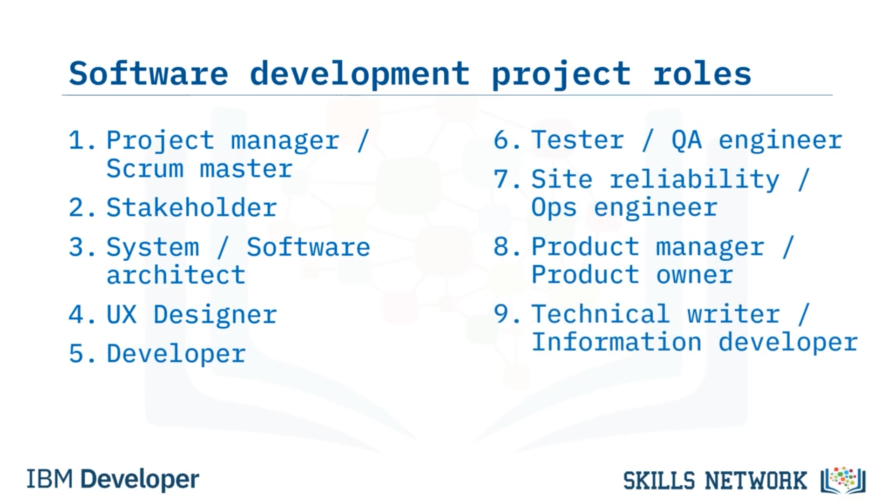
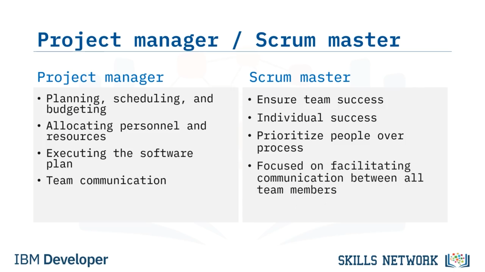
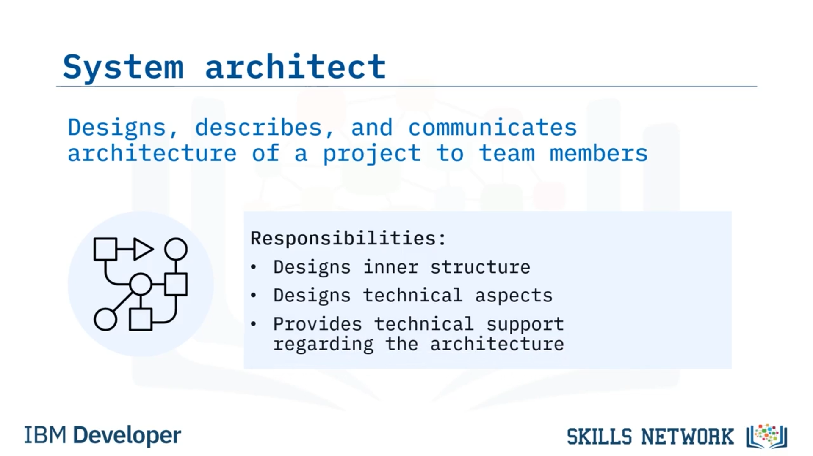
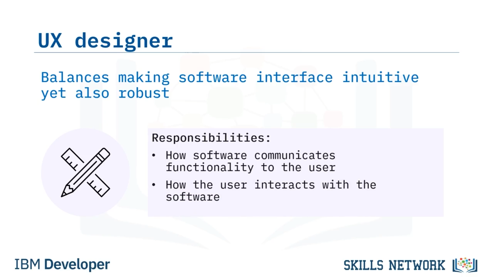
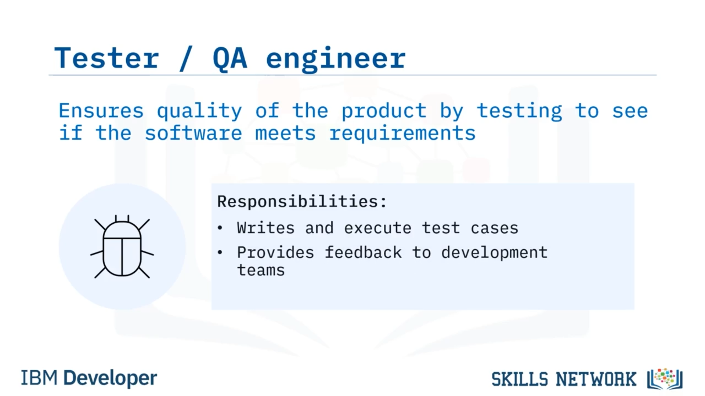
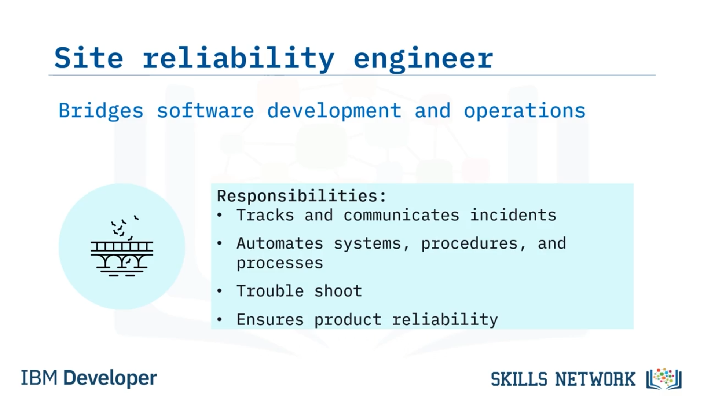
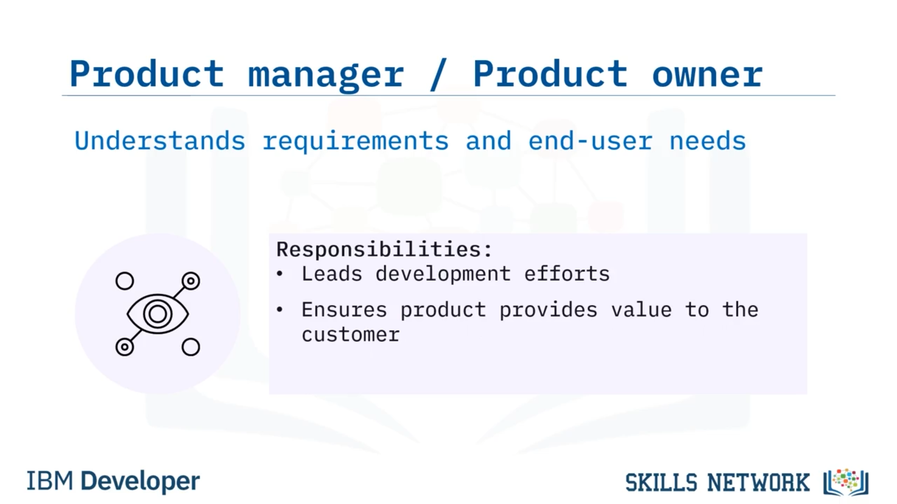

# 👥 Yazılım Mühendisliği Projelerinde Roller

## 🎯 Giriş ve Öğrenme Hedefleri

Yazılım Mühendisliği Projelerinde Roller konusuna hoş geldiniz. Bu videoyu izledikten sonra:

* Bir yazılım mühendisliği projesindeki yaygın rolleri listeleyebilecek,
* Her bir rolü tanımlayabilecek
* Ve her rolün sorumluluklarını açıklayabileceksiniz.

Bir yazılım geliştirme projesinde yaygın olarak görülen çeşitli roller vardır. Kullanılan yaklaşıma (örneğin Agile veya Waterfall) bağlı olarak bu rollerin adları değişebilir. Bazen farklı şirketler, benzer işler için farklı isimler kullanabilir. Ancak her projede bu rollerin hepsi bulunmayabilir.

Bu videoda ele alacağımız roller şunlardır:

* Proje yöneticisi veya Scrum Master,
* Paydaş (stakeholder),
* Sistem veya yazılım mimarı,
* UX tasarımcısı,
* Yazılım geliştirici,
* Test uzmanı veya QA mühendisi,
* Site güvenilirliği (site reliability) veya Ops mühendisi,
* Ürün yöneticisi veya ürün sahibi,
* Ve teknik yazar veya bilgi geliştirici (information developer).

Şimdi her rolü ve her iş için bazı sorumlulukları açıklayalım.

---

## 🗂️ Proje Yöneticisi ve Scrum Master

Geleneksel SDLC yöntemlerinde proje yöneticileri bulunur; Agile’da ise bu role karşılık gelen kişi Scrum Master olarak adlandırılır.

Bir proje yöneticisi, projenin sorunsuz ilerlemesini sağlar ve proje ile ilgili iletişimi kolaylaştırır. Proje yöneticisi genellikle şu tür daha büyük ölçekli konularla ilgilenir:

* Planlama, zamanlama ve bütçeleme,
* Personel ve kaynak tahsisi,
* Yazılım planının yürütülmesi,
* Ekip içi iletişim.

Agile’da bir Scrum Master bulunur. Planlamaya odaklanmak yerine, Scrum Master ekibin ve bireylerin başarısını güvence altına almaya odaklanır. Dört temel Agile değerinin, sürecin üzerinde insanları ve iletişimi önceliklendirdiğini unutmayın ve Scrum Master, bu iletişimi kolaylaştırmaktan sorumludur.

---

## 🧑‍💼 Paydaşlar (Stakeholders)

Paydaşlar, ürünün kendileri için tasarlandığı kişilerdir. Bunlar; müşteri, son kullanıcılar, karar vericiler, sistem yöneticileri ve diğer kilit personeller gibi bireyleri içerir.

Paydaşın başlıca sorumluluğu, proje gereksinimlerini tanımlamak ve ekip üyelerinin gereksinimlerle ilgili açıklamaya ihtiyaç duyması veya önerilen bir çözümün planlandığı şekilde çözülememesi durumunda geri bildirim sağlamaktır.

Paydaşlar ayrıca, yazılım yayımlanmadan önce bazen beta testi ve kabul testine de katılabilir.

---

## 🏛️ Sistem / Yazılım Mimarı

Sistem mimarı, bir projenin mimarisini tasarlar ve açıklar ve bu mimariyi ekip üyelerine aktarır. Bazen yazılım mimarı veya çözüm mimarı olarak da adlandırılırlar.

Yazılımın iç yapısının ve teknik yönlerinin temel özelliklerini tasarlamaktan sorumludurlar. Mimar, SDLC’nin farklı aşamalarında teknik destek sunar.

Not: Yazılım mimarisi başka bir modülde daha ayrıntılı şekilde ele alınacaktır.

---

## 🎨 UX Tasarımcısı

UX, “user experience” yani kullanıcı deneyimi anlamına gelir. Bir UX tasarımcısının amacı, yazılımı hem sezgisel (kullanımı kolay) hale getirmek hem de gereksinimleri karşılayacak kadar sağlam olmasını sağlamaktır.

Kullanıcı deneyimi tasarımcısı, yazılımın kullanıcı açısından nasıl davrandığını tanımlar. UX tasarımcısı, yazılımın işlevselliğini son kullanıcıya nasıl aktardığını ve son kullanıcının yazılımla nasıl etkileşim kurduğunu belirler.

---

## 💻 Yazılım Geliştirici

Sonraki rol, yazılımı çalıştıran kodu yazan geliştiricilerdir.

Sorumlulukları şunları içerir:

* Tasarım dokümanında ortaya konan mimariyi uygulamak,
* Yazılım gereksinim şartnamesinde belirtilen gereksinimleri yazılıma dahil etmek,
* UX tasarımcıları tarafından belirlenen UX gereksinimlerini uygulamak.

  

---

## ✅ Test Uzmanı / QA Mühendisi

Test uzmanları veya QA mühendisleri, ürünün kalitesini ve yazılım çözümünün müşteri gereksinimlerini karşıladığını güvence altına almaktan sorumludur.

Hataları veya eksiklikleri belirlemek için test senaryoları yazmak ve yürütmekle yükümlüdürler ve bu geri bildirimi geliştirme ekiplerine sağlarlar.

---

## 🛠️ Site Güvenilirliği (SRE) / Ops Mühendisi

Site güvenilirliği mühendisi (site reliability engineer), bazen SRE veya Ops mühendisi olarak adlandırılır ve yazılım mühendisliği uzmanlığını BT sistem yönetimi ile birleştirerek geliştirme ve operasyonlar arasında köprü kurar.

Şu görevleri yerine getirirler:

* Olayları takip etmek ve bunları tartışmak için toplantıları kolaylaştırmak,
* Sistemleri, prosedürleri ve süreçleri otomatikleştirmek,
* Sorun giderme süreçlerine yardımcı olmak,
* Ve müşteri için güvenilirliği sağlamak.

  

---

## 📦 Ürün Yöneticisi / Ürün Sahibi

Ürün yöneticisi veya ürün sahibi, ürünün nasıl görünmesi gerektiğine dair vizyona sahiptir.

Müşterinin gereksinimlerini ve son kullanıcının ihtiyaçlarını yakından bilirler. Yazılımın ortaya çıkarılması için geliştirme çalışmalarına liderlik etmekten ve ürünün paydaşların aradığı değeri sağladığından emin olmaktan sorumludurlar.

---

## 📝 Teknik Yazar / Bilgi Geliştirici

Son olarak, teknik yazar veya bilgi geliştirici (information developer), son kullanıcı için dokümantasyon yazar.

Teknik içeriğe sahip materyaller hakkında, teknik olmayan bir kitleyi hedefleyerek dokümantasyon üretirler. Bu dokümantasyon yalnızca son kullanıcının yazılımı kullanmasına yardımcı olmakla kalmaz, aynı zamanda müşterinin geliştirme ekiplerine zamanında geri bildirim sağlayabilmesine de yardımcı olur.

Teknik yazarlardan; kullanıcı kılavuzları, raporlar, teknik makaleler (white paper) ve basın bültenleri yazmaları istenebilir.

---

## 📚 Bu Videoda Öğrendikleriniz

Bu videoda şunları öğrendiniz:

* Bir yazılım geliştirme projesinde çeşitli iş rolleri bulunduğunu,
* Ve her mesleğin, rolüne özgü sorumlulukları olduğunu.
