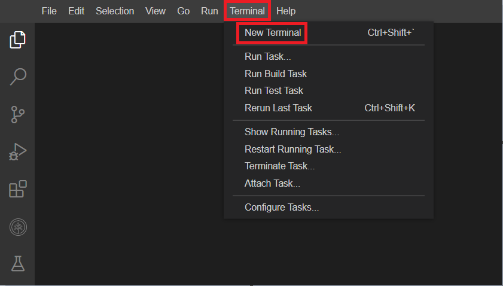
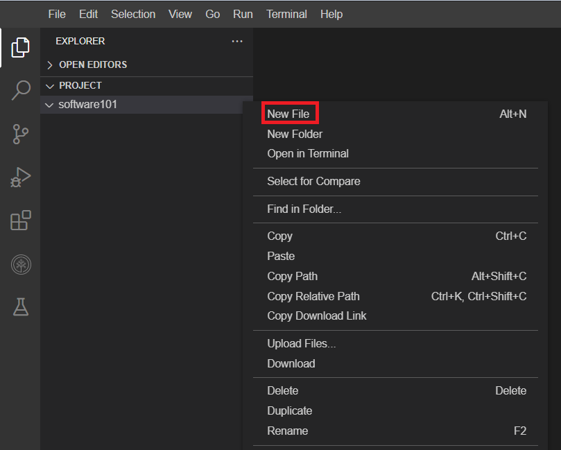
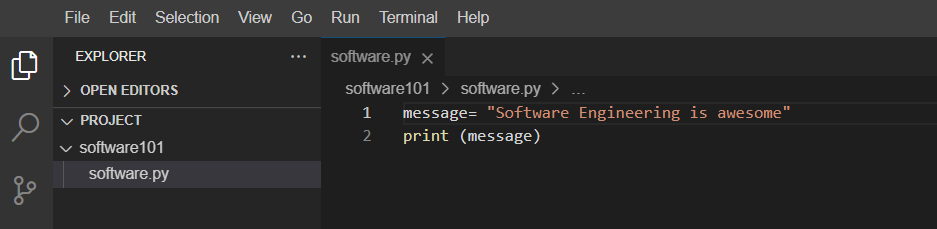

# 💻 Uygulamalı lab: Bir IDE ile çalışmaya başlama

Tahmini Süre: 30 dakika

Bu labde, Tümleşik Geliştirme Ortamı (Integrated Development Environment – IDE) kullanmaya aşina olacaksınız. Kullanacağınız IDE, açık kaynaklı Theia projesine dayanan  **Skills Network Cloud IDE** ’dir. Bu IDE, popüler Visual Studio (VS) Code IDE’sine oldukça benzer. Bu labde IDE’yi keşfedecek ve onu kullanarak basit bir Python uygulaması oluşturup çalıştıracaksınız. Bir kod dosyası oluşturacak, kaydedecek ve değişiklik yapmak için düzenleyeceksiniz.

**Hedefler:**

* IDE arayüzünü keşfetmek.
* IDE kullanarak basit bir Python programı oluşturmak.
* Programı çalıştırmak.
* Kaynak kodu düzenlemek ve programı yeniden çalıştırmak.

---

## 🧪 Lab ortamı hakkında

**Skills Network Lab ortamının iki bileşeni:**

* Bu labi tamamlamak için takip edeceğiniz talimatlar ekranın sol tarafında görüntülenir.
* Ekranın sağ tarafındaki alan, menüleri, terminalleri ve araçları kullanarak kod geliştireceğiniz asıl IDE’dir.


---

## 🧪 Alıştırma 1: IDE arayüzünü keşfetme

### 🧭 Menüleri, terminalleri ve araçları keşfetme

Şimdi IDE arayüzünü keşfedelim. Lütfen aşağıdaki ekran görüntülerinde kırmızı kutularla vurgulanan her bir simgeye ve menü öğesine tıklayarak amaçlarını öğrenin.

1. **Explorer (Gezgin) menüsünde** , oluşturduğunuz veya klonladığınız klasörleri, dosyaları ve önceden kurulmuş gereksinimleri bulursunuz.

   
2. **Search (Arama) menüsünde** , oluşturulmuş veya klonlanmış belirli klasörleri ya da dosyaları arayabilirsiniz.

   
3. **Source Control (Kaynak Yönetimi) menüsünde** , klonlanan depoyu (repository) bulursunuz.
4. **Debug (Hata Ayıklama) menüsünde** , kodunuzu hata ayıklayabilir ve sorun giderebilirsiniz.
5. **Extensions (Uzantılar) menüsünde** , ön koşul olarak sağlanmış önerilen, kurulu ve yerleşik yazılımları görebilirsiniz.
6. **Skills Network Toolbox** içinde, diğer derslerdeki lab alıştırmalarını tamamlamak için veritabanı, büyük veri, bulut ve diğer araçları kullanma seçeneklerini bulursunuz.

   
7. IDE’nin üst kısmındaki menü seçeneklerini keşfedin:  **File, Edit, Selection, View, Go, Run, Terminal, Help** . Bu menü öğelerinin bazılarını sonraki alıştırmalarda kullanacaksınız. Ne için kullanıldıklarına dair bir özet aşağıda verilmiştir:

   * **File:** Yeni dosya veya klasör oluşturmak ve dosyayı kaydetmek için kullanılır.
   * **Edit:** Geri al, yinele (redo), kes, yapıştır ve dosya içinde bul işlemleri için kullanılır.
   * **Selection:** Dosya içindeki her şeyi seçmek (Select All), satırı yukarı/aşağı kopyalamak ve satırı yukarı/aşağı taşımak için kullanılır.
   * **View:** Explorer, extensions ve search gibi diğer menüleri görüntülemek için kullanılır.
   * **Go:** Geri gitmek, son düzenleme konumunu görüntülemek ve dosyalara gitmek için kullanılır.
   * **Run:** Hata ayıklama (debugging) ve yapılandırma ekleme (Add configurations) için kullanılır.
   * **Terminal:** Yeni terminal açmak ve görevleri (tasks) çalıştırmak için kullanılır.
   * **Help:** Uzantı listesini görüntülemek ve bir dosya ile başlamaya yardımcı olmak için kullanılır.

Her bir menüye tıklayın ve keşfedin.

Klasör ve dosya oluşturmayı ve komutları çalıştırmak için terminali nasıl kullanacağınızı bu labin ilerleyen kısımlarında öğreneceksiniz.

---

## 🧪 Alıştırma 2: IDE kullanarak basit bir Python programı oluşturma

1. Sağ taraftaki pencerede, **File** menüsüne tıklayın ve aşağıdaki görselde gösterildiği gibi **“New Folder”** seçeneğini seçin.
   Klasöre **“welcome101”** adını verin.

   

   
2. **welcome101** klasörüne sağ tıklayın ve **“New File”** seçeneğine tıklayın.
   Yeni bir dosya oluşturun ve adını **“welcome.py”** yapın.

   

   
3. Aşağıdaki kodu **welcome.py** dosyasına yapıştırın ve **Ctrl+S** ile kaydedin.

   

---

## 🧪 Alıştırma 3: Programı çalıştırma

1. Düzenleyicideki menüyü kullanarak bir terminal penceresi açın:  **Terminal > New Terminal** .

   

   Bu terminalde, labı tamamlamak için kullanılan tüm komutları çalıştıracaksınız.

   
2. Python’un kurulu olduğunu doğrulayın.

   ```
   python3 --version
   ```

   Sürüm numaraları farklı olsa da aşağıdakine benzer bir çıktı görmelisiniz:

   ```
   Python 3.10.12

   ```

   
3. Bu lab için dizini, terminalde aşağıdaki komutu kullanarak değiştirin:

```bash
cd welcome101
```


**Not:** Eğer **No such file or directory** (Böyle bir dosya veya dizin yok) hatasıyla karşılaşırsanız, lütfen **welcome101** klasörünün doğru dizinde oluşturulduğundan emin olun.

Doğru dizinde klasör oluşturmak için Explorer’da boş bir alana sağ tıklayın,  **New Folder** ’ı seçin ve adını **welcome101** olarak değiştirin. Ardından lab talimatlarının geri kalanına devam edin.


4. Programı terminalde aşağıdaki komutu kullanarak çalıştırın:

```bash
1
python3 welcome.py
```


Kaynak kod yanlış olduğu için bir **invalid syntax** (geçersiz sözdizimi) hatası alacaksınız.

---

## 🧪 Alıştırma 4: Kaynak kodu düzenleme ve programı yeniden çalıştırma

1. Kaynak kodu aşağıda gösterilen kodla değiştirin:

```python

message= "Welcome to the world of programming!"
print (message)
```


3. Programı terminalde aşağıdaki komutu kullanarak çalıştırın:

```bash
1
python3 welcome.py
```

Copied!

Wrap Toggled!

Executed!

Buna benzer bir çıktı görmelisiniz:

```text
1
Welcome to the world of programming!
```


---

## 🧪 Alıştırmalar (Practice Exercises)

1. **"software101" adlı yeni bir klasör oluşturun.**
   **İpucu için buraya tıklayın**

   Sağ taraftaki pencerede, **File** menüsüne tıklayın ve aşağıdaki görselde gösterildiği gibi **“New Folder”** seçeneğini seçin. Klasöre **“software101”** adını verin.

   
2. **Bu klasörde “software.py” adında yeni bir dosya oluşturun.**
   **İpucu için buraya tıklayın**

   **software101** klasörüne sağ tıklayın ve **“New File”** seçeneğine tıklayın; yeni bir dosya oluşturun ve adını **“software.py”** yapın.

   
3. **“software engineering is awesome” ifadesini yazdıran bir kod yazın.**
   **İpucu için buraya tıklayın**

   Aşağıdaki mesajı yazdıran bir kod yazın:

   **“software engineering is awesome”**
   **Çözüm için buraya tıklayın

   **

   Aşağıdaki kodu **software.py** dosyasına yapıştırın ve **Ctrl+S** ile kaydedin.

```python
1
2
message= "software engineering is awesome"
print(message)
```


4. **Programı çalıştırın.**
   **Çözüm için buraya tıklayın**

   Programı terminalde aşağıdaki komutu kullanarak çalıştırın:

```bash
1
python3 software.py
```


5. **software.py dosyasını düzenleyin ve “software engineering is awesome” ifadesindeki “s” ve “e” harflerini büyük yapın.**
   **Çözüm için buraya tıklayın**

   **software.py** dosyasında mesajı,

   **“software engineering is awesome”** ifadesinden

   **“Software Engineering is awesome”** ifadesine değiştirin.

   
6. **Güncellenmiş dosyayı çalıştırın.**
   **Çözüm için buraya tıklayın**

   Programı terminalde aşağıdaki komutu kullanarak çalıştırın:

```bash
1
python3 software.py
```

Copied!

Wrap Toggled!

Executed!

Tebrikler! Bu labi tamamladınız ve bir IDE içinde Python programlarını nasıl çalıştıracağınızı artık biliyorsunuz.

---

**✍️ Yazar:**

Pallavi Rai
