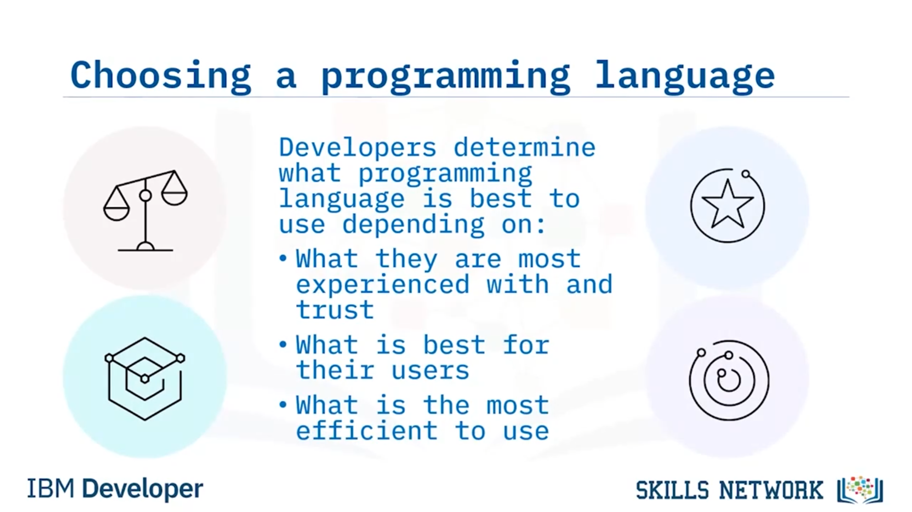
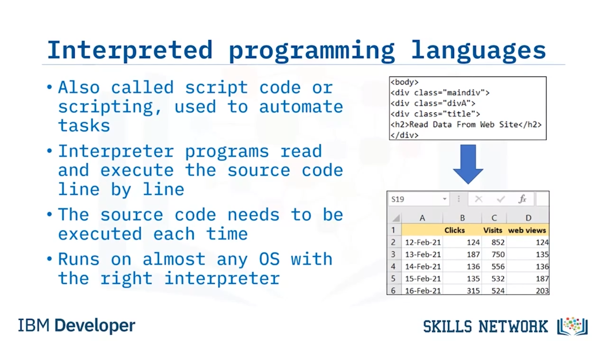
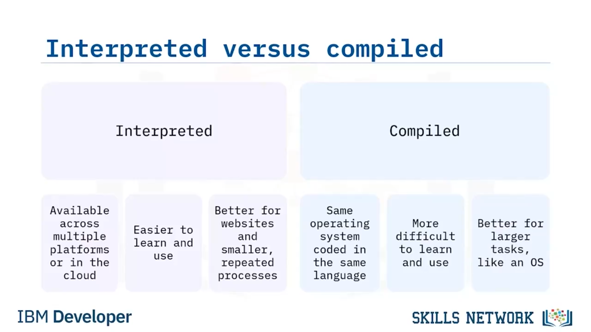
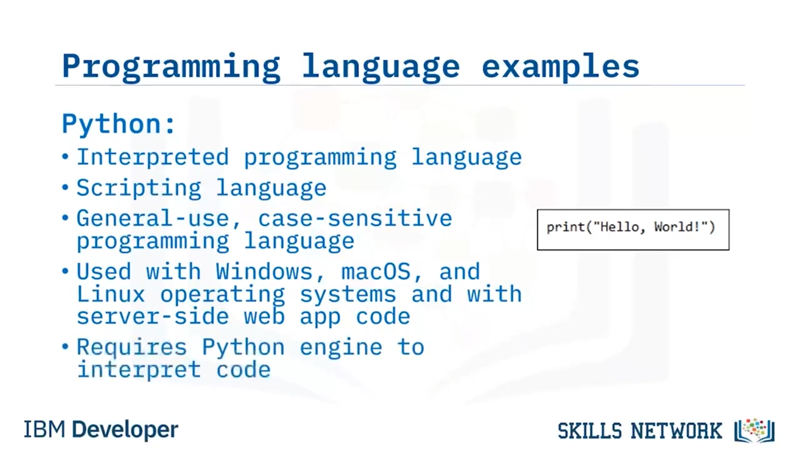

# ⚖️ Derlenen ve Yorumlanan Programlama Dillerinin Karşılaştırılması

Derlenen ve yorumlanan programlama dillerini karşılaştırmaya hoş geldiniz. Bu videoyu izledikten sonra, yorumlanan ve derlenen programlama dillerini karşılaştırabilecek ve yorumlanan ve derlenen programlama dillerini tartışabileceksiniz.

Geliştiriciler bir programlama dilini nasıl seçer? Geliştiriciler, hangi programlama dilini kullanmanın en iyi olduğuna; en çok deneyime sahip oldukları ve güvendikleri dile, kullanıcıları için en iyi olana ve kullanımı en verimli olana göre karar verirler.

Yorumlanan ve derlenen programlama dilleri nelerdir? Yorumlanan programlama dilleri, daha küçük görevler için betik şeklinde kaynak kod oluşturmak amacıyla kullanılır. Kaynak kod bir yorumlayıcıdan geçer. Yorumlayıcı, bir bilgisayarın işletim sistemine veya bir web tarayıcısına gömülüdür.

Derlenen programlama dilleri dosyalar oluşturmak için kullanılır. Bu dosyalar, çalıştırılabilir dosyalardır. Daha sonra, bir bilgisayar veya cihaz üzerinde çalıştırabileceğiniz programlar hâlinde bir araya getirilirler.

Yorumlanan programlama dilleri, görevleri otomatikleştirmek için kullanıldıklarından, script kodu (betik kodu) veya betik dilleri olarak da adlandırılır. Yorumlayıcı programlar, kaynak kodu tıpkı birinin bir metni okuması gibi satır satır okur ve yürütür. Program her çalıştırıldığında, istenen çıktıyı almak için kaynak kodun tekrar yürütülmesi gerekir ve yorumlanan programlama dillerinden biriyle yazılmış kaynak kod, doğru yorumlayıcı olduğu sürece neredeyse her türlü işletim sisteminde çalışır.

Örneğin, geçen ayki web sayfası görüntüleme sayılarıyla ilgili bilgi talep eden bir müşteriniz olduğunu hayal edin. Bu görev için bir program oluşturmak üzere hangi tür programlama dili en uygun ve en verimli olurdu? Bir betik yazmak için yorumlanan programlama dillerinden birini kullanırdınız. Bu betik, web sayfası görüntüleme verilerini alır ve ardından müşterinin okuyabilmesi için bunları bir tabloya yerleştirirdi.

Derlenen programlama dilleri, kısaca programlama dilleri olarak da adlandırılır. Bunlar, bilgisayarınızda bir hesap tablosu programını çalıştırmak gibi daha büyük görevleri tamamlayan daha karmaşık programlar için kullanılır. Derlenen bir programlama dili, genellikle cihazınıza çalıştırılabilir bir dosya olarak kurulan daha büyük bir program yazmak için kullanılır.

Derlenen bir dilde kod yazmak daha uzun sürer, ancak karşılığında programın kodu daha hızlı çalışır, çünkü derlenen programlar cihaza kuruludur. Ve program bir kez kodlandıktan sonra, derlenen program tek bir indirilebilir dosya hâlinde gruplanır.

Web sayfası görüntüleme bilgisi isteyen o müşteriyi hatırlayın. Şimdi, verileri görüntülemek ve yönetmek için bir hesap tablosu programı istiyor. Bir programcı, Microsoft Excel gibi derlenmiş bir program oluşturmak için C programlama dilini kullanabilir.

Peki yorumlanan programlama dilleri ile derlenen programlama dilleri arasındaki başlıca farklar nelerdir? Önce yorumlanan programlamaya bakalım. Bu programlar, birden fazla platformda veya bulutta kullanılabilir. Betik dilleri öğrenmesi ve kullanması daha kolay dillerdir ve daha küçük, tekrar eden işlemleri ele aldıkları için web siteleri için daha uygundurlar.

Sonra derlenen programlama vardır. Bu programlar, aynı işletim sistemine ve aynı dilde yazılmış koda sahip kullanıcılara sunulur. Ancak derlenen programlama dillerini öğrenmek ve kullanmak daha zordur, çünkü bunlar daha fazla parçaya sahip daha büyük programlardır ve bilgisayarınızda işletim sistemini çalıştırmak gibi daha büyük görevler için daha uygundurlar.

Programlama dillerinin benzerliklerini ve farklarını daha iyi anlamak için birkaç örneğe bakalım. En yaygın programlama dillerinden bazıları C, C++ ve C#’tır. C, derlenen bir programlama dilidir. C, özgün dildir ve C++ ile C# onun türevleridir. C ve türevleri, büyük/küçük harf duyarlı dillerdir. C programlama dili, Windows ve diğer yaygın işletim sistemlerinin temelini oluşturur ve kod yazmayı öğrenmek ve kullanmak daha uzun sürer, ancak daha az bellek gerektirir ve kod daha hızlı çalışır.

Bir diğer yaygın programlama dili Java’dır. Java, derlenen bir programlama dilidir. Aynı zamanda nesne yönelimli, büyük/küçük harf duyarlı bir programlama dilidir. Java sanal makinesi veya JVM, Java ile yazılmış kodu çalıştırmak için gereklidir. Java, Android işletim sistemi gibi bazı işletim sistemleri için birincil programlama dilidir. Ve Java’nın bir avantajı da, çapraz platformlu bir dil olmasıdır; bu da aynı kodu macOS, Windows ve Linux üzerinde çalıştırdığı anlamına gelir.

Python, yorumlanan bir programlama diline örnektir. Aynı zamanda bir betik dili olarak da anılır. Python, genel amaçlı, büyük/küçük harf duyarlı, popüler bir programlama dilidir. Windows, macOS ve Linux işletim sistemleriyle ve sunucu taraflı web uygulaması kodlarıyla birlikte kullanılır ve kodu yorumlamak için Python motoruna ihtiyaç duyar.

JavaScript, bir başka yorumlanan programlama dilidir. Web tarayıcılarında istemci tarafında çalışan bir betik dilidir. JavaScript büyük/küçük harf duyarlıdır. Basit betikler HTML ile birlikte çalıştırılır. Daha karmaşık betikler ise ayrı dosyalarda çalıştırılır. Ve benzer seslense de, derlenen programlama dili olan Java ile karıştırılmamalıdır.

Yaygın programlama dillerine bir diğer örnek HTML’dir. HTML, yorumlanan bir programlama dilidir. HTML, “Hypertext Markup Language” (Köprü Metni Biçimlendirme Dili) ifadesinin kısaltmasıdır. HTML, bazı istisnalar dışında çoğunlukla büyük/küçük harf duyarsızdır ve istemci taraflı web tarayıcılarında web sayfalarını biçimlendirmek için etiketler kullanır.

Bu videoda, yorumlanan programlama dillerinin, cihazınızın işletim sistemindeki bir yorumlayıcıda veya web tarayıcınızda çalışan kaynak kod oluşturduğunu öğrendiniz. Derlenen programlama dillerinin ise, cihazınızdaki programlarda gruplanan çalıştırılabilir dosyalar oluşturduğunu öğrendiniz. C ve Java gibi derlenen programlama dilleri, işletim sistemleri ve diğer çalıştırılabilir dosyalar gibi daha büyük programları yazmak için kullanılır. Ve Python ve HTML gibi yorumlanan programlama dilleri, bir web tarayıcısı veya bilgisayar içinde tekrarlayan görevleri tamamlayabilen kodları yazmak için kullanılır.

