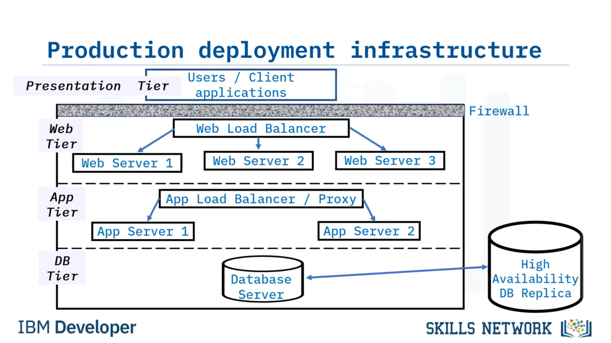
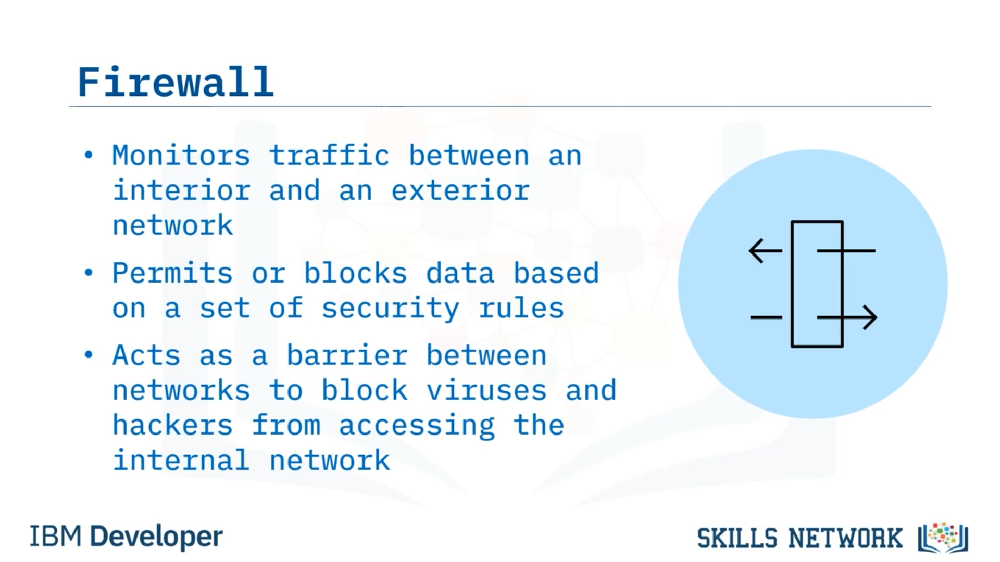
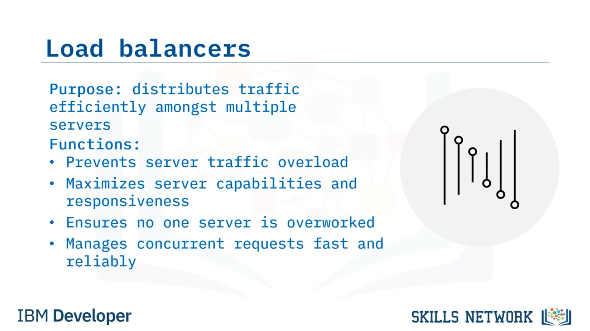

# Üretim Dağıtım Bileşenleri

## 🚀 Üretim Dağıtım Bileşenlerine Giriş

Production deployment bileşenlerine hoş geldiniz. Bu videoyu izledikten sonra şunları yapabileceksiniz: Bir production ortamına dağıtım için yaygın olarak gereken bileşenleri açıklamak. Bir firewall ve bir load balancer’ın amacını açıklamak. Ve farklı sunucu türlerini birbirinden ayırt etmek. Bir uygulamayı production ortamında dağıtmak için gereken n-tier bir mimariyi ele alalım ve altyapıyı bir diyagram kullanarak gösterelim. En üst katman, front-end istemci uygulamalarını içeren sunum katmanıdır. Diğer tüm katmanlar bir firewall’un arkasında yer alır.

## 🧱 Katmanların Genel Görünümü

Bu diyagramda bahsedilen firewall’lar ve diğer bileşenler videonun ilerleyen kısımlarında daha ayrıntılı olarak ele alınacaktır. Bir sonraki katman, gelen trafiği birden çok web sunucusuna dağıtan bir web load balancer’a sahip olan web katmanıdır. Web katmanının altındaki katman application server katmanıdır. Bu katman, trafiği farklı application server’lara yönlendiren bir app load balancer veya bir proxy server içerir. En alttaki katman ise database sunucusunu içeren veri katmanıdır. Güvenilirliği sağlamak için çoğu zaman database’in yüksek erişilebilirlik sağlayan bir replikası kullanılır. Bazı ortamlarda ek bileşenler veya katmanlar bulunabilir.

## 🔥 Firewall ve Load Balancer’a Giriş

Ayrıca bu bileşenlerin tümü her deployment için gerekli değildir. Örneğin, bazı ortamlarda web server’lara ek olarak application server’lara ihtiyaç olmayabilir. Şimdi bu bileşenlere daha ayrıntılı bakalım. Bir firewall, ağlar arasındaki trafiği izleyen bir güvenlik cihazıdır. Belirli bir güvenlik kuralları kümesine göre istenen veriyi izin verir ya da engeller. Dahili ağa virüslerin, malware’in ve hacker’ların erişmesini engellemek için ağlar arasında bir bariyer görevi görür. Load balancer’ların amacı, bir ağ üzerindeki, server farm olarak adlandırılan birden fazla sunucu arasında ağ trafiğini verimli bir şekilde dağıtmaktır.

## ⚖️ Load Balancer’ların Görevleri ve Sunucular

Load balancer’lar, sunucu trafiğinin aşırı yüklenmesini önlemek için kullanılır ve istemciler ile sunucular arasında konumlanır. Bir load balancer, erişilebilirliği ve yanıt verebilirliği en üst düzeye çıkaracak şekilde hangi sunucuların bu gereksinimleri karşılayabileceğini belirler. Load balancer’lar, tek bir sunucunun aşırı çalıştırılmamasını sağlar. İstemcilerden gelen eşzamanlı istekleri yönetir ve doğru veriyi hızlı ve güvenilir bir şekilde geri döndürür. Web ve application server’lar, client olarak adlandırılan başka bir bilgisayar programına hizmetler, kaynaklar, veri veya uygulamalar sağlayan yazılımlar ya da makinelerdir. Sunucular ağ verisini, cihazları ve sistemleri depolar, işler ve yönetir. Bir web server, web sayfaları, dosyalar, görseller ve videolar gibi içerikleri bir client’a iletir.

## 🖥️ Web Server, App Server ve Proxy Server

Ve bir web server, öncelikli olarak bir kullanıcının bir web sitesine erişmesi gibi durumlarda, bir web tarayıcısından gelen hypertext transfer protocol isteklerine yanıt verir. Bir app server, business logic çalıştıran ve uygulamayı, uygulamayı kendi makinesinde çalıştırmak yerine client’a sunan bir sunucudur. Temel görevi, son kullanıcı ile server-side uygulama kodu arasındaki etkileşimi sağlamaktır. Uygulama kodu, verinin nasıl oluşturulacağını, saklanacağını ve değiştirileceğini belirleyen business logic’i temsil eder. Ve bu mantık, işlem sonuçları ve hangi verinin bir database’e yazılıp oradan okunacağı gibi şeyleri belirler. Sonraki bileşenimiz olan bir proxy server, iki katman arasında konumlanan ve bu katmanlar arasındaki istekleri işleyen ara bir sunucudur. Bir proxy server, load balancing, sistem optimizasyonu, caching, bir firewall gibi davranma, isteğin kaynağını gizleme, şifreleme, malware tarama ve daha fazlası gibi birden çok amaca hizmet edebilir.

## 🗄️ Database ve DBMS

Ve bir proxy server, bir ağ üzerindenakan verinin verimliliğini, gizliliğini ve güvenliğini artırabilir. Son olarak, bir database, bir bilgisayarda saklanan ve çeşitli şekillerde erişilebilen ilişkili veriler koleksiyonudur. Bir database genellikle database management system veya DBMS adı verilen bir yazılım tarafından kontrol edilir. DBMS, database’i kullanıcılara veya diğer programlara bağlayarak database’i kontrol eder. Database server, verinin akışını ve depolanmasını kontrol eder. DBMS, database server’ı bir uygulamaya bağlar; böylece database’de saklanan veriler uygulama tarafından alınabilir veya manipüle edilebilir. Bu videoda şunları öğrendiniz: Bir production ortamı için gereken yaygın bileşenler arasında bir firewall, bir load balancer, web ve application server’lar, proxy server’lar ve database server’lar bulunur.

## ✅ Öğrenilen Temel Noktaların Özeti

Bir firewall, ağlar arasındaki trafiği izleyen bir güvenlik cihazıdır. Bir load balancer, ağ trafiğini sunucular arasında dağıtır. Bir web server, web sayfaları, dosyalar, görseller ve videolar gibi içerikleri bir client’a sunar. Bir application server, business logic çalıştırır ve uygulamayı, uygulamayı kendi makinesinde çalıştırmak yerine client’a sunar ve son olarak, bir database server, bir database management system aracılığıyla veriyi saklar ve veri akışını kontrol eder.

