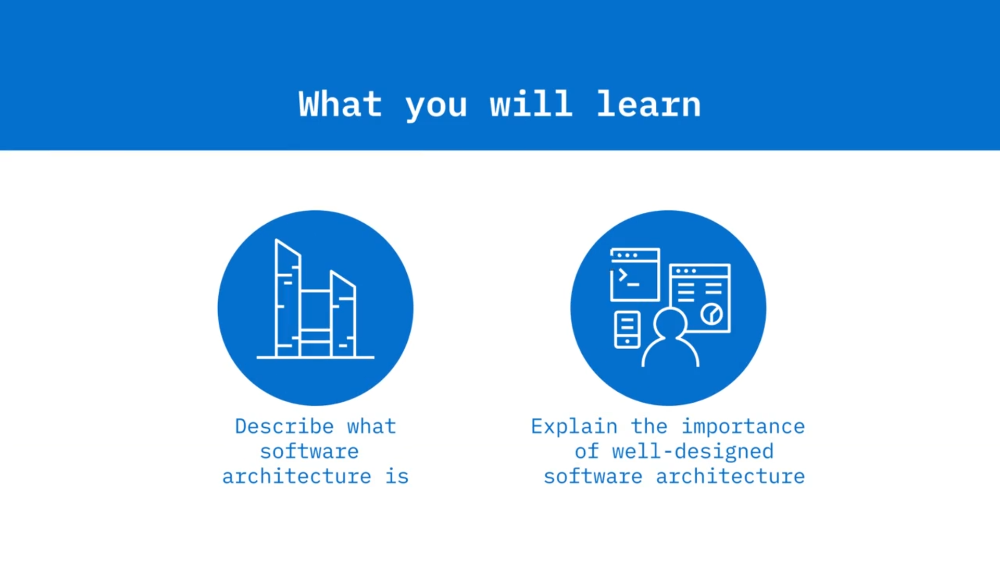
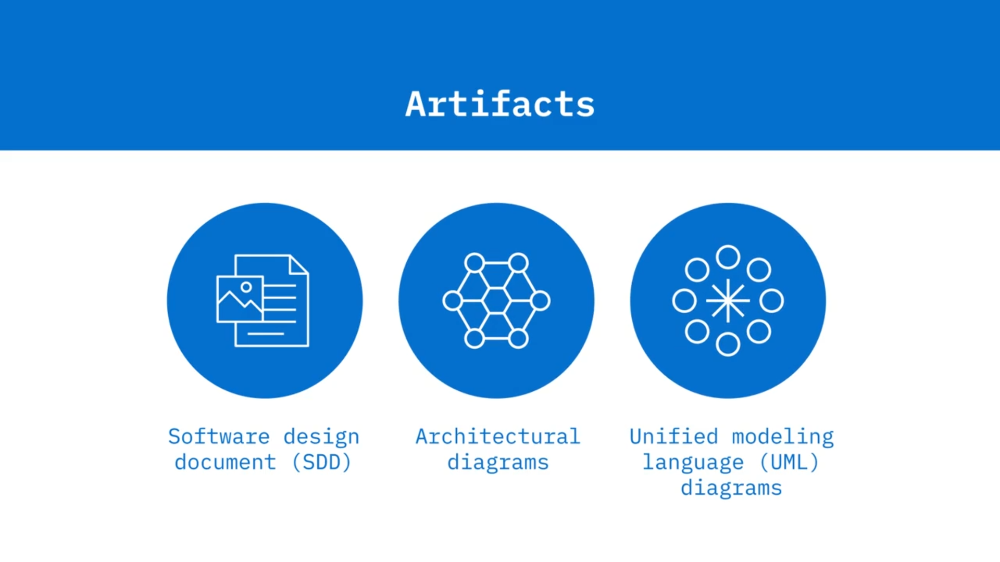
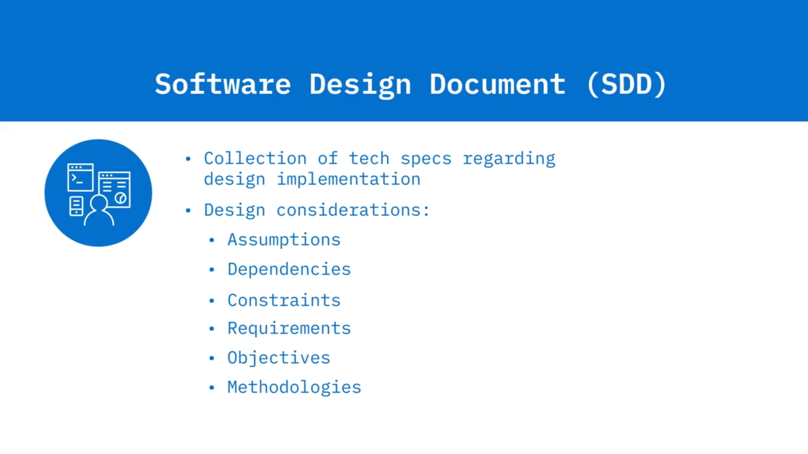
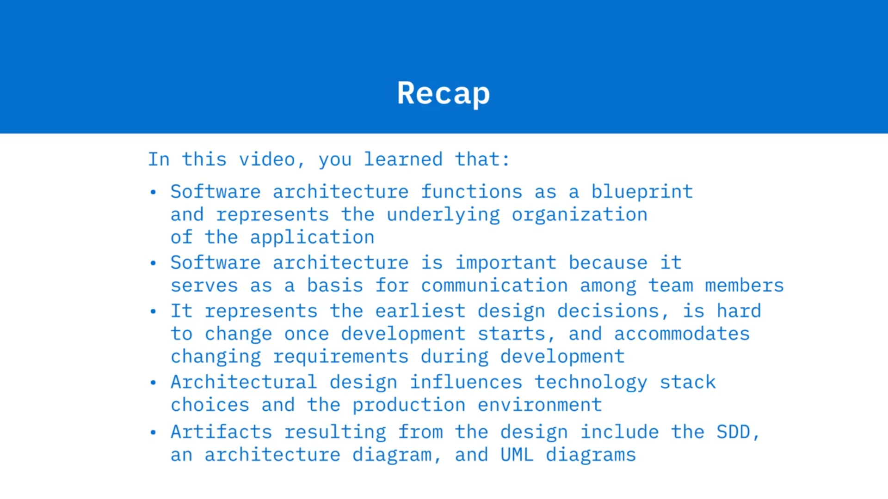

# 🧱 Yazılım Mimarisine Giriş

Yazılım Mimarisine Giriş’e hoş geldiniz. Bu videoyu izledikten sonra şunları yapabileceksiniz: yazılım mimarisinin ne olduğunu açıklamak; iyi tasarlanmış yazılım mimarisinin önemini açıklamak; yazılım mimarisinin teknolojik yığınlar (tech stack’ler) ve üretim ortamları gibi tasarım kararlarını nasıl etkilediğini açıklamak; ve yazılım mimarisi tasarımından ortaya çıkan çeşitli çıktıları listelemek. Yazılım tasarımı ve dokümantasyonu, SDLC’nin tasarım aşamasında gerçekleşir. Basitçe ifade etmek gerekirse yazılım mimarisi, sistemin organizasyonudur. Yazılım mimarisi, yazılımın etkileşen bileşenlerini geliştirmek için programcıların kullandığı yazılım sistemi için bir plan, bir taslak işlevi görür. Mimari, bir yazılım sisteminin temel yapılarını içerir ve bu sistemin davranışını açıklar. Mimari; bileşenlerin birbirleriyle nasıl etkileşime girmesi gerektiğini, çalışma ortamını ve yazılımı tasarlamak için kullanılan ilkeleri tanımlar.

Yazılım mimarisi, genellikle uygulamaya alındıktan sonra değiştirilmesi maliyetli olan erken tasarım kararlarını kayda geçirir. Bir yazılımın mimarisi; performans, ölçeklenebilirlik, bakım yapılabilirlik, birlikte çalışabilirlik, güvenlik ve yönetilebilirlik gibi uygulamanın fonksiyonel olmayan yönlerine odaklanır. İyi tasarlanmış yazılım mimarisi pek çok nedenle önemlidir. İlk olarak, paydaşların farklı ihtiyaçlarını dengeler ve ekip üyeleri arasında iletişim için bir temel görevi görür. Ayrıca mimari, en erken tasarım kararlarını temsil eder ve bu kararlar, geliştirme sürecinin ilerleyen aşamalarındaki diğer kodlama ve uygulama kararlarıyla birleşir. Yine, iyi tasarlanmış bir mimari, değişen gereksinimler karşısında çeviklik sağlar. İyi organize edilmiş bir mimari, uygulama ayrıntıları değişse bile yazılım sisteminin ömrünü uzatır.

Mimari tasarım, sistem için kullanılacak teknoloji yığınlarının seçimine de yön verir. Mimari, fonksiyonel olmayan kabiliyetleri ele aldığı için, bu gereksinimleri karşılayan yığınların seçilmesi tasarım aşamasında son derece kritiktir. Teknoloji yığınının; sistemi oluşturmak için kullanılacak yazılımlar, programlama dilleri, kütüphaneler ve framework’ler dâhil tüm teknolojilerin bir listesi olduğunu hatırlayın. Mimarlar, geliştirme ihtiyaçlarını öngörebilmek için yığının avantajlarının ve dezavantajlarının farkında olmalıdır. Bir evin inşaatçılarına tasarım kararlarını ileten planlar (blueprint’ler) gibi, mimari tasarım aşamasında da paydaşlara yazılım tasarımını iletmek için kullanılan çeşitli çıktılar üretilir. Bu çıktılar; yazılım tasarım dokümanı (SDD), bir mimari diyagram ve Birleşik Modelleme Dili (UML) diyagramlarını içerir. SDD, tasarımın nasıl uygulanması gerektiğini gösteren teknik spesifikasyonların bir derlemesidir.

Yazılımın işlevsel bir tanımını ve varsayımlar, bağımlılıklar, kısıtlar, gereksinimler, hedefler ve metodolojiler gibi tasarım ile ilgili hususları sağlar. Mimari diyagram, bileşenleri, bunların etkileşimlerini, kısıtlarını ve sınırlarını gösterir. Tasarımda kullanılan mimari desenleri gösterir. Mimari desenler, sıkça karşılaşılan sorunlara yönelik genel ve yeniden kullanılabilir çözümlerdir ve yaklaşan bir videoda daha ayrıntılı olarak ele alınacaktır. UML diyagramları, programlama dillerinden bağımsız, ortak bir gösterim kullanarak yapıyı ve davranışı ileten diyagramlardır. UML diyagramları da başka bir videoda daha ayrıntılı olarak tartışılacaktır. Bu modülde yazılım mimarisiyle ilişkili olarak ele alınacak bir diğer konu, üretim ortamına dağıtımla (deployment) ilgili hususlardır.

Mimari, yazılımın hangi ortamda yayımlanacağına ilişkin seçimleri yönlendirir. Üretim ortamı; sunucular, yük dengeleyiciler ve veritabanları gibi, uygulamayı çalıştıran ve son kullanıcıya ulaştıran altyapıdan oluşur. Bu videoda şunları öğrendiniz: Yazılım mimarisi, bir plan (blueprint) işlevi görür ve uygulamanın temel organizasyonunu temsil eder. İyi bir mimari tasarım, ekip üyeleri arasındaki iletişim için bir temel görevi gördüğü için önemlidir. Yazılım mimarisi, en erken tasarım kararlarını temsil eder, geliştirme başladıktan sonra değiştirilmesi zordur ve geliştirme süreci boyunca değişen gereksinimleri karşılayabilir. Mimari tasarım, teknoloji yığını seçimlerini ve üretim ortamını etkiler ve tasarımdan ortaya çıkan çıktılar arasında SDD, mimari diyagram ve UML diyagramı bulunur.

