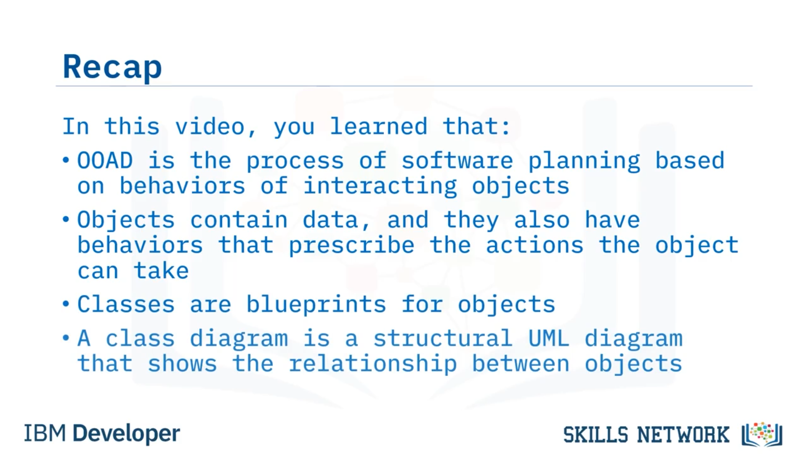

# 🎓 Object-Oriented Analysis and Design

## 🎯 OOAD'in Amacı ve Kapsamı

Object-oriented analysis and design'e hoş geldiniz. Bu videoyu izledikten sonra şunları yapabileceksiniz: Object ve class'ların ne olduğunu açıklamak. Bir class diagram'ın amacını tanımlamak ve object-oriented design'ı software architecture ile ilişkisi bakımından açıklamak. 

Object-oriented analysis and design, kısaca OOAD, bir software system'i analiz etmek ve tasarlamak için kullanılan bir yaklaşımdır; bu yaklaşım, sistemin geliştirilmesinde object-oriented programming languages kullanılacağı zaman uygulanır. Bu yüzden, OOAD'den bahsetmeden önce, Java, C++ veya Python gibi dillerdeki object-oriented programming hakkında biraz daha fazla şey öğrenelim. OOAD'in merkezinde objects bulunur. Objects data içerir ve ayrıca object'in gerçekleştirebileceği actions'ı belirleyen behaviors'a sahiptir.

## 🧍‍♀️ Patient Object ve Instance Örneği

Örneğin, bir patient'ı temsil eden bir object oluşturabilirim. Ve diyelim ki patient'ın adı Naya Patel ve Naya yaptığı bir appointment'ı iptal etmek zorunda. Ancak Naya'yı oluşturmadan önce, önce bir patient object'in generic versiyonunu oluşturmalıyız. Bir object'in generic versiyonuna “class” denir. Naya hakkında daha fazla konuşmadan önce sırada class'ları tartışalım. Specific objects, instances olarak da adlandırılır, ve bir object için blueprint veya template olan “classes”tan oluşturulurlar. Dolayısıyla, önceki örneğimizde, Naya Patel'i ele alırsak, Naya patient class'ının bir instance'ı olurdu.

## 🧱 Class, Attributes ve Instantiation

Class, bir object'in generic attributes'ını – yani properties ve methods'larını – içerir, ancak bu generic attributes, yalnızca object code içinde oluşturulduğunda, ki buna “instantiation” denir, belirli değerlere ayarlanır. Dolayısıyla, patient class'ında LastName adlı bir variable olabilir; bu bir property'dir ancak o soyadının ne olduğunu belirtmez. LastName, object oluşturulup bir isim atanıncaya kadar sadece bir placeholder'dır. Ve object instantiate edildikten sonra, bir appointment oluşturmak veya iptal etmek gibi bir action gerçekleştirmesi için object'in methods'ı çağrılabilir. OOAD, birbirleriyle etkileşime giren objects'e bölünebilen bir system için kullanılır. Bu şekilde, birden fazla developer application'ın farklı yönleri üzerinde aynı anda çalışabilir. Daha önce de belirtildiği gibi, bir system'in hem static structure'ını hem de dynamic behavior'unu gösteren görsel UML diagrams oluşturulabilir.

## 📊 Class Diagram ve UML'de Yapı

Behavioral UML diagrams'ın birkaç örneğini zaten gördük, bu yüzden şimdi classes'ın ne olduğunu bildiğimize göre, “class diagram” adı verilen structural bir UML diagram'a bakalım. Bu, bir “class diagram” örneğidir. Class diagrams, OOAD'de bir software system'in structure'ını aktarmak için sıklıkla kullanılır. Class diagram, object-oriented design içindeki classes'ın birbirleriyle nasıl ilişkili olduğunu gösterir. Her kutu bir class'ı temsil eder ve onun attributes'ını gösterir. Bir object'in attributes'ının hem properties veya data'sı hem de methods olarak adlandırılan kullanılabilir actions olduğunu hatırlayın. Bir class diagram ayrıca classes arasındaki relationships'i de gösterir.

## 🧬 Inheritance, Subclass ve Özet

Bir subclass'ın, parent class'ının attributes'ını “inherit” ettiği söylenir; bu, parent class ile aynı properties ve methods'a sahip olduğu, ancak ayrıca ilave properties ve methods da ekleyebileceği anlamına gelir. Bu diagramda, nurse, doctor ve technician classes, medical personnel'ın subclasses'ıdır ve specialist class, doctor class'ın bir subclass'ıdır. Bu, doctors'ın medical personnel'ın yapabildiği her şeyi yapabildiği ve specialists'in bir doctor'un yapabildiği her şeyi yapabildiği anlamına gelir. Bu videoda şunları öğrendiniz: Object-oriented analysis and design, interacting objects'in behaviors'ına dayalı bir software system planlama sürecidir. Objects data içerir ve ayrıca object'in gerçekleştirebileceği actions'ı belirleyen behaviors'a sahiptir. Classes, objects için blueprints'tir. Ve bir class diagram, objects arasındaki relationship'i gösteren structural bir UML diagram'dır.

