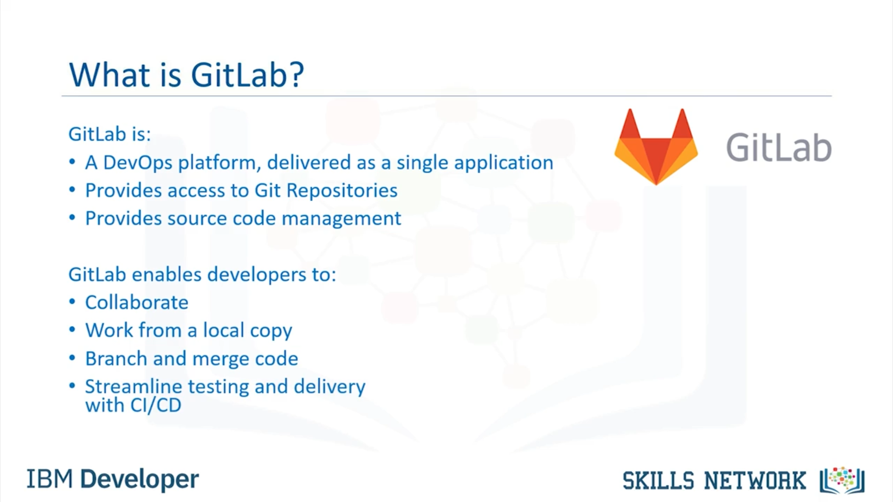

# GitHub’a Giriş 👋

## Video Hedefleri 🎯

Introduction to GitHub’a hoş geldiniz. Bu videoyu izledikten sonra şunları yapabileceksiniz: Source repositories’nin amacını tanımlamak ve GitHub’ın bir source repository’nin ihtiyaçlarını nasıl karşıladığını açıklamak.

---

## Linux Geliştirmesi ve BitKeeper Arka Planı 🐧

2000’lerin başındaki Linux development, BitKeeper olarak bilinen free-to-use bir sistem altında yönetiliyordu. 2005’te BitKeeper, for-fee bir sisteme dönüştü ve bu durum Linux developers için birçok açıdan sorunlu hale geldi. Linus Torvalds, bir replacement source-version control system geliştirmek üzere bir ekibe liderlik etti.

Proje kısa bir timeframe içinde yürütüldü ve temel karakteristikler küçük bir grup tarafından tanımlandı. Bunlar şunları içeriyordu:

* Non-linear development için strong support. (O zamanlar Linux patches, saniyede 6.7 patches hızında geliyordu.)
* Distributed development. Her developer, full development history’nin local bir kopyasına sahip olabiliyordu.
* Existing systems ve protocols ile compatibility. Bu, Linux community’sinin çeşitliliğini kabul etmek için gerekliydi.
* Large projects’in efficient handling’i.
* Cryptographic authentication of history. Bu, distributed systems’in hepsinde identical code updates olmasını sağlar.
* Pluggable merge strategies.

Many pathways of development, explicit integration strategies gerektirebilecek complex integration decisions’a yol açabilir.

---

## Git Repository Modelini Özel Yapan Nedir? 🧱

What is special about the Git Repository model? Git, distributed version-control system olarak tasarlanmıştır.

* Primarily, development sürecinde source code’u tracking’e odaklanır.
* Programmers arasında koordinasyonu sağlamak, changes’i track etmek ve non-linear workflows’u desteklemek için öğeler içerir.
* Linux kernels’ın distribution’ı için 2005 yılında Linus Torvalds tarafından oluşturulmuştur.
* Git, content üzerindeki changes’i track etmek için kullanılan bir distributed version-control system’dir.

Bu, belirli bir agile development methodologies odağıyla, collaboration için central point görevi görür.

---

## Central ve Distributed Version Control Karşılaştırması 🔁

Central version control system’de, her developer’ın code’u central system’den check out etmesi ve tekrar oraya commit etmesi gerekir.

Git ise distributed version control olduğu için, her developer full development history’nin local bir kopyasına sahiptir ve changes, bu repository’lerden birinden diğerine kopyalanır. Her developer bir hub gibi davranabilir.

Git doğru şekilde kullanıldığında, deployable code’a karşılık gelen bir main branch bulunur. Teams, release edilmeye hazır changes’i continuously integrate edebilir ve releases arasında ayrı branches üzerinde eşzamanlı olarak çalışabilir.

Git ayrıca, her team için access-level controls ile tasks’in centralized administration’ına izin verir.

---

## Git’in Kullanım Şekilleri ve GitHub Arayüzü 🧭

Git, local olarak GitHub Desktop client gibi araçlarla birlikte var olabilir ya da direkt olarak GitHub web interface’e bağlı bir browser üzerinden kullanılabilir.

IBM Cloud, Git repositories (çoğu zaman repos olarak adlandırılır) dahil olmak üzere, sound ve established open-source tools üzerine kuruludur.

GitHub, Git repositories için bir online hosting service’tir. GitHub, Microsoft’un bir subsidiary’si tarafından hosted edilir. GitHub, free, professional ve enterprise accounts sunar. August 2019 itibarıyla GitHub’da 100M’den fazla repositories vardı.

---

## Repository Nedir? 🗂️

A Repository is: Documents (application source code dahil) saklamak için kullanılan bir data structure’dır.

Bir repository, version-control’ü track edebilir ve maintain edebilir.

---

## GitLab ve DevOps Platformu 🛠️

GitLab, single application olarak sunulan complete bir DevOps platformudur. GitLab, source code management tarafından kontrol edilen Git repositories’e access sağlar.

GitLab ile developers şunları yapabilir:

* Collaborate; code’u reviewing, comments yapma ve birbirlerinin code’unu geliştirmeye yardım etme.
* Kendi local copy’leri üzerinden code ile çalışma.
* Gerektiğinde code’u branch ve merge etme.
* Built-in Continuous Integration (CI) ve Continuous Delivery (CD) ile testing ve delivery’yi streamline etme.

---

## Videodan Öğrendiklerinizin Özeti 📌

Bu videoda şunları öğrendiniz:

* GitHub, Git repositories için online hosting service’tir.
* Repositories, application source code dahil olmak üzere documents saklar ve contributors’ın version-control’ü track etmesini ve maintain etmesini sağlar.
* What is special about the Git Repository model? Git, distributed version-control system olarak tasarlanmıştır.
* Primarily, development sürecinde source code’u tracking’e odaklanır.
* Programmers arasında koordinasyonu sağlamak, changes’i track etmek ve non-linear workflows’u support etmek için öğeler içerir.

  
