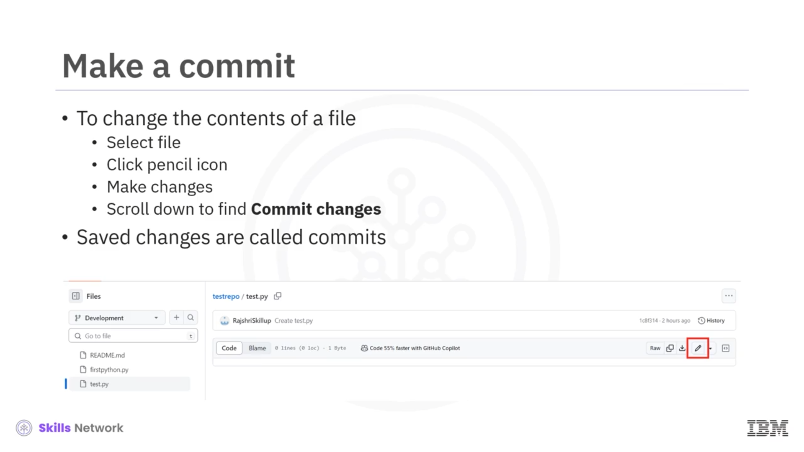
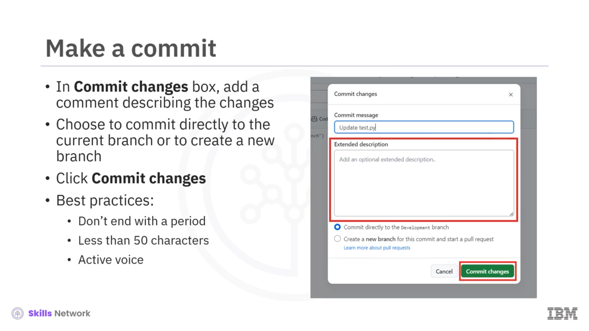
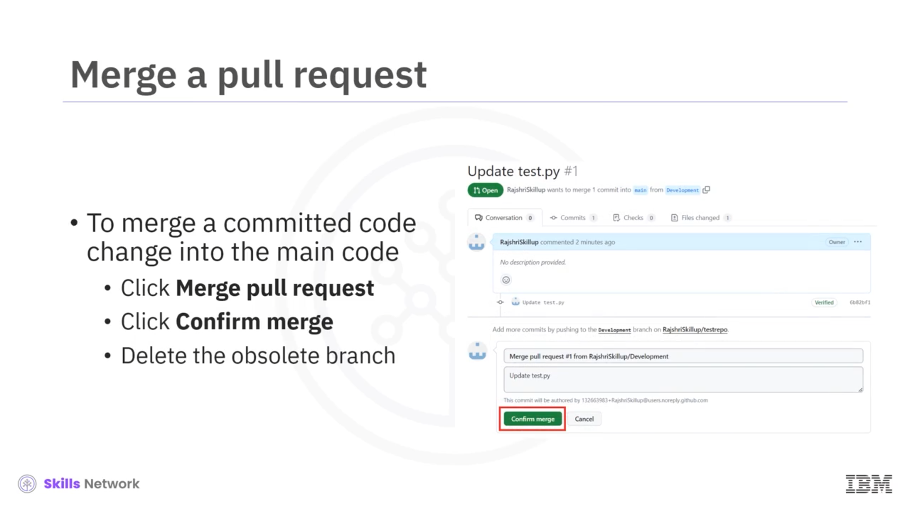

# GitHub Branches 🌿

## Video Hedefleri 🎯

GitHub branches’a hoş geldiniz. Bu videoyu izledikten sonra, GitHub içindeki branches’in amacını açıklayabilecek ve değişikliklerin branches içine nasıl merge edileceğini anlatabileceksiniz.

## main branch ve Diğer Branch’ler 🌱

GitHub’daki tüm files bir branch üzerinde saklanır.

main branch belirleyicidir; code’unuzun deploy edilebilir versiyonunu saklar.

main branch varsayılan olarak oluşturulur, ancak code’un bitmiş, deploy edilebilir versiyonu olarak herhangi bir branch’i main olarak kullanabilirsiniz. Bir şeyleri değiştirmeyi planladığınızda yeni bir branch oluşturur ve ona açıklayıcı bir isim verirsiniz. Yeni branch, original branch’in bire bir kopyası olarak başlar.

Siz changes yaptıkça, oluşturduğunuz branch değişmiş code’u tutar.

## Yeni Branch Oluşturma 🧩

Yeni bir branch oluşturmak için, branch **Main** dropdown’ına tıklayın, **new branch** text alanına yeni branch adını ekleyin ve **Create Branch** seçeneğini seçin.

GitHub branches, büyük software projects için oldukça complex olabilir. Bizim incelediğimiz türden basit bir project için ise şunları düşünün:

Ortak bir base ile başlayın; bu, project için initial source’tur. Bir noktada, yeni features geliştirilirken code branch edilir. Bu örnekte, her iki branch de changes geçiriyor.

İki work stream’i merge edilmeye hazır olduğunda, her branch’in code’u branch’in ucu (tip’i) olarak tanımlanır ve bu iki uç, üçüncü bir combined branch içinde merge edilir.

## Branch Üzerinde Çalışma ve Commit 💾

Developers, bir branch içindeki source files üzerinde çalışır. Bazı projects biraz zaman aldığı için, source hemen anlamlı gelmeyebilir.

Bir file’ın içeriğini değiştirmek için, file’ı seçin, pencil ikonuna tıklayın, changes’i yapın, changes’i commit edin.

Bir developer kendisine atanan işi tamamladığında, changes’ini kaydetmek için code’u commit eder. Commit, developer’ın, code’un geliştirilen feature veya feature set’i için stable bir platformu temsil ettiğine ikna olduğunu gösterir.

Bir developer, path’ine bir change source commit ettiğinde, yapılan changes’i açıklayan bir comment yazması gerekir. Comment anlamlı ve descriptive olmalıdır.

Developer, current branch’e commit etmeyi ya da yeni bir branch oluşturmayı seçebilir. Son olarak,  **Commit changes** ’e tıklayın.

## İyi Commit Mesajı Yazma İpuçları 📝

Comment yazarken bazı best practice’ler:

* Comment message’ını nokta ile bitirmeyin
* Commit messages’i 50 karakterin altında tutun
* Detaylar için extended window’u kullanın
* Her zaman active voice kullanarak yazın

## Pull ve Pull Request Süreci 🔄

Pull, branches’in merge edilmesini, changes’i yakalayacak şekilde başlatmak için kullanılır.

Bir pull request, önerilen committed changes’i başkalarının review edip kullanabilmesi için erişilebilir hale getirir. Code unfinished olsa bile, bir pull herhangi bir commit’ten sonra gelebilir.

Bir pull, changes’in bir user tarafından approve edilmesini gerektirir. Bu, change’in author’ı olabilir ya da team içinde atanabilir.

Şunu unutmayın: Size ait olmayan bir branch üzerinde change yaptığınızda, GitHub sizin adınıza otomatik olarak bir pull request oluşturur. Log files immutable olduğu için, change’in merge edilmesini approve eden kişiyi her zaman bulmak mümkündür.

Bir pull request açmak için  **Pull requests** ’e tıklayın ve  **New pull request** ’i seçin. Compare kutusundan yeni branch’i seçin. Changes’i görmek için aşağıya doğru scroll edin. Değerlendirmek istediğiniz changes’in bunlar olduğunu confirm edin. Request’e bir title ve description ekleyin.  **Create pull request** ’e tıklayın.

## Merge ve Branch’in Tamamlanması 🌉

Bir Git repository’nin amacı, deploy edilmiş code’un yalnızca main branch üzerinde bulunmasıdır. Developers, bir branch içindeki source files’ı değiştirebilir, ancak changes commit edilene kadar release edilmez.

Bir pull command verilir, code review edilir ve approve edilir. Approve edilen code, main code içine geri merge edilir.

Commit edilmiş bir code change’i main code’unuza merge etmek için  **Merge pull request** ’e tıklayın, ardından  **Confirm merge** ’e tıklayın.

Bir branch için tüm changes tamamlandığında, o branch obsolete kabul edilir ve delete edilmelidir.

## Videodaki Temel Noktalar 📌

Bu videoda şunları öğrendiniz:

* GitHub’daki tüm files’ın bir branch üzerinde bulunduğunu
* main branch’in, code’un bitmiş, deploy edilebilir versiyonunu içerdiğini
* Code’u değiştirmeniz gerektiğinde yeni branches oluşturmanız gerektiğini
* Yeni branch’in, original branch’in bire bir kopyası olarak başladığını
* Siz changes yaptıkça, oluşturduğunuz branch’in değişmiş code’u tuttuğunu
* Aynı anda birden fazla branch’in change geçiriyor olabileceğini
* Kaydedilmiş changes’in commits olarak adlandırıldığını
* Pull requests’in, diğer users’ın commit edilmiş önerilen changes’i review edip kullanmalarını sağladığını
* Değişmiş code’u main branch içine merge etmeye hazır olduğunuzda, commit edilmiş code changes’i main code’unuza merge ettiğinizi 🌿

