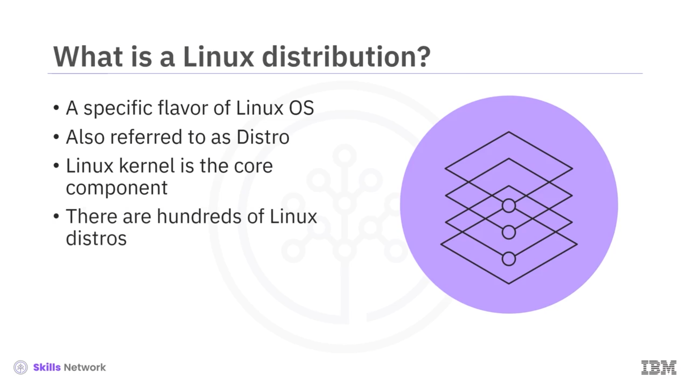
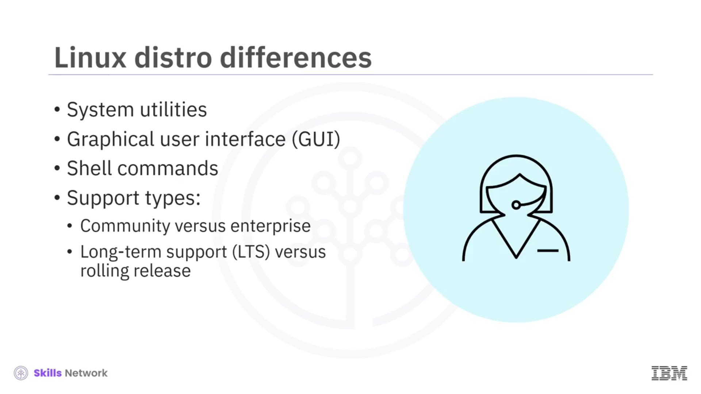
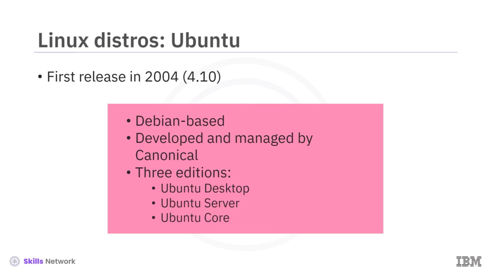
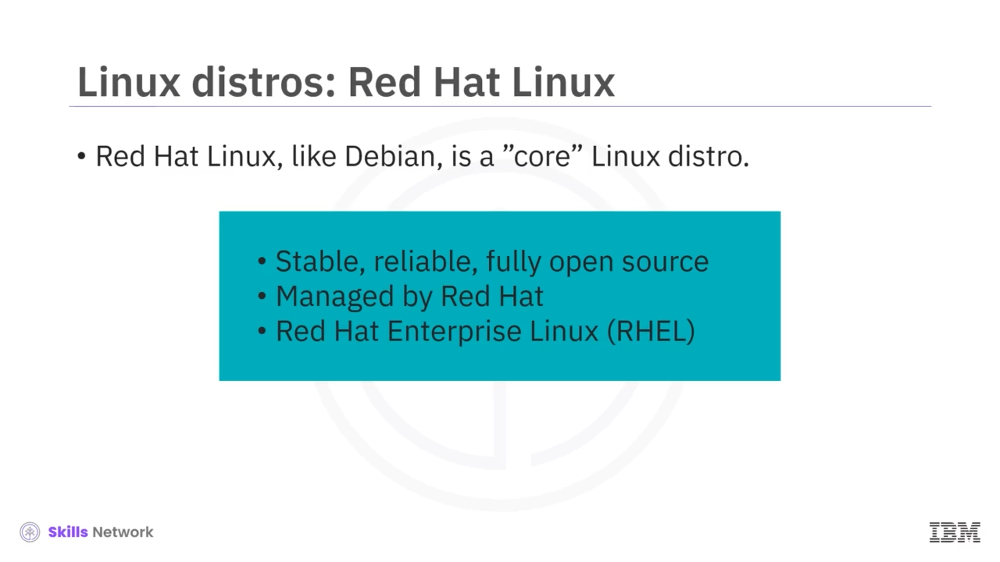
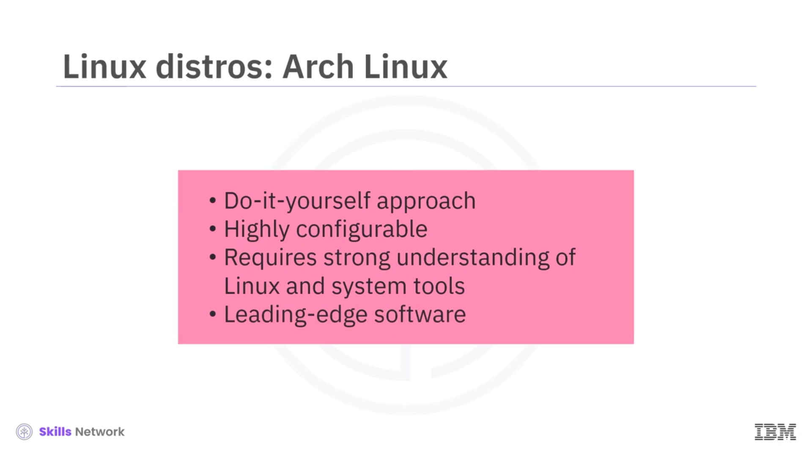
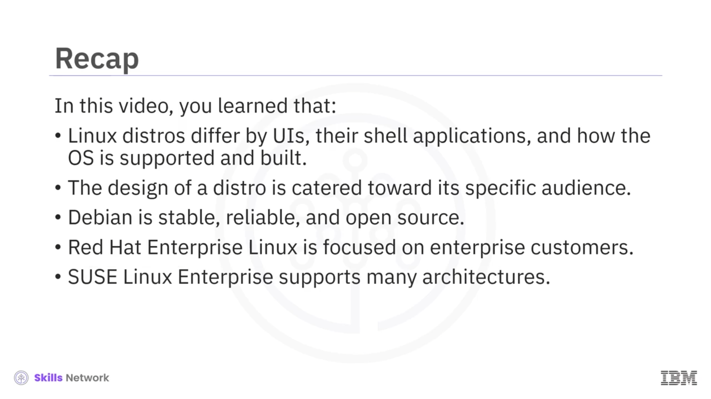

# 🧬 Linux Dağıtımları

## 🎯 Bu Videoda Neler Öğreneceksiniz?

Linux Dağıtımları’na hoş geldiniz. Bu videoyu izledikten sonra şunları yapabileceksiniz:

* Bir Linux dağıtımının ne olduğunu açıklamak
* Bazı yaygın Linux dağıtımlarını birbirinden ayırt etmek
* Bazı popüler Linux dağıtımlarının kullanım senaryolarını belirlemek

---

## ❓ Linux Dağıtımı Nedir?

Peki, bir Linux dağıtımı nedir?  Bir Linux dağıtımı, Linux işletim sisteminin belirli bir çeşididir ( *flavor* ). Ayrıca *distro* olarak da adlandırılabilir. Tüm Linux dağıtımları *Linux çekirdeğini* ( *Linux kernel* ) kullanmak zorundadır. Bu çekirdek, sistemin bilgisayar donanımını doğru şekilde kullanmasını sağlayan, Linux işletim sisteminin çekirdek bileşenidir. Ve günümüzde, her biri belirli bir kitleye veya göreve uyarlanmış yüzlerce Linux dağıtımı vardır.

---

## 🧩 Dağıtımları Birbirinden Ayıran Özellikler

Peki, Linux dağıtımlarını birbirinden ayıran nedir?  Her Linux dağıtımı, işletim sisteminin parçası olan ve dağıtımla birlikte hazır gelen komutlar ve uygulamalar gibi kendine özgü bir *varsayılan yardımcı programlar* kümesi içerir. Her dağıtımın, işletim sistemiyle etkileşim kurmak için kullandığınız kendine ait bir *grafiksel kullanıcı arayüzü* ( *GUI* ) vardır. Her dağıtım, komutları girmek ve çıktılarını almak için kullanılan bir pencere olan kabukta ( *shell* ) kullanabileceğiniz belirli bir komut kümesini destekler.

Ve son olarak, her dağıtım farklı düzeylerde destek sunar. Topluluk destekli bir proje olarak geliştirilebilir ve yönetilebilir ya da ticari bir kuruluş tarafından sürdürülebilir. Ayrıca uzun süreli destek sürümü ( *long-term support* ,  *LTS* ) olabilir ya da kararlı paket güncellemelerinin sürekli bir takvime göre yayımlandığı *rolling release* türünde olabilir.

---

## 🐋 Debian

 **Debian** , en eski köklere sahip dağıtımlardan biridir.

İlk sürümü 1993’te (0.01 sürümü adıyla) yayımlanmış, ilk resmi ve kararlı sürümü ise 1996’da (1.1 sürümü) çıkmıştır.

Kararlı, güvenilir ve tamamen açık kaynaklı olmasıyla bilinir.

Birçok bilgisayar mimarisini (ya da donanım türünü) destekler.

Bu özellikler, Debian’ın sunucu alanında yüksek itibara sahip olmasını sağlar.

Dahası, Debian hâlihazırda mevcut en büyük topluluk tarafından yürütülen dağıtımdır.

---

## 🟣 Ubuntu

Bir diğer popüler dağıtım  **Ubuntu** ’dur.

Bu da kökleri eskiye dayanan bir dağıtımdır; ilk resmi sürümü 2004’te yayımlanmıştır.

Ubuntu, Debian tabanlıdır; yani Debian’ın üzerine inşa edilmiştir ve Debian işletim sistemiyle aynı araçların çoğunu kullanır.

Ubuntu, *Canonical* tarafından geliştirilir ve yönetilir.

Ve Ubuntu’nun üç resmi sürümü vardır:

* **Desktop** – kişisel bilgisayarlar, dizüstü bilgisayarlar ve iş istasyonları için
* **Server** – basit dosya sunucuları veya çok düğümlü bulutlar ( *multinode clouds* ) için
* **Core** – Nesnelerin İnterneti ( *Internet of Things* ) için

---

## 🎩 Red Hat Linux ve RHEL

 **Red Hat Linux** , tıpkı Debian gibi, başka bir Linux dağıtımından türetilmemiş olması anlamında “çekirdek” ( *core* ) bir Linux dağıtımıdır.

Red Hat, kararlı, güvenilir ve tamamen açık kaynaklı olmasıyla bilinir.

IBM’in bir yan kuruluşu olan Red Hat tarafından yönetilir.

Günümüzde, tamamen kurumsal müşterilere odaklanan bir sürüm olan **Red Hat Enterprise Linux** (ya da  *RHEL* ) olarak sunulmaktadır.

---

## 🦊 Fedora

Sırada **Fedora** vardır; birçok mimariyi destekleyen kararlı bir işletim sistemi olarak bilinir.

Ayrıca oldukça güvenilir ve güvenlidir; özgün güvenlik duvarı ve güvenlik özellikleri sunar.

Geniş ve büyüyen bir toplulukla birlikte, aktif olarak geliştirilmektedir.

Ve Red Hat tarafından desteklenmektedir ( *sponsored* ).

Sonuç olarak, Red Hat, elbette testten sonra, Fedora’nın kod tabanının büyük bir kısmını kullanır.

---

## 🟢 SUSE Linux Enterprise (SLE)

Bir diğer Linux dağıtımı  **SUSE Linux Enterprise** ’dır.

*SLE* olarak da bilinen SUSE Linux Enterprise, iki sürümde sunulur:

* **Server** – *SLES*
* **Desktop** – *SLED*

Raspberry Pi için ARM gibi birçok mimariyi destekler

ve kullanıcıların resmi olarak SLE’nin parçası olmayan paketleri kurmalarını sağlayan  **SUSE Package Hub** ’ı kullanır.

Ve küçük bir Alman açık kaynak yazılım şirketi olan **SUSE** tarafından bakımı yapılır.

---

## 🏗️ Arch Linux

Ve son olarak,  **Arch Linux** ’a geliyoruz.

Arch Linux’un *kendin-yap* ( *do-it-yourself* ) yaklaşımı, kullanıcıların sistemlerinin her bir parçasını özelleştirmelerine olanak tanır.

Bu da onu son derece yapılandırılabilir kılar; bu özgürlük, Arch’ı çok popüler yapmaktadır.

Ancak bu aynı zamanda, Arch’ı etkin bir şekilde kullanmak için Linux ve sistem araçları hakkında sağlam bir anlayışa sahip olmanız gerektiği anlamına gelir.

Ve Arch, diğer dağıtımlarla aynı şekilde kararlılığa odaklanmadığı için, tamamen kararlı olacağına dair pek az garanti bulunan en yeni yazılımlara kolay erişim sağlar.

---

## 📌 Bu Videoda Öğrendikleriniz

Bu videoda şunları öğrendiniz:

* Linux dağıtımları, kullanıcı arayüzleri, kabuk uygulamaları ve işletim sisteminin nasıl desteklendiği ve inşa edildiğine göre birbirinden ayrılabilir.
* Bir Linux dağıtımının tasarımı, belirli bir hedef kitleye göre şekillendirilir.
* Debian, kararlılığı, güvenilirliği ve açık kaynaklı olması nedeniyle sunucu alanında yüksek itibara sahiptir.
* Red Hat Enterprise Linux, IBM’in bir yan kuruluşu olup tamamen kurumsal müşterilere odaklanmıştır.
* Ve SUSE Linux Enterprise, Raspberry Pi için ARM gibi birçok mimariyi destekler.

