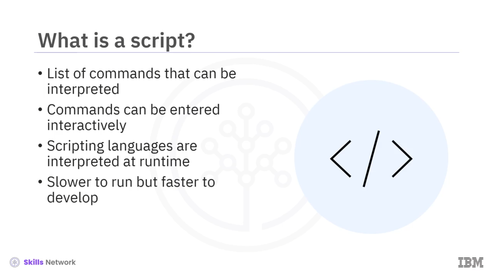
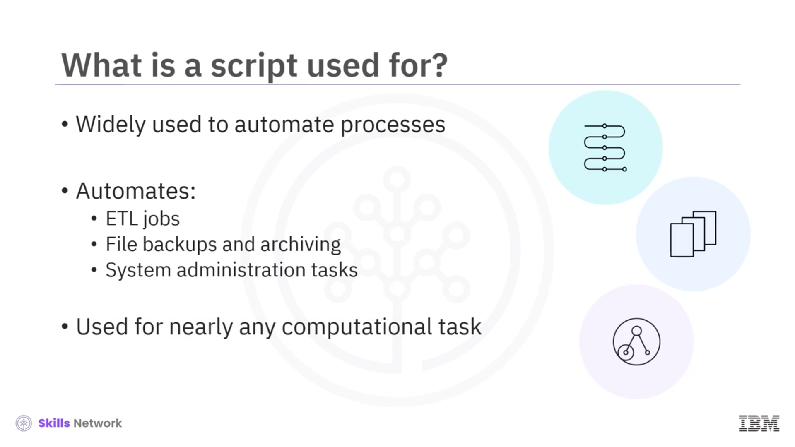

# 🐚 Shell Scripting Basics

## 🎬 Shell Scripting Basics’e Hoş Geldiniz

Shell Scripting Basics’e hoş geldiniz.

Bu videoyu izledikten sonra şunları yapabileceksiniz:

* Bir script’in ne olduğunu ana hatlarıyla açıklamak.
* Script yazımının kullanım alanlarını listelemek.
* *Shebang* yorumlayıcı yönergesini ( *interpreter directive* ) tanımlamak.
* Basit bir `hello_world` shell script’i oluşturmak ve çalıştırmak.

---

## 📜 Script Nedir?

Bir script, *scripting language* ( *betik dili* ) adı verilen bir program tarafından yorumlanıp çalıştırılabilen komutlar listesidir.

Komutlar, komut satırında etkileşimli olarak girilebilir veya satır satır bir metin dosyasında listelenebilir.

Scripting dilleri genellikle derlenmez. Çalışma zamanında yorumlanırlar.

Script’ler genellikle derlenmiş dillere kıyasla daha yavaş çalışır, ancak geliştirilmesi çok daha kolay ve hızlıdır.




---

## 🤖 Script’lerin Kullanım Alanları

Script’ler; ETL işlerleri, dosya yedekleme ve arşivleme, ve genel sistem yönetimi görevleri gibi süreçleri otomatikleştirmek için yaygın olarak kullanılır.

Script’leri, uygulama entegrasyonu, eklenti ( *plug-in* ) ve web uygulaması geliştirme de dahil olmak üzere neredeyse her türlü hesaplamalı görev için kullanabilirsiniz.



---

## ✳️ Shell Script ve Shebang Yönergesi

Bir shell script, ilk satırı genellikle bir *interpreter directive* (yorumlayıcı yönergesi) biçiminde olan yürütülebilir bir metin dosyasıdır.

Yorumlayıcı yönergesi, *shebang* yönergesi olarak da bilinir ve şu biçimdedir:

> “pound, bang, interpreter” artı isteğe bağlı bir argüman.

Buradaki  *interpreter* , yürütülebilir bir programa giden mutlak bir yoldur ve isteğe bağlı argüman, tek bir argümanı temsil eden bir dizedir.

Shell script’ler, bir shell programını çağıran script’lerdir.


---

## 💻 Shebang Örnekleri

Örneğin:

* `#!/bin/sh`

  `bin` dizinindeki Bourne shell’i ya da başka uyumlu bir shell programını çağırır.
* `#!/bin/bash` shebang’i, Bash shell’ini çağırır.

Shebang yönergeleri yalnızca shell programlarıyla sınırlı değildir.

Örneğin, şu yönergeyi kullanan bir Python script’i oluşturabilirsiniz:

```bash
#!/usr/bin/env python3
```


---

## 👋 Basit Bir “hello world” Shell Script’i Örneği

Burada, basit bir “hello world” örneğiyle bir shell script’in bir program çalıştırmak için nasıl kullanılabileceğini gösteriyoruz.

Komut isteminden, basit bir “hello world shell script”i şu şekilde oluşturabilirsiniz:

`touch` komutunu kullanarak `hello_world.sh` adlı boş bir metin dosyası oluşturun.

`.sh` uzantısı, dosyanın bir shell script olduğunu belirtmek için kullanılan bir konvansiyondur.


---

## 🧩 Metin Dosyasını Bash Script’ine Dönüştürme

Şimdi, bash shebang’ini *echo* komutuyla yazarak ve bu yankılanan metni, dosyanıza “double greater than symbol” olarak adlandırılan, çıktıyı dosyaya eklemek için kullanılan Bash “output redirection” operatörünü kullanarak ekleyerek, metin dosyanızı bir bash script’e dönüştürün.

Son olarak, `echo` komutunu kullanarak `echo Hello World` ifadesini yazdırın ve yine bu çıktıyı bash script’inize yönlendirin.

---

## 🔐 Script’i Yürütülebilir Hale Getirme

Bash script’inizi çalıştırmadan önce, onu yürütülebilir hale getirmeniz gerekir.

İlk olarak, script’inizin geçerli izin ayarlarını `ls` komutunu `-l` seçeneğiyle kullanarak kontrol edin.

`R` ve `W` girdileri, script’in okunabilir ve yazılabilir olduğunu gösterir, ancak `X`’in olmaması onun yürütülebilir olmadığını ifade eder.

`R`, `W` ve `X` girdileri, üç kullanıcı tabanlı izin grubuna uygulanır:

* *Owner* (sahip) — yani siz,
* *Group* (grup),
* ve tüm kullanıcılar.

Script’i tüm kullanıcılar için yürütülebilir hale getirmek üzere, `chmod` komutunu `'plus X'` seçeneğiyle çağırabilirsiniz.

İzin ayarlarını tekrar kontrol etmek, üç izin grubunun tümü için `X` girdileri sayesinde script’inizin artık tüm kullanıcılar için yürütülebilir olduğunu gösterir.

---

## ▶️ Script’i Çalıştırma

Artık bash script’inizi `./hello_world.sh` yazarak ve Enter’a basarak nihayet çalıştırabilirsiniz ve komut satırında `hello world` metni görünür.


---

## 🧠 Bu Videoda Öğrendikleriniz

Bu videoda şunları öğrendiniz:

* Bir shell script, bir *shebang* yorumlayıcı yönergesiyle başlayan yürütülebilir bir metin dosyasıdır.
* Bir shell script, komutları yürütmek ve diğer programları çalıştırmak için kullanılabilir.
* Scripting dilleri derlenmez, çalışma zamanında yorumlanırlar.
* Derlenmiş diller, scripting dillerinden çok daha hızlı olabilir, ancak daha fazla geliştirme süresi gerektirir.


