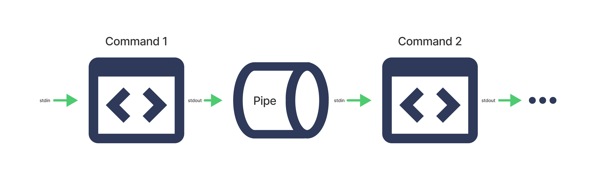

# 🔧 Boru (Pipe) Örnekleri

## 🎯 Öğrenme Hedefleri

Bu okumayı tamamladıktan sonra şunları yapabileceksiniz:

* Boruları ( *pipes* ) açıklamak
* Metin dizileri ve metin dosyası içerikleriyle çalışırken komutları birleştirmek için boruları kullanmak
* URL’lerden bilgi çıkarmak için boruları kullanmak

---

## 🚰 Borular (Pipes) Nedir?

Basitçe söylemek gerekirse, borular, Linux’ta bir komutun çıktısını başka bir komutun girdisi olarak kullanmanıza izin veren komutlardır.



**Pipes | şu biçimi kullanır:**

```bash
1
[command 1] | [command 2] | [command 3] ... | [command n]
```

**Kopyalandı!**

**Satır Kaydırma Açık/Kapalı!**

Arka arkaya kaç tane boru zincirleyeceğinizin bir sınırı yoktur!

Bu labde, temel veri işleme problemlerini çözmek için boruları ve filtreleri nasıl kullanabileceğinizi daha yakından inceleyeceksiniz.

---

## 🧪 Boru Örnekleri

### 🔗 Komutları Birleştirme

Yaygın olarak kullanılan bir örnekle başlayalım. Aşağıdaki komutları hatırlayın:

* `sort` – Bir dosyadaki metin satırlarını sıralar ve sonucu gösterir.
* `uniq` – Bir metin dosyasındaki ardışık, tekrar eden satırları tek bir satıra indirger.

Boru operatörünün yardımıyla bu komutları birleştirerek bir dosyadaki tüm benzersiz satırları yazdırabilirsiniz.

Aşağıdaki içeriğe sahip `pets.txt` dosyasına sahip olduğunuzu varsayalım:

```bash
$ cat pets.txt
goldfish
dog
cat
parrot
dog
goldfish
goldfish
```

Yalnızca `sort` komutunu `pets.txt` üzerinde kullanırsanız, şu çıktıyı elde edersiniz:

```bash
$ sort pets.txt
cat
dog
dog
goldfish
goldfish
goldfish
parrot
```

Dosya sıralanmıştır, ancak “dog” ve “goldfish” satırlarının yinelenmiş (tekrarlı) satırları vardır.

Diğer yandan yalnızca `uniq` kullanırsanız, şu çıktıyı elde edersiniz:

```bash
$ uniq pets.txt
goldfish
dog
cat
parrot
dog
goldfish
```

Bu sefer ardışık tekrarlar kaldırılmıştır, ancak “dog” ve “goldfish” kelimelerinin ardışık olmayan tekrarları kalmıştır.

Ancak iki komutu doğru sırayla birleştirerek – önce `sort`, sonra `uniq` kullanarak – şu çıktıyı elde edersiniz:

```bash
$ sort pets.txt | uniq
cat
dog
goldfish
parrot
```

`sort` tüm özdeş öğeleri ardışık hale getirdiği ve `uniq` de tüm ardışık tekrarları kaldırdığı için, komutları birleştirmek `pets.txt` dosyasındaki yalnızca benzersiz satırları yazdırır!

---

## 🧵 Dizgilere ve Dosyalara Komut Uygulama

`tr` gibi bazı komutlar yalnızca standart girdi (normalde klavyeden girilen metin) kabul eder, ancak dizgileri ( *strings* ) veya dosya adlarını kabul etmez.

`tr` ( *translate* ) – Girdi metnindeki karakterleri değiştirir.

```bash
tr [OPTIONS] [target characters] [replacement characters]
```

Bu gibi durumlarda, komutu dizgilere ve dosya içeriklerine uygulamak için borulama kullanabilirsiniz.

Dizgilerle çalışırken, bir dizgideki tüm sesli harfleri alt çizgi `_` ile değiştirmek için `echo` ile birlikte `tr` kullanabilirsiniz:

```bash
$ echo "Linux and shell scripting are awesome\!" | tr "aeiou" "_"
L_n_x _nd sh_ll scr_pt_ng _r_ _w_s_m_!
```

Önceki örnekteki işlemin tamamlayıcısını gerçekleştirmek – yani tüm ünsüzleri (sesli harf olmayan herhangi bir harf) alt çizgi ile değiştirmek – için `-c` seçeneğini kullanabilirsiniz:

```bash
$ echo "Linux and shell scripting are awesome\!" | tr -c "aeiou" "_"
_i_u__a_____e______i__i___a_e_a_e_o_e_
```

Dosyalarla çalışırken, bir dosyanın tüm metnini büyük harfe çevirmek için `cat` komutunu `tr` ile birlikte şu şekilde kullanabilirsiniz:

```bash
$ cat pets.txt | tr "[a-z]" "[A-Z]"
GOLDFISH
DOG
CAT
PARROT
DOG
GOLDFISH
GOLDFISH
```

Olasılıklar sınırsızdır! Örneğin, yukarıdaki boru hattına `uniq` ekleyerek dosyadaki yalnızca benzersiz satırları döndürebilirsiniz:

```bash
$ sort pets.txt | uniq | tr "[a-z]" "[A-Z]"
CAT
DOG
GOLDFISH
PARROT
```

---

## 🧾 JSON Dosyalarından Bilgi Çıkarma

Bu JSON dosyasını kullanarak, `grep` komutunu kullanıp Bitcoin’in (BTC) güncel USD fiyatını nasıl elde edebileceğinize bakalım.

```json
{
  "coin": {
    "id": "bitcoin",
    "icon": "https://static.coinstats.app/coins/Bitcoin6l39t.png",
    "name": "Bitcoin",
    "symbol": "BTC",
    "rank": 1,
    "price": 57907.78008618953,
    "priceBtc": 1,
    "volume": 48430621052.9856,
    "marketCap": 1093175428640.1146,
    "availableSupply": 18877868,
    "totalSupply": 21000000,
    "priceChange1h": -0.19,
    "priceChange1d": -0.4,
    "priceChange1w": -9.36,
    "websiteUrl": "http://www.bitcoin.org",
    "twitterUrl": "https://twitter.com/bitcoin",
    "exp": [
      "https://blockchair.com/bitcoin/",
      "https://btc.com/",
      "https://btc.tokenview.com/"
    ]
  }
}
```

Yukarıdaki çıktıyı bir dosyaya kopyalayın ve dosyayı `Bitcoinprice.txt` olarak adlandırın.

Burada almak istediğiniz JSON alanı `"price": [numbers].[numbers]"` ifadesidir. Bunu elde etmek için, JSON metninden çıkarmak amacıyla aşağıdaki `grep` komutunu kullanabilirsiniz:

```bash
grep -oE "\"price\"\s*:\s*[0-9]*\.?[0-9]*"
```

Bu ifadeyi ayrıntılarına göre inceleyelim:

* `-o` `grep`’e yalnızca eşleşen kısmı döndürmesini söyler.
* `-E` `grep`’in `?` gibi genişletilmiş ( *extended* ) regex sembollerini kullanabilmesini sağlar.
* `\"price\"` `"price"` dizgisini eşleştirir.
* `\s*` herhangi bir sayıda (0 dahil) boşluk (`\s`) karakterini eşleştirir.
* `:` `:` karakterini eşleştirir.
* `[0-9]*` 0’dan 9’a kadar herhangi bir rakamdan oluşan herhangi bir sayıda rakamı eşleştirir.
* `\.?` isteğe bağlı olarak bir `.` karakterini eşleştirir.

JSON dosyasının çıktısını almak için `cat` komutunu kullanın ve gerekli çıktıyı elde etmek için bunu `grep` komutuna borulayın:

```bash
1
cat Bitcoinprice.txt | grep -oE "\"price\"\s*:\s*[0-9]*\.?[0-9]*"
```

Bu tür `grep` komutlarını kullanarak doğrudan URL’lerden de bilgi çıkarabilir ve herhangi bir özel veriyi elde edebilirsiniz.

---

## 🌐 URL’lerden Bilgi Çıkarma

Aşağıda, URL’lerden doğrudan bilgi çıkarma ve belirli verileri alma sürecini görebilirsiniz:

**Click here to see the process of extracting information directly from URLs and retreiving specific data:**

### 1️⃣ Web Sitesine Giriş

1. Web tarayıcınızı açın ve şu bağlantıya gidin:

   `https://openapi.coinstats.app`.

   Aşağıda gösterildiği gibi giriş sayfasına yönlendirileceksiniz:

   
2. E-posta adresinizi ve parolanızı girin, ardından e-posta adresinizi doğrulamaya devam edin. Doğrulamadan sonra, gösterge paneline ( *dashboard* ) yönlendirileceksiniz.
3. Gösterge panelinde, **Generate API Key** düğmesini bulun ve tıklayın. Aşağıda gösterildiği gibi bir API anahtarı üretilecektir. Bu API anahtarını kaydettiğinizden emin olun.
   

### 2️⃣ API Dokümantasyonunu Kullanma

4. Sonraki adımda, gösterge panelinin sol tarafındaki **API Docs** bölümüne tıklayın.
   
5. Buna tıkladığınızda, aşağıda gösterildiği sayfaya yönlendirileceksiniz. `/coins` uç noktasına ( *endpoint* ) tıklayın.
   
6. Açılan sayfanın sağ köşesinde, çıktıyı JSON formatında almak için bir `curl` komutu bulacaksınız. Bu işlevi test etmek için **Try it** düğmesine tıklayın.
   **Not:** Bu süreç yalnızca, oluşturulan API Anahtarını, `Authorization` talep eden başlık ( *header* ) isimli metin kutusuna girdiğinizde çalışır.
7. Yetkilendirmeden ( *Authorization* ) sonra, çıktı aşağıda olduğu gibi JSON formatında üretilecektir:
   
8. Gerekli verileri almak için, daha önce belirtilen yönergeleri izleyerek `grep` komutunu kullanın.

---

## 📚 Özet

Bu okumada şunları öğrendiniz:

* Borular, Linux’ta bir komutun çıktısını başka bir komutun girdisi olarak kullanmanıza izin veren komutlardır.
* `sort` ve `uniq` gibi komutları, dizgileri ve metin dosyası içeriklerini düzenlemek için birleştirebilirsiniz.
* Bir `curl` komutunun çıktısını, URL verilerinin bileşenlerini çıkarmak için `grep` komutuna borulayabilirsiniz.

<resim gelecek>
