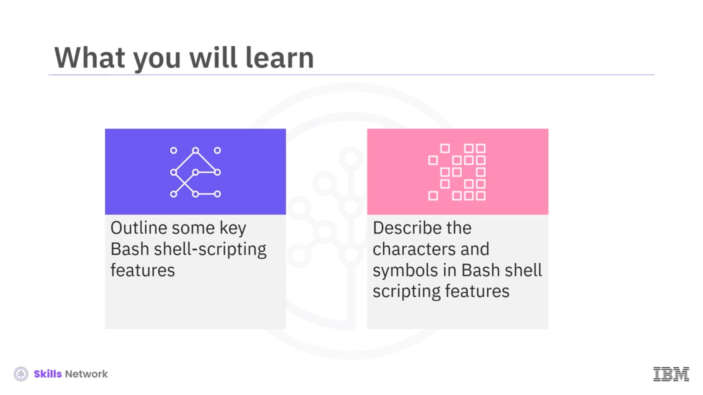
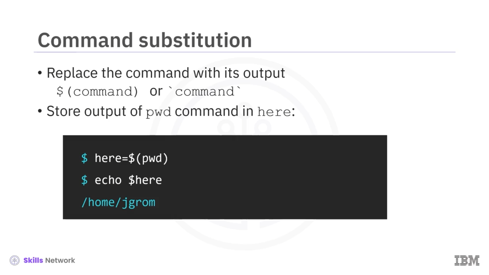

# 🐚 Bash Kabuklarının Faydalı Özellikleri

“Bash Kabuklarının Faydalı Özellikleri”ne hoş geldiniz.

Bu videoyu izledikten sonra şunları yapabileceksiniz:

* Bazı temel Bash kabuk betikleme özelliklerini özetlemek.
* Bash kabuk betikleme özelliklerindeki karakterler ve semboller hakkında bilgi edinmek.

---

## 🔣 Metakarakterler (Metacharacters)

 *Metakarakterler* , kabuk için özel bir anlama sahip olan özel karakterlerdir.

Pound sembolü `#`, kabuğun göz ardı ettiği yorumları eklemek için kullanılır. Örneğin, bu yorum herhangi bir çıktı döndürmez.

Noktalı virgül `;`, aynı satıra yazılan komutları birbirinden ayıran bir metakarakterdir. Örneğin, bu iki komut çıktıları iki ayrı satırda olacak şekilde şöyle döner.

Yıldız işareti `*`, bir dosya adı deseninde art arda gelen herhangi sayıda karakteri temsil eder. Örneğin, bu ifade, `/bin` dizinindeki adı `ba` ile başlayıp ardından herhangi karakterler gelen tüm nesneleri döndürür; bu durumda bu, `Bash`tir.

Soru işareti `?` ise yıldız metakarakterinin tek karakterlik bir sürümü gibi davranır. Örneğin, bu ifade `/bin` dizininde, soru işareti yerine tek bir karakter bulunan tüm nesneleri listeler; yani `bash` ve `dash` yollarını.

---

## 🧾 Tırnak Kullanımı ve Kaçış (Quoting)

*Tırnak kullanımı* (quoting), kabuğun özel karakterleri metakarakter olarak mı yorumlaması gerektiğini yoksa bunları “kaçırması” ( *escape etmesi* ) mi gerektiğini belirtir.

Ters eğik çizgi `\`, tek bir karakterin metakarakter olarak yorumlanmasını engellemek için kullanılabilir. Burada ters eğik çizgi, Bash'e dolar işaretini `$` varsayılan değişken adı olarak değil düz metin olarak yorumlamasını söyler; böylece çıktı tam olarak `'dollar one each'` olur.

Çift tırnaklar `" "` içindeki metni, içlerinde geçen metakarakterler hariç, olduğu gibi yorumlar; metakarakterler ise özel anlamlarına göre yorumlanır. Örneğin, öncesinde ters eğik çizgi olmadan yazılan `'dollar one'` ifadesi bir değişken olarak yorumlanır; burada gördüğümüz gibi bu değişken bu durumda boştur. Dikkat ederseniz, `each` kelimesinden önceki boşluğu yazdırmıştır.

Öte yandan tek tırnaklar `' '` içlerindeki tüm içeriğin harfiyen, yani düz metin olarak yorumlanması için kullanılır. Örneğin, bu ifade yukarıdaki ilk örnekle aynı sonucu döndürür.

---

## 📤📥 Girdi/Çıktı (I/O) Yönlendirmesi

Girdi/Çıktı, yani  *Input/Output (I/O) yönlendirmesi* , standart girdi (klavye) ya da standart çıktı (terminal) akışlarını yönlendirmek için kullanılan bir dizi özelliğe karşılık gelir.

`>` sembolü, bir komutun standart çıktısını bir dosyaya yönlendirmek için kullanılır. Dosya yoksa aynı zamanda dosyayı oluşturur, zaten varsa da içeriğinin üzerine yazar.

Üzerine yazmayı önlemek için, çıktıyı var olan içeriğin sonuna ekleyen çift büyüktür sembolünü `>>` kullanabilirsiniz.

`2>` birleşimi, bir hata iletisini bir dosyaya yönlendirir. Örneğin hata iletisini bir hata günlük dosyasına eklemek için, bir tane daha büyüktür işareti eklersiniz.

Ve son olarak, küçüktür işareti `<`, bir dosyanın içeriğini standart girdiye giriş olarak aktarmak için kullanılan bir yönlendirmedir.

---

## 🧪 I/O Yönlendirme Örnekleri

Şimdi birkaç örneğe bakalım.

Başlangıç olarak, aynı anda bir dosya oluşturup içine biraz metin yazarak başlayabilirsiniz, tıpkı burada olduğu gibi.

Daha sonra, içinde neler olduğunu görmek için dosyayı `cat` komutuyla görüntüleyebilirsiniz. Gördüğünüz gibi, `'line1'` metni `'eg.text'` dosyasına yazılmıştır.

Şimdi dosyaya başka bir satır eklemeyi deneyebilirsiniz. İçeriği tekrar görüntülediğinizde, dosyanın tam olarak eklediğiniz iki satırı içerdiğini görürsünüz.

`garbage` gibi bir sözcük girmek bir hata döndürür. Bu ifade hata iletisini yakalar ve `'err.txt'` dosyasına yönlendirir. Ve gerçekten de `'err.txt'` dosyasının içeriği beklediğiniz gibidir.

---

## 🔁 Komut Yer Değiştirme (Command Substitution)

Bir komutu çıktısıyla değiştirmek için *komut yer değiştirme*yi (command substitution) kullanabilirsiniz.

Eşdeğer iki gösterim vardır: İlkinde komut, önünde bir dolar işareti olacak şekilde parantez içine alınır; ikincisinde ise komut ters tırnaklar (backticks, backquotes) içine alınır.

Diyelim ki geçerli dizin yolunu `'here'` adlı bir değişkende saklamak istiyorsunuz. `pwd` (ya da  *present working directory* ) komutunun çıktısını yakalayıp `'here'` değişkenine atamak için komut yer değiştirmeyi kullanabilirsiniz.

Ve gerçekten de, değerini `echo` ile yazdırmak geçerli dizini döndürür.

---

## 📎 Komut Satırı Argümanları

 *Komut satırı argümanları* , komut satırında belirtilen bir program tarafından kullanılan argümanlardır.

Özellikle, bir kabuk betiğine, yani bir programa, argüman iletmenin bir yolunu sağlarlar.

Bir Bash betiği için komut satırı argümanları şu şekilde belirtilir: `'arg1'` ve `'arg2'` argümanları `'MyBashScript.sh'` betiğine geçirilir.

---

## ⚙️ Bash Çalışma Kipleri: Yığın ve Eşzamanlı

Bash'in iki temel çalışma kipi vardır:

 *Yığın (batch) kipi* , ki bu olağan kipdir, komutları sıralı olarak çalıştırır. Örneğin, noktalı virgül metakarakteriyle ayrılmış bu iki komut belirli bir sırayla yürütülür. İkinci komut ancak birinci komut tamamlandıktan sonra çalışır.

*Eşzamanlı (concurrent) kipte* komutlar paralel olarak çalışır. Birinci komuttan sonra gelen `&` operatörü, birinci komutun arka planda çalışmasını sağlar ve denetimi ön planda ikinci komuta devreder.

---

## ✅ Özet

Bu videoda şunları öğrendiniz:

* Metakarakterler, kabuk için anlama sahip özel karakterlerdir.
* Tırnak kullanımı, metakarakter anlamını yorumlamak veya kaçırmak için kullanılır.
* I/O yönlendirmesi, yönlendirme için kullanılan bir dizi özelliğe karşılık gelir.
* Komut yer değiştirme (command substitution), bir komutu çıktısıyla değiştirmek için kullanılır.
* Komut satırı argümanları, bir kabuk betiğine argüman geçirmek için kullanılır.
* Eşzamanlı kip (concurrent mode), komutların paralel olarak çalışmasına izin verir.

