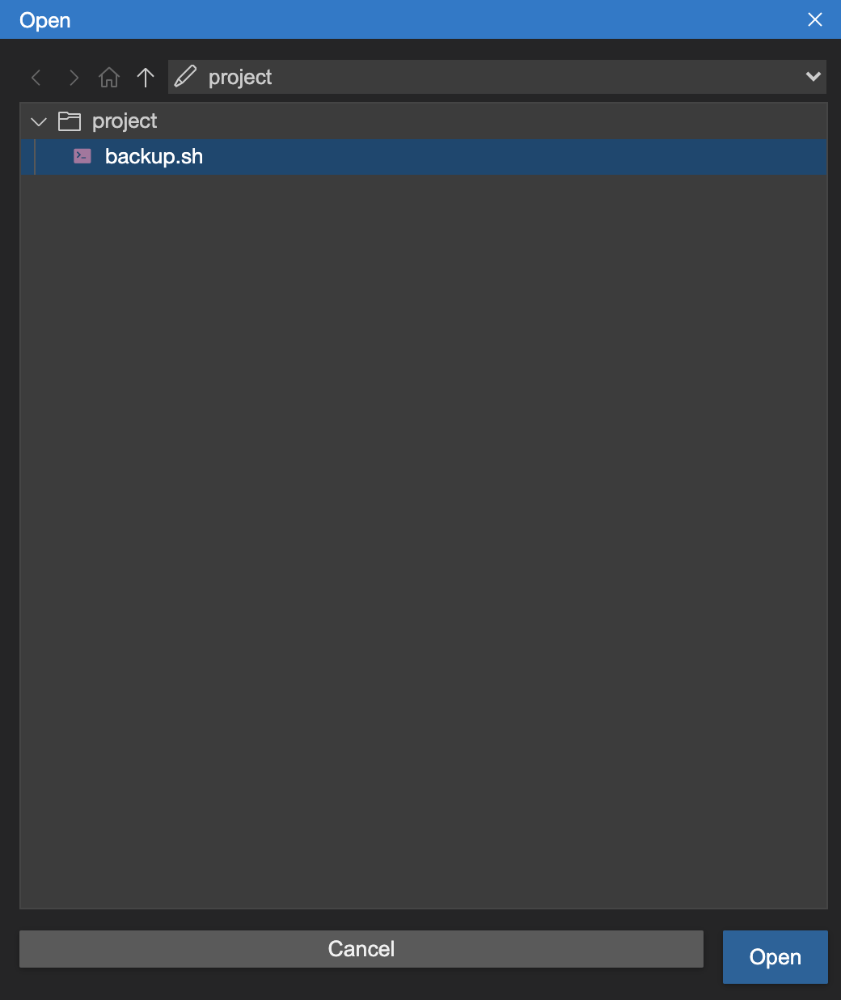

# 🚀 Linux Komutları ve Kabuk Betikleme - Final Proje

Tahmini gereken süre: 90 dakika

Final projenin uygulamalı laboratuvarına hoş geldin!

Bu senaryoda, üst düzey teknoloji şirketi ABC International Inc.’de baş Linux geliştiricisisin. ABC Inc.’in en güvenilir Linux geliştiricilerinden biri olarak, her gün çalışacak ve son 24 saat içinde güncellenmiş tüm şifrelenmiş parola dosyalarını otomatik olarak yedekleyecek `backup.sh` adlı bir betik oluşturma görevi sana verildi.

Lütfen aşağıdaki görevleri tamamla ve ilerledikçe yönergeleri takip ettiğinden emin ol. Çalışmanı kaydetmeyi unutma.

---

## 🧰 Başlarken

### ✅ Görev 0

1. Menü çubuğundan  **Terminal -> New Terminal** ’ı seçerek yeni bir terminal aç:

2. Şablon dosyası `backup.sh`’yi indirmek için aşağıdaki komutu çalıştır:

```bash

wget https://cf-courses-data.s3.us.cloud-object-storage.appdomain.cloud/pWN3kO2yWEuKMvYJdcLPQg/backup.sh
```


3. Dosyayı, aşağıda gösterildiği gibi  **File -> Open** ’a tıklayarak IDE’de aç:




---

### 🧰 Başlarken (Tekrar)

### ✅ Görev 0

Menü çubuğundan  **Terminal -> New Terminal** ’ı seçerek yeni bir terminal aç:

Şablon dosyası `backup.sh`’yi indirmek için aşağıdaki komutu çalıştır:

```bash
1
wget https://cf-courses-data.s3.us.cloud-object-storage.appdomain.cloud/pWN3kO2yWEuKMvYJdcLPQg/backup.sh
```

Dosyayı, aşağıda görüldüğü gibi  **File -> Open** ’a tıklayarak IDE’de aç:


---

## 📄 Şablon betik backup.sh hakkında

Şablon betiğin, `#` sembolü ile başlayan açıklama satırları içerdiğini fark edeceksin. Bunları silme.

`# [TASK {number}]` şeklinde görünenler değerlendiricin tarafından kullanılacaktır:


Ayrıca, betikte `# [TASK 1]` satırının üzerindeki mevcut kodu lütfen değiştirme.

---

## 💾 İlerlemeni Kaydetme

Oturumdan çıkarsan çalışman kaydedilmeyecek.

İlerlemeni kaydetmek için:

Geçerli çalışma dosyasını (`backup.sh`) **CTRL+s** [Windows/Linux], **CMD+s** [MAC] ile ya da aşağıda görüldüğü gibi **File -> Save** yoluyla kaydet:


Ne yazık ki, düzenleyicimiz şu anda dosya yüklemeyi desteklemiyor; bu yüzden çalışmanı aşağıdaki şekilde kopyalayıp yapıştırman gerekiyor:

İlerleme halindeki `backup.sh` dosyanı “yüklemek” ve üzerinde çalışmaya devam etmek için:

* Bir terminal aç ve `touch backup.sh` yaz
* Boş `backup.sh` dosyasını editörde aç
* Yerel olarak kaydettiğin `backup.sh` dosyasının içeriğini kopyalayıp editördeki boş `backup.sh` dosyasına yapıştır

---

## 🧱 Görevler

### ✅ Görev 1

Koddaki `# [TASK 1]` satırına git.

İki değişkeni, birinci ve ikinci komut satırı argümanlarının değerlerine eşitle:

* `targetDirectory` değişkenini, birinci komut satırı argümanına eşitle
* `destinationDirectory` değişkenini, ikinci komut satırı argümanına eşitle

Bu görev, kodun okunabilirliğini artırmaya yöneliktir.

**İpucu için buraya tıkla**

Betik tarafından yorumlanan komut satırı argümanlarına `$1` (birinci argüman) ve `$2` (ikinci argüman) ile erişebilirsin.

Yukarıdaki kodun ekran görüntüsünü al ve **01-Set_Variables.jpg** veya `.png` olarak kaydet.

---

### ✅ Görev 2

İki komut satırı argümanının değerlerini terminalde görüntüle.

**İpucu için buraya tıkla**

`echo` komutunu bir yazdırma komutu olarak kullanabileceğini unutma.

Örnek:

```bash
echo "The year is $year"
```

Yukarıdaki kodun ekran görüntüsünü al ve **02-Display_Values.jpg** veya `.png` olarak kaydet.

---

### ✅ Görev 3

Saniye cinsinden geçerli zaman damgasını ( *timestamp* ) ifade eden `currentTS` adlı bir değişken tanımla.

**İpucu için buraya tıkla**

`date` komutunun çıktı formatını özelleştirebileceğini unutma.

Bir değişkeni bir komutun çıktısına eşitlemek için komut ikamesi ( *command substitution* ) kullanabilirsin: `$()` veya

Örneğin:

```bash
currentYear=$(date +%Y)
```

Yukarıdaki kodun ekran görüntüsünü al ve **03-CurrentTS.jpg** veya `.png` olarak kaydet.

---

### ✅ Görev 4

Betik tarafından oluşturulacak arşivlenmiş ve sıkıştırılmış yedek dosyanın adını saklamak için `backupFileName` adlı bir değişken tanımla.

`backupFileName` değişkeninin değeri `"backup-[$currentTS].tar.gz"` olmalıdır.

Örneğin, `currentTS` değeri `1634571345` ise, `backupFileName` değeri `backup-1634571345.tar.gz` olmalıdır.

Yukarıdaki kodun ekran görüntüsünü al ve **04-Set_Value.jpg** veya `.png` olarak kaydet.

---

### ✅ Görev 5

Geçerli dizinin mutlak yolunu değer olarak alan `origAbsPath` adlı bir değişken tanımla.

**İpucu için buraya tıkla**

Geçerli dizinin mutlak yolunu `pwd` komutunu kullanarak elde edebilirsin.

Yukarıdaki kodun ekran görüntüsünü al ve **05-Define_Variable.jpg** veya `.png` olarak kaydet.

---

### ✅ Görev 6

Değeri, hedef dizinin (destination directory) mutlak yoluna eşit olacak `destAbsPath` adlı bir değişken tanımla.

**İpucu için buraya tıkla**

Önce `cd` komutuyla `destinationDirectory`’ye git, sonra Görev 5’te kullandığın yöntemi kullan.

Not: `cd "destinationDirectory" || exit` ifadesini de kullanabileceğini lütfen unutma; bu, belirtilen dizin yanlış ya da erişilemez ise betiğin bu adımda derhal sona ermesini sağlar. Bu, devam etmeden önce doğru dizinin sağlandığını doğrulayan dolaylı bir doğrulama kontrolü görevi görür. Görev 7 için de aynı yaklaşımı uygula.

Yukarıdaki kodun ekran görüntüsünü al ve **06-Define_Variable.jpg** veya `.png` olarak kaydet.

---

### ☑️ Kontrol Noktası


Çalışmanı yerel bilgisayarına kaydetmen için dostça bir hatırlatma!

---

### ✅ Görev 7

Geçerli çalışma dizininden, hedef dizine (`targetDirectory`) dizin değiştir.

**İpucu için buraya tıkla**

Önce `origAbsPath` dizinine `cd` ile git, ardından `targetDirectory`’ye `cd` ile geç.

Yukarıdaki kodun ekran görüntüsünü al ve **07-Change_Directory.jpg** veya `.png` olarak kaydet.

---

### ✅ Görev 8

Son 24 saat içinde güncellenmiş dosyaları bulman gerekiyor. Bu, son değiştirilme tarihi 24 saat önce veya daha yeni olan tüm dosyaları bulman gerektiği anlamına gelir.

Bunu kolaylaştırmak için:

`yesterdayTS` adlı sayısal bir değişken tanımla; bu değişkenin değeri, geçerli zaman damgasından (`currentTS`) 24 saat önceki zaman damgası (saniye cinsinden) olmalıdır.

**İpucu için buraya tıkla**

Aritmetiği `$(( ))` kullanarak yapabilirsin, örneğin:

```bash
zero=$((3 * 5 - 6 - 9))
```

Dolayısıyla, 24 saat sonrasının zaman damgasını saniye cinsinden almak için şunu kullanırsın:

```bash
tomorrowTS=$(($currentTS + 24 * 60 * 60))
```

Yukarıdaki kodun ekran görüntüsünü al ve **08-YesterdayTS.jpg** veya `.png` olarak kaydet.

---

## 🧮 Diziler Hakkında Not

Betikte şu satırı göreceksin:

```bash
1
declare -a toBackup
```


Bu satır, bir dizi olan `toBackup` adlı bir değişken tanımlar. Bir dizi, bir değer listesini içerir ve dizilere öğe eklemek için aşağıdaki sözdizimini kullanabilirsin:

```bash
1
myArray+=($myVariable)
```

Kopyalandı!

Wrap Toggled!

Bir diziyi yazdırdığında veya echo ile gösterdiğinde, dizinin string gösterimini, yani değerlerin boşluklarla ayrılmış hâlini görürsün:

```bash
$ declare -a myArray
$ myArray+=("Linux")
$ myArray+=("is")
$ myArray+=("cool!")
$ echo ${myArray[@]}
Linux is cool!
```


Bu, daha sonra `tar` komutuna, yedeklenmesi gereken tüm dosyaların adlarını içeren `$toBackup` dizisini verdiğinde kullanışlı olacaktır. Bu sayede tüm dosyalar tek seferde arşivlenecektir!

---

### ✅ Görev 9

`for` döngüsünde, geçerli klasördeki tüm dosya ve dizinler üzerinde gezinmek için *wildcard* kullan.

**İpucu için buraya tıkla**

Yıldız `*`, geçerli çalışma dizinindeki tüm dosya ve dizinlerle eşleşen bir  *wildcard* ’dır.

Yukarıdaki kodun ekran görüntüsünü al ve **09-List_AllFilesandDirectoriess.jpg** veya `.png` olarak kaydet.

---

### ✅ Görev 10

`for` döngüsünün içinde, `$file` dosyasının son 24 saat içinde değiştirilip değiştirilmediğini kontrol etmek istiyorsun.

Bir dosyanın son değiştirilme tarihini saniye cinsinden almak için `date -r $file +%s` komutunu kullan, ardından bu değeri `yesterdayTS` ile karşılaştır.

`if [[ $file_last_modified_date -gt $yesterdayTS ]]` ise, dosya son 24 saat içinde güncellenmiş demektir!

Bunun çoğu derste ele alınmadığından, bu görev için aşağıdaki kodu kopyalayıp çift köşeli parantezlerin (`[[]]`) içine yapıştırabilirsin:

```bash
1
`date -r $file +%s` -gt $yesterdayTS
```

Kopyalandı!

Wrap Toggled!

Yukarıdaki kodun ekran görüntüsünü al ve **10-IF_Statement.jpg** veya `.png` olarak kaydet.

---

### ✅ Görev 11

`if-then` ifadesi içinde, son 24 saat içinde güncellenmiş `$file` dosyasını `toBackup` dizisine ekle.

Bunun çoğu derste ele alınmadığından, bu görev için aşağıdaki kodu kopyalayıp `then` ifadesinden sonra yerleştirebilirsin:

```bash
1
toBackup+=($file)
```


Yukarıdaki kodun ekran görüntüsünü al ve **11-Add_File.jpg** veya `.png` olarak kaydet.

---

### ☑️ Kontrol Noktası


Çalışmanı yerel bilgisayarına kaydetmen için dostça bir hatırlatma!

---

### ✅ Görev 12

`for` döngüsünden sonra, dosyaları, dosya adlarını içeren `$toBackup` dizisini kullanarak, `backupFileName` adındaki bir dosyaya sıkıştır ve arşivle.

**İpucu için buraya tıkla**

Şunu kullan:

```bash
tar -czvf $backupFileName ${toBackup[@]}
```

Yukarıdaki kodun ekran görüntüsünü al ve **12-Create_Backup.jpg** veya `.png` olarak kaydet.

---

### ✅ Görev 13

Artık `$backupFileName` dosyası, geçerli çalışma dizininde oluşturulmuştur.

**İpucu için buraya tıkla**

`backupFileName` dosyasını, `destAbsPath` konumundaki hedef dizine taşı.

Yukarıdaki kodun ekran görüntüsünü al ve **13-Move_Backup.jpg** veya `.png` olarak kaydet.

Tebrikler! Artık laboratuvarın kodlama kısmını tamamladın!

---

## 💾 Gönderim Hazırlığı

### ✅ Görev 14

1. Geçerli çalışma dosyası `backup.sh`’yi **CTRL+s** [Windows/Linux], **CMD+s** [MAC] ile ya da aşağıda görüldüğü gibi **File -> Save** yoluyla kaydet:


2. Dosyayı yerel bilgisayarına indirmek için aşağıda görüldüğü gibi **File -> Download** yolunu kullan:


Bu dosyayı daha sonra akran değerlendirmesi için göndereceksin.

---

### ✅ Görev 15

1. Menü çubuğundan  **Terminal -> New Terminal** ’ı seçerek yeni bir terminal aç; aşağıdaki görselde olduğu gibi:

Bu, ekranın alt kısmında yeni bir terminal açacaktır, aşağıda görüldüğü gibi:


Üzerinde çalıştığın `backup.sh` dosyasını kaydet ve çalıştırılabilir yap.

**İpucu için buraya tıkla**

Doğru seçeneklerle `chmod` komutunu kullan.

Dosyanın çalıştırılabilir olduğunu `ls` komutunun `-l` seçeneği ile doğrula:

```bash
1
ls -l backup.sh
```


Yukarıdaki komutun çıktısının ekran görüntüsünü al ve **15-executable.jpg** veya `.png` olarak kaydet.

---

### ✅ Görev 16

Aşağıdaki `.zip` dosyasını `wget` komutuyla indir:

```bash
1
wget https://cf-courses-data.s3.us.cloud-object-storage.appdomain.cloud/IBM-LX0117EN-SkillsNetwork/labs/Final%20Project/important-documents.zip
```


Arşiv dosyasını aç:

```bash
1
unzip -DDo important-documents.zip
```

p Toggled!

Not: `-DDo`, orijinal değiştirilme tarihini geri yüklemeden üzerine yazarak açar.

Dosyanın son değiştirilme tarihini şimdiki zamana güncelle:

```bash
1
touch important-documents/*
```


Betini aşağıdaki komutla test et:

```bash
1
./backup.sh important-documents .
```


Bu, geçerli dizininde `backup-[CURRENT_TIMESTAMP].tar.gz` adında bir dosya oluşturmuş olmalıdır.

`ls -l` komutunun çıktısının ekran görüntüsünü al ve **16-backup-complete.jpg** veya `.png` olarak kaydet.

---

### ✅ Görev 17

`backup.sh` betiğini `/usr/local/bin/` dizinine kopyala. ( **mv kullanma.** )

Not: `/usr/local/bin/` dizininde dosya oluşturmak için `sudo cp` kullanman gerekebilir.

Cronjob’un çalışıp betiği tetikleyip tetiklemediğini test etmek için betiği her 1 dakikada bir çalışacak şekilde zamanla.

**İpucu için buraya tıkla**

```bash
1
*/1 * * * * /usr/local/bin/backup.sh /home/project/important-documents /home/project
```


Theia Lab sanal bir ortam olduğundan, cron servisini aşağıdaki komutla açıkça başlatmamız gerekir:

```bash
1
sudo service cron start
```


Cron servisi başlatıldıktan sonra, `/home/project` dizininde `.tar` dosyalarının oluşturulup oluşturulmadığını kontrol et.

Eğer oluşturuluyorlarsa, aşağıdaki komutu kullanarak cron servisini durdur; aksi halde her dakika `.tar` dosyaları oluşturmaya devam edecektir:

```bash
1
sudo service cron stop
```


`crontab` kullanarak, `/usr/local/bin/backup.sh` betiğini `important-documents` klasörünü her 24 saatte bir `/home/project` dizinine yedekleyecek şekilde zamanla.

`crontab -l` çıktısının ekran görüntüsünü al ve **17-crontab.jpg** veya `.png` olarak kaydet.

İpucu: Gerçek bir senaryoda cron işlerini ayarlarken, cron servisinin çalıştığından emin ol veya gerekirse cron servisini başlat.

---

## 🎉 Tebrikler!

Bu ders için son laboratuvarı tamamladın! Aferin!
