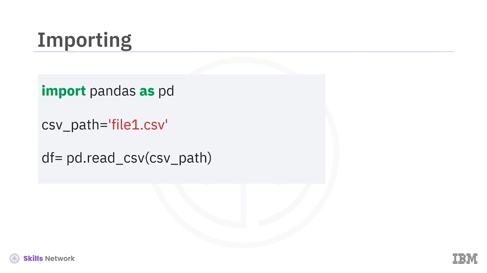
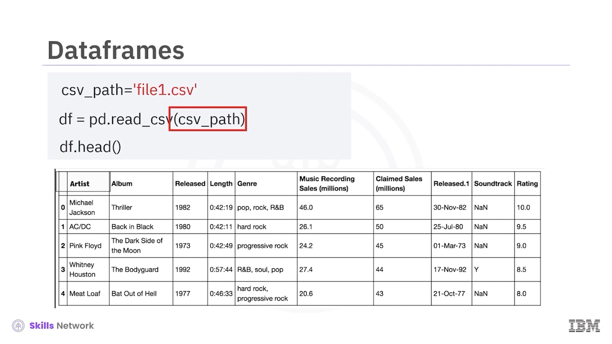
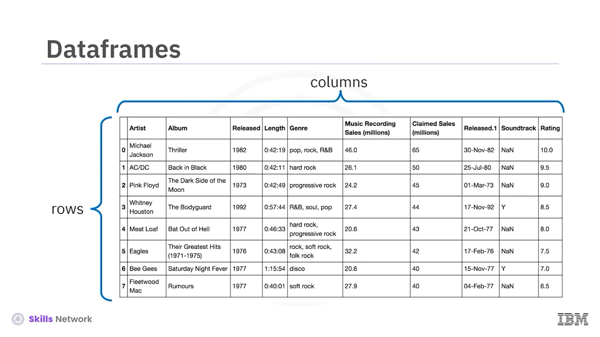

# 📥 Veriyi Yükleme

## 📚 Bağımlılıklar ve Kütüphaneler

Bağımlılıklar ( *dependencies* ) veya kütüphaneler ( *libraries* ), problemleri çözmeye yardımcı olan, önceden yazılmış kodlardır.

Bu videoda, veri analizi için popüler bir kütüphane olan  **Pandas** ’ı tanıtacağız.

Pandas gibi bir kütüphaneyi veya bağımlılığı, aşağıdaki komutu kullanarak içe aktarabilirsiniz.

`import` komutu ile başlayıp ardından kütüphanenin adını yazarsınız.

Artık çok sayıda önceden oluşturulmuş sınıfa ( *classes* ) ve fonksiyona erişiminiz olur.

Bu, kütüphanenin kurulu olduğunu varsayar.

Laboratuvar ortamımızda gerekli tüm kütüphaneler kuruludur.

---

## 🐼 Pandas ile CSV Dosyası Yükleme

Diyelim ki bir **csv** dosyasını, pandas’ın yerleşik ( *built-in* ) fonksiyonu `readcsv` ile yüklemek istiyoruz.

Bir  **csv** , veri depolamak için kullanılan tipik bir dosya türüdür.

Sadece `Pandas` kelimesini, ardından bir nokta ve tüm girdileriyle birlikte fonksiyonun adını yazmanız yeterlidir.

---

### 🔤 Kütüphane Adını Kısaltma (`as` İfadesi)

`pandas` kelimesini her seferinde yazmak zor olabilir, bu yüzden kütüphanenin adını kısaltmak için `as` ifadesini kullanabilirsiniz.

Bu durumda, standart kısaltma olan `pd` kullanılır.

Şimdi `pd` yazın. Sonra bir nokta yazıp, kullanmak istediğiniz fonksiyonun adını ekleyin.

Bu durumda, `readcsv`.

Sadece `pd` kısaltmasıyla sınırlı değilsiniz.

Bu örnekte, `banana` terimini kullanıyoruz.

Ancak, bu videonun geri kalanında `pd` kullanmaya devam edeceğiz.

---

## 🧱 CSV’den DataFrame’e

Bu kodu biraz daha ayrıntılı inceleyelim.

Pandas’ın veriyle çalışmanıza izin verdiği yollardan biri, bir `DataFrame` kullanmaktır.

Bir **csv** dosyasından bir `DataFrame` elde etme sürecini gözden geçirelim.

Bu değişken, csv dosyasının yolunu saklar.

Bu yol, `readCSV` fonksiyonuna argüman olarak kullanılır.

Sonuç, `df` değişkenine kaydedilir.

Bu, `DataFrame`’in kısaltmasıdır.

Artık veriler bir `DataFrame` içinde olduğuna göre, onunla çalışabilirsiniz.

Bir `DataFrame`’in ilk beş satırını incelemek için `head` yöntemini kullanabilirsiniz.

---

### 📑 Excel Dosyası Yükleme

Bir Excel dosyasını yükleme süreci benzerdir.

Excel dosyasının yolunu ve `readexcel` fonksiyonunu kullanın.

Sonuç, bir `DataFrame` olur.

---

## 📊 DataFrame’ler ve Sözlüklerden Oluşturma

Bir `DataFrame`, satırlardan ve sütunlardan oluşur.

Bir sözlükten ( *dictionary* ) bir `DataFrame` oluşturabilirsiniz.

Anahtarlar ( *keys* ), sütun etiketlerine karşılık gelir.

Değerler ( *values* ), satırlara karşılık gelen listelerdir.

Daha sonra sözlüğü, `DataFrame` fonksiyonunu kullanarak bir `DataFrame`’e dönüştürebilirsiniz (*cast* edebilirsiniz).

Tablo ile olan doğrudan ilişkiye dikkat edin.

Anahtarlar, tablo başlıklarına karşılık gelir.

Değerler ise satırlara karşılık gelen listelerdir.

---

## 🎯 Sütun Seçimi ile Yeni DataFrame Oluşturma

Yalnızca bir sütundan oluşan yeni bir `DataFrame` oluşturmak için, `DataFrame` adını (bu örnekte `df`) ve sütun başlığının adını çift köşeli parantez içine alın.

Sonuç, özgün sütundan oluşan yeni bir `DataFrame` olur.

Aynı işlemi birden fazla sütun için de yapabilirsiniz.

`DataFrame` adını (bu örnekte `df`) ve birden fazla sütun başlığının adını çift köşeli parantez içine alın.

Sonuç, belirtilen sütunlardan oluşan yeni bir `DataFrame` olur.

---

## 🔎 `iloc` ve `loc` ile Elemanlara Erişim

### 🔢 Sayısal İndekslerle `iloc` Kullanımı

Tekil öğelere erişmenin bir yolu, `iloc` yöntemini kullanmaktır.

İlk girdi, satır indeksini temsil eden bir tam sayıdır; ikincisi ise sütun indeksini temsil eden bir tam sayıdır.

Birinci satır ve birinci sütuna aşağıdaki şekilde erişebilirsiniz.

İkinci satır ve birinci sütuna aşağıdaki şekilde erişebilirsiniz.

Birinci satır, üçüncü sütuna aşağıdaki şekilde erişebilirsiniz ve ikinci satır, üçüncü sütuna da yine aşağıdaki şekilde erişebilirsiniz.

Satır indeksinin ve sütunun adını da kullanabilirsiniz.

`Artist` adlı sütunun birinci satırına aşağıdaki şekilde erişebilirsiniz.

Benzer şekilde, `Artist` adlı sütunun ikinci satırına erişebilirsiniz.

Aynı işlemi `Released` adlı sütun için de yapabilirsiniz.

---

### 🔠 Etiketlerle `loc` Kullanımı

İndeks bir tam sayı değilse, `loc` da kullanılabilir.

`df_new` adlı yeni bir `DataFrame` oluştururuz.

1, 2, 3 ve benzeri indeksleri `A`, `B`, `C` ile değiştiririz.

`A` indeksine, yani `Artist` adlı sütunun birinci satırına aşağıdaki şekilde erişebilirsiniz.

Benzer şekilde, `B` indeksine, yani `Artist` adlı sütunun ikinci satırına erişebilirsiniz.

Aynı işlemi `Released` adlı sütun için de yapabilirsiniz.

---

## ✂️ DataFrame Dilimleme ve Yeni DataFrame Oluşturma

`DataFrame`’leri dilimleyebilir ( *slice* ) ve değerleri yeni bir `DataFrame`’e atayabilirsiniz.

İlk iki satırı ve ilk üç sütunu `Z` değişkenine atayın.

Sonuç, seçilen satır ve sütunlardan oluşan bir `DataFrame` olur.

`loc` kullanarak da `DataFrame`’leri dilimleyebilir ve değerleri yeni bir `DataFrame`’e atayabilirsiniz.

Kod, ilk iki satırı ve `Artist` ile `Released` adlı sütunlar arasında kalan tüm sütunları atar.

Sonuç, ilgili değerlere sahip yeni bir `Z` `DataFrame`’idir.

---

## 🧪 Daha Fazla Örnek

Daha fazla örnek için laboratuvarlara ( *labs* ) göz atın.
