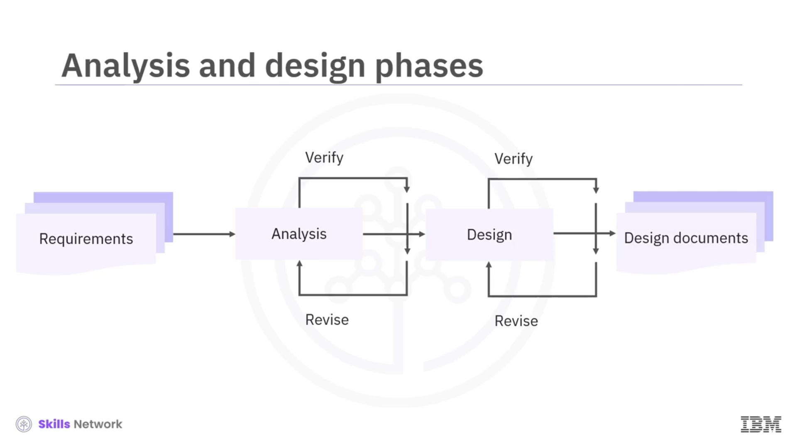
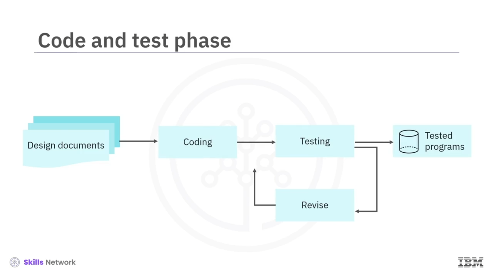

# 🔄 Uygulama Geliştirme Yaşam Döngüsü

## 🎬 Videoya Giriş

“Uygulama Geliştirme Yaşam Döngüsü”ne hoş geldiniz.

Bu videoyu izledikten sonra şunları yapabileceksiniz:

* Uygulama geliştirme yaşam döngüsündeki adımları listelemek
* Uygulama geliştirme yaşam döngüsünün farklı aşamalarını açıklamak
* Uygulama kodlarını birden fazla dosyada yazmanın önemini fark etmek

Hayal edin: Bir müşteri sizden, çalışanlarının günlük görevlerini takip etmelerine yardımcı olacak bir uygulama geliştirmenizi istiyor.

Şimdi de, bir müşterinin sizden otel rezervasyonlarını baştan müşteri çıkışına kadar yönetmek için bir web uygulaması geliştirmenizi istediği bir senaryoyu düşünün.

Her iki senaryoda da, müşteri istekte bulunur bulunmaz uygulamayı geliştirmeye başlayabilir misiniz?

Pek sayılmaz!

Uygulama kullanıcılar için hazır olmadan önce, gereksinimleri analiz etmek, planlama yapmak ve kod yazmak gibi belirli faaliyetleri gerçekleştirmeniz gerekir.

---

## 🧭 Uygulama Geliştirme Yaşam Döngüsüne Genel Bakış

Uygulama türünden bağımsız olarak, her uygulama “uygulama geliştirme yaşam döngüsü” adı verilen farklı aşamalardan geçer.

Uygulama geliştirme yaşam döngüsünü yedi aşamaya ayırabilirsiniz:

1. Gereksinim toplama ( *requirement gathering* )
2. Analiz ( *analysis* )
3. Tasarım ( *design* )
4. Kod ve test ( *code and test* )
5. Kullanıcı ve sistem testi ( *user and system test* )
6. Canlıya alma / üretim ( *production* )
7. Bakım ( *maintenance* )

Şimdi, uygulama geliştirmenin her bir aşamasını detaylı olarak inceleyelim.

---

## 📋 Gereksinim Toplama Aşaması

Gereksinim toplama, uygulama geliştirme sürecindeki ilk aşamadır.

Bu aşamada, uygulamanın tüm boyutları için gereksinimleri toplarsınız; buna kullanıcı gereksinimleri, iş gereksinimleri ve teknik gereksinimler dahildir.

Otel rezervasyon uygulamasını ele alalım.

Bu uygulama için bir  **kullanıcı gereksinimi** , kullanıcıların farklı odaları ve mevcut imkânları görüntüleyebilmesi olabilir.

Farklı odalar ve imkânlar için doğru ücreti belirlemek ise bir **iş gereksinimi** olabilir.

Bir  **teknik gereksinim** , uygulamanın tüm tarayıcılarda ve mobil cihazlarda çalışması gerektiği olabilir.

Amaç, gereksiz veya önemsiz görünse bile mümkün olduğunca fazla gereksinimi toplamaktır.

Ayrıca tasarımın kısıtlarını ve iş modelinin uygulanabilirliğine dair sınırlamaları da belirlemeniz gerekir.

Örneğin, otel rezervasyon uygulaması için, sunucunun oda uygunluk durumunu her zaman güncel tutması gerektiği bir kısıt vardır ve bunun belirli bir maliyeti bulunur.

Bu nedenle, işin sürdürülebilirliğini sağlamak için, nihai ödemeye küçük bir kolaylık ücreti eklenir.

---

## 🧠 Analiz ve Tasarım Aşamaları

Gereksinimleri ve kısıtları topladıktan sonra, uygulamanın tasarımı için olası bir çözüm oluşturmak amacıyla her birini analiz etmeniz gerekir.

Analiz ve tasarım sırasında, belirtilen tüm gereksinimleri karşılayan örnek bir çözüm oluşturmak için birden fazla doğrulama ve revizyon turu olabilir.

Uygulama geliştirmenin analiz ve tasarım aşamaları boyunca, tüm tasarım güncellemelerinin kayıt altına alındığı düzgün bir dokümantasyon tutmanız gerekir.

Bu dokümantasyon açık ve öz olmalı ve kod ve test aşaması sırasında kullanılacaktır.

Son olarak önerilen tasarım ve belirtilen gereksinimler, kod ve test aşamasına iletilir.

---

## 💻 Kod ve Test Aşaması

Kod ve test aşamasında, ekip tasarım dokümantasyonunda belirtilen programlama gereksinimlerini kullanarak uygulama programlarını yazar, test eder, gözden geçirir ve kod, belgelenmiş tüm gereksinimleri karşılayana kadar yeniden test eder.

Test aşamasını inceleyelim.

Birim kodu için yürüttüğünüz testlere **birim testi** ( *unit testing* ) denir.

Birim testini, tüm gerekli gereksinimleri karşıladığınızdan emin olmak için programlama seviyesinde gerçekleştirin.

Birim testinden sonra, kabul edilebilir bir uygulama sürümü oluşturabilirsiniz.

Uygulamanın yeni sürümü daha sonra bir dizi kullanıcı ve sistem düzeyi testten geçirilir.

---

## 🧪 Kullanıcı ve Sistem Düzeyi Testler

 **Kullanıcı testleri** , işlevselliği bir kullanıcının bakış açısından doğrular.

Buna ek olarak, entegrasyon testi ( *integration testing* ) ve performans testi ( *performance testing* ) dâhil olmak üzere birçok sistem düzeyi test gerçekleştirmeniz gerekir.

 **Entegrasyon testleri** , tüm ilgili programların entegrasyondan sonra beklenildiği gibi çalışmaya devam ettiğini doğrular.

Entegrasyon testi, uygulamanın daha büyük bir yapı içinde çalıştığını da doğrular.

 **Performans testi** , değişen iş yüklerine göre uygulamanın hızını, ölçeklenebilirliğini ve kararlılığını değerlendirmeye yardımcı olur.

Testlerden sonra yeni bir uygulama sürümü oluşturabilir ve bunu canlı ortama ( *production* ) gönderebilirsiniz.

---

## 🚀 Üretim (Production) Aşaması

Uygulama canlıya alındıktan sonra, son kullanıcılar uygulamaya erişebilir ve onu kullanabilir.

Uygulamanın doğru bir şekilde çalıştığından ve kullanıcılara erişilebilir olduğundan emin olmanız gerekir.

Uygulama üretim ( *production* ) aşamasındayken, kararlı bir durumda ( *steady state* ) kalmalıdır.

Kararlı bir durumda, uygulamada herhangi bir değişiklik yapmamalısınız.

Ancak bu her zaman mümkün değildir.

Örneğin, bir hata durumunda uygulamada değişiklik yapmanız gerekebilir.

Bu değişiklikler, canlı ortama uygulanmadan önce sıkı şekilde kontrol edilir ve yoğun bir şekilde test edilir.

---

## 🔧 Bakım (Maintenance) Aşaması

Uygulama geliştirme yaşam döngüsündeki son aşama **bakım**dır.

Uygulamanın bir yükseltmeye ihtiyaç duyması veya yeni özellikler eklemeniz gerekmesi mümkündür.

Bu durumda, yeni özellikler, canlı ortama dağıtılmış uygulama sürümüne entegre edilmeden önce, önceki tüm aşamalardan geçmelidir.

---

## 🗂 Çoklu Dosya Kullanımı ve En İyi Uygulama

Farklı işlevsellikler için birden fazla dosya tutmanın neden en iyi uygulama ( *best practice* ) olduğuna kısaca bakalım.

Her uygulamada genellikle birden fazla işlevsellik bulunur ve her bir işlevsellik için gereksinimler farklılık gösterebilir.

En iyi uygulama, her işlevselliği ayrı bir dosyada kodlamaktır.

Daha sonra, uygulamayı çalıştıran ve belirli işlevleri gerçekleştirmek için tek tek dosyaları çağıran merkezi bir program oluşturabilirsiniz.

Kodu bu şekilde düzenlemek, kod bakımını verimli ve kolay hâle getirir.

Birden fazla dosyaya sahip olmak, mevcut bir uygulamaya yeni bir işlevsellik eklemeniz gerektiğinde de yardımcı olur.

Yeni işlevsellik için kodu ayrı bir dosyada yazdığınızda, yalnızca bu dosya, çalışan uygulamaya entegre edilmeden önce tüm tasarım ve doğrulama sürecinden geçer.

---

## 📚 Videonun Özeti

Bu videoda şunları öğrendiniz:

* Uygulama geliştirme yaşam döngüsünün yedi aşaması vardır; bunlar şunlardır:
  * **Gereksinim toplama** : Uygulama için kullanıcı, iş ve teknik gereksinimleri topladığınız aşama
  * **Analiz** : Toplanan gereksinimleri analiz ettiğiniz aşama
  * **Tasarım** : Tam çözümü tasarladığınız aşama
  * **Kod ve test** : Uygulamanın farklı bileşenlerini geliştirdiğiniz ve test ettiğiniz aşama
  * **Kullanıcı ve sistem testi** : Kullanıcıların uygulamayı kullanılabilirlik açısından test ettiği ve sizin de sistem entegrasyon testi ile performans testlerini gerçekleştirdiğiniz aşama
  * **Üretim (production)** : Uygulamanın tüm son kullanıcılara açık olduğu aşama
  * **Bakım** : Kullanıcı veya sistemle ilgili sorunları giderdiğiniz veya uygulamayı yükselttiğiniz aşama
* Verimli kodlama için, farklı eylemleri gerçekleştiren tek tek dosyaları ve fonksiyonları çağırmak üzere her zaman merkezi bir program kullanın.

