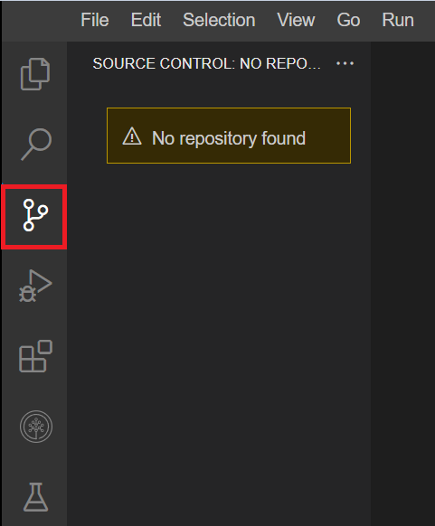

# 🧪 IDE ile Çalışmaya Başlama: Uygulamalı Lab

## 🧰 Lab Hakkında

Bu labde, Birleşik Geliştirme Ortamı ( *Integrated Development Environment – IDE* ) kullanmaya aşina olacaksınız.

Kullanacağınız IDE, **Theia** adlı açık kaynaklı bir projeye dayanan  **Skills Network Cloud IDE** ’dir. Bu IDE, popüler **Visual Studio (VS) Code** IDE’sine benzer.

Bu labde, IDE’yi keşfedecek ve onu basit bir Python programı oluşturmak ve çalıştırmak için kullanacaksınız.

Bir kütüphane yükleyecek, bir kod dosyası oluşturacak, dosyayı kaydedecek ve değişiklik yapmak için düzenleyeceksiniz.

---

## 🎯 Hedefler

* IDE arayüzünü keşfetmek.
* Terminali kullanarak bir paket yüklemek.
* IDE kullanarak basit bir Python programı oluşturmak.
* Programı çalıştırmak.
* Kaynak kodu düzenlemek ve programı yeniden çalıştırmak.


# 🧪 Lab Ortamı Hakkında

## 🧱 Skills Network Lab Ortamının İki Bileşeni

* Bu labı tamamlamak için izleyeceğiniz talimatlar, ekranın sol tarafında görüntülenir.
* Ekranın sağ tarafındaki alan ise, menüleri, terminalleri ve araçları kullanarak kodunuzu geliştireceğiniz asıl IDE’dir.


# 🧪 Alıştırma 1: IDE Arayüzünü Keşfetme

## 🔍 Menüleri, Terminalleri ve Araçları Keşfetme

Şimdi IDE arayüzünü keşfedelim.

Aşağıdaki ekran görüntülerinde kırmızı kutularla vurgulanan her bir simgeye ve menü öğesine tıklayarak, amaçlarına aşina olun.


---

### 1️⃣ Explorer Menüsü

**Explorer** menüsünde:

* Oluşturduğunuz veya klonladığınız klasörleri
* Dosyaları
* Yüklenmiş ön koşulları ( *pre-requisites* )

bulacaksınız.


---

### 2️⃣ Search Menüsü

**Search** menüsünde, oluşturulmuş veya klonlanmış belirli klasörleri ya da dosyaları arayabilirsiniz.


---

### 3️⃣ Source Control Menüsü

**Source Control** menüsünde, klonlanmış depoyu ( *cloned repository* ) bulacaksınız.




---

### 4️⃣ Debug Menüsü

**Debug** menüsünde, kodunuzu hata ayıklayabilir ( *debug* ) ve sorun giderebilirsiniz.


---

### 5️⃣ Extensions Menüsü

**Extensions** menüsünde, ön koşul olarak sağlanmış:

* Önerilen ( *recommended* )
* Kurulu ( *installed* )
* Yerleşik ( *built-in* )

yazılımları görebilirsiniz.


---

### 6️⃣ Skills Network Toolbox

**Skills Network Toolbox** içinde, diğer derslerdeki lab alıştırmalarını tamamlamak için:

* Veritabanı
* Büyük veri ( *big data* )
* Bulut ( *cloud* )
* Ve diğer araçları

kullanmanıza imkân veren seçenekleri bulacaksınız.


---

### 7️⃣ IDE Üst Menü Çubuğunu Keşfetme

IDE’nin üst kısmındaki menü seçeneklerini keşfedin:

**File, Edit, Selection, View, Go, Run, Terminal, Help**

Bu menü öğelerinin bazılarını ilerleyen alıştırmalarda kullanacaksınız.

Aşağıda, ne için kullanıldıklarının kısa bir özeti verilmiştir:

* **File** : Yeni bir dosya veya klasör oluşturmak ve dosyayı kaydetmek için kullanılır.
* **Edit** : Geri al ( *undo* ), yinele ( *redo* ), kes, yapıştır ve dosya içinde bul gibi işlemler için kullanılır.
* **Selection** : Dosyada  *Select All* , satırı yukarı veya aşağı kopyalama ( *Copy line up/down* ) ve satırı yukarı veya aşağı taşıma ( *Move line up/down* ) için kullanılır.
* **View** : Explorer, Extensions ve Search gibi diğer menüleri görüntülemek için kullanılır.
* **Go** : Geri gitmek, son düzenleme konumunu görüntülemek ve dosyalara gitmek için kullanılır.
* **Run** : Hata ayıklama ( *debugging* ) ve yapılandırmalar eklemek ( *Adding configurations* ) için kullanılır.
* **Terminal** : Yeni bir terminal ( *New terminal* ) açmak ve görevleri ( *tasks* ) çalıştırmak için kullanılır.
* **Help** : Uzantılar ( *extensions* ) listesini görüntülemek ve bir dosyayla çalışmaya başlamak ( *get started a file* ) için kullanılır.

Her bir menüye tıklayın ve içeriklerini keşfedin.


---

Sonraki bölümlerde, klasör ve dosya oluşturmayı ve komutları çalıştırmak için terminali nasıl kullanacağınızı öğreneceksiniz.


# 🧪 Alıştırma 2: IDE kullanarak basit bir Python programı oluşturma

## 📁 Yeni Klasör Oluşturma


1. Sağ taraftaki pencerede, **File** menüsüne tıklayın ve aşağıdaki görselde gösterildiği gibi **“New Folder”** seçeneğini seçin.


Klasörün adını **“welcome101”** olarak belirleyin.

**Not:** Klasörün **/home/project** dizini içinde oluşturulduğundan emin olun. Herhangi bir sorunla karşılaşıyorsanız, boş bir alana sağ tıklayın ve **New Folder** seçeneğini seçin.

## 📄 Yeni Python Dosyası Oluşturma

2. **welcome101** klasörüne sağ tıklayın ve **“New File”** seçeneğine tıklayın.
   Yeni bir dosya oluşturun ve adını **“welcome.py”** olarak belirleyin.

## 🧮 Kodu Yapıştırma ve Kaydetme

3. Aşağıdaki kodu **welcome.py** dosyasına yapıştırın ve **Ctrl+S** kullanarak kaydedin.

```python
import numpy as np
a = np.array([1,2])
b = np.array([3,4])
c = a + b
print(c)
```
