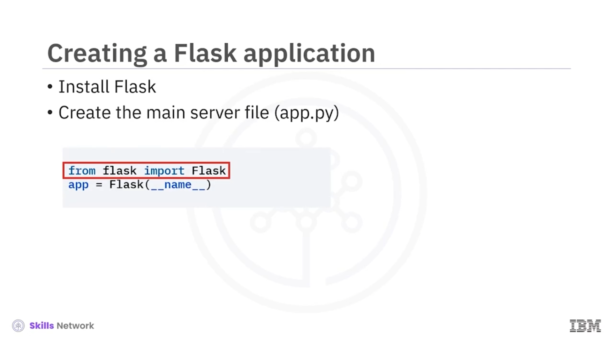
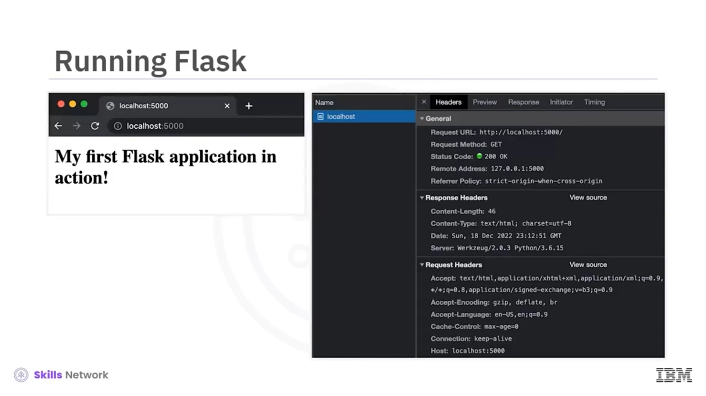

# 🚦 Flask – Temel Uygulamalar ve Rotalar

“Basic Application and Routes” bölümüne hoş geldiniz. Bu videoyu izledikten sonra şunları yapabileceksiniz:

* Temel rotalara sahip bir Flask uygulaması oluşturmak ve çalıştırmak
* Sunucudan istemcilere JSON yanıt döndürmeyi açıklamak
* Flask’te mevcut çeşitli konfigürasyon seçeneklerini açıklamak

---

## 🏁 İlk Flask Uygulamasına Başlamadan Önce

İlk Flask uygulamanızı oluşturmadan önce, Flask’i kurduğunuzdan emin olun.

Sonrasında, sunucunuz olacak bir Python dosyası oluşturun. Bu dosyanın adını `app.py` koyalım.

Şimdi bu dosyaya yazacağınız koda bakalım — önce, küçük `flask` modülünden büyük **F** ile yazılan `Flask` sınıfını içe aktarın.

---

## 🧱 Flask Nesnesini Oluşturma ve Scaffold

Sonraki adımda, `Flask` sınıfından bir nesne örnekleyip bunu uygulamanız ( *app* ) olarak kullanın.

Kurucu ( *constructor* ), `Scaffold` sınıfından tek bir argüman alır. Bu *scaffold* içindeki adı, yerleşik `__name__` değişkeninde bulunan uygulama modülünün adını geçirerek ayarlarsınız.

Bu ad, dosya sisteminde kaynakları ( *resources* ) bulmak ve uzantılar tarafından hata ayıklama bilgisi sağlamak için kullanılır.

---

## 🛣️ İlk Route’unuzu Eklemek

Artık sunucunuzu tanımladığınıza göre, ilk  *route* ’u ekleyelim.

İstemci, sunucunuzu herhangi bir *path* eklemeden çağırdığında ona bir mesaj döndürmek istiyorsunuz. Bir *route* tanımlamak için `@app` dekoratörünü kullanmanız gerekir.

Dekoratör, argüman olarak yolu ( *path* ) alır. Son olarak, bu metottan metin ya da HTML döndürebilirsiniz.

Koda bakalım:

`@app` dekoratörü, `hello_world` metodu üzerinde tanımlıdır. Argüman olarak `"/"` alır ve kalın biçimde `"my first Flask application in action!"` HTML mesajını döndürür.

---

## ▶️ Uygulamayı Çalıştırma: Ortam Değişkenleri

Sıradaki adım, uygulamanızı çalıştırmaktır.

İlk adım, birkaç sistem ortam değişkeni ( *environment variable* ) oluşturmaktır.

Ana sunucu dosyasının adını içeren `FLASK_APP` adlı bir değişkene ihtiyacınız vardır. Buna ek olarak, geliştirme ( *development* ) veya üretim ( *production* ) ortamını tanımlayacak `FLASK_ENV` değişkenine ihtiyacınız vardır.

Bu değişken, Flask 2.3 sürümünde kullanımdan kaldırılacaktır ( *deprecated* ).

Gördüğünüz gibi, `FLASK_APP` ortam değişkenini, merkezi sunucuyu içeren dosya adı olarak ve `FLASK_ENV` değişkenini `development` olarak tanımladınız.

Son olarak uygulamayı çalıştırmak için, `Flask run` komutunu çalıştırarak Flask framework’üne `run` argümanını geçirirsiniz.

Flask uygulaması varsayılan olarak 5000 portunda çalışır. Mesajınızı görmek için `http://localhost:5000` adresine gidebilirsiniz.

---

## 🔍 Geliştirici Araçlarıyla Yanıtı İncelemek

Sunucunuzdan dönen bilgileri görmek için tarayıcı geliştirici araçlarını da kullanalım.

İstenen URL `http://localhost:5000`’dır.

İstek metodu HTTP `GET`’tir.

Yanıtın durumu 200’dür; bu, başarılı bir yanıtı gösterir.

Yanıt başlığındaki içerik tipi ( *content type* ) `"text/html"` değerindedir.

Sunucu, Python `3.6.15` sürümüyle çalışan Werkzeug’dür.

İlk Flask uygulamanızı çalıştırdığınız için tebrikler. Uygulamanızı çalıştırmadan önce her uygulama için ortam değişkenlerini ayarlamanız gerekmektedir.

---

## 🔧 `flask` Komutuna Konfigürasyon Geçmek

Çalıştırılacak Python dosyasını belirtmek için `flask` komutuna `--app` kullanarak konfigürasyon geçebilirsiniz.

Geliştirme modunu etkinleştirmek için `--debug` ekleyin.

*Debug* bayrağı, kaynak dosyalar değiştirildiğinde otomatik yeniden başlatmaları da etkinleştirir ve uygulamalar geliştirirken değişikliklerinizi anında görmek istediğinizde oldukça kullanışlıdır.

Sizin durumunuzda, uygulama `app.py` adlı bir dosyada saklandığından, Flask varsayılan olarak geçerli dizinde `app.py` dosyasını arayacağı için bu argümanı atlayabilirdiniz.

Çıktı aşağıdakine benzer görünmelidir. Ekran, Flask uygulamasının daha önce olduğu gibi geliştirme modunda çalıştığını gösterir.

---

## 📦 Flask Uygulamasından JSON Döndürme

Flask uygulamanızdan JSON döndürmek için birden fazla yol vardır.

Yöntemlerden biri, sözlük ( *dictionary* ) veya liste ( *list* ) gibi serileştirilebilir ( *serializable* ) bir nesne döndürmektir.

Verilen örnek kodda, bir Python sözlüğü döndürürsünüz. Flask, istemciye JSON döndürmek için Python `json` modülünü kullanır.

Bunun çalışıp çalışmadığını `curl` komutunu kullanarak test edelim.

`localhost:5000` adresine bir `GET` isteği yaparsınız.

200 OK yanıt durumunu görebilirsiniz.

HTML yerine `"application/JSON"` içerik tipini de görebilirsiniz.

Son olarak, döndürülen JSON’u görebilirsiniz.

Sınıf ( *class* ) gibi daha karmaşık bir nesne döndürürseniz, serileştirilebilir olduğundan emin olun.

---

## 🧩 `jsonify` Kullanarak JSON Döndürme

İkinci yol, Flask tarafından sağlanan `jsonify` metodunu kullanmaktır.

Bu metod, girişte anahtar-değer çiftlerini alır ve uygun JSON’u döndürür.

Bir örneğe bakalım:

İlk olarak, `jsonify` fonksiyonunu Flask’ten içe aktarırsınız.

Sonrasında, `jsonify` fonksiyonuna anahtar-değer çiftleri geçirirsiniz.

Tarayıcıda öncekiyle aynı sonucu elde etmelisiniz.

Geliştirici araçları, 200 OK durum kodu ve `"application/JSON"` içerik tipine sahip aynı görünüme sahip olmalıdır.

---

## ⚙️ Flask Konfigürasyon Seçenekleri

`FLASK_ENV` ve `FLASK_APP` değişkenleriyle iki konfigürasyona baktınız.

Flask, uygulamanızda kullanabileceğiniz çeşitli diğer konfigürasyon seçenekleri de sağlar:

* `ENV` – Uygulamanın çalıştığı ortamın (production veya development) ne olduğunu belirtir.
* `DEBUG` – Hata ayıklama ( *debug* ) modunu etkinleştirir.
* `TESTING` – Test modunu etkinleştirir.
* `SECRET_KEY` – Oturum çerezini ( *session cookie* ) imzalamak için kullanılır.
* `SESSION_COOKIE_NAME` – Oturum çerezinin adıdır.
* `SERVER_NAME` – Sunucunun *host* ve portunu bağlar.
* `JSONIFY` – Varsayılan olarak `'application/JSON'` değerine ayarlanır.

Bunlara ek olarak, Flask’e konfigürasyon seçenekleri sağlamanın başka yolları da vardır.

Flask, bir `config` nesnesi sağlar. Konfigürasyon seçeneklerini bu nesnenin içine ekleyebilirsiniz.

Zaten ortam değişkenleriniz varsa, bunları `config` nesnesine yükleyebilirsiniz.

Son olarak, konfigürasyon seçeneklerini ayrı bir JSON dosyasında tutabilir ve `config` nesnesi tarafından sağlanan `from_file` metodu ile içeri aktarabilirsiniz.

---

## 🗂️ Uygulama Büyürken Dizin Yapısı Oluşturma

Uygulamanız büyüdükçe, tek bir Python dosyası kullanmak yerine bir dizin yapısı oluşturmalısınız.

Uygulamanızı yapılandırmanın birçok yolu vardır.

İşte bir örnek:

* Ana kaynak kodunu, kendi modül dizininde saklayın.
* Tüm konfigürasyonları kendi dosyasında saklayın.
* Görseller, JavaScript ve CSS dosyaları gibi tüm statik varlıkları ayrı saklayın.
* Tüm dinamik içeriği bir *template* dizininde saklayın.
* Tüm test dosyalarını bir *test* dizinine yerleştirin.
* Bağımlılıkların doğru sürümünü kurmak için etkinleştirilebilecek bir sanal ortam bulundurun.

---

## 🧾 Videoda Öğrendikleriniz

Bu videoda şunları öğrendiniz:

* `Flask` sınıfından bir örnek oluşturarak bir sunucu oluşturabilirsiniz.
* URL işleyicileri ( *URL handlers* ) oluşturmak için `@app` dekoratörünü kullanın.
* Dize ( *string* ) mesajlar döndürebilir veya JSON nesneleri döndürmek için `jsonify()` metodunu kullanabilirsiniz.
* Uygulama konfigürasyonunu ortam değişkenlerinden, Python dosyalarından veya doğrudan `app.config` nesnesinden ayarlayabilirsiniz.

