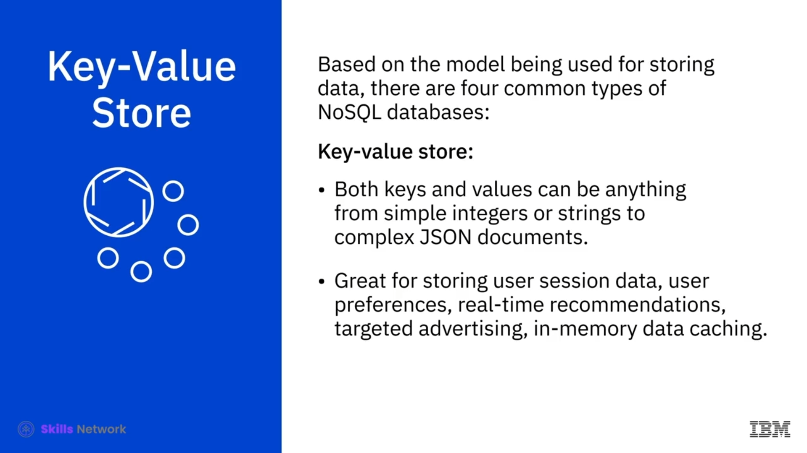
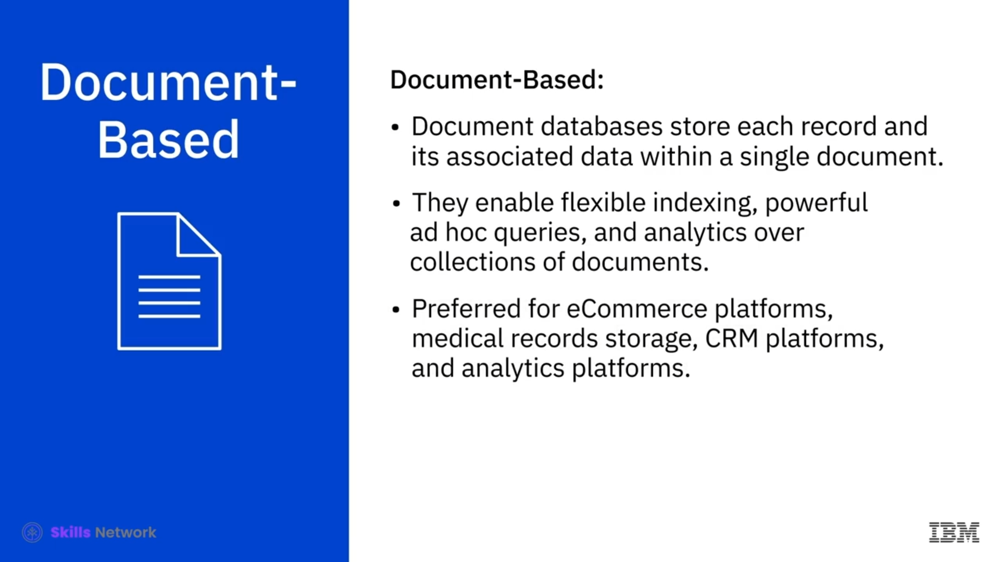

# 🗃️ İlişkisel Olmayan Veritabanları

## 🧩 NoSQL Nedir?

 *NoSQL* , *not only SQL* (yalnızca SQL değil) ya da bazen *Non SQL* ifadesinin kısaltması olup, verinin saklanması ve geri alınması için esnek şemalar sağlayan ilişkisel olmayan bir veritabanı tasarımıdır. *NoSQL* veritabanları uzun yıllardır vardır, ancak bulut, büyük veri ve yüksek hacimli web ve mobil uygulamalar çağında son zamanlarda daha popüler hale gelmiştir.

Günümüzde ölçeklenebilirlik, performans ve kullanım kolaylığına ilişkin özellikleri nedeniyle tercih edilmektedir. *NoSQL* sözcüğündeki *no* ifadesinin, gerçek anlamda “hayır” kelimesi değil, *not only* (“yalnızca … değil”) ifadesinin kısaltması olduğunun altını çizmek önemlidir.

*NoSQL* veritabanları, belirli veri modelleri için inşa edilmiştir ve geliştiricilerin modern uygulamalar oluşturmasına ve yönetmesine olanak tanıyan esnek şemalara sahiptir. Bunlar, sabit şemalara sahip geleneksel satır–sütun–tablo veritabanı tasarımını kullanmaz ve genellikle veriyi sorgulamak için yapılandırılmış sorgu dili  *SQL* ’i kullanmaz. Ancak bazıları *SQL* ya da *SQL* benzeri arayüzleri destekleyebilir.

## 🧱 Şemasız Veri Saklama ve NoSQL Türleri

 *NoSQL* , verinin şemasız ya da serbest biçimli şekilde saklanmasına izin verir. Yapısal, yarı yapısal ya da yapısız olsun, her tür veri herhangi bir kayıtta saklanabilir.

Verinin saklanması için kullanılan modele bağlı olarak yaygın dört *NoSQL* veritabanı türü vardır: anahtar–değer ( *key value store* ), belge tabanlı ( *document based* ), sütun tabanlı ( *column based* ) ve grafik tabanlı ( *graph based* ).

---

## 🔑 Anahtar–Değer (Key-Value) Depoları

 **Anahtar–değer deposu ( *key value store* )** , bir anahtar–değer veritabanında verilerin, anahtar–değer çiftleri koleksiyonu olarak saklandığı modeldir. Anahtar, verinin bir özniteliğini temsil eder ve benzersiz bir tanımlayıcıdır. Hem anahtarlar hem de değerler, basit tamsayılar veya dizgelerden karmaşık *JSON* belgelerine kadar herhangi bir şey olabilir.

Anahtar–değer depoları; kullanıcı oturum verisini ve kullanıcı tercihlerini saklamak, gerçek zamanlı öneriler ve hedefli reklamcılık yapmak ve bellekiçi (in-memory) veri önbellekleme için harikadır.

Ancak, veriyi belirli veri değerlerine göre sorgulamak istiyorsanız, veri değerleri arasında ilişkilere ihtiyaç duyuyorsanız veya birden çok benzersiz anahtarınızın olması gerekiyorsa, bir anahtar–değer deposu sizin için en uygun seçenek olmayabilir.

 *Redis* , *Memcached* ve *DynamoDB* bu kategorideki bilinen örneklerden bazılarıdır.

---

## 📄 Belge Tabanlı (Document-Based) Veritabanları

 **Belge tabanlı ( *document based* ) veritabanları** , her bir kaydı ve bu kayda ilişkin verileri tek bir belge içinde saklar. Belgeler koleksiyonları üzerinde esnek indeksleme, güçlü anlık ( *ad hoc* ) sorgular ve analitik yapılmasını mümkün kılar.

Belge veritabanları; e-ticaret platformları, tıbbi kayıtların saklanması, *CRM* platformları ve analitik platformları için tercih edilir. Ancak, karmaşık arama sorguları ve çok işlemli (çok adımlı) işlemler çalıştırmak istiyorsanız, belge tabanlı bir veritabanı sizin için en iyi seçenek olmayabilir.

 *MongoDB* ,  *DocumentDB* , *CouchDB* ve *Cloudant* popüler belge tabanlı veritabanlarından bazılarıdır.

---

## 📊 Sütun Tabanlı (Column-Based) Veritabanları

 **Sütun tabanlı ( *column based* ) modeller** , veriyi satırlar yerine sütunlar halinde gruplanmış hücrelerde saklar. Genellikle birlikte erişilen sütunların mantıksal bir gruplandırılmasına sütun ailesi ( *column family* ) denir.

Örneğin, bir müşterinin adı ve profil bilgilerine büyük olasılıkla birlikte erişilir, ancak satın alma geçmişine aynı anda erişilmez. Bu nedenle müşteri adı ve profil bilgisi verileri bir sütun ailesi içinde gruplanabilir.

Sütun veritabanları, bir sütuna karşılık gelen tüm hücreleri disk üzerinde ardışık bir giriş olarak sakladığı için, veriye erişmek ve veriyi aramak çok hızlı hale gelir.

Sütun veritabanları, yoğun yazma isteği gerektiren sistemler, zaman serisi verisinin, hava durumu verisinin ve *IoT* verisinin saklanması için çok uygun olabilir. Ancak karmaşık sorgular kullanmanız veya sorgu desenlerinizi sık sık değiştirmeniz gerekiyorsa, bu sizin için en iyi seçenek olmayabilir.

En popüler sütun veritabanları *Cassandra* ve  *HBase* ’tir.

---

## 🕸️ Grafik (Graph-Based) Veritabanları

 **Grafik tabanlı ( *graph based* ) veritabanları** , veriyi temsil etmek ve saklamak için grafiksel bir model kullanır. Özellikle, farklı veri parçaları arasındaki bağlantıları görselleştirmek, analiz etmek ve bulmak için faydalıdır.

Bu modelde daireler düğümleri ( *nodes* ) oluşturur ve veriyi içerir; oklar ise ilişkileri temsil eder. Grafik veritabanları, çok sayıda birbirine bağlı ilişki içeren, bağlantılı verilerle ( *connected data* ) çalışmak için mükemmel bir seçimdir.

Grafik veritabanları; sosyal ağlar, gerçek zamanlı ürün önerileri, ağ diyagramları, sahtekarlık tespiti ve erişim yönetimi için çok uygundur. 

Ancak yüksek hacimli işlemleri işlemek istiyorsanız, grafik veritabanları büyük hacimli analitik sorgular için optimize edilmediğinden, bu sizin için en iyi seçenek olmayabilir.

*Neo4J* ve *CosmosDB* daha popüler grafik veritabanlarından bazılarıdır.

---

## 🚀 NoSQL’un Ortaya Çıkışı ve Avantajları

 *NoSQL* , geleneksel ilişkisel veritabanı teknolojisinin sınırlamalarına bir yanıt olarak oluşturulmuştur.  *NoSQL* ’un başlıca avantajı, büyük hacimlerde yapılandırılmış, yarı yapılandırılmış ve yapılandırılmamış veriyi işleyebilme yeteneğidir.

Diğer bazı avantajları arasında, birden çok veri merkezine ölçeklenen dağıtık sistemler olarak çalışabilme yeteneği yer alır; bu da bulut bilişim altyapısından yararlanmalarını sağlar.

Verimlidir ve maliyet etkin bir yatay ölçekleme ( *scale-out* ) mimarisi sunar; yeni düğümler eklendikçe ek kapasite ve performans sağlar ve daha basit bir tasarım sunar. Kullanılabilirlik üzerinde daha iyi kontrol ve geliştirilmiş ölçeklenebilirlik sayesinde daha çevik, daha esnek olabilir ve daha hızlı yineleme yapabilirsiniz.

---

## ⚖️ İlişkisel ve İlişkisel Olmayan Veritabanlarının Karşılaştırılması

İlişkisel ve ilişkisel olmayan veritabanları arasındaki temel farkları özetlemek gerekirse: *RDBMS* şemaları, veritabanına eklenen tüm verilerin nasıl türlendirilmesi ve yapılandırılması gerektiğini katı biçimde tanımlar. Buna karşın *NoSQL* veritabanları şema bağımsız ( *schema agnostic* ) olabilir ve yapılandırılmamış ve yarı yapılandırılmış verinin saklanmasına ve işlenmesine izin verir.

Üst düzey ticari ilişkisel veritabanı yönetim sistemlerini ( *RDBMS* ) işletmek ve bakımını yapmak pahalıdır; *NoSQL* veritabanları ise düşük maliyetli standart donanım ( *commodity hardware* ) üzerinde çalışacak şekilde özel olarak tasarlanmıştır.

İlişkisel veritabanları, çoğu *NoSQL* sisteminin aksine *ACID* uyumluluğunu destekler; bu da işlemlerin güvenilirliğini ve çökme durumunda kurtarılabilmesini sağlar.

 *RDBMS* , olgun ve iyi belgelenmiş bir teknolojidir; bu da görece daha yeni bir teknoloji olan  *NoSQL* ’e kıyasla risklerin az çok öngörülebilir olduğu anlamına gelir. Buna rağmen *NoSQL* veritabanları kalıcıdır ve giderek daha fazla hayati önem taşıyan ( *mission critical* ) uygulamalarda kullanılmaktadır.

