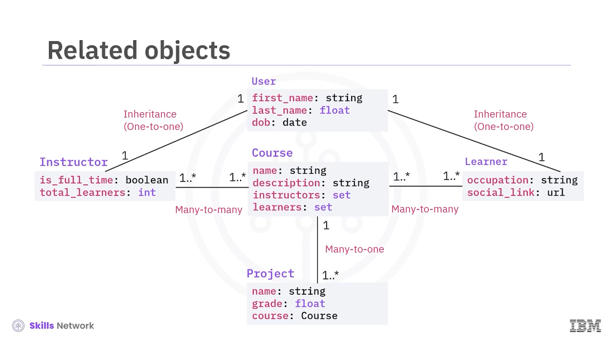
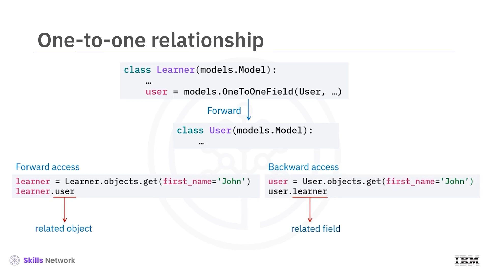
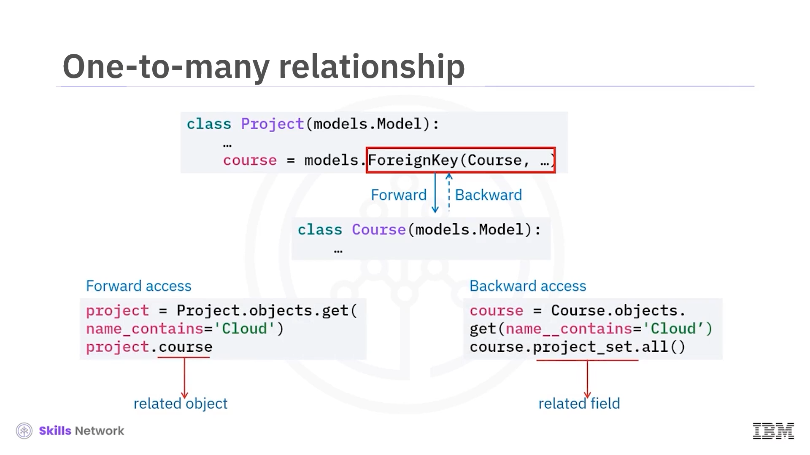

# 🔗 İlişkili Nesneler

## 🎯 Giriş ve Öğrenme Hedefi

İlişkili Nesneler'e hoş geldiniz.

Bu videoyu izledikten sonra, ilişkili nesnelere erişmek ve onları silmek için Django model API'lerini kullanabileceksiniz.

## 🧩 Çevrimiçi Kurs Modelleri Arasındaki İlişkiler

Çevrimiçi kurs sistemimizdeki tüm modeller birbiriyle ilişkilidir.

`User` modeli, `Instructor` ve `Learner` modelleriyle bire bir ( *one-to-one* ) ilişkiye sahiptir.

`Course` modeli, `Instructor` ve `Learner` modelleriyle çoktan çoğa ( *many-to-many* ), `Project` modeliyle ise çoktan bire ( *many-to-one* ) ilişkiye sahiptir.

Bu ilişkili modelleri Django model API'lerini kullanarak nasıl yöneteceğinizi göstereceğiz.

## 🔁 Tek Tarafta Tanımlanan İlişkiler: *Forward* ve *Backward* Erişim

Django sizden bir model ilişkisinin yalnızca bir tarafını tanımlamanızı ister.

Örneğin, `Learner` modelini, `User` modeline bire bir alan ( *one-to-one field* ) referansına sahip olacak şekilde tanımlamanız yeterlidir. Bu açık referansa *forward access* (ileri yönde erişim) denir.

Arka planda Django, `User` modelinden `Learner` modeline doğru bir geri ilişki oluşturur; böylece `Learner` nesnesine `User` modelinden de erişebilirsiniz. Bu, örtük bir referans ya da *backward access* (geri yönde erişim) olarak adlandırılır.

Bir `Learner` hakkında ad veya soyad gibi ortak bilgilere erişmek için, öncelikle ona karşılık gelen `User` nesnesini almamız gerekir.

`Learner` modelinde bir `User` referansını zaten tanımladığımız için, `Learner`dan `User`a açıkça erişebiliriz.

Django geri ilişkiyi otomatik olarak oluşturduğu için, `User` nesnesinden de ilgili `Learner` nesnesine erişebiliriz.

## 🧬 Kalıtım ve Bire Bir İlişki

Kalıtım ( *inheritance* ) ilişkisi, bire bir ilişkiye benzer.

`Learner` sınıfı, `User` sınıfından kalıtım alır.

`Learner`ın üst ( *parent* ) `User` referansına, Django'nun `user` model adını, alt çizgi ve `PTR` sonekiyle birleştirerek oluşturduğu `user_PTR` alanı üzerinden erişebiliriz.

Aynı zamanda Django, `User`dan `Learner`a doğru bir geri ilişki de oluşturur.

## 1️⃣➡️∞ *Foreign Key* ile Birden-Çoğa ve Çoktan-Bire

Birden çoğa veya çoktan bire ilişki, bir *foreign key* alanı kullanılarak tanımlanır.

Burada, `Project` modelinden `Course` modeline doğru bir *forward* referans tanımlamış durumdayız.

Artık bir `Project` için ilgili `Course` nesnesine açıkça erişebiliriz.

Bu arada Django, `Course` modelinden `Project` modeline, örtük bir `project set` alanı ile geri referans oluşturur; böylece bir `Course`a ait `Project` nesnelerine erişebiliriz.

## 🔗 Çoktan-Çoğa ( *Many-to-Many* ) İlişkiler

Çoktan çoğa ( *many-to-many* ) ilişkili nesneleri yönetmek de diğer ilişkileri yönetmeye benzer.

Bu örnekte, `Course` modeli `Instructor` modeline işaret eden, açık bir referans olarak tanımlanmış çoktan çoğa bir alan içerir.

Bir `Course`un eğitmenlerine bu *forward* erişim üzerinden ulaşabiliriz; ayrıca, hâlihazırda ders veren `Instructor` nesnelerine de Django'nun oluşturduğu örtük referans aracılığıyla erişebiliriz.

## 🗑️ İlişkili Nesneleri Silmek ve `onDelete` Seçenekleri

Daha önce, ilişkisi olmayan tek bir nesneyi basitçe `delete` metodunu çağırarak sildiğimizi açıklamıştık.

Peki, nesneler birbirleriyle ilişkiliyse ne olur?

Örneğin, bir `Course`, bir *foreign key* alanı üzerinden birçok kurs projesine sahip olabilir ve her bir kurs projesi de tek bir `Course`a ait olabilir.

Eğer bir `Course`u silersek, ona ait olan bu kurs projelerine ne olur?

Django bu projeleri saklayacak mı yoksa onları da mı silecektir?

Aslında Django, `onDelete` seçeneklerini nasıl ayarladığınıza bağlı olarak farklı silme davranışlarını destekler.

`onDelete` seçeneğini, bir parametre olarak *foreign key* alanının içine yerleştirebiliriz.

Şimdi, ilişkili `Project` nesneleriyle birlikte bir `Course` nesnesini sildiğimizde her seçeneğin nasıl çalıştığını görelim.

Varsayılan seçenek  *cascade* 'dir. Bir `Course` nesnesi silinirse, tüm kurs projelerini de siler.

*protect* seçeneği, bir `Course` nesnesinin ilişkili herhangi bir kurs projesi varsa silinmesini engeller.

*set null* seçeneği, kurs projelerini gelecekte kullanılmak üzere saklar. *set null* yalnızca *foreign key* alanına `null` değerine izin verirsek kullanılabilir.

*set default* veya *set* seçeneği, ilişkili `Course` silindiğinde projeleri varsayılan bir `Course`a ya da başka bir `Course`a atar.

*do nothing* seçeneği, `Course` silindiğinde ilişkili projeler üzerinde hiçbir işlem yapmaz.

Bu seçenek önerilmez, çünkü projeler *orphan objects* (sahipsiz nesneler) hâline gelir. Hâlâ var olmayan bir `Course` nesnesine işaret etmeye devam ederler.

## ⚙️ İlişkili Nesneleri Yönetmek için Ek Yöntemler

İlişkili nesneleri yönetmek için kullanabileceğimiz bazı ek Django yöntemleri vardır.

İlişkili nesne kümesine bir nesne eklemek için, nesne referansı ile birlikte `add` metodunu kullanırız.

İlişkili nesnelerle birlikte yeni bir nesne oluşturmak için, ilkel veya ilişkisel alan değerleri gibi anahtar sözcük parametreleriyle `create` metodunu kullanırız.

Belirli nesneleri kaldırmak için, ilişkili nesne referanslarıyla birlikte `remove` metodunu kullanırız.

Tüm ilişkili nesneleri temizlemek için, herhangi bir parametre olmadan `clear` metodunu kullanırız.

İlişkili nesneleri değiştirmek için ise, yeni nesne kümesiyle birlikte `set` metodunu kullanırız.

## 🧾 Özet

Bu videoda, Django modelinin ilişkili nesneleri okumak veya üzerinde işlem yapmak için kullanışlı API'ler sağladığını öğrendiniz.

Django'nun, *forward* ya da açık ( *explicit* ) ilişki olarak adlandırılan ilişkiyi yalnızca bir tarafta tanımlamanızı gerektirdiğini gördünüz.

Bir *forward* ilişki tanımladığınızda, Django tanımladığınız bu ilişki türüne bağlı olarak otomatik şekilde bir *backward* ya da örtük ( *implicit* ) ilişki oluşturur.

Ayrıca, bir nesne silindiğinde ilişkili nesnelere ne olacağını belirlemek için `onDelete` seçeneklerini kullanırsınız.

