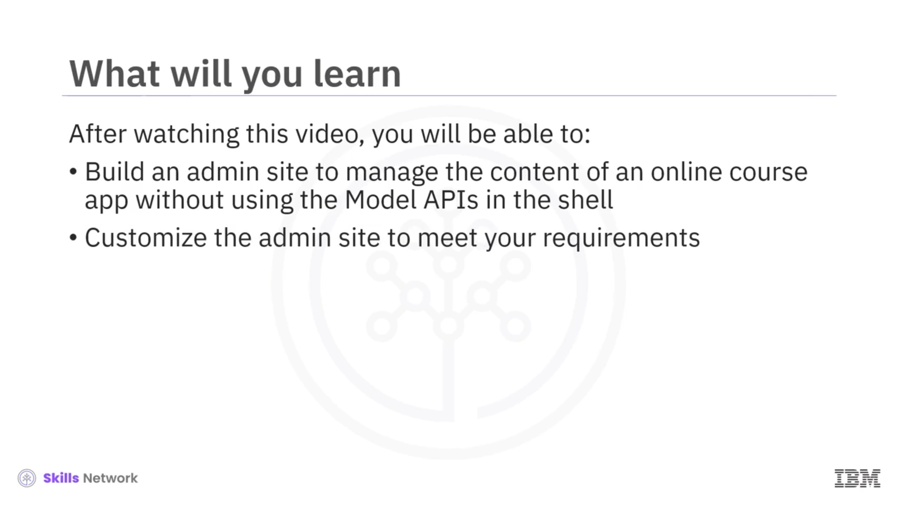
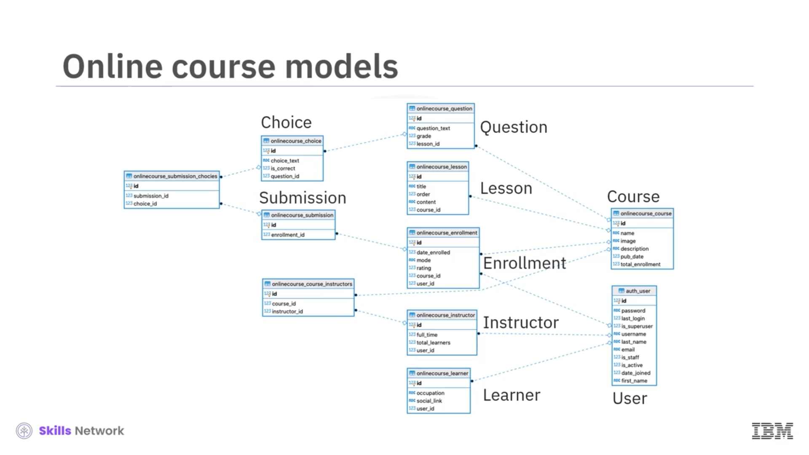
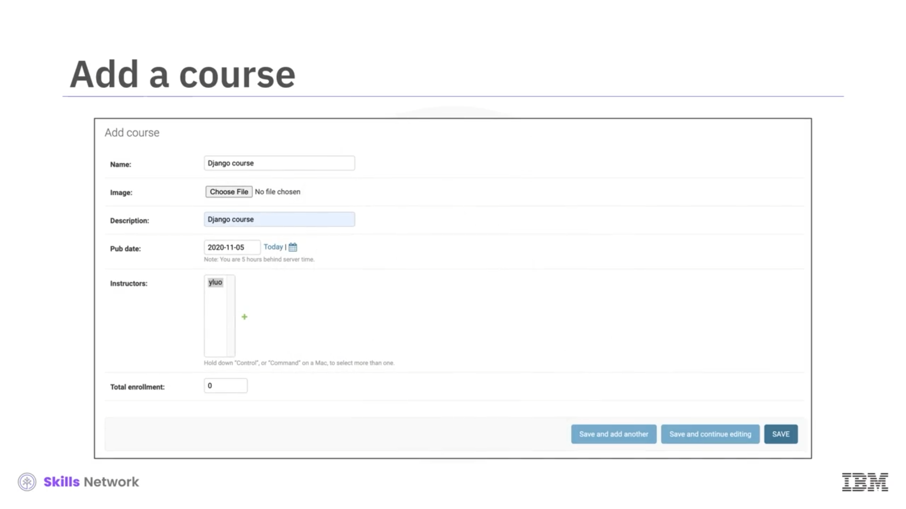
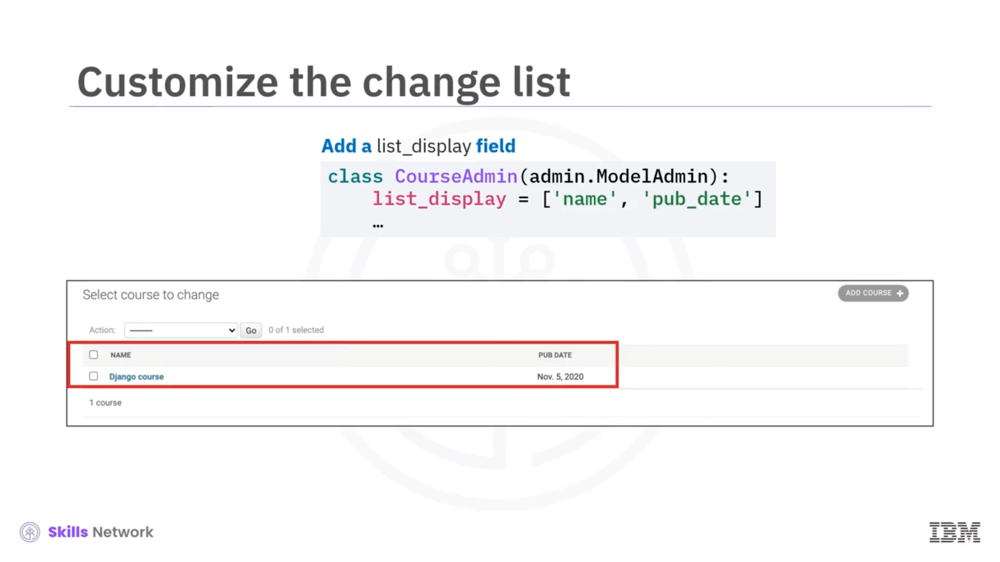
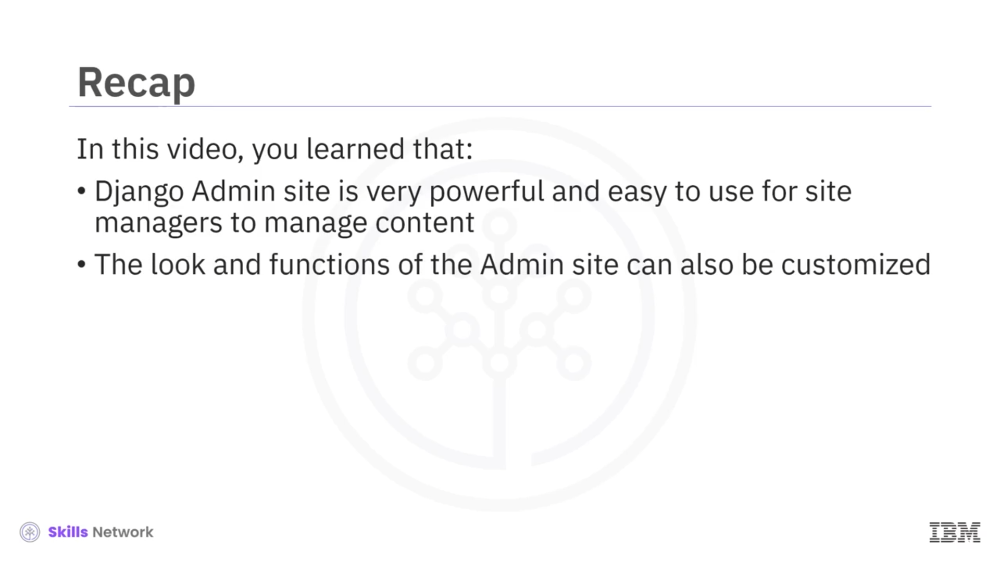

# 🛠️ Django Admin

Django Admin’e hoş geldiniz.

Bu videoyu izledikten sonra, çevrimiçi bir kurs uygulamasının içeriğini kabukta *Model API’lerini kullanmadan* yönetmek için bir **admin sitesi** oluşturabilecek ve admin sitesini özelleştirebileceksiniz.



---

## 📚 Kullanılacak Modellerin Gözden Geçirilmesi

Online kurs uygulamamızda kullanacağımız modellere bir göz atalım.

Uygulama, çevrimiçi bir öğrenme uygulaması için yaygın olan bazı varlıklara sahiptir:

 *`Course`* ,  *`Lessons`* , *`Questions`* ve  *`Choices`* .

**Persona** (rol) tarafında ise:

 *`User`* , *`Learner`* ve *`Instructor`* bulunur.

**Aksiyonlar** için:

*`Course Enrollment`* (Kursa Kayıt) ve *`Question submission`* (Soru gönderimi) yer alır.

Bu kadar çok varlık ve aralarındaki ilişkilerle, geliştiricilerin bu online kurs uygulamasını oluşturmasının ne kadar zor olabileceğini hayal edebilirsiniz. Neyse ki Django, geliştiricilere bu içeriği minimum kodlama çabasıyla yönetmek için çok güçlü bir **Django admin** sitesi sunar.



---

## 👥 İçerik Yayıncıları ve Kullanıcıların Ayrımı

Django framework’ü, içerik yayıncıları ile kullanıcılar arasında net bir ayrım yapar.

Django, içeriği yönetmek için yerleşik bir **admin sitesi** sağlar.

Bir online kurs uygulaması için:

* Eğitmenler veya site yöneticileri admin sitesini kullanarak kursları, dersleri, soruları ve benzeri içerikleri **ekleyebilir** veya  **düzenleyebilir** .
* Kurs hazır olduğunda ve yayınlandığında, öğrenciler bu kurslara **genel siteden** kayıt olabilir.


---

## 🔐 Admin Kullanıcısı (Superuser) Oluşturma

Bir Django admin sitesi oluşturmaya, admin sitesi için bir **admin kullanıcısı** (superuser) oluşturarak başlayalım.

Önce komut satırında şu komutu çalıştırın:

```bash
python manage.py createsuperuser
```

Bu komut sizden kullanıcı adı ve parola gibi kimlik bilgilerini isteyecektir.


---

## 🚀 Sunucuyu Başlatma ve Admin Sitesine Giriş

Süper kullanıcıyı oluşturduktan sonra, Django sunucusunu başlatabilirsiniz.

Admin sitesine gidin ve az önce oluşturduğunuz kimlik bilgileriyle giriş yapın.

Modellerinizi yönetebilmek için **admin sitesine kaydetmeniz** gerekir.


---

## 🧩 Modelleri Admin Sitesine Kaydetme

Önce `onlinecourse/admin.py` dosyasını açın ve `Course` ve `Instructor` modellerini kaydetmek için şu iki satırı ekleyin:

```python
admin.site.register(Course)
admin.site.register(Instructor)
```

Admin sitesini yenilediğinizde, **Onlinecourse** bölümünün altında **Courses** ve **Instructors** öğelerinin eklendiğini görebilirsiniz.


Model alanlarına (fields) göre Django farklı **UI bileşenleri** (widget’lar) oluşturur:

* *Instructor* için, `Full_time` isimli Boolean alanı için bir  **onay kutusu (checkbox)** ,
* `total learners` isimli tamsayı (integer) alanı için bir **sayısal girdi (numeric input)** oluşturur.

`Instructor` modeli, `User` modelinden **kalıtım (inheritance)** alır, bu nedenle `User`, `Instructor` ile ilişkili bir nesnedir ve ad, doğum tarihi gibi bazı ortak bilgileri içerir.

Burada yalnızca bir kullanıcıyı eğitmene dönüştürebilir ve eğitmenin tam zamanlı olup olmadığını belirleyebiliriz.


---

## 📈 Total Learners Alanı ve Yönetim Tercihi

`Total learners` adında bir alan olmasına rağmen, bu alanı admin sitesinde yönetmek istemeyebiliriz.

Bunun yerine, bu alanı, eğitmenin kursuna kayıtlı öğrenci sayısından **hesaplamak** isteyebiliriz.

Daha sonra, admin sitesinde hangi alanların yönetileceğini nasıl seçeceğinizi göstereceğiz.

---

## 📝 Yeni Kurs Oluşturma

Bir kursu şu bilgileri girerek oluşturabiliriz:

* Adı (name),
* Açıklaması (description),
* Kurs tanıtımı için görseli (image),
* Yayın tarihi (publication date),
* Eğitmenleri (instructors),
* ve benzeri diğer bilgiler.



---

## ⚙️ Admin Sitesinde Alanları (Fields) Özelleştirme

Geliştiriciler, admin sitesinde yalnızca bazı model alanlarını göstermek ve belirli bir sıra ile yerleştirmek isteyebilir.

Dahil edilecek alanları seçmek için bir **model admin sınıfı** oluşturur ve modele dahil edilmesini istediğimiz alan adlarının olduğu bir `fields` listesi ekleriz.

Örneğin, `Course` modeli için admin sitesinde yer almasını istediğimiz alanların listesine sahip bir `CourseAdmin` sınıfı oluştururuz.

Bu alandaki sıralama şöyle olacaktır: `pub_date`, `name` ve `description`.


---

## 🧮 CourseAdmin’i Kayıt Etme

`CourseAdmin` sınıfını tanımladıktan sonra, `admin.site.register` metodunu değiştirerek `CourseAdmin` nesnesini ikinci parametre olarak ekleriz.

```python
admin.site.register(Course, CourseAdmin)
```

Admin sitesini yeniledikten sonra yeni bir kurs eklemeyi denediğinizde, yalnızca `pub_date`, `name` ve `description` alanlarının gösterildiğini ve düzenlenebildiğini görürsünüz.


---

## 🧱 Dersleri (Lessons) Kurs Formuna Satır İçi Eklemek

Bir kurs, çok sayıda ders ( *lessons* ) ve soru ( *questions* ) içerebilir.

Her modeli kendi admin formu ile **tek tek** eklemek yerine, `Course` ve `Lesson` modellerini aynı form üzerinden birlikte ekleyebiliriz. Bunu `admin.StackedInline` veya `admin.TabularInline` nesnelerini kullanarak yaparız.

`Lesson` modelini satır içi (inline) olarak eklemek için, modelini `Lesson` olarak belirttiğimiz ve `extra` değerini `5` yaptığımız bir `LessonInLine` nesnesi oluşturabiliriz. Bu, aynı anda bir kursla birlikte en fazla **5 dersi** eklemek istediğimiz anlamına gelir.

`Course` admin formunu tanımlayan `CourseAdmin` nesnesinde, oluşturduğumuz `LessonInline` sınıfını içerecek bir `inlines` listesi ekleriz.

Sayfayı yeniledikten sonra, **Course admin formu** içinde bir **Lessons** bölümü göründüğünü fark edersiniz.

Burada bir dersin başlığını ( *title* ), sırasını ( *order* ) ve içeriğini ( *content* ) ekleyebilirsiniz; bunlar Django tarafından otomatik olarak ilgili kursa eklenir.


---

## 🔎 Tablo Görünümü, list_display, Arama ve Filtreleme

Birden fazla kursu veya diğer modelleri tablosal (liste) biçimde gösterdiğimizde, tabloda hangi alanların görüneceğini belirlememiz gerekir.

Örneğin, bir kurs listesi için tabloda yalnızca kursun **adını** ve **yayın tarihini** göstermek isteyebiliriz. Bunu, kurs değişiklik tablosunda gösterilmesini istediğimiz alanların listesini içeren bir `list_display` ekleyerek yaparız.

Sayfayı yeniledikten sonra, kurs değişiklik tablosu artık `list_display` içinde tanımladığımız şekilde kurs adını ve yayın tarihini gösterir.



Kurs değişiklik listesi çok uzun olabilir ve bu liste üzerinde **arama** yapabilmek veya listeyi **filtreleyebilmek** isteyebilirsiniz.

Kurs değişiklik listesinde arama ve filtrelemeyi etkinleştirmek için:

* Arama yapmak istediğiniz alanları içerecek şekilde `search_fields` ekleyin.
* Filtrelemek istediğiniz alanları içerecek şekilde `list_filter` ekleyin.

Sayfayı yeniledikten sonra, admin sayfasında kursları arayıp filtreleyebilmeniz için kurs değişiklik listesinde bir **Search** kutusu ve bir **Filter** menüsü görünecektir.


---

## ✅ Sonuç: Django Admin’in Gücü

Bu videoda, Django Admin sitesinin, site yöneticilerinin içeriği yönetmesi için **çok güçlü** ve **kullanımı kolay** bir araç olduğunu öğrendiniz.

Ayrıca, görünümünün ve işlevlerinin de **özelleştirilebilir** olduğunu gördünüz.


