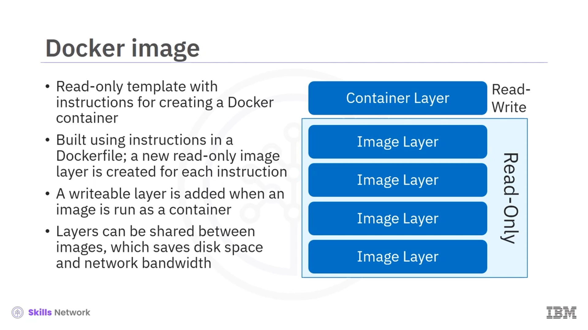
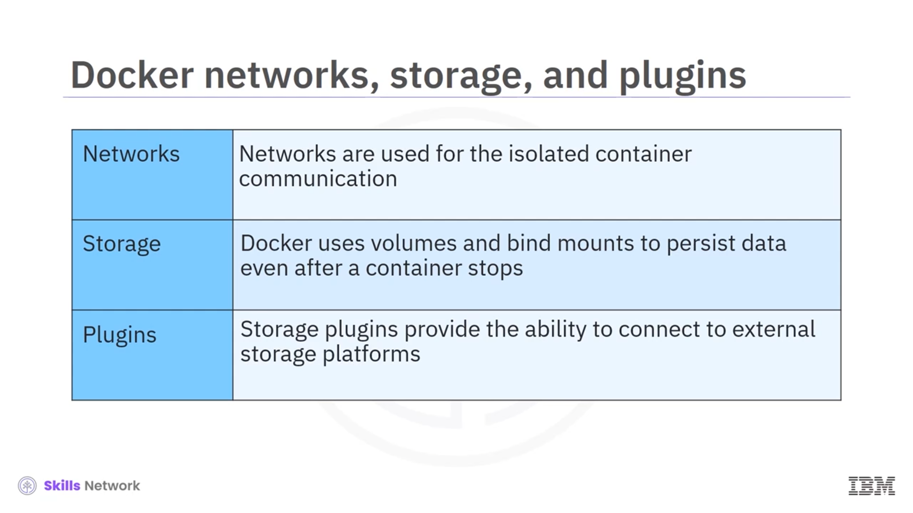

# 🐳 Docker Nesneleri ve Temel Kavramlar

## 🎯 Dersin Hedefleri ve Docker Nesneleri

**Docker nesneleri** tanıtımına hoş geldiniz. Bu dersi tamamladıktan sonra:

* **Docker nesnelerini** tanımlayabilecek,
* Temel **Dockerfile** komutlarını açıklayabilecek,
* **Kapsayıcı görüntü (image)** adlandırmasını anlayabilecek,
* **Docker ağlarının** , **depolamanın** ve **eklentilerin (plugins)** nasıl kullanıldığını açıklayabileceksiniz.

 **Docker** , aşağıdaki temel nesneleri içerir:

* **Dockerfile (Docker dosyası)**
* **Görüntüler (images)**
* **Kapsayıcılar (containers)**
* **Ağlar (networks)**
* **Depolama birimleri (volumes)**
* **Eklentiler (plugins)**

---

## 📄 Dockerfile (Docker Dosyası) Nedir?

 **Dockerfile** , bir **görüntü oluşturmak** için gereken talimatları içeren düz metin bir dosyadır. Konsoldan veya terminalden çalıştırdığınız herhangi bir metin düzenleyici ile bir **Docker dosyası** oluşturabilirsiniz.

Dockerfile içinde, **Docker’ın sağladığı temel talimatları** kullanırsınız. Bir Dockerfile her zaman, kullanılacak **temel görüntüyü (base image)** tanımlayan bir **`FROM`** talimatı ile başlamalıdır.

---

## 🧩 Temel Dockerfile Talimatları: FROM, RUN, CMD

Genellikle temel görüntü, bir işletim sistemi (örneğin  **Ubuntu** ) gibi genel bir depodan veya  **Go** , **Node.js** gibi belirli bir programlama dili için hazırlanmış bir görüntüden gelir.

Dockerfile içindeki temel talimatlar:

* **`FROM`** : Kullanılacak **temel görüntüyü** tanımlar.
* **`RUN`** : Görüntü oluşturulurken çalıştırılacak **komutları** yürütür.
* **`CMD`** : Konteyner çalıştığında varsayılan olarak yürütülecek **komutu** tanımlar.

Bir Dockerfile **yalnızca bir tane** geçerli **`CMD`** talimatına sahip olabilir. Dosyada birden fazla **`CMD`** talimatı varsa, **yalnızca sonuncusu** geçerli kabul edilir.

---

## 🖼️ Docker Görüntüleri ve Katmanlı Yapı

Bir  **Docker görüntüsü (image)** , bir **Docker konteyneri** oluşturmak için gereken talimatları içeren **salt okunur (read-only)** bir şablondur.

* **Dockerfile** , görüntüyü oluşturmak için gerekli talimatları sağlar.
* Dockerfile içindeki  **her komut** , görüntüde **yeni bir katman (layer)** oluşturur.
* Dockerfile’ı değiştirip görüntüyü yeniden oluşturduğunuzda, **Docker Engine** yalnızca **değişen katmanları** yeniden oluşturur.
* Görüntüler, bu katmanları paylaşabildiği için hem **disk alanından** hem de görüntü gönderip alırken **ağ bant genişliğinden** tasarruf sağlar.

Bu görüntüyü  **kullandığınızda** , yani onu çalıştırdığınızda, **çalışan bir konteyner** elde edersiniz. Salt okunur görüntü katmanlarının üzerine:

* Konteyner için **yazılabilir bir katman (container layer)** eklenir.
* Konteynerler görüntüden türediği için, kendi durumlarını kaydedebilmek adına bu **yazılabilir katmana** ihtiyaç duyarlar.

---

## 🏷️ Docker Görüntü İsimlendirme Biçimi

 **Docker görüntü adı** , üç ana bileşenden oluşan benzersiz bir biçime sahiptir:

* **Ana bilgisayar adı (hostname)**
* **Depo (repository)**
* **Etiket (tag)**

Bu üçlü, görüntünün nerede tutulduğunu ve hangi sürüm olduğunu tanımlamaya yardımcı olur.

---

## 🔎 Örnek Görüntü Adı: docker.io/ubuntu:18.04

Örnek olarak şu görüntü adını inceleyelim: **`docker.io/ubuntu:18.04`**

* **Ana bilgisayar adı `docker.io`** → **Docker Hub** kayıt defterini ifade eder.

  Docker CLI kullanırken genellikle bu kısmı yazmadan da kullanabilirsiniz; varsayılan olarak **Docker Hub** kabul edilir.
* **Depo adı `ubuntu`** → **Ubuntu görüntüleri** için kullanılan depoyu gösterir.
* **Etiket `18.04`** → Yüklü **Ubuntu sürümünü** belirtir (örneğin Ubuntu 18.04).

Bu sayede aynı depoda birden çok sürüm ( **`ubuntu:18.04`** , **`ubuntu:20.04`** vb.) tutulabilir.

---

## 📦 Docker Konteyneri Nedir?

Şimdi **Docker konteyneri** kavramına bakalım.

Bir  **Docker konteyneri** , bir görüntünün  **çalıştırılabilir bir örneğidir (running instance)** . Bir konteyneri:

* **Oluşturmak** ,
* **Başlatmak** ,
* **Durdurmak** ,
* **Silmek**

için **Docker API** veya  **Docker CLI** ’yi kullanabilirsiniz.

Ayrıca:

* Bir konteyneri  **birden fazla ağa bağlayabilir** ,
* Konteynere **depolama birimleri (volumes)** ekleyebilir,
* Konteynerin mevcut durumuna göre **yeni bir görüntü** oluşturabilirsiniz.

 **Docker** , konteynerleri hem birbirlerinden hem de ana makineden iyi bir şekilde  **izole eder** .  **Ağ nesneleri (networks)** , konteynerler arası iletişimi kontrol etmeye ve izole etmeye yardımcı olur.

---

## 💾 Veri Kalıcılığı, Volumelar ve Eklentiler

Varsayılan durumda, bir konteyner **silindiğinde** veya artık mevcut olmadığında, konteyner içindeki veriler  **kalıcı değildir** .

Verileri, konteyner durduktan sonra bile koruyabilmek için Docker:

* **Birimler (volumes)** ve
* **Bağlama bağlantıları (bind mounts)**

kullanır.

Ayrıca, **depolama eklentileri (storage plugins)** gibi eklentiler sayesinde, konteynerler:

* Harici  **depolama platformlarına** ,
* Farklı **storage sağlayıcılarına**

bağlanabilir ve verilerini orada saklayabilir.

---

## 🔁 Özet: Docker Nesneleri Arasındaki İlişki

Bu videoda **Docker’ın nesne modelini** ve bu nesneler arasındaki ilişkiyi öğrendiniz:

* **Dockerfile** ,  **FROM** , **RUN** ve **CMD** gibi talimatlarla bir **görüntünün nasıl oluşturulacağını** tanımlar.
* **Docker görüntüsü (image)** , kapsayıcıyı oluşturmak için kullanılan **salt okunur şablondur** ve katmanlı bir yapıya sahiptir.
* **Docker konteyneri** , bu görüntünün  **çalıştırılabilir bir örneğidir** .
* **Görüntü adı biçimi** ,  **ana bilgisayar adı** , **depo** ve **etiket** olmak üzere üç tanımlayıcıdan oluşur.
* **Ağlar (networks)** , kapsayıcı iletişimlerini izole eder ve düzenler.
* **Birimler (volumes)** ve  **bağlama bağlantıları (bind mounts)** , konteyner durduktan sonra bile verilerin **kalıcı olmasını** sağlar.
* **Depolama eklentileri (storage plugins)** , konteynerlerin harici depolama sistemlerine bağlanmasına olanak tanır.

Bu yapı sayesinde  **Docker** , uygulamaları taşınabilir, yönetilebilir ve ölçeklenebilir hale getirir.

