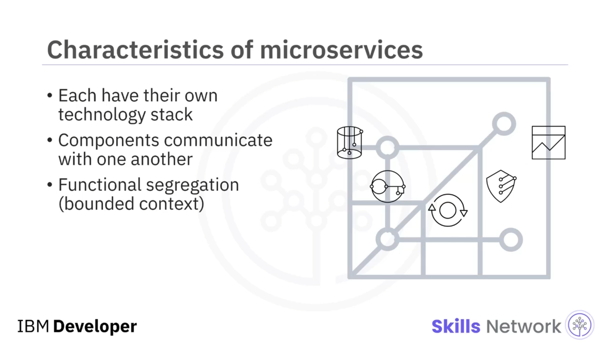
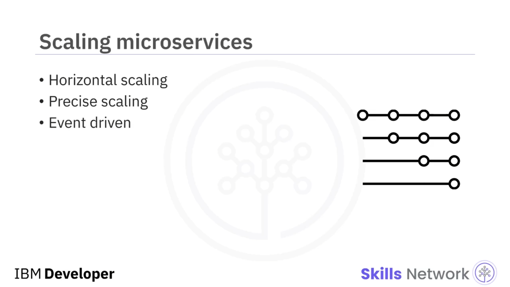

# 🔧 Microservisler Nedir?

## 🎬 Giriş ve Öğrenme Hedefleri

‘Microservisler Nedir?’ bölümüne hoş geldiniz.

Bu videoyu izledikten sonra, microservislerin ne olduğunu açıklayabilecek, microservis mimarisinin faydalarını anlatabilecek ve microservislerin nasıl ölçeklenebileceğini açıklayabileceksiniz.

---

## 🏗️ Microservis Mimarisi ve Servislerin Yapısı

 *Microservis mimarisi* , tek bir uygulamanın, gevşek şekilde bağlı ve bağımsız olarak dağıtılabilen birçok küçük servisten oluşturulduğu bir yaklaşımdır.

Bu servislerin genellikle veritabanı ve veri yönetim modeli de dahil olmak üzere kendi teknoloji yığınları bulunur. Ekipler, bileşenler birbirlerine bir *API endpoint* üzerinden bağımlı oldukları için, farklı bileşenler için farklı programlama dilleri bile seçebilir.

Microservis bileşenleri,  *REST API* ’ler, *event streaming* ve *message broker*ların bir kombinasyonu üzerinden birbirleriyle iletişim kurar. Bu servisler, iş fonksiyonelliğine göre ayrıştırılır ve düzenlenir; servisleri ayıran bu sınıra *bounded context* adı verilir.

Servisler arasında karşılıklı bağımlılık olmadığı için, tüm uygulamaya dokunmadan yeni özellikler veya işlevler eklemek amacıyla kodu daha kolay güncelleyebilirsiniz.

---

## 🧩 Takımlar ve Teknoloji Yığınları

Her ekip, sorumlu olduğu bileşenleri geliştirmek için ihtiyaçlarına ve uzmanlığına en uygun kendi teknoloji yığınını seçebilir.

Ve bu bileşenler, birbirlerinden bağımsız olarak ölçeklenebilir; böylece yalnızca tek bir özelliğin çok fazla yükle karşılaşması nedeniyle tüm uygulamayı ölçeklemek zorunda kalmaktan kaynaklanan israf ve maliyet azaltılır.

---

## 📈 Microservislerde Ölçeklenebilirlik ve Yatay Ölçekleme

Microservislerin ölçeklendirildiğini gördüğünüz her yerde, genellikle *yatay ölçekleme* söz konusudur.

Yatay ölçekleme, kaynakların daha fazla örneğini ekleyerek ölçekleme anlamına gelir ve buna “ *scaling out* ” da denir.

Microservislerde, her bir servis ayrı ayrı dağıtılabilir ve ölçeklenebilir. Doğru şekilde uygulandığında, microservisler daha az altyapı gerektirir; çünkü monolitik uygulamalarda olduğu gibi tüm uygulamayı ölçeklendirmek yerine yalnızca ölçeklenmesi gereken bileşenlerin hassas bir şekilde ölçeklenmesine olanak tanır.

---

## 📡 API Çağrıları, Olay Akışı ve Mesaj Aracısı

Belirli bir servis için başlangıç durumunu kurmanın etkili bir yolu, çoğu zaman bir  *API call* ’dır.

Ancak, ilerlemeden haberdar olmak için özellikle etkili bir yöntem değildir. İşte bu noktada, durum değişikliklerini yayınlamaya yardımcı olan *event streaming* devreye girer ve bu  *message broker* ’ı sisteme dahil ederek microservisin ölçeklenmesine yardımcı olur.

---

## ✅ Bu Videodan Öğrendikleriniz

Bu videoda şunları öğrendiniz:

* Microservisler, her bir uygulama bileşenini kendi servisi haline getirir ve her servis bir *API* aracılığıyla iletişim kurar.
* Microservisler, uygulama bileşenlerinin farklı teknoloji yığınları kullanmasına izin verir.
* Microservisler, bireysel bileşenlerin talebe yanıt olarak ölçeklenmesini sağlar.
* Microservisler, bileşenler bağımsız olarak yineleyebildiği için değişiklikle ilişkili riskleri azaltır.
* Bir servisteki hatalar, diğer servisleri mutlaka etkilemez.

