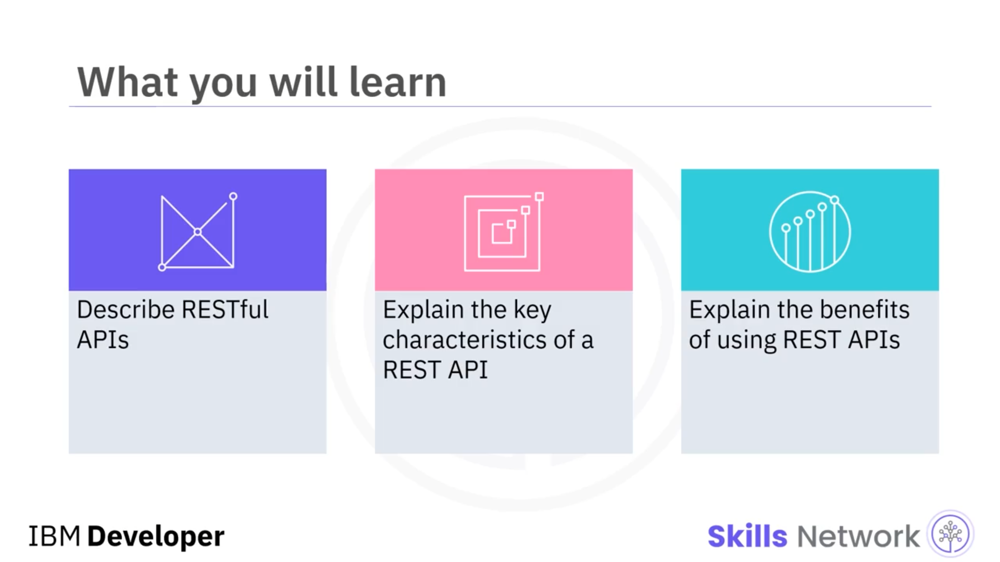
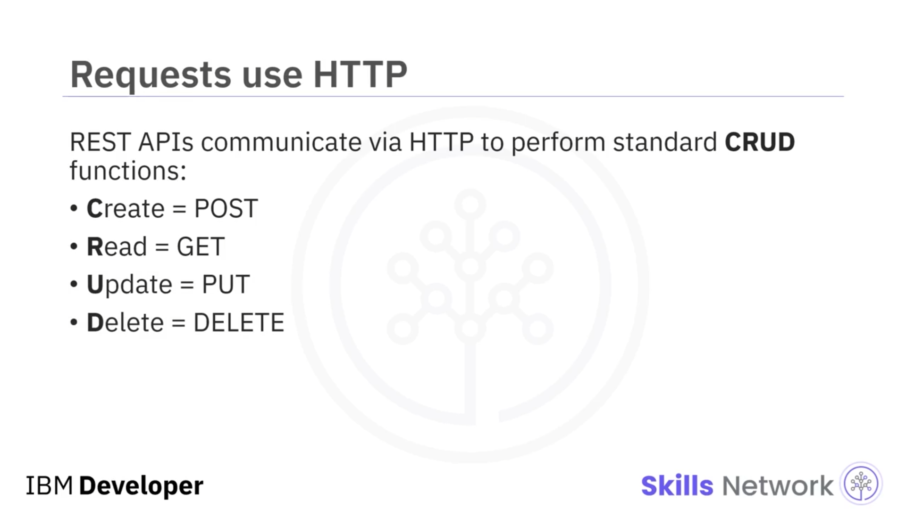

# 🔍 REST Nedir?

## 🎬 “What is REST?” Videosuna Giriş

‘What is REST?’ (REST Nedir?) videosuna hoş geldiniz. Bu videoyu izledikten sonra **RESTful API’leri** tanımlayabilecek, bir **REST API’nin temel özelliklerini** açıklayabilecek ve **REST API’leri kullanmanın faydalarını** açıklayabileceksiniz.

 **REST** , *Representational State Transfer* ifadesinin kısaltmasıdır. REST API’leri, uygulamaları entegre etmek için esnek ve hafif bir yol sağlar ve mikroservis mimarilerinde bileşenleri birbirine bağlamak için en yaygın yöntem haline gelmiştir.

Bu, uygulamaların bir ağ içinde birbirleriyle nasıl iletişim kurması gerektiğini tanımlayan bir **mimari stil**dir. Bir API’nin RESTful olarak sınıflandırılmasını sağlayan üç özelliği vardır:

* Tüm istekleri `HTTP` üzerinden yönetir,
* Durumsuz ( *stateless* ) istemci-sunucu iletişimi sağlar,
* Bileşenler arasında tekdüzen ( *uniform* ) bir arayüzden oluşur.

## ⚙️ REST ve CRUD İşlemleri

REST API’leri, bir kaynak içindeki kayıtları oluşturmak, okumak, güncellemek ve silmek gibi standart işlevleri (aynı zamanda *CRUD* olarak da bilinir) gerçekleştirmek için `HTTP` istekleri aracılığıyla iletişim kurar.

Örneğin, bir REST API:

* Bir kayıt oluşturmak için `POST` isteği,
* Bir kaydı almak için `GET` isteği,
* Bir kaydı güncellemek için `PUT` isteği,
* Bir kaydı silmek için `DELETE` isteği

kullanır.

## 🧠 Durumsuzluk (Statelessness) ve Ölçeklenebilirlik

REST API’leri  **durumsuzdur ( *stateless* )** , yani her istek, işlenmesi için gerekli tüm bilgileri içerir.

REST’in ortaya koyucusu olan  **Roy Fielding** , tezinde şunu söylemiştir:

> “Her istemciden sunucuya giden istek, isteği anlamak için gerekli tüm bilgileri içermelidir ve sunucu tarafında tutulan herhangi bir bağlamsal durumdan yararlanamaz. Oturum durumu ( *session state* ) bu nedenle tamamen istemcide tutulur.”

REST API’lerinin bu durumsuz yapısı aynı zamanda onları **ölçeklenebilir** kılar.

## 🔗 Tekdüzen Arayüzün (Uniform Interface) Faydaları

RESTful API’lerin başlıca faydası, isteğin nereden geldiğinden bağımsız olarak **tekdüzen bir arayüz** sağlamasıdır.

Bir REST API, aynı veri parçasının, örneğin bir ürün kimliğinin ( *product id* ), yalnızca tek bir  **Uniform Resource Identifier** ’a ( *URI* ) ait olmasını sağlamalıdır.

Ve kaynaklar, istemcinin ihtiyaç duyabileceği her bilgiyi içermelidir. Örneğin, istemci ürünün adını ve fiyatını talep edebilir.

## 💱 REST’e CEX.IO Üzerinden Bir Örnek

Şimdi bir REST örneğine bakalım. **CEX.IO** bir kripto para borsasıdır. Geliştiricilere, **bitcoin** ve diğer kripto para fiyatlarını ve piyasa verilerini bir **REST API** aracılığıyla sağlar.

## 📚 CEX.IO Geliştirici Dokümantasyonu

CEX, geliştirici bölümünde tüm API çağrılarını, hem istek hem de yanıt parametrelerine ilişkin ayrıntılı bilgilerle birlikte, basit bir `JSON` formatında belgelemiştir.

Ayrıca `JavaScript`, `Python`, `C#` ve `Java` dillerinde örnek istekler ve kod parçacıkları da sunmuştur.

Örneğin, herkese açık ( *public* ) API’leri aracılığıyla bir para birimi çiftinin son fiyatını talep edebilirsiniz.

## ✅ Bu Videoda Öğrendikleriniz

Bu videoda şunları öğrendiniz:

* REST API’leri, bileşenler arasında **esnek ama tekdüzen arayüzler** sağlar.
* REST API’leri **durumsuzdur ( *stateless* )** ve  **ölçeklenebilirdir** .
* REST API’leri, `POST`, `GET`, `PUT` ve `DELETE` gibi `HTTP` metotlarını kullanarak iletişim kurar.
* REST, uygulamaların nasıl iletişim kurduğunu tanımlayan bir **mimari stil**dir.

