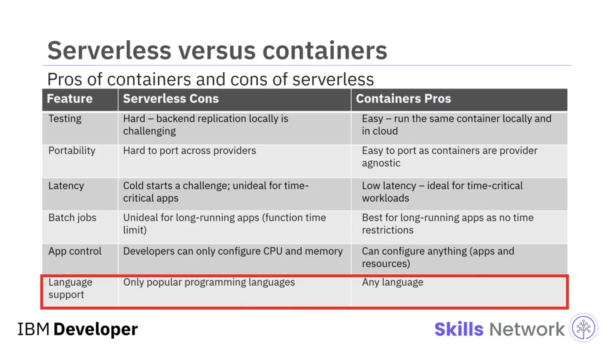

# ⚖️ Serverless'in Artıları ve Eksileri

## 🎯 Giriş ve Öğrenme Hedefleri

'Serverless'in Artıları ve Eksileri' bölümüne hoş geldiniz.

Bu videoyu izledikten sonra, *serverless* bilişimin faydalarını açıklayabilecek, *serverless* bilişimin kısıtlarını tanımlayabilecek ve  *serverless* 'in artı ve eksilerini konteynerler ve geleneksel bilişimle karşılaştırabileceksiniz.

## 🏛️ Geleneksel Bilişimdeki Zorluklar ve Serverless'ın Ortaya Çıkışı

Öyleyse önce geleneksel bilişimdeki zorlukları ve *serverless* bilişimin ortaya çıkışının bunların nasıl üstesinden geldiğini anlayalım.

Geleneksel bilişimde geliştirme ve operasyon ekipleri kendi altyapılarını kurar ve bakımını yapar.

Bu süreçler çok zaman alır, karmaşıktır ve sermaye yatırımları gerektirir.

Buna karşın bulut, konteynerler ve *serverless* bilişimin ortaya çıkmasıyla birlikte geliştirme ekipleri, altyapı, ölçeklenebilirlik ve hata toleransı konusunda endişelenmeden, yüksek kaliteli kod yazmaya ve uygulamalarını milisaniyeler içinde inşa edip çalıştırmaya odaklanabilir.

Ancak *serverless* bilişimin de *vendor lock-in* (sağlayıcıya bağımlılık), üçüncü taraf bağımlılıkları ve ağ ( *networking* ) gibi kendine özgü zorlukları vardır.

## 🚀 Serverless Bilişimin Faydaları

Şimdi *serverless* bilişimin fayda ve kısıtlarına bakalım ve ardından bunları konteynerler ve geleneksel bilişim ile karşılaştıralım.

*Serverless* bilişimde işin büyük bir kısmını bulut sağlayıcıları üstlenir ve bu da birçok fayda getirir.

Altyapı kurulumu ve bakım gereksinimleri yoktur, çünkü bunların tamamını bulut sağlayıcısı yönetir; bu da maliyetleri düşürür.

Bulut sağlayıcıları güvenilirliği sağlar; bu da yüksek erişilebilirlik ve hata toleransı ile sonuçlanır.

Geliştiriciler, uygulamalara odaklanıp en iyi yaptıkları işi yaptıkları için bundan fayda sağlar.

*Serverless* olmadan uygulamanızın tüm bileşenleri sürekli çalışır ve bu da kaynak israfına yol açar.

*Serverless* fonksiyonlar, uygulamanızı yalnızca ihtiyaç duyulduğunda belirli bölümleri çalışacak şekilde yapılandırmanıza olanak tanır.

Örneğin, kullanıcıların oturumlarını açık tutmak için bir uygulamanın ön yüzünün (front end) sürekli çalışması gerekir.

Ancak bir kimlik doğrulama (authentication) hizmeti yalnızca ara sıra çağrıldığı için kaynak ve maliyet tasarrufu sağlar.

Fonksiyonlar milisaniyeler içinde çalışırken, konteynerların veya sanal makinelerin (VM'lerin) çalışma süreleri sırasıyla saniyeler ve dakikalar mertebesindedir.

Pek çok bulut sağlayıcısı, daha hızlı geliştirme, dağıtım ve güncellemeler için *Integrated Development Environment (IDE)* adı verilen yerleşik bir kod editörü sunar.

Kullanılmayan (boşta duran) kaynaklar için değil, istek başına ödeme ( *pay-per-request* ) esasına göre ücretlendirilirsiniz.

Geliştirme için herhangi bir popüler programlama dilini kullanabilirsiniz.

Kimlik doğrulama, veritabanı ve diğer arka uç (backend) hizmetleri için bol miktarda üçüncü taraf desteği mevcuttur.

Geliştiriciler yalnızca geliştirmeye odaklandığından, kuruluşlar da kendi işlerine odaklanabilir ve ürünleri rakiplerinden daha hızlı piyasaya sürebilir.

*Serverless* ortamı, başarısızlıklar yaşansa bile daha fazla yenilik ve deneme yapmaya olanak tanır.

Ve yönetilecek bir altyapı olmadığı için, daha çevreci bir bilişim yaklaşımı da kesin bir olasılık haline gelir.

## ⚠️ Serverless Bilişimin Kısıtları ve Zorlukları

Ancak *serverless* bilişim, bazı kısıtları olduğu için her durum için en iyi seçenek değildir:

Pek çok kuruluş, ani dalgalanmalar gösteren iş yüklerinde önemli maliyet tasarrufları elde eder; ancak uzun süre çalışan süreçlerle karakterize edilen iş yüklerinde, *kullandıkça öde* ( *pay-per-use* ) modelinin avantajları azalır.

Ve bu tür uygulamalar için geleneksel bir ortam daha maliyet etkin olabilir.

Bulut sağlayıcılarının teknolojilerine ve ortamlarına olan bağımlılık, *vendor lock-in* (sağlayıcıya kilitlenme) riskine yol açar.

İstekler uzun aralıklarla geliyorsa, uygulamaların çoğu zaman tüm süreçleri yeniden başlatması gerekir; buna *cold start* (soğuk başlatma) denir.

Ve bu, fonksiyonun çalışma süresini artırır.

*Serverless* gecikmesi, bankacılık, sağlık hizmetleri veya uç (edge) ile ilgili uygulamalar gibi zamana kritik uygulamalar için kabul edilemez düzeydedir.

Saldırı yüzeylerinin uç noktalarından kaynak koda doğru değişmesi ve sağlayıcının güvenlik uygulamalarındaki sınırlamalar nedeniyle güvenlik endişeleri artar.

Her dağıtık sistemde izleme ( *monitoring* ) ve hata ayıklama ( *debugging* ) karmaşıktır.

Arka uç hizmeti olarak sunulan *backend-as-a-service (BaaS)* ortamını yerel sisteminizde bire bir taklit edemediğiniz için, tüm işlevselliği test etmek ve uygulama sorunlarının hata ayıklamasını yapmak zordur.

Dil desteği, bulut sağlayıcısına bağlıdır.

Ve tüm bulut sağlayıcıları tüm programlama dilleri için destek sunmaz; dolayısıyla bulut sağlayıcınızın desteklediği dillerle sınırlı kalırsınız.

Sunucular üzerinde kontrolünüz olmadığı için, kullanım ya da performans açısından optimize edebileceğiniz sunucular da yoktur.

Ayrıca, durumun ( *state* ) kalıcı olması söz konusu değildir.

Örneğin, aynı fonksiyonun bir sonraki çağrısında önceki çalıştırmanın durumu mevcut olmayacaktır.

Yerel önbellek yalnızca birkaç saat sürdüğü için, `Redis` veya `Memcached` gibi düşük gecikmeli harici önbellekleri kullanmak daha iyidir.

## 🔗 Serverless ve Konteynerların Birlikte Kullanımı

*Serverless* ve konteynerlar birlikte çalışabilir mi? Kesinlikle!

*Serverless* ve konteynerlar birbirini dışlayan kavramlar değildir.

Hibrit bir çözümde birlikte en iyi şekilde çalışırlar.

*Serverless* mı yoksa konteynerlar mı seçeceğiniz konusunda zorlanıyorsanız, sektörün standart tavsiyesini izleyin:

“Önce *serverless* olarak inşa edin, gerekirse konteynerlara geçin.”

## ⚖️ Serverless vs Konteynerlar

Şimdi *serverless* bilişim ve konteynerleştirmeyi karşılaştıralım; önce  *serverless* 'ın artıları ve konteynerların eksileriyle başlayalım:

*Serverless* bilişim, yalnızca kullandığınız kadar ödediğiniz için daha maliyet etkindir.

*Serverless* için ölçeklenebilirlik tamamen bulut sağlayıcısı tarafından yönetilir.

Bulut sağlayıcısı tüm altyapıyı yönetir.

Dağıtım süresi, saniyeler yerine milisaniyeler mertebesindedir.

Ve pazara çıkış hızı açısından, geliştirme hızlı olduğundan, kuruluşlar altyapıyı dert etmeden temel işlerine odaklanabilir.

Şimdi de konteynerların artıları ve  *serverless* 'ın eksilerini ele alalım:

Konteynerlarla yerel bir ortamda veya bulutta test yapmak daha kolaydır.

Konteynerlar, işletim sisteminden, dilden ve sağlayıcıdan bağımsız oldukları için taşınmaları daha kolaydır.

Konteynerlarda gecikme ( *latency* ) çok düşüktür; bu nedenle zamana kritik iş yükleri için bile uygundurlar.

Konteynerlar, toplu işler (batch job) için tamamlama süresi sınırlaması olmadığı için uzun süre çalışan uygulamalar için de idealdir.

Konteynerlarla hem uygulamaları hem de kaynakları yapılandırabilirsiniz.

Ve dil desteği açısından, konteynerleştirme herhangi bir dili destekler.

## 🆚 Serverless vs Geleneksel Bilişim

Şimdi de *serverless* bilişim ve geleneksel bilişimi karşılaştıralım;  *serverless* 'ın artıları ve geleneksel bilişimin eksileriyle başlayalım:

*Serverless* mimari, geliştiricilerin yüksek kaliteli kod yazmaya odaklandığı bir bulut bilişim modelidir.

*Serverless* bilişim, yalnızca kullandığınız kadar ödediğiniz için daha maliyet etkindir.

Ölçeklenebilirlik tamamen bulut sağlayıcısı tarafından yönetilir.

Ve kütüphaneler ile entegrasyonlar uygulama içinde hazır olarak bulunur.

Ve son olarak, geleneksel bilişimin artılarını ve  *serverless* 'ın eksilerini ele alalım:

Geleneksel bilişimde veriler sizin kontrolünüz altındadır.

Ağ yapısı ( *networking* ) açısından, özel uygulama programlama arayüzleri (API'ler) kurmak yerine, normal İnternet Protokolü (IP) adresleri üzerinden erişim sağlarsınız.

Güvenliğin yalnızca kuruluşun ağ sınırları içinde uygulanması gerekir.

Ve tüm yapıyı siz yönettiğiniz için, *vendor lock-in* (sağlayıcıya kilitlenme) oldukça nadirdir.

## 📚 Özet

Bu videoda şunları öğrendiniz:

* Geleneksel bilişimde altyapıyı siz kurar ve bakımını yaparsınız; *serverless* bilişimde ise geliştirme ekipleri yüksek kaliteli kod yazmaya odaklanabilir.
* *Serverless* bilişim, yerleşik yüksek erişilebilirlik ve hata toleransı, daha hızlı fonksiyon çalışma süreleri ve istek başına faturalandırma ( *pay-per-request* ) gibi çeşitli faydalar sunar.
* *Serverless* bilişimin, zamana kritik uygulamalar için kabul edilemez gecikme, karmaşık izleme ve hata ayıklama ve durumun kalıcı olmaması gibi bazı kısıtları vardır.
* *Serverless* ve konteynerlar birbirini dışlamaz ve hibrit bir çözümde birlikte en iyi şekilde çalışırlar.
* Ve son olarak, *serverless* ile geleneksel bilişimin her birinin kendine özgü artıları ve eksileri vardır.

