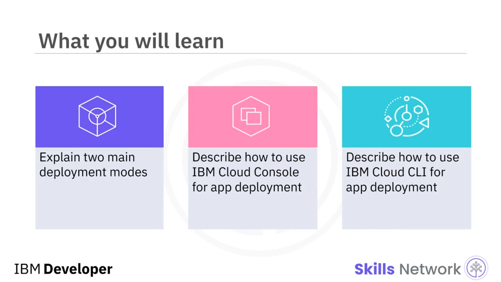
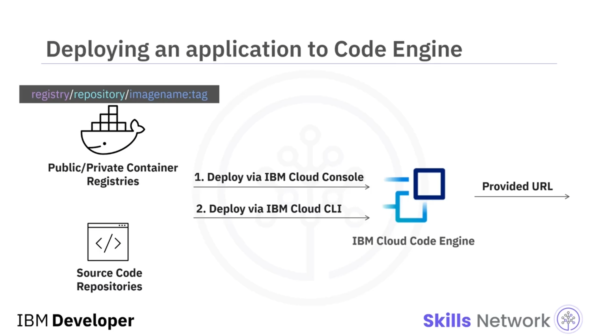

# 🚀 Uygulamaları Dağıtma ve Çalıştırma

## 🎯 Video Hedefleri ve Dağıtım Modları

“Uygulamaları Dağıtma ve Çalıştırma”ya hoş geldiniz. Bu videoyu izledikten sonra, konteyner imajı tabanlı bir uygulamayı dağıtmanın iki temel şeklini açıklayabilecek, uygulama dağıtım süreci için  *IBM Cloud Console* ’ın nasıl kullanılacağını ve yine uygulama dağıtım süreci için  *IBM Cloud CLI* ’nin nasıl kullanılacağını anlatabileceksiniz.



Konteyner imajı tabanlı uygulamanızı  *IBM Cloud Code* ’a bu iki moddan birini kullanarak dağıtabilirsiniz: İlk olarak, konteyner imajınızı özel veya genel bir  *container registry* ’ye oluşturup gönderebilirsiniz.  *Cloud Code Engine* , benzersiz bir imaj adıyla bu imajı çekebilir ve kayıt defterine erişim yetkisi vererek otomatik olarak dağıtabilir. Ya da, imajınızı manuel olarak oluşturmak istemiyorsanız, kodunuzla birlikte bir *Dockerfile* veya bir *buildpack* belirtebilir ve  *Cloud Engine* ’e uygulamanızı kaynak koddan oluşturup ardından dağıtması için talimat verebilirsiniz. Dolayısıyla, özünde bu iki mod aynıdır. Tek fark, konteyner imajını oluşturma ve gönderme sorumluluğunun kimde olduğudur.


---

## 🌐 IBM Cloud Console ve IBM Cloud CLI’ye Genel Bakış

 *IBM Cloud Console* , son kullanıcıların *Code Engine* de dahil olmak üzere IBM bulut servislerini kolayca yönetebilmesi için iyi tasarlanmış bir web portalıdır. *IBM Cloud Console* içinde, yalnızca birkaç tıklamayla uygulamayı kolayca oluşturup dağıtabilirsiniz.

Komut satırı arayüzüne ( *command line interface – CLI* ) aşinaysanız ve daha hassas bir dağıtım yapmak istiyorsanız, uygulamayı oluşturmak ve dağıtmak için  *IBM Cloud CLI* ’yi seçebilirsiniz. Ardından, uygulamanız *Code Engine* üzerinde dağıtıldıktan sonra, Engine size uygulamanızın ana sayfasına veya mikro servisinizin giriş uç noktasına yönlendirebilen bir uç nokta URL’si sağlayacaktır.

Bahsedildiği gibi, *IBM Cloud Console* uygulamanızı kolayca oluşturup dağıtmanıza yardımcı olmak için iyi tasarlanmış bir kullanıcı arayüzü sunar. Şimdi bir uygulama oluşturmanın temel adımlarına bakalım. İlk olarak, uygulamanızın adını belirtmeniz gerekir.



---

## 🧩 IBM Cloud Console Üzerinden Uygulama Oluşturma Adımları

Daha sonra, bir  *Container image* ’dan mı yoksa bir  *Source code* ’dan mı dağıtım yapacağınızı seçebilirsiniz. Burada varsayılan *Container image* seçeneğini seçersiniz.

Ve ardından,  *code engine* ’in imajınızı kayıt defterinden çekebilmesi için imajınıza ait referansı ve isteğe bağlı olarak kayıt defteri erişimini sağlamanız gerekir. Ancak bunların yalnızca temel adımlar olduğunu unutmayın. Uygulamanızın gereksinimlerine göre yapılandırabileceğiniz başka gelişmiş ayarlar da vardır.

Dolayısıyla, uygulama oluşturulduktan sonra *cloud engine* bunu otomatik olarak dağıtacaktır. Uygulama hatasız çalışırsa, birkaç dakika içinde hazır olmalıdır.


---

## 💻 IBM Cloud CLI ile Uygulama Dağıtımı ve Testi

Uygulama hazır olduktan sonra, bir URL kullanarak test etmek için  **Test application** ’a tıklayabilirsiniz. Alternatif olarak, komut satırı arayüzünü tercih ediyorsanız, uygulamanızı *IBM Cloud CLI* kullanarak dağıtabilirsiniz.


Bir uygulama oluşturup dağıtmak için kullanılan temel komut `ibmcloud ce app create` komutudur:

```bash
ibmcloud ce app create
```

Bu komutun üç ana argümanı vardır: uygulamanızın adı, bir *container registry* içindeki imaj referansı ve konteyner kayıt defteri herkese açık değilse bir kayıt defteri erişimi. Bir örneğe bakalım: Burada, `us.icr.io` kayıt defteri sunucusundaki bir imajdan `helloworldapp` adlı bir uygulama oluşturmak istiyorsunuz.  *Code Engine* ’in imajı çekebilmesi için, `myregistry` adlı bir kayıt defteri erişimi oluşturur ve sağlarsınız.


Şimdi, uygulama oluşturulup dağıtıldıktan sonra, uygulamanızı çalıştırıp test etmek için `ibmcloud ce app get` komutunu kullanabilirsiniz:

```bash
ibmcloud ce app get
```

Bu komutun iki ana argümanı vardır: uygulamanızın adı ve URL gibi, uygulamanızın çıktısının biçimi. Burada, daha önce dağıtılmış olan `helloworldapp` uygulamasının çıktısını almak için bir örneğe bakalım.

Uygulama adını vererek `ibmcloud ce app get` komutunu çağırır ve çıktı biçimini URL olarak belirlersiniz. Daha sonra, komut çıktısından uygulamanızın herkese açık olarak erişilebilen URL’sini görebilirsiniz.


---

## ✅ Özet


Bu videoda, bir *Cloud Engine* uygulamasını ya gönderilmiş bir konteyner imajından ya da bir kaynak kod deposundan oluşturabileceğinizi öğrendiniz. Ve tercihlerinize göre, uygulama dağıtım görevlerini gerçekleştirmek için *IBM Cloud Console* veya *IBM Cloud CLI* kullanmayı seçebilirsiniz.


