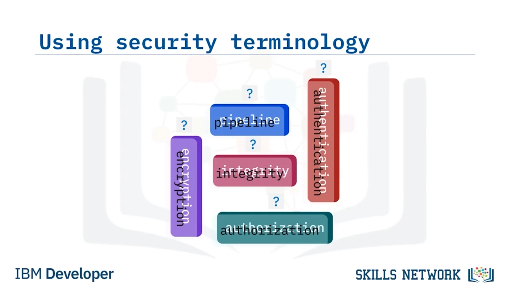

# 🔐 Güvenlik Kavramları ve Terminoloji

## 🎥 Giriş

Güvenlik Kavramları ve Terminoloji’ye hoş geldiniz!

Bu videoyu izledikten sonra şunları yapabileceksiniz:

Temel güvenlik terimlerini tanımlamak ve temel güvenlik kavramlarını açıklamak.

Hiç, temel güvenlik kavramlarının ve terimlerinin aslında ne anlama geldiğini merak ettiniz mi?

Eminim güvenlik profesyonelleri bunların ne anlama geldiğini biliyordur. Ancak bir yazılım mühendisi olarak itiraf etmeliyim ki, bazen onların başka bir gezegenden geldiklerini düşünüyorum!

“ *Integrity* ” ve “ *authentication* ” gibi terimlerin, net bir anlamı yokmuş gibi etrafa saçıldığını hissediyor musunuz?

Bu videoyu izledikten sonra, güvenlik kavramlarını temsil eden terimler hakkında artık böyle hissetmeyeceksiniz.

---

## 🆔 Kimlik Doğrulama ( *Authentication* ) ve Yetkilendirme ( *Authorization* )

Öncelikle, *authentication* (kimlik doğrulama) ve *authorization* (yetkilendirme) kavramlarını duyarsınız.

Aralarındaki fark nedir?

 *Authentication* , bir kullanıcının kimliğini doğrulama sürecidir.

Bu, birinin gerçekten iddia ettiği kişi olduğundan emin olmak anlamına gelir. Kimliklerinin gerçek (authentic) olduğu anlamına gelir.

Diğer yandan,  *authorization* , bir kullanıcının erişim haklarını belirleme sürecidir.

Başka bir deyişle: Artık kim olduğunuzu bildiğime göre; ne yapmanıza izin veriliyor?

Dolayısıyla bir kullanıcıyı kimlik doğrulamadan geçirdikten sonra, o kullanıcı yetkilendirilebilir.

 *Authorization* , kullanıcının yalnızca yapmasına izin verilen şeyleri yapabildiğinden emin olur.

---

## 🔒 Şifreleme ( *Encryption* )

Sırada, tam olarak *encryption* (şifreleme) nedir?

 *Encryption* , bilgiyi yalnızca yetkili erişimi olan kullanıcıların çözebileceği şekilde kodlama sürecidir.

Yetkili erişim, doğru erişim haklarına sahip olmak anlamına gelir.

Şifrelemenin iki ana türü vardır:

*Simetrik şifreleme* ( *symmetric encryption* ), hem şifreleme hem de şifre çözme için aynı anahtarın kullanılması durumudur.

*Asimetrik şifreleme* ( *asymmetric encryption* ) ise, şifreleme ve şifre çözme için farklı anahtarların kullanılması durumudur.

---

## 🧩 Bütünlük ( *Integrity* )

Sırada, açık ve net bir tanımı yokmuş gibi görünen terimlerden biri olan *integrity* (bütünlük) var.

Aslında, net bir tanımı vardır!

 *Integrity* , verinin, kimliği doğrulanmamış bir kaynak tarafından değiştirilmediğinden emin olma sürecidir.

Bu, okuduğunuz veriye güvenebileceğiniz anlamına gelir.

Örneğin, bütünlüğe ulaşmanın bir yolu, güvenli özet (hash) algoritmaları kullanmaktır.

Bu, verinin bir özetini (hash’ini) oluşturur; böylece algoritmayı daha sonra yeniden uyguladığınızda, beklenenden farklı bir sonuç elde edip etmediğinizi kontrol edebilirsiniz; bu da verinin kurcalandığını (değiştirildiğini) gösterecektir.

---

## 🔁 CI/CD Kavramı

Karşılaşmış olabileceğiniz bir diğer terim  *CI/CD* ’dir.

 *CI/CD* ’nin ana fikri, uygulama geliştirme hattında otomasyon kullanmaktır.

 *CI/CD* ’nin *CI* kısmı, *continuous integration* (sürekli entegrasyon) anlamına gelir; bu, yeni kod değişikliklerinin düzenli olarak derlenmesi, test edilmesi ve birleştirilmesi demektir.

 *CI/CD* ’nin *CD* kısmı ise aslında iki kavramı ifade eder:

Birincisi, *continuous delivery* (sürekli teslimat); bu, test edilmiş değişikliklerin otomatik olarak geliştirme, test veya hazırlık (staging) ortamına çıkarılması anlamına gelir.

İkincisi, *continuous deployment* (sürekli dağıtım); bu ise yeni sürümlerin otomatik olarak üretim ortamına dağıtılması anlamına gelir.

---

## 🛡️ CI/CD Hattında Güvenlik ve SDLC

*CI/CD* hattındaki güvenlik, yazılım geliştirme yaşam döngüsü ( *SDLC – Software Development Lifecycle* ) için hayati öneme sahiptir.

Güvenliği göreli olarak kolay bir şekilde uygulayabilirsiniz.

Örneğin:

Sürekli entegrasyon aşamasının başlarında kaynak kodunu tarayın.

Güvenlik açıklarını ortaya çıkarmak için kaynak kod taraması ve analizi gerçekleştirin.

Ardından, *CI/CD* hattına daha fazla test ekleyin.

Diğer *CI/CD* testleriyle birlikte güvenlik testleri de gerçekleştirin.

Ve dağıtımdan sonra bile yeni tehditleri sürekli olarak tespit edip raporlayın.

Üretim ortamında ortaya çıkan tehditleri tespit etmek için çalışma zamanı (runtime) güvenliğini entegre edin.

---

## 📌 Bu Videoda Öğrendikleriniz

Bu videoda şunları öğrendiniz:

* *Authentication* (kimlik doğrulama), bir kullanıcının kimliğini doğrular.
* *Authorization* (yetkilendirme), bir kullanıcının erişim haklarını belirler.
* *Symmetric encryption* (simetrik şifreleme), aynı anahtarlarla şifreleme ve şifre çözme yapılması anlamına gelir.
* *Asymmetric encryption* (asimetrik şifreleme), şifreleme ve şifre çözmenin farklı anahtarlarla yapılması anlamına gelir.
* Ve güvenliği, *continuous integration/continuous delivery (CI/CD)* hattına uygulayabilirsiniz.

