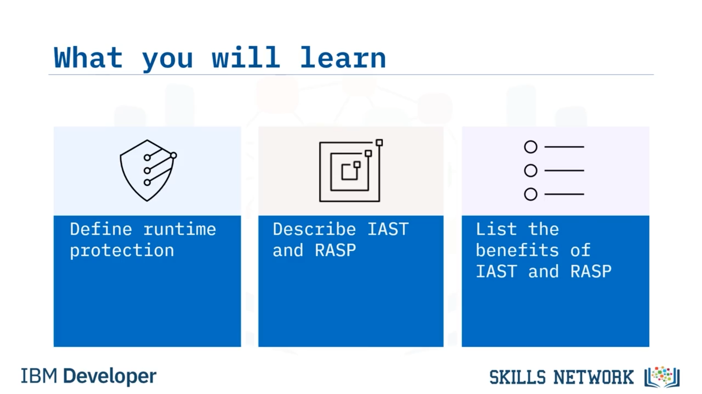

# 🛡️ Çalışma Zamanı Koruması

### 🎬 Giriş

Çalışma Zamanı Koruması'na hoş geldiniz! Bu videoyu izledikten sonra şunları yapabileceksiniz:

* Çalışma zamanı korumasını tanımlamak
* *Interactive application security testing* (veya  *IAST* ) ve *runtime application self-protection* (veya  *RASP* ) [“rasp” şeklinde telaffuz edilir] kavramlarını açıklamak
* IAST ve RASP'in faydalarını sıralamak

---

### 🧩 Çalışma Zamanı Koruması Nedir?

Önce, çalışma zamanı koruması nedir?

Çalışma zamanı koruması, uygulamalar çalışırken onları tehditlere karşı koruyan modern bir güvenlik mekanizmasıdır.

Peki çalışma zamanı korumasını nasıl sağlayabilirsiniz?

Uygulamalar çalışırken zayıflıkları tarayabilen güvenlik araçlarını kullanın.

*Interactive Application Self-testing* (veya  *IAST* ), test süreci sırasında güvenlik açıklarını tarar.

Ve *Runtime Application Self-Protection* (veya  *RASP* ), üretim ortamındaki saldırıları arar.

---

### 🧪 IAST’in Rolü ve Özellikleri

Test sırasında IAST'i uyguladığınızda, uygulama kamuya sunulmadan önce güvenlik açıklarını gerçek zamanlı olarak tespit eder.

Sorunun nerede olduğunu bulmak ve veri ihlallerine yol açmadan önce onu hızla düzeltmek için kritik bilgiler elde edersiniz.

Ayrıca IAST'i diğer otomatik test prosedürleriyle birlikte çalıştırabilirsiniz.

## Peki, IAST'in bazı özellikleri nelerdir?

IAST, uygulamanızı gerçek zamanlı olarak incelerken düşük sayıda yanlış pozitif üretir.

IAST'i *continuous integration/continuous delivery* (veya  *CI/CD* ) süreçlerine entegre etmek basittir.

Standart derleme, test ve kalite güvence araçlarıyla sorunsuz biçimde bağlanabilir ve yanlış pozitifleri azaltmak için çok fazla yapılandırma veya ayarlama yapmanız gerekmez.

IAST, daha erken ve daha az maliyetli düzeltmeler yapılmasını sağlar.

Kodunuzla yakından çalıştığınız geliştirme yaşam döngüsünün erken aşamalarında güvenlik açıklarını tespit etmenize ve düzeltmenize avantaj sağlar.

Hataları ve güvenlik açıklarını düzeltmenin kaynaklar ve güvenlik riski açısından en az maliyetli olduğu zamandır.

Ayrıca IAST, herhangi bir kurumsal alanda ölçeklenebilir.

Ve IAST; otomatik ve manuel yöntemlerin yanı sıra Docker teknolojisi de dâhil olmak üzere çeşitli dağıtım yöntemlerini destekler.

---

### 🛡️ RASP’in Rolü ve Özellikleri

Uygulamanızı dağıttığınızda ve üretim ortamında çalıştığında, RASP üretim ortamında çalışma zamanı düzeyinde koruma sağlayabilir.

Kodunuzun riskli bölümleri hakkında görünürlük sağlar.

Bir uygulamaya entegre edildiğinde RASP, programın davranışını ve etkinliğin bağlamını değerlendirerek yazılımı zararlı girdilere karşı korur.

RASP, insan müdahalesi gerektirmeden saldırıları gerçek zamanlı olarak belirlemeye ve önlemeye yardımcı olur.

Uygulamayı izlerken etkinliği sürekli olarak gözlemler ve değerlendirir.

## Peki, RASP'in bazı özellikleri nelerdir?

RASP, istismara karşı koruma sağlar.

Yapılandırılmış sorgu dili (veya  *SQL* ) enjeksiyonu, açık istismarı ve botlar da dâhil olmak üzere kötü amaçlı etkinliğe işaret edebilecek tüm trafik türlerini yakalar.

RASP bir tehdit algıladığında, kullanıcının oturumunu sonlandırabilir ve güvenlik ekibini bilgilendirebilir.

RASP doğrudan bir uygulamanın içinde çalışabilir.

Dağıtımı basittir ve uygulama davranışını izleme ve kendini koruma yeteneğine doğası gereği sahiptir.

RASP saldırıları yüksek hassasiyetle tespit eder ve önler, kötü amaçlı istekleri meşru isteklerden ayırır ve yanlış pozitifleri en aza indirir.

RASP'i farklı DevOps sistemlerine dâhil edebilirsiniz.

---

### ☁️ RASP ve Bulut Ortamı

Bulutu güvence altına almak kolay bir iş değildir ve çok çaba gerektirir; çünkü uygulamalar, güvenli ağınızın dışında, başka birine ait altyapı üzerinde çalışmaktadır.

Neyse ki RASP, bulut bilişimle son derece uyumludur.

---

### ✅ Bu Videoda Neler Öğrendiniz?

Bu videoda şunları öğrendiniz:

* Çalışma zamanı koruması, uygulamalar çalışırken onları güvenlik açıklarına karşı koruyan bir güvenlik mekanizmasıdır.
* IAST ve RASP, çalışan bir uygulamayı zayıflıklar açısından inceleyen güvenlik araçlarıdır.
* IAST, test süreci sırasında güvenlik açıklarını tarar.
* Ve RASP, üretim ortamındaki saldırıları tarar.

