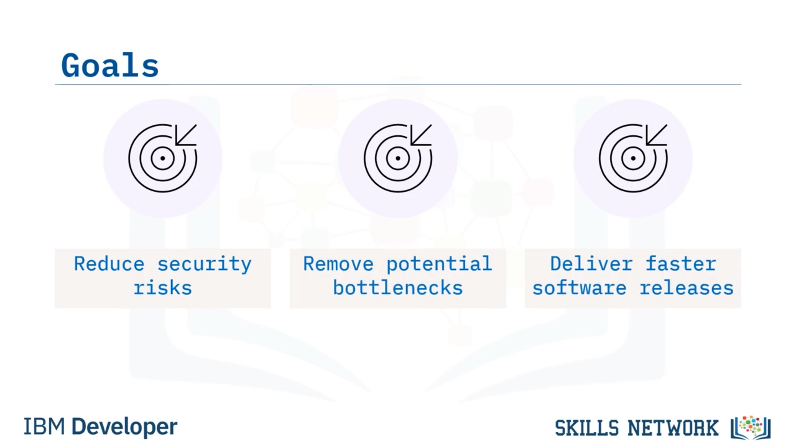
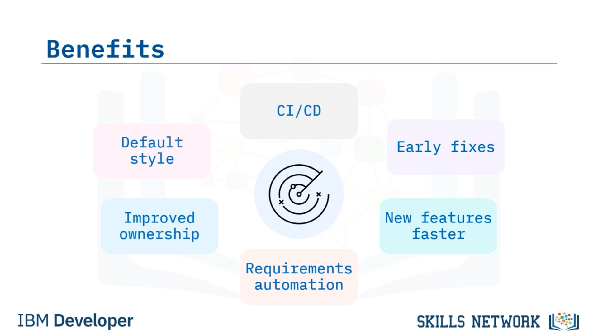

# 🔁 Sürekli Güvenlik Analizi

## 👋 Sürekli Güvenlik Analizine Hoş Geldiniz

Bu videoya hoş geldiniz! Bu videoyu izledikten sonra şunları yapabileceksiniz:

* *Sürekli güvenlik analizini* tanımlamak.
* Sürekli güvenlik analizinin faydalarını açıklamak.
* Sürekli güvenlik analizi için en iyi uygulamaları açıklamak.

---

## 🧩 Sürekli Güvenlik Analizi Nedir?

*Sürekli güvenlik analizi* ( *continuous security analysis* ), güvenliğin yazılım geliştirme yaşam döngüsü ( *software development lifecycle – SDLC* ) içinde kesintisiz olarak entegre edilmesi ve test edilmesidir.

Gereksinimler ( *Requirements* ) aşamasından başlayarak Tasarım ( *Design* ), Geliştirme ( *Develop* ), Test ( *Testing* ) aşamalarında ve kodu dağıttığınız ( *deploy* ) anda sürekli güvenlik analizi yürütürsünüz.

Sürekli güvenlik testi ve analizi, geliştirme sürecinin ilk aşamasından itibaren ve kod üretimdeyken, dağıtımdan sonra da bir öncelik olmalıdır.

---

## 🎯 Sürekli Güvenlik Analizinin Temel Amaçları

Peki, sürekli güvenlik analizinin temel amaçları nelerdir?

Sürekli güvenlik analizi, güvenlik risklerini azaltır ve geliştirmenin önündeki potansiyel darboğazları ortadan kaldırmanıza yardımcı olur. Bu nedenle, hızlı yazılım sürümleri teslim edebilmek için sürekli güvenlik analizi yapmak istersiniz.

Sürekli güvenlik analizini uygulayarak kuruluşunuz için güvenli bir SDLC oluşturursunuz. Sürekli güvenlik analizini uyguladığınızda, güvenlik SDLC içinde bir öncelik ve kritik bir faktör hâline gelir.

Bu nedenle, sürekli güvenlik analizini SDLC’ye entegre etmek birçok fayda sağlar. İlk olarak, sürekli güvenlik analizini doğrudan bir sürekli entegrasyon/sürekli teslimat ( *continuous integration/continuous delivery – CI/CD* ) hattına entegre edebilirsiniz.

---

## ⚙️ Geliştirme Sürecine Etkileri ve Otomasyon

SDLC boyunca sürekli güvenlik analizi yüksek bir öncelik olduğu için, güvenlik sorunlarını geliştirme sürecinin erken safhalarında çözebilirsiniz.

Sürekli güvenlik analizi, güvenliği sağladığınızda geliştirme sürecindeki kesintileri azalttığınız için yeni özellik geliştirilmesini hızlandırır.

Sürekli güvenlik analizinin bir diğer faydası da, mevcut ve yeni uygulama geliştirme için güvenlik gereksinimlerini otomatikleştirebilmenizdir.

Sürekli güvenlik analizi, geliştiriciler arasında yazılım sahipliğini ve sorumluluğunu artırır ve güvenli kodlama varsayılan bir geliştirme tarzı hâline gelir.

---

## 🛠️ Sürekli Güvenlik Analizi için Bir Araç: Snyk Open Source

Sürekli güvenlik analizi gerçekleştirmek için kullanabileceğiniz araçlardan biri  *Snyk Open Source* ’tur.

Bu araç, açık kaynak kütüphanelerdeki güvenlik açıklarını bulur ve düzeltir. Açık kaynak kütüphanelerin neden olduğu lisanslama sorunlarını tespit eder.

Geliştirme sırasında güvenlik açıklarını düzeltmek için öneriler sunar.

GitHub gibi bir kaynak kontrol yönetimi ( *source control management – SCM* ) kod deposuyla geliştirirken, çekme istekleri ( *pull requests* ) kullanarak güvenlik açıklarını düzeltir.

Ayrıca  *Snyk Open Source* , sorunlara öncelik verir ve yeni keşfedilen güvenlik açıkları hakkında raporlar oluşturur.

---

## 📌 Sürekli Güvenlik Analizi için En İyi Uygulamalar

*Sürekli güvenlik analizini* uygulamak için şu dört en iyi uygulamayı izleyin:

* Geliştirme boyunca güvenlik sorunlarını ve risklerini denetlemek için planlama yapılmasını zorunlu kılın.
* Kodunuzu güncel işletim sistemleri ve yazılımlar üzerinde, güvenli bir ortamda geliştirin.
* Güvenliği doğrudan tüm geliştirme yığınına ( *full development stack* ) yerleştirmek için kod geliştirme bileşenlerinin tamamını analiz edin.
* Tüm kod testlerinin birden fazla geçerli test ölçütünü karşılamasını sağlamak için, sürekli güvenlik analizine ek olarak statik uygulama güvenlik testi ( *static application security testing – SAST* ) ve yazılım bileşeni analizi ( *software composition analysis – SCA* ) uygulayın.

---

## ✅ Bu Videoda Neler Öğrendiniz?

Bu videoda şunları öğrendiniz:

* Sürekli güvenlik analizi, güvenliğin SDLC içinde kesintisiz entegrasyonu ve testidir.
* Sürekli güvenlik analizi, riski azaltır ve yazılım geliştirmedeki darboğazları ortadan kaldırır.
* *Snyk Open Source* , güvenlik ve lisanslama sorunlarını bulur ve düzeltir.
* Sürekli güvenlik analizi, yeni özellik geliştirilmesini hızlandırır.

