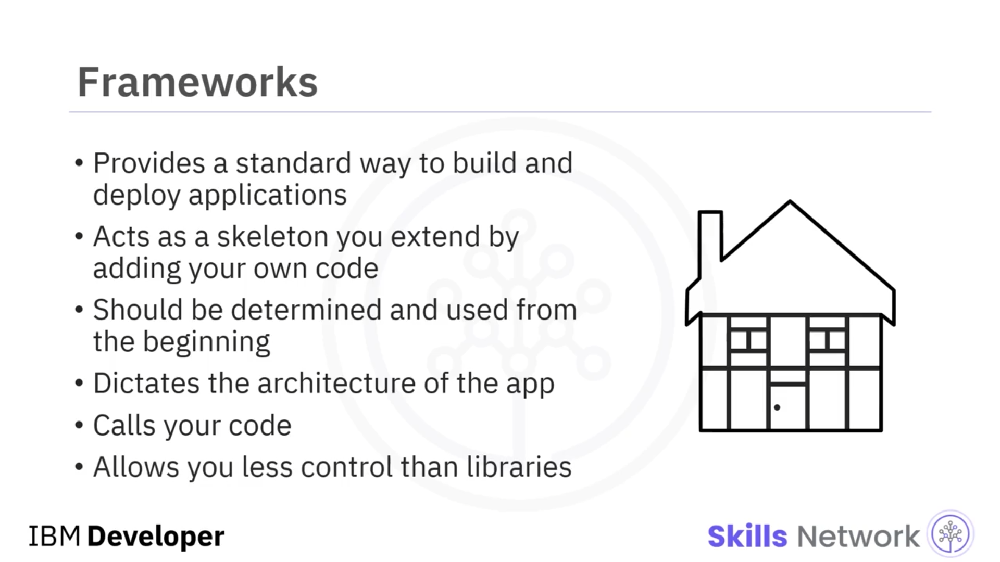

# 🛠️ Uygulama Geliştirme Araçlarının Tanıtımı

Uygulama Geliştirme Araçlarının Tanıtımına hoş geldiniz. Bulut uygulamanızı fikir aşamasından tam anlamıyla şekillenmiş, yazılmış ve dağıtılmış hâle getirmek uzun bir süreçtir, ancak bu süreç boyunca size yardımcı olacak pek çok araç vardır. Bir bulut uygulaması geliştiricisinin çalışma tezgâhında şunlar bulunur: Sürüm kontrolü, kütüphaneler ve framework’ler.

Birçok geliştirici aynı projede çalıştığında, kaynak kodun yeni bir sürümünü oluşturacak şekilde değişikliklerin hangi sırayla yapıldığını bilmek, son derece önemli hâle gelir. Sürüm kontrol sistemleri, hangi değişikliklerin ne zaman ve kim tarafından yapıldığını takip eder ve değişiklikler arasındaki çatışmaları giderir. Kodunuzu geliştirirken, projede tek katkıda bulunan kişi siz olsanız bile sürüm kontrolü faydalı olabilir. Doğru kullanıldığında, bir şeyler ters gittiğinde kodunuzun önceki bir sürümüne dönmenizi sağlar ve kodun zaman içinde nasıl geliştiğine dair temel bilgiler sunar.

Sürüm kontrol işlevselliği genellikle kullandığınız depolama sistemiyle bağlantılıdır; bu nedenle, yeni başlayanlar için bile bir kod deposu (repository) kullanmanız önerilir. Git ve GitHub, kaynak kodu depolama ve yönetimi için son derece popülerdir. Git, dosyaları, değişiklikleri takip edebileceğiniz, kodu daha odaklı geliştirme için farklı dallara ayırabileceğiniz ve ardından bunları kodun ana gövdesiyle tekrar birleştirebileceğiniz depolarda saklar.

Kütüphaneler, kendi kodunuz içinde kullanabileceğiniz standart programlar ve alt yordamlar (subroutine’ler) gibi kod koleksiyonlarıdır. Örneğin, bir carousel gibi gezinme özelliği eklemek isteyebilirsiniz; bir kod kütüphanesi size bunun için gerekli kodu sağlayabilir, böylece onu sıfırdan oluşturmak için zaman ve enerji harcamanız gerekmez. Bu şekilde kodu yeniden kullanabilmek, uygulamanızı geliştirmenizi çok daha hızlı ve kolay hâle getirir.

Birden fazla kod kütüphanesi mevcut projenize entegre edilebilir. Belirli bir işlev veya özellik ihtiyacı keşfettikçe, buna uygun bir kütüphane araştırabilirsiniz. Gerektikçe hangi yöntemi ne zaman çağıracağınıza siz karar verirsiniz. Alt yordam tamamlandığında kontrol program akışına geri döner. Bir kod kütüphanesi kullandığınızda, kontrol sizdedir. Kod kütüphaneleri genellikle belirli bir problemi çözmek veya belirli bir özellik kümesi eklemek için kullanılır. Her durumda, aralarından seçim yapabileceğiniz pek çok kütüphane vardır; bu yüzden araştırmanızı yapın.

İşte bazı kod kütüphanesi örnekleri: jQuery, DOM manipülasyonunu basitleştiren bir JavaScript kütüphanesidir. Email-validator, bir e-posta adresinin doğru biçimde oluşturulup oluşturulmadığını ve geçerli olup olmadığını kontrol eden küçük bir kütüphanedir. Apache Commons Proper, yeniden kullanılabilir Java bileşenlerinden oluşan bir depodur.

Framework’ler, uygulama oluşturmak ve dağıtmak için standart bir yol sağlar. Bir framework’ü, kendi kodunuzu ekleyerek genişletebileceğiniz ve uygulamalarınızı üzerinde inşa edebileceğiniz bir iskelet olarak düşünebilirsiniz. Kullanmayı düşündüğünüz framework, geliştirme planlamanızın erken aşamasında belirlenmeli ve en başından itibaren kullanılmalıdır. Yeni framework’ler mevcut bir projeye sonradan dâhil edilemez. Seçtiğiniz framework, programınızın mimarisini belirler ve program akışını kontrol eder. Framework, hangi alt yordamların ve yöntemlerin ne zaman çağrılacağını belirler.

Bir framework ile çalışırken uymanız gereken belirli bir yapı vardır. Framework’ü sizin çağırmanız yerine framework sizin kodunuzu çağırır. Framework’ler kütüphanelere göre daha az esnektir ve size daha az kontrol imkânı tanır; ancak iyi bir standartlaşma sağlar ve verimli kod yazmanıza yardımcı olabilir. Bir benzetme kullanacak olursak, eğer bir ev inşa eden bir marangozsanız, framework; dışına tuğlaları, içine alçıpanı ve benzeri öğeleri eklediğiniz iskeletin kendisidir. Bu iskelet, evin nasıl inşa edileceğine dair bir kılavuz görevi görür.

İşte bazı framework örnekleri: AngularJS, dinamik web uygulamaları için JavaScript tabanlı bir framework’tür. Vue.js, kullanıcı arayüzüne odaklanan bir JavaScript framework’üdür. Django, web geliştirme için Python kullanan bir framework’tür.

Framework’ler, ihtiyaç duyduğunuzda fonksiyonları çağırmanıza izin veren kütüphanelerden farklı olarak, uymanız gereken iş akışını tanımlar. Bir framework kullanırken, bazen bir geliştirici olarak geliştirme sürecinin tamamı üzerinde tam kontrole sahip olmadığınız hissine kapılabilirsiniz. Framework’ün ve onun önceden tanımlanmış iş akışının geliştirme sürecini kontrol ettiği bu his, kontrolün tersine çevrilmesi (inversion of control) olarak adlandırılır. Yüksek düzeyde kontrol sağlayan framework’lere “opinionated” denir; bu framework’ler iş akışlarının nasıl kullanılacağı konusunda “fikir sahibidir” ve normalde sizin vermeniz gereken kodun nasıl yazılacağı, dosyaların nerede bulunacağı, hatta dosya adlarının ne olacağı gibi birçok kararı ortadan kaldırır. Framework’ler çoğu zaman ihtiyaç duyduklarında çağırdıkları kendi kütüphanelerini içerir.

Kontrolün tersine çevrilmesi, standartlaştırılmış uygulamalar oluşturmanızı sağlar ve pek çok zahmetli yapılandırma işini ortadan kaldırarak, uygulamanızın koduna odaklanabilmenize imkân tanır. Bu videoda, geliştirici olarak kariyeriniz boyunca kullanacağınız bazı araçları öğrendiniz: sürüm kontrolü, kütüphaneler ve framework’ler.

