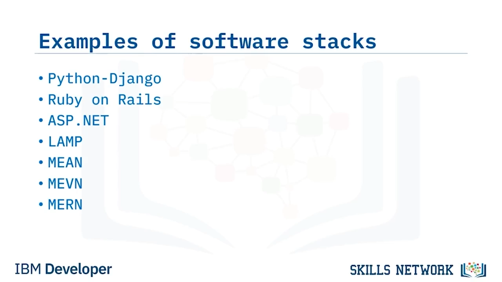

# 💻 Yazılım Yığınlarına Giriş

Yazılım Yığınlarına Giriş’e hoş geldiniz. Bu videoyu izledikten sonra, yazılım yığını terminolojisini açıklayabilecek, yaygın olarak kullanılan bazı yazılım yığınlarını tanımlayabilecek ve farklı yazılım yığınlarının faydalarını ve zorluklarını sıralayabileceksiniz.

## 🧱 Yazılım Yığını Nedir?

Bir yazılım yığını, yazılımlar ve programlama dilleri de dahil olmak üzere teknolojilerin bir birleşimidir. Geliştiriciler, web ve mobil uygulamalar gibi uygulamalar ve çözümler oluşturmak için bir yazılım yığını kullanırlar.

Tek tek teknolojilerden oluşan bu küme, bir hiyerarşi içinde “yığılır” ve bir uygulamanın çalıştırılmasını desteklemek için birlikte çalışır. Yığının üst seviyeleri kullanıcı için görevler veya hizmetler sunar, alt seviyeler ise bilgisayar donanımıyla etkileşime girer.

Yazılım yığınları genellikle şunları içerir:

* Programlama dilleri, framework’ler ve kullanıcı arayüzü araçları gibi **ön uç (front-end) teknolojileri**
* Programlama dilleri, framework’ler, web sunucuları, uygulama sunucuları, işletim sistemleri, mesajlaşma uygulamaları ve veritabanları gibi **arka uç (back-end) teknolojileri**

“Yazılım yığını” yerine “teknoloji yığını” terimini de duyabilirsiniz. Ancak teknoloji yığını, yazılım yığınından daha geniş bir terimdir ve sanal makineler, konteynerler, depolama ve yük dengeleyiciler gibi donanım ve altyapının yanı sıra yazılım yığınını da içerir.

En basit yazılım yığını uygulaması; bir sunum katmanı, bir iş mantığı (business logic) katmanı ve bir veri katmanından oluşur. Ancak daha karmaşık uygulamalar; sanallaştırma, zamanlama ve orkestrasyon yazılımları, çalışma zamanları, veritabanı bağlantısı, ağ iletişimi ve güvenlik için yazılımları içeren daha karmaşık yığınlar kullanır.

Bir yığını oluşturan yazılım ve hizmetler; kurumiçi kaynaklardan, üçüncü taraf sağlayıcılardan veya bulut sağlayıcılarından gelebilir. Bir yığının yapısı için resmi bir tanım yoktur; tek kural, içerdiği yazılım ve hizmetlerin bir uygulamanın geliştirilmesini, işlevselliğini veya dağıtımını desteklemesidir.

Bir yazılım yığını kullanırken, mevcut tüm katmanları kullanmak zorunda değilsiniz; yalnızca çözümünüzle ilgili olan katmanları kullanmanız yeterlidir.

## 🧰 Bazı Yaygın Yazılım Yığınları

Yazılım yığınlarına birçok farklı örnek vardır:

* **Python-Django yığını** , popüler Python programlama dilini Django web framework’üyle birlikte kullanır. Bu kombinasyon tamamen açık kaynaktır ve genellikle büyük ölçekli, hızla değişen web uygulamaları için kullanılır.
* **Ruby on Rails yığını** , Ruby programlama dilini sunucu taraflı bir web uygulama framework’ü ile birlikte kullanır. Ruby on Rails, veri aktarımı için JSON veya XML ve ön uç geliştirme için HTML, CSS ve JavaScript ile çok iyi çalışır.
* **ASP.NET yığını** , ASP.NET MVC framework’ü, IIS web sunucusu, SQL Server ve Azure gibi Microsoft teknolojilerini içerir.

Sonraki aşamada LAMP, MEAN, MEVN ve MERN yığınları hakkında daha fazla bilgi edineceksiniz.

## 🧱 LAMP, MEAN, MEVN ve MERN Yığınları

 **LAMP yığını** , Linux işletim sistemi üzerinde çalışır. Apache HTTP veya web sunucusunu, MySQL veritabanlarını ve PHP programlama dilini kullanır. LAMP, web siteleri ve bulut uygulamaları geliştirmek için tasarlanmış yazılım yığınının erken bir örneğidir.

Tüm bileşenlerinin açık kaynak olması ve gevşek bir şekilde birbirine bağlı olması sayesinde yığına farklı seçenekler eklemek kolaydır. Örneğin, veritabanı sunucunuz için MySQL yerine PostgreSQL kullanmayı tercih edebilirsiniz; bu durumda LAMP yığını **LAPP yığınına** dönüşür. Benzer şekilde, PHP yerine Python programlama dilini kullanabilirsiniz.

 **MEAN yığını** , bir MongoDB veritabanını; Express.js web uygulama sunucusu framework’ü, ön uç JavaScript geliştirme için Angular.js framework’ü ve sunucu tarafı betik çalıştırma için Node.js platformu ile birlikte kullanır.

MEAN yığınındaki yazılım ve hizmetler, platformdan bağımsızdır, ücretsizdir ve açık kaynaktır. MEAN yığınıyla ilişkili diğer yığınlar şunlardır:

* **MERN yığını** , Angular.js yerine React kullanır ve ön uç geliştirme için esnek ve yüksek performanslı bir framework’tür.
* **MEVN yığını** , Angular.js yerine Vue.js kullanır. Vue, daha az özelliğe sahip daha hafif bir JavaScript framework’üdür, ancak Angular.js’den daha iyi performans sağlayabilir.

## ⚖️ MEAN, MEVN ve LAMP Yığınlarının Avantaj ve Dezavantajları

Şimdi üç farklı yazılım yığınının — MEAN, MEVN ve LAMP — bazı avantaj ve dezavantajlarını ele alalım.

### 🟢 MEAN Yığınının Avantajları ve Dezavantajları

 **MEAN** , web uygulamaları geliştirmek için kullanılan, ücretsiz ve açık kaynak bir JavaScript yazılım yığıdır.

MEAN yığınının en büyük avantajı, tüm parçalarının JavaScript kullanmasıdır; yani geliştiricilerin yalnızca tek bir dili bilmesi yeterlidir. Yığın aynı zamanda açık kaynak olduğundan, maliyet işletmeler için caziptir ve geliştiricilerin kullanabileceği çok sayıda dokümantasyon ve yeniden kullanılabilir kod vardır.

Geliştirme süreci hızlı ilerleyebilir, çünkü Node.js’in ücretsiz, yeniden kullanılabilir modül kütüphanelerinin çok büyük bir koleksiyonu vardır.

Ancak MEAN yığını, büyük ölçekli uygulamalar için her zaman uygun olmayabilir. Express.js kullanırken iş mantığı çoğunlukla sunucuda bulunur, bu da toplu işlemler (batching operations) gibi bazı hizmetlerin yeniden kullanılmasını engeller. Ayrıca MongoDB, yapılandırılmamış veriler için harikadır, ancak ilişkisel bir veritabanının sunduğu işlevsellik düzeyini sağlamaz.

### 🟣 MEVN Yığınının Avantajları ve Dezavantajları

 **MEVN yığını** , MEAN gibi bir web yığınıdır, ancak kullanıcı arayüzleri için Angular.js yerine Vue.js kullanır.

MEVN ve MEAN yığınlarının avantajları benzerdir, ancak Vue.js çok daha yeni bir teknolojidir ve Angular.js kadar çok yeniden kullanılabilir kütüphaneye sahip değildir.

### 🔵 LAMP Yığınının Avantajları ve Dezavantajları

MEAN ve MEVN gibi, **LAMP yığını**ndaki yazılım ve hizmetler de açık kaynaktır; bu da geliştiricilerin kullanabileceği çok sayıda yeniden kullanılabilir kod parçası olduğu anlamına gelir. Ayrıca LAMP en eski yazılım yığınlarından biri olduğu için, destek ve yeniden kullanılabilir çözümler bulmak kolaydır.

Bununla birlikte, Linux işletim sistemi yığının ayrılmaz bir parçası olduğundan, LAMP; platformdan bağımsız olan MEAN ve MEVN kadar esnek değildir. MySQL bir ilişkisel veritabanıdır, bu yüzden yığın, yapılandırılmamış veriden yararlanamaz.

LAMP yığınının bir diğer dezavantajı, arka ucun PHP, Perl veya Python üzerinde çalışması; ön ucun ise JavaScript ve HTML kullanmasıdır. Bu da geliştiricilerin ön ve arka uç arasında gidip gelmesini, tüm yığın boyunca JavaScript kullanılan MEAN ve MEVN yığınlarına kıyasla daha zor hale getirir.

## 📝 Özet

Bu videoda şunları öğrendiniz:

* Yazılım yığınları, uygulamalar ve çözümler oluşturmak için kullanılan teknolojilerin bir kombinasyonudur.
* Yazılım yığınları, basit üç katmanlı sistemlerden çok katmanlı yapılara kadar değişebilir.
* Farklı geliştiriciler ve ortamlar için çok sayıda yazılım yığını türü vardır.
* MEAN yığınının en büyük avantajı, tüm parçalarının JavaScript kullanmasıdır; böylece geliştiricilerin yalnızca tek bir dili bilmesi yeterlidir.
* Ve Linux üzerindeki LAMP yığını, ilişkisel verilerle çalışmak için iyi bir şekilde uyumludur.

