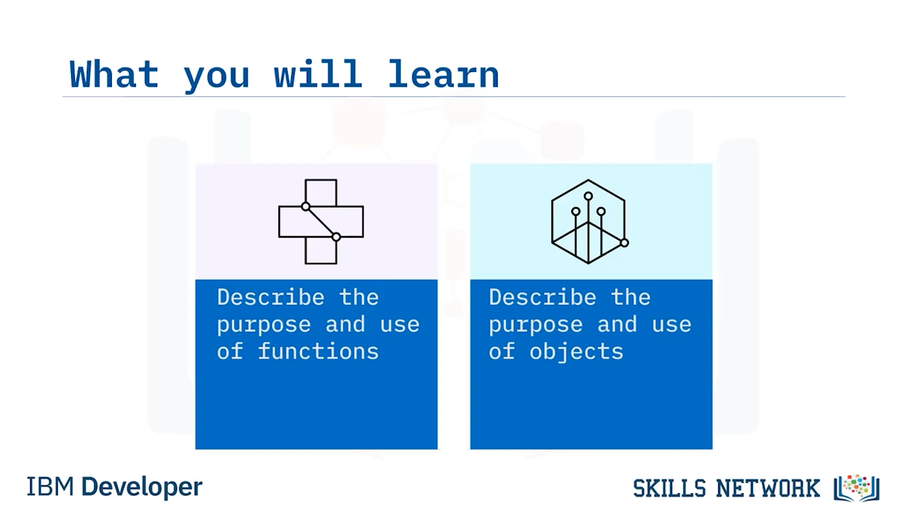
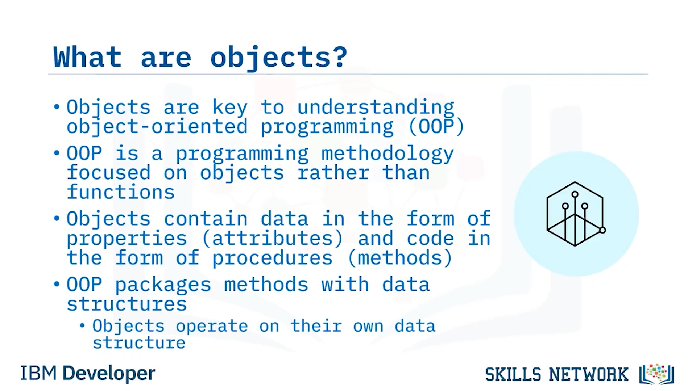

# 🤖 Programlama Kavramlarına Giriş Bölüm 2

Programlama Kavramlarına Giriş – Bölüm 2’ye hoş geldiniz. Bu videoyu izledikten sonra şunları yapabileceksiniz: Programlamada fonksiyonların amacını ve kullanımını açıklamak ve programlamada nesnelerin amacını ve kullanımını açıklamak.

Şimdi, fonksiyonların temel kavramına bakalım. Fonksiyonlar, bir programın, her biri program içinde belirli bir görevi yerine getiren birden çok modüler bileşene bölünmesini teşvik eden modüler programlama yazılım geliştirme metodolojisinin bir sonucudur. Yani, fonksiyon özünde, tek bir spesifik eylemi gerçekleştirecek, yapılandırılmış, bağımsız ve tekrar kullanılabilir bir kod parçasıdır. Bu, yazılım geliştiricilerin büyük ve karmaşık bir programı alıp onu daha küçük, daha yönetilebilir ve odaklanmış parçalara ayırabilmesini sağlar. Bazı programlama dilleri fonksiyonlara alt yordam (subroutine), prosedür (procedure), metot (method) veya modül (module) gibi başka isimler verebilir, ancak modern programlama dillerinin çoğu bunlara “fonksiyon” der.

Fonksiyonlar veriyi girdi (input) olarak alır, sonra bu veriyi işler ve ardından sonucu çıktı (output) olarak döndürür. Özünde iki tür fonksiyon vardır. Standart kütüphane fonksiyonları, programlama dili tarafından sağlanan yerleşik fonksiyonlardır. Yaygın bir örnek, `Print` fonksiyonudur. Ancak programlama dilleri, kendi fonksiyonlarınızı yazmanıza da izin verir. Ve bir fonksiyonu yazdıktan sonra onu tekrar tekrar kullanabilirsiniz. Bir fonksiyonu oluşturan kod bloklarının nasıl tanımlandığı programlama dilleri arasında farklılık gösterir. Bazıları süslü parantezler kullanır, bazıları `begin` ve `end` deyimlerini kullanır, diğerleri ise örneğin girintileme kullanır.

Fonksiyonları kullanmanın birkaç adımı vardır. Yapmanız gereken ilk şey, bir fonksiyonu tanımlamak (veya oluşturmak)tır. Bir fonksiyonu tanımlarken, bir fonksiyon anahtar sözcüğü sağlarsınız, fonksiyona benzersiz bir ad verirsiniz ve fonksiyon gövdesini oluşturan deyimleri yazarsınız. Bir fonksiyon tanımlandıktan sonra, onun çağrılması (veya invoke edilmesi) gerekir. Bir fonksiyonu çağırdığınızda, fonksiyon içindeki belirtilen eylemler, belirtilen parametreler kullanılarak gerçekleştirilir. Fonksiyonların tanımlanması ve çağrılması tüm programlama dilleri için ortak olmakla birlikte, C ve C++ gibi bazı programlama dilleri fonksiyonun ayrıca bildirilmesini (declare) de gerektirir.

Şimdi de nesne kavramına bakalım. Nesnelerin ne olduğunu anlamak, nesne yönelimli programlamayı anlamanın anahtarıdır. Nesne yönelimli programlama (OOP), prosedür yönelimli programlamanın odaklandığı fonksiyonlar yerine nesnelere odaklanan bir programlama metodolojisidir. Nesnelerin kendileri, özellikler (properties/attributes) biçiminde veri ve metotlar (procedures/methods) biçiminde kod içerir. İki metodoloji arasındaki temel fark, prosedürel programlama ayrı veri yapıları üzerinde işlem yapmak için metotları kullanırken, OOP’nin ikisini bir arada paketlemesi, yani bir nesnenin kendi veri yapısı üzerinde işlem yapmasıdır.

Hayatınızdaki gerçek dünya nesnelerini düşünün: arabanız, bisikletiniz, televizyonunuz veya çamaşır makineniz gibi ve kendinize şu iki soruyu sorun: “Bu nesne hangi durumlarda olabilir?” ve “Bu nesne hangi davranışları gerçekleştirebilir?”. Bu sorulara vereceğiniz cevapları düşündüğünüzde, cevapların nesnelere göre değiştiğini göreceksiniz. Daha karmaşık nesnelerin genellikle içinde bulunabilecekleri daha fazla olası durum vardır ve daha fazla davranış gerçekleştirebilirler. Programlamada, kavramsal olarak konuşursak, bir yazılım nesnesi de gerçek dünya nesnesine benzer; çünkü onlar da durumlar (veya özellikler) ve davranışlardan (veya metotlardan) oluşur. Yazılım nesneleri, bir Windows hizmeti, bir kullanıcı hesabı, bir veritabanı tablosu veya bir sistem klasörü gibi herhangi bir şey olabilir. Nesneler, özelliklerini alanlarda (bazı programlama dillerinde değişkenler olarak adlandırılır) saklar ve davranışlarını metotlar (bazı programlama dillerinde fonksiyonlar olarak adlandırılır) aracılığıyla dışarıya açarlar.

Bu videoda şunları öğrendiniz:

* Bir fonksiyon, tek bir spesifik eylemi gerçekleştirecek, yapılandırılmış, bağımsız ve tekrar kullanılabilir bir kod parçasıdır.
* Fonksiyonların tanımlanması ve çağrılması, tüm programlama dilleri için ortaktır.
* Nesne yönelimli programlama, fonksiyonlar yerine nesnelere odaklanan bir programlama metodolojisidir.
* Yazılım nesneleri, özelliklerden (properties) ve metotlardan (methods) oluşur.

