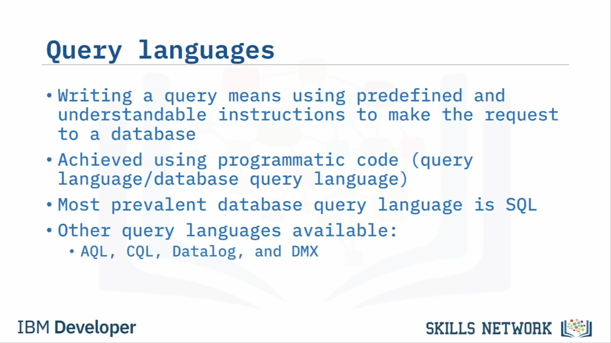
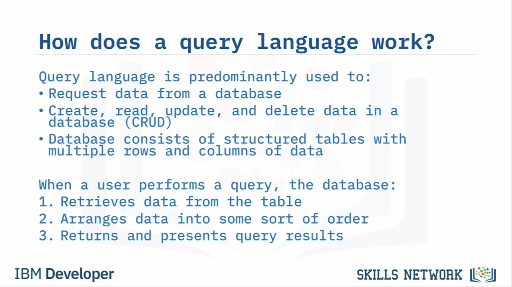
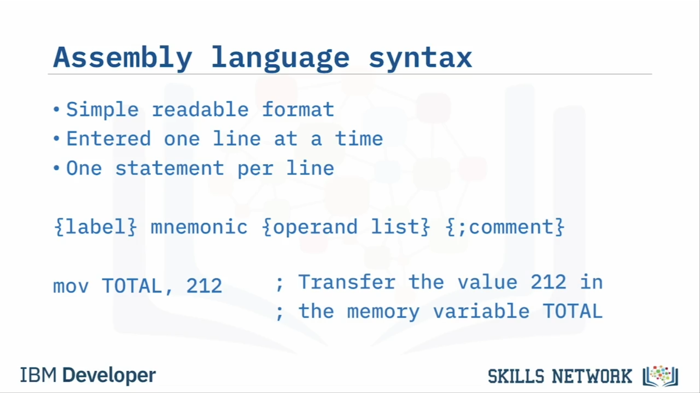

# 🧠 Sorgu ve Assembly Programlama Dilleri

“Sorgu ve Assembly Programlama Dilleri”ne hoş geldiniz. Bu videoyu izledikten sonra şunları yapabileceksiniz: Yüksek seviyeli ve düşük seviyeli programlama dillerini karşılaştırmak, sorgu dillerini açıklamak ve assembly dillerini açıklamak. Haydi sorgu ve assembly programlama dillerini keşfedelim. Ama önce, programlama dillerini iki seviyeye ayırmamız gerekiyor: yüksek seviyeli ve düşük seviyeli.

Yüksek seviyeli bir programlama dili, daha gelişmiştir ve kodun daha anlaşılır olmasını ve programları kodlama ile hata ayıklama hızını artırmak için yaygın İngilizce dili kullanır. Yüksek seviyeli programlama dillerine, Structured Query Language (veya SQL) gibi sorgu dilleri, Pascal gibi yapısal programlama dilleri ve Python gibi nesne yönelimli programlama dilleri örnek verilebilir.

Buna karşılık, düşük seviyeli bir programlama dili makine kodunu temsil etmek için bir dizi sembol kullanır. Düşük seviyeli programlama dillerine ARM, MIPS ve x86 gibi assembly dilleri örnek gösterilebilir.

Sorgu, bir veritabanından bilgi talebidir. Veritabanı sorguyu işler, tablolarında istenen bilgiyi arar ve sonuçları sorguyu yapan tarafa geri döndürür.

Bir veritabanına sorgu gönderirken, sorguyu yapan kullanıcı uygulaması ile sorguyu işleyen veritabanının aynı dili konuşması önemlidir. Programlama açısından bakıldığında, bir sorgu yazmak, veritabanına istekte bulunmak için önceden tanımlanmış ve anlaşılır talimatlar kullanmak anlamına gelir. Bu, programatik kod kullanılarak gerçekleştirilir ve biz buna sorgu dili diyoruz.

Bir sorgu dili, veritabanı sorgu dili olarak da adlandırılabilir. Veritabanı sorguları ve veritabanı yönetimi için açık ara en yaygın kullanılan sorgu dili SQL’dir. Bununla birlikte, AQL, CQL, Datalog ve DMX gibi başka sorgu dilleri de mevcuttur.

SQL veritabanlarına ek olarak, “Not Only SQL” ifadesinin kısaltması olan NoSQL adında başka bir veritabanı türü daha vardır. Bu iki veritabanı türü arasındaki temel fark, veri yapılarıdır. SQL veritabanları ilişkisel olup yapılandırılmış, önceden tanımlanmış şemalar kullanırken, NoSQL veritabanları doğası gereği ilişkisel değildir ve yapılandırılmamış veriler için dinamik şemalara sahiptir.

Bir sorgu dili ağırlıklı olarak bir veritabanından veri talep etmek veya bir veritabanındaki verileri oluşturmak (Create), okumak (Read), güncellemek (Update) ve silmek (Delete) için kullanılır. Bu son dört önemli veritabanı işlemini ifade etmek için muhtemelen CRUD teriminin kullanıldığını göreceksiniz.

Genellikle bir kullanıcı, bir sorgu yapmak veya bir CRUD işlemi gerçekleştirmek için, veritabanını barındıran veritabanı yönetim sistemi tarafından anlaşılabilir bir sözdizimi kullanarak bir komut girer. Bir veritabanı da tipik olarak, birden çok veri satırı ve sütunundan oluşan yapılandırılmış tablolardan oluşur.

Bir kullanıcı sorgu çalıştırdığında, veritabanı ilgili satır ve sütunlardan verileri alır ve sorgu sonuçlarında döndürülüp sunulmaya hazır olacak şekilde belirli bir düzende düzenler.

Veritabanı sorguları ya bir select komutu ya da CREATE, INSERT, UPDATE gibi bir eylem komutu ya da her ikisinin karışımı olabilir. Bu komutları tanımlamak için daha yaygın olarak “ifade” (statement) terimi kullanılır.

Select sorguları bir veritabanından veri talep ederken, eylem (action) sorguları veritabanındaki verileri değiştirir. Sorgu ifadeleri, kullanıcı oluşturma ve izinleri değiştirme gibi diğer yönetimsel işlevleri gerçekleştirmek için de kullanılabilir.

Bu tablo, en yaygın SQL sorgu ifadelerinden bazılarını listeler. İşte yaygın SQL ifadelerinin bazı basit sözdizimi örnekleri.

Daha önce de belirtildiği gibi, assembly dilleri sorgu dillerinden, yapısal programlama dillerinden ve nesne yönelimli programlama dillerinden daha az gelişmiştir. Assembly dili, makine kodunun 0 ve 1’lerini temsil etmek için basit bir sembol kümesi kullandığından, düşük seviyeli bir programlama dili olarak sınıflandırılır.

Assembly dilleri, donanım üreticilerinin işlemci mimarilerine sıkı sıkıya bağlıdır ve bu nedenle her CPU tipi genellikle kendi assembly diline sahiptir. Bu nedenle, günümüzde donanım üreticileri arasında farklılık gösteren çok sayıda assembly dili kullanılmaktadır.

Assembly dilleri, ifadeleri için basit ve okunabilir bir biçim kullanır ve bu ifadeler her satırda bir ifade olacak şekilde, bir seferde bir satır olarak girilir.

Assembly dili ifadeleri burada gösterilen standart biçimi kullanır. Bu sözdiziminde, süslü parantezler { } içindeki tüm alanlar isteğe bağlıdır ve ifade iki ana bölümden oluşur. İlk bölüm komut (veya mnemonic), ikinci bölüm ise parametreleri (veya operandları) içerir. İfadenin sonuna isteğe bağlı, faydalı yorumlar da eklenebilir.

Assembly dilleriyle ilgili bir diğer önemli fark da, derleyici (compiler) veya yorumlayıcı (interpreter) yerine bir assembler kullanılarak çevrilmeleridir ve tek bir ifade sadece tek bir makine kodu komutuna çevrilir; buna karşın yüksek seviyeli dillerde tek bir ifade birden çok makine kodu komutuna dönüştürülebilir.

Assemblerlar, Input (INP), Output (OUT), Load (LDA), Store (STA) ve Add (ADD) gibi mnemonic’ler kullanarak assembly dilini makine koduna çevirir. İfadeler, işlemciye verilerle ne yapacağını söyleyen işlem kodlarından (opcode) ve işlemciye veriyi nerede bulacağını söyleyen operandlardan oluşur.

Bu videoda şunları öğrendiniz: Sorgu dilleri, yapısal programlama dilleri ve nesne yönelimli programlama dilleri yüksek seviyeli programlama dilleri olarak sınıflandırılır. Assembly dilleri düşük seviyeli programlama dilleri olarak sınıflandırılır. Bir sorgu dili, ağırlıklı olarak bir veritabanından veri istemek veya bir veritabanındaki verileri manipüle etmek için kullanılır. Veritabanı sorguları ve veritabanı yönetimi için en yaygın sorgu dili Structured Query Language (SQL)’dir. Select sorguları bir veritabanından veri talep ederken, eylem sorguları veritabanındaki verileri değiştirir.

Ayrıca şunları da öğrendiniz: Assembly dilleri, makine kodunun 0 ve 1’lerini temsil etmek için basit bir sembol kümesi kullanır. Assembly dilleri, donanım üreticilerinin işlemci mimarilerine sıkı sıkıya bağlıdır. Assembly dilleri, derleyici veya yorumlayıcı yerine bir assembler kullanılarak çevrilir. Ve assembly dili komutlarının, karşılık geldikleri makine kodu komutlarıyla bire bir eşleşmesi vardır.

