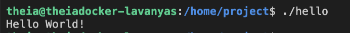

# 🌍 Uygulamalı Laboratuvar – 11 Programlama Dilinde Hello World

Bir yazılım tasarımı soyuttur ve koda dönüştürülerek somut bir hâl alması gerekir. Kod, programlama dilleri veya betik dilleri kullanılarak oluşturulur. Bu laboratuvarda, en yaygın kullanılan dillerin, aynı çıktıya ulaşmak için bir araç olduğunu ve benzer çıktılar sağlayabildiğini göreceksiniz. Programı yazma ve kodu çalıştırma şekli dilden dile farklılık gösterecektir. Bir yazılım mühendisi bir veya birden fazla dilde yetkin olabilir. Bu laboratuvarda, C, Java, Go, Python, Node JS, Ruby, PHP, PERL, Bash, C++ ve bonus olarak bir işaretleme dili olan HTML ile “Hello World!” yazmayı öğrenerek çok dilli programlama yolculuğunuza başlayacaksınız.

## 🎯 Öğrenme Hedefleri

Bu egzersizi tamamladıktan sonra aşağıdaki görevleri yerine getirebilmelisiniz:

* Kodun nasıl yazıldığını ve çalıştırıldığını anlamak
* Birkaç dilde “Hello World!” görüntülemek: C, Java, Go, Python, Node JS, Ruby, PHP, PERL, Bash, C++ ve HTML
* Farklı diller kullanarak aynı çıktıyı elde etmek

## 🖥️ Ön Çalışma – Terminali Açma

1. Üst menüde Terminal’e tıklayın ve New Terminal’e basın.

   
2. Bu işlem, komut çalıştırabileceğiniz yeni bir terminal penceresi açacaktır.

   


# 💻 Alıştırma 1: C Kullanarak Hello World Gösterme

C, en eski dillerden biridir. Bir programlama dilidir. C kodunu olduğu gibi çalıştıramazsınız; çalıştırılabilir (executable) bir forma dönüştürmek için derlemeniz gerekir.

1. Explorer simgesine tıklayın. Project bölümüne gidin.

   
2. Project’e tıklayın. İlk C programınızı oluşturmak için New File seçeneğini seçin.

   
3. Dosya adını **helloworld.c** olarak girin ve OK’a basın.

   
4. Bu adım dosyayı açacaktır.

   
5. Aşağıdaki kodu dosyaya kopyalayıp yapıştırın. printf ifadesinde, çıktıda mesajdan sonra yeni satır karakteri **\n** bulunduğundan emin olun.

   ```
   #include <stdio.h>

   int main(void) {
     printf("Hello World!\n");
     return 0;
   }
   ```

Bu kodu yapıştırıp kaydettikten sonra dosyanız pencerede aşağıdaki gibi görünecektir.


6. File menüsüne tıklayın ve **Save** seçeneğini seçerek değişiklikleri kaydedin.
7. Şimdi terminalde aşağıdaki komutu yazarak veya kopyalayıp yapıştırarak, ardından Enter tuşuna basarak kodu derleyin.

   **gcc** bir C derleyicisidir. **-o** çıktı dosyasının adını belirtir.

```
gcc -o hello helloworld.c
```

9. Derlenen dosyayı çalıştırmak için terminale aşağıdaki komutu yazın veya yapıştırın ve Enter’a basın. İlk C programınızın çıktısını göreceksiniz.

```
./hello
```





# ☕ Java Kullanarak Hello World Gösterme

Java, Nesne Yönelimli bir programlama dilidir ve C++ üzerine kuruludur. Güvenli ve güçlü uygulamalar geliştirmek için en çok kullanılan dillerden biridir.

Project’e tıklayın. İlk Java programınızı oluşturmak için **New File** seçeneğini seçin.

1. Dosya adını **helloworld.java** olarak girin ve OK’e basın.
2. Java programlarının uzantısı  **.java** ’dır.
3. Bu işlem dosyayı açacaktır.
4. Aşağıdaki kodu dosyaya kopyalayıp yapıştırın:

```
public class helloworld {
    public static void main(String s[]){
        System.out.println("Hello World!");
    }
}
```

Bu kodu yapıştırıp kaydettikten sonra dosyanız pencerede bu şekilde görünecektir.

5. File menüsüne tıklayın ve **Save** seçeneğini seçerek değişiklikleri kaydedin.
6. Şimdi terminalde aşağıdaki komutu yazarak veya kopyalayıp yapıştırarak kodu derleyin. Ardından Enter tuşuna basın.

   **javac** , bir Java derleyicisidir. Derleme çıktısı, aynı isimli ve **.class** uzantılı bir dosyada saklanır.

```
javac helloworld.java
```

7. Derlenmiş dosyayı çalıştırmak için terminale aşağıdaki komutu yazın veya yapıştırın ve Enter’a basın. İlk Java programınızın çıktısını göreceksiniz:

```
java helloworld
```

devami 

# Hello World in 11 Programming Languages.pdf
