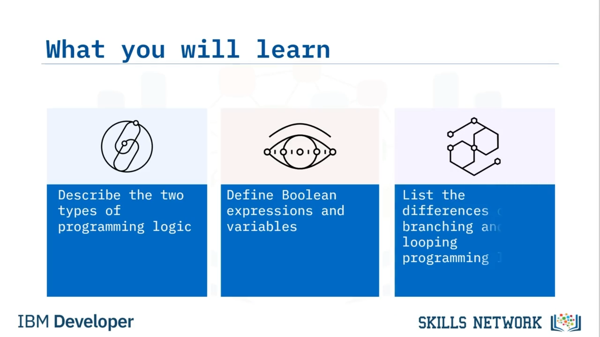

# 🤖 Dallanma ve Döngü Programlama Mantığı

Dallanma ve Döngü Programlama Mantığına hoş geldiniz. Bu videoyu izledikten sonra şunları yapabileceksiniz:

* İki tür programlama mantığını açıklamak
* Boolean ifadelerini ve değişkenleri tanımlamak
* Dallanma ile döngü arasındaki farkları listelemek

İki temel programlama mantığı türü vardır: dallanma ve döngü. Her iki tür de Boolean ifadelerini ve değişkenleri kullanır. Boolean ifadesi, yalnızca iki değeri olan bir tür programlama ifadesidir; ya “true” ya da “false” olur. Değişkenlerin ise daha kapsamlı bir program içinde bir fonksiyona veya alt yordam(a) aktarılan atanmış değerleri vardır. Bilgisayarlar karar vermek için Boolean mantığını kullanır. Bir Boolean ifadesi true ise bilgisayar bir işlem yapar, ifade false ise farklı bir işlem yapar.

Genellikle bir program, bilgisayara ne yapacağını söyleyen talimatlardan ve program çalışırken programın kullandığı verilerden oluşur. Bir değişken, programa aktarılan koşullara veya bilgilere bağlı olarak değişebilen bir değere sahiptir. Boolean mantık, değişkenlerle birlikte programlamanın temelini oluşturur. Dallanma mantığı, bir bilgisayar programının, programın yürütülmesi sırasında belirli koşulların karşılanıp karşılanmadığına bağlı olarak farklı talimat kümelerini izleyerek bir karar verdiği yerdir. Mümkün olan her bir kod yolu başka bir dal oluşturur. Çalışan kod dalı, dallanma prosedürünün parametrelerine atanan değerlere bağlıdır. Karmaşık mantığı uygulamak için dalların sayısında bir sınır yoktur.

Bu parametrelerin değerleri kullanıcı tarafından girilebilir veya önceki bir prosedürün çıktısı tarafından üretilebilir. Dallanma, program çalışırken programın hangi yolu izleyeceğini belirlemek için ortaya çıkan ve işlenen yapıları içerir. Dallanma deyimleri (yapılar olarak da bilinir), yürütme akışının programın farklı bir bölümüne atlamasına olanak tanır. Diğer kontrol yapıları içinde kullanılan yaygın dallanma deyimleri şunları içerir: `if`, `if-then-else`, `switch` ve `GoTo`. `if` deyimi, bir programın belirtilen ölçütlere göre karar vermesini sağlayan bir karar verme yapısıdır. `if` deyimi, belirli bir koşul karşılandığında (TRUE) bir kod kümesini, koşul karşılanmadığında (FALSE) ise başka bir kod kümesini yürütür.

`if-then-else`, `then` anahtar sözcüğünü izleyen alt deyimini çalıştıran koşullu bir yapıdır. Bu yalnızca verilen koşul true olduğunda gerçekleşir. `if-else` deyimi, `if` (true/false ifadesi) false olduğunda gerçekleştirilecek bir eylem belirleyerek `if` deyimini genişletir. `if-else` deyiminde program, ya true kod bloğunu ya da false kod bloğunu yürütür; bu nedenle bir `if-else` deyiminde her zaman bir şey gerçekleştirilir. Bilgisayar programlama dillerinde `switch` deyimi, bir değişkenin veya ifadenin değerinin arama ve eşleme yoluyla program yürütümünün kontrol akışını değiştirmesine olanak tanımak için kullanılan bir tür seçim kontrol mekanizmasıdır. `GoTo`, birçok bilgisayar programlama dilinde bulunan ve denetimi tek yönlü olarak başka bir kod satırına aktaran bir deyimdir. Buna karşılık, bir fonksiyon çağrısı genellikle denetimi geri döndürür.

Şimdi, döngü programlamanın mantığına bakalım. Bir döngü, belirli bir koşula ulaşılıncaya kadar sürekli tekrar eden bir talimatlar dizisidir. Genellikle, veri alma ve değiştirme gibi belirli bir işlem gerçekleştirilir ve ardından bir sayacın belirli bir sayıya ulaşıp ulaşmadığı gibi bazı koşullar kontrol edilir. Eğer ulaşmamışsa, dizideki bir sonraki talimat, dizideki ilk talimata dönmek ve diziyi yinelemek olur. Koşula ulaşıldığında, bir sonraki talimat bir sonraki sıralı talimata “düşer” veya döngünün dışına dallanır. Döngü, program yazarken yaygın olarak kullanılan temel bir programlama fikridir.

Üç temel döngü deyimi vardır: `while`, `for` ve `do-while`. Bir `while` döngüsünde, döngü gövdesi işlenmeden önce bir koşul değerlendirilir. Bir koşul true ise ve yalnızca o zaman döngünün gövdesi yürütülür. Bir `for` döngüsünde başlangıç değeri yalnızca bir kez uygulanır; ardından koşul, her yinelemeden sonra sayacı sabit bir değerle karşılaştırır ve false döndürüldüğünde `for` döngüsü durur. Bir `do-while` döngüsünde, koşul her zaman döngü gövdesinden sonra yürütülür. Bu döngü, çıkış kontrollü döngü olarak da adlandırılır.

Bu videoda şunları öğrendiniz: İki temel programlama mantığı türü vardır: dallanma ve döngü. Her iki mantık türü de Boolean ifadeleri ve değişkenleri kullanır. Boolean ifadelerin yalnızca iki olası değeri vardır, true veya false, ve değişkenlerin, daha kapsamlı bir program içinde bir fonksiyona veya alt yordam(a) aktarılan atanmış değerleri vardır. Değişkenlerin, programa aktarılan koşullara veya bilgilere bağlı olarak değişebilen değerleri vardır. Ve dallanma, hangi eylemlerin gerçekleştirileceğine karar vermekle ilgiliyken, döngü belirli bir eylemin kaç kez gerçekleştirileceğine karar vermekle ilgilidir.

